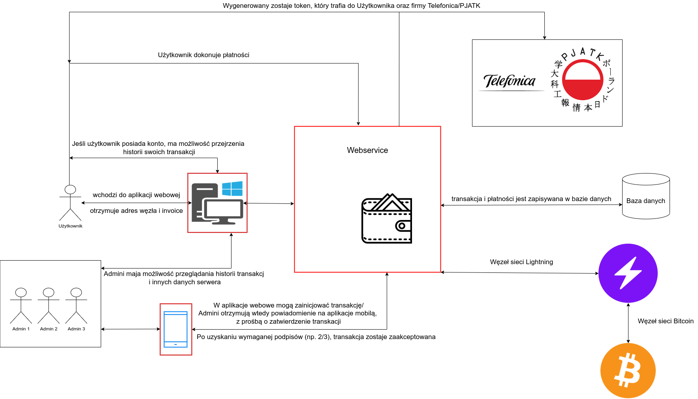
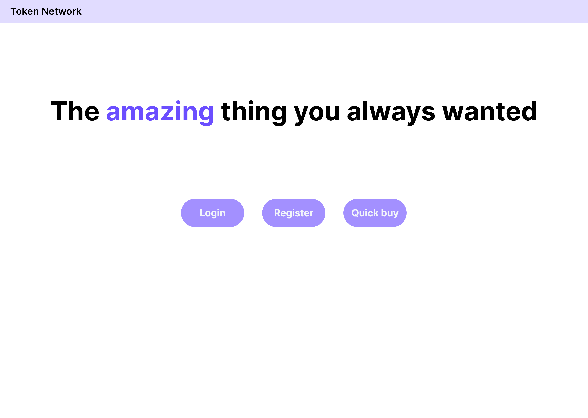
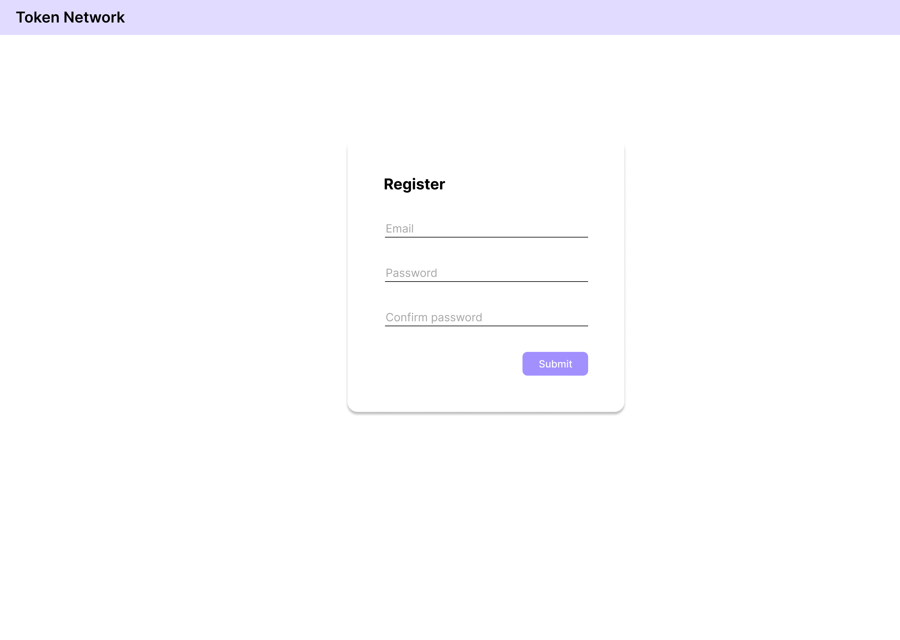
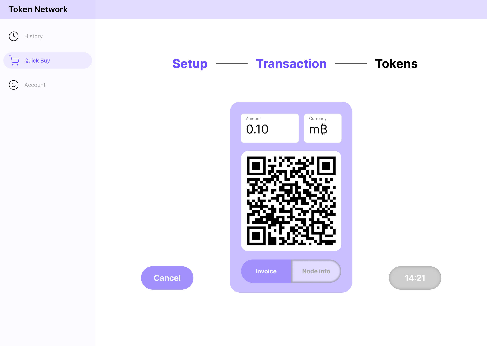
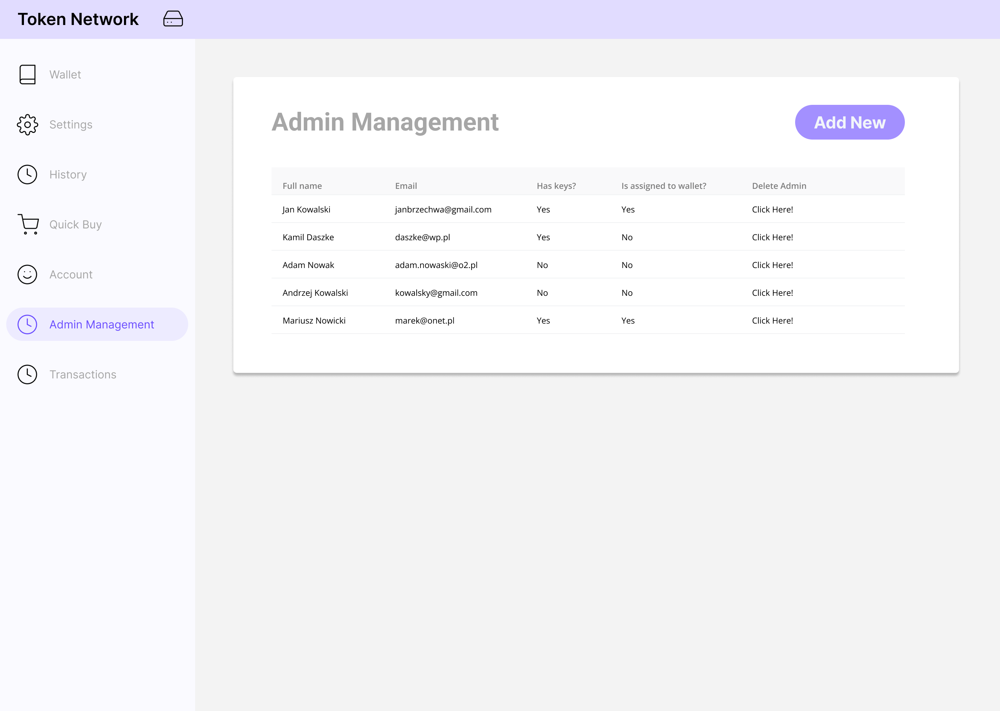
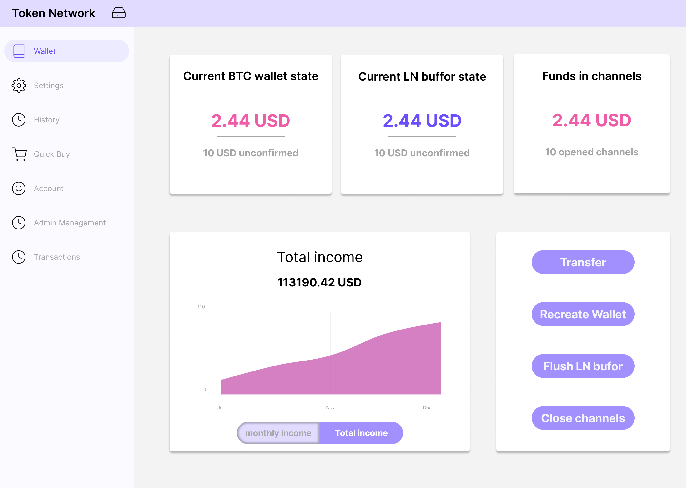
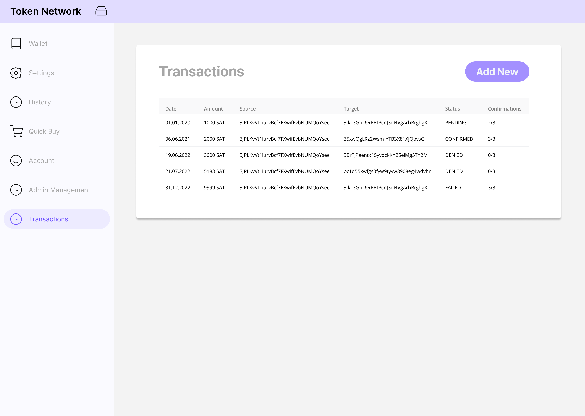

== Analiza

=== Przypadki użycia

==== Aktorzy

System będzie posiadał trzech aktorów.
Są oni ułożeni w hierarchii, każdy następny dziedziczy przypadki użycia po poprzednim.
Możemy wyróżnić następujących aktorów:

* Niezalogowany użytkownik → nie jest w danym momencie zalogowany.
Może on zalogować się bądź zarejestrować, jeżeli nie posiada konta.
Niezalogowany użytkownik może również kupować tokeny, aczkolwiek nie będzie on później miał dostępu do historii swoich transakcji.
* Użytkownik → po zalogowaniu ma on dodatkowo dostęp do historii swoich płatności.
Może on tam przejrzeć wszystkie dotychczasowe zakupy oraz wyświetlić otrzymane tokeny.
* Administrator → ma możliwość zarządzania serwerem oraz do przeglądania jego zasobów.
Jeżeli wysłał on swój klucz publiczny na serwer, może też być członkiem portfela, a co za tym idzie zyskuje możliwość podpisywania transakcji w aplikacji mobilnej.
Podobnie jak zwykły użytkownik, może on kupować tokeny oraz przeglądać swoją osobistą historię.

==== Przypadki użycia dla aplikacji webowej

Jest to główna część systemy, w której użytkownicy, zarówno zalogowani, jak i niezalogowani, będą mogli kupować tokeny oraz zakładać konta.
Administratorzy będą mieli możliwość zarządzania i przeglądania danych serwera.
Warto zaznaczyć, że administratorzy mogą stworzyć innego administratora tylko w osobnym panelu do tego przeznaczonym.
Strona rejestracji pozwala tylko i wyłącznie na tworzenie standardowych użytkowników.

.Diagram przypadków użycia dla aplikacji webowej.
[plantuml]
----
include::../diagrams/use_case_webapp.puml[]
----

==== Przypadki użycia dla aplikacji mobilnej

Jest to dodatek do serwera pozwalający przede wszystkim na podpisywanie transakcji multisig.
Każdy administrator może zalogować się do aplikacji, wygenerować klucz prywatny oraz wysłać klucz publiczny na serwer.
Jeżeli zostanie on dodany do tworzonego portfela, administrator będzie mógł podpisywać transakcje za pomocą swojego klucza prywatnego bądź je odrzucać.

.Diagram przypadków użycia dla aplikacji mobilnej.
[plantuml]
----
include::../diagrams/use_case_mobileapp.puml[]
----

=== Udziałowcy

[cols="1h,4"]
|===
2+| *KARTA UDZIAŁOWCA*
|Identyfikator: | _UOB01_
|Nazwa: | _Użytkownik_
|Opis: |_Osoba chcąca wymienić swoje bitcoiny w sieci lightning na tokeny do rejestracji wydarzeń w czasie i nie tylko._
|Typ udziałowca: |_Ożywiony bezpośredni_
|Punkt widzenia: |_Łatwość dokonania transakcji, wygoda obsługi, możliwość przeglądania historii po zalogowaniu._
|Ograniczenia: |_Nie może mieć dostępu do portfela znajdującego się na serwerze oraz do transakcji wychodzących._
|===

[cols="1h,4"]
|===
2+| *KARTA UDZIAŁOWCA*
|Identyfikator: |_UOB02_
|Nazwa: |_Administrator_
|Opis: |_Osoba mająca wgląd w ustawienia serwera, która może inicjować przelewy z głównego portfela, podpisywać transakcje
swoim kluczem i przeglądać historię wpłat._
|Typ udziałowca: |_Ożywiony bezpośredni_
|Punkt widzenia: |_Osoba będąca częściowo właścicielem serwera oraz zarządzająca nim._
|Ograniczenia: |_Jeżeli nie jest dodany do portfela, nie może podpisywać transakcji._
|===

[cols="1h,4"]
|===
2+| *KARTA UDZIAŁOWCA*
|Identyfikator: |_UNP03_
|Nazwa: |_Uczelnia_
|Opis: |_Uczelnia, która chce wdrożyć projekt w ramach europejskiego projektu Ingenious._
|Typ udziałowca: |_Nieożywiony pośredni_
|Punkt widzenia: |_Nadzorowanie projektu, kontakt z udziałowcami z projektu ingenuity, pomoc z ustaleniem wymagań.
biznesowych_
|Ograniczenia: |_Nie ma wglądu w projekt, jedynie go nadzoruje._
|===

[cols="1h,4"]
|===
2+| *KARTA UDZIAŁOWCA*
|Identyfikator: |_UNP04_
|Nazwa: |_Promotor_
|Opis: |_Osoba opiekująca się projektem oraz pomagająca w jego realizacji._
|Typ udziałowca: |_Ożywiony pośredni_
|Punkt widzenia: |_Nadzorowanie projektu, kontakt z udziałowcami z projektu ingenuity, pomoc z ustaleniem wymagań
biznesowych oraz realizacją zadań technicznych._
|Ograniczenia: |_Ograniczona komunikacja, zjazdy raz na 2/3 tygodnie._
|===

[cols="1h,4"]
|===
2+| *KARTA UDZIAŁOWCA*
|Identyfikator: |_UNB05_
|Nazwa: |_BitcoinJ_
|Opis: |_Biblioteka umożliwiają operacje w sieci Bitcoin._
|Typ udziałowca: |_Nieożywiony bezpośredni_
|Punkt widzenia: |_Techniczny, umożliwia operacje na Bitcoinach._
|Ograniczenia: |_Biblioteka nie posiada najnowszych funkcjonalności sieci Bitcoin, co stanowi dla nas
spore utrudnienie._
|===

[cols="1h,4"]
|===
2+| *KARTA UDZIAŁOWCA*
|Identyfikator: |_UNB06_
|Nazwa: |_LightningJ_
|Opis: |_Biblioteka pozwalająca na połączenie się z węzłem LND za pomocą kodu w Javie._
|Typ udziałowca: |_Nieożywiony bezpośredni_
|Punkt widzenia: |_Techniczny, umożliwia operacje w sieci Lightning._
|Ograniczenia: |_Biblioteka jest mało popularna, a co za tym idzie ciężko szukać o niej informacji._
|===

[cols="1h,4"]
|===
2+| *KARTA UDZIAŁOWCA*
|Identyfikator: |_UOB07_
|Nazwa: |_Zespół projektowy_
|Opis: |_Tworzy system oraz dokumentację pod przewodnictwem promotora._
|Typ udziałowca: |_Ożywiony bezpośredni_
|Punkt widzenia: |_Twórcy rozwiązania._
|Ograniczenia: |_Czas, wiedza._
|===

<<<

=== Wymagania funkcjonalne

==== Serwer i aplikacja webowa

[cols="2h,2,1,3"]
|===
4+| *KARTA WYMAGANIA*
|Identyfikator: |F01 h|Priorytet: |*M* (musi być)
|Nazwa 3+|Konfiguracja serwera
|Opis 3+a|
Administrator powinien mieć możliwość skonfigurowania:

* liczby osób, które podpiszą przelew, aby został wykonany
* ceny tokenów
* limity automatycznych transferów
* inne ustawienia
|Kryteria akceptacji 3+|Administrator ma możliwość edycji podanych ustawień i nie tylko.
Podane parametry nie muszą być na jednym panelu, mogą znajdować się na osobnych.
|Udziałowiec 3+| _UOB02_
|Wymagania powiązane 3+| _F08, F09, F12, F13, F16, F17, F18_
|===

[cols="2h,2,1,3"]
|===
4+| *KARTA WYMAGANIA*
|Identyfikator: |F02 h|Priorytet: |*M* (musi być)
|Nazwa 3+|Logowanie użytkownika / admina
|Opis 3+|Użytkownik lub admin, po wypełnieniu danych logowania, powinien mieć dostęp do głównego panelu aplikacji.
|Kryteria akceptacji 3+| Użytkownik jest w stanie poprawnie zalogować się do aplikacji.
|Udziałowiec 3+| _UOB01, UOB02_
|Wymagania powiązane 3+| _F03, F04_
|===

[cols="2h,2,1,3"]
|===
4+| *KARTA WYMAGANIA*
|Identyfikator: |F03 h|Priorytet: |*M* (musi być)
|Nazwa 3+|Rejestracja użytkownika
|Opis 3+|Nowy użytkownik ma mieć możliwość zarejestrowania się, aby móc korzystać ze wszystkich funkcjonalności.
|Kryteria akceptacji 3+|Użytkownik może utworzyć konto w systemie.
|Udziałowiec 3+|_UOB01_
|Wymagania powiązane 3+|_F02_
|===

[cols="2h,2,1,3"]
|===
4+| *KARTA WYMAGANIA*
|Identyfikator: |F04 h|Priorytet: |*M* (musi być)
|Nazwa 3+|Dodanie administratora
|Opis 3+|Administrator ma mieć możliwość zarejestrowania nowego administratora.
|Kryteria akceptacji 3+|Administrator może dodawać innych administratorów.
|Udziałowiec 3+|_UOB02_
|Wymagania powiązane 3+|_F02, F14, F15, FA01_
|===

[cols="2h,2,1,3"]
|===
4+| *KARTA WYMAGANIA*
|Identyfikator: |F05 h|Priorytet: |*M* (musi być)
|Nazwa 3+|Przeglądanie historii
|Opis 3+|Użytkownicy i administratorzy mają wgląd do historii płatności. Użytkownicy oczywiście tylko do
swojej własnej historii. Administratorzy mają mieć dodatkowy panel z danymi ze wszystkich płatności.
|Kryteria akceptacji 3+| Dostępne są 2 panele, jeden dla indywidualnej historii, drugi dla wszystkich płatności dostępny tylko dla administratorów.
|Udziałowiec 3+| _UOB01, UOB02_
|Wymagania powiązane 3+| _F08, F09_
|===

[cols="2h,2,1,3"]
|===
4+| *KARTA WYMAGANIA*
|Identyfikator: |F06 h|Priorytet: |*M* (musi być)
|Nazwa 3+|Wysyłanie powiadomienia o bieżącej transakcji
|Opis 3+|Kiedy jeden administrator chce dokonać transakcji, reszta administratorów musi otrzymać powiadomienie o
potrzebnej akcji w aplikacji mobilnej.
|Kryteria akceptacji 3+|Administratorzy dodani do portfela widzą powiadomienie o nowo utworzonej transakcji.
|Udziałowiec 3+| _UOB02_
|Wymagania powiązane 3+|_F07, F12, FA03, FA04, FA05_
|===

[cols="2h,2,1,3"]
|===
4+| *KARTA WYMAGANIA*
|Identyfikator: |F07 h|Priorytet: |*M* (musi być)
|Nazwa 3+|Wykonanie transakcji po uprzednim uzyskaniu wymaganej liczby podpisów
|Opis 3+|Każdy portfel ma swoją wymaganą liczbę podpisów, którą musi mieć transakcja, aby została uznana za
poprawną. Kiedy zostaną uzbierane podpisy, transakcja powinna zostać rozpropagowana w sieci Bitcoin.
|Kryteria akceptacji 3+|Podpisana transakcja jest wysyłana i akceptowana przez inne węzły w sieci.
|Udziałowiec 3+| _UOB02_
|Wymagania powiązane 3+|_F06, F12, FA03, FA04, FA05_
|===

[cols="2h,2,1,3"]
|===
4+| *KARTA WYMAGANIA*
|Identyfikator: |F08 h|Priorytet: |*M* (musi być)
|Nazwa 3+| Płatności oraz otrzymywanie tokenów
|Opis 3+| Użytkownik musi mieć możliwość zakupu tokenów w odpowiednim do tego panelu. Powinien on składać się
z formularza z ilością tokenów, ekranu z rachunkiem oraz adresem węzła, oraz ekranu z podsumowaniem i wypisanymi
tokenami.
|Kryteria akceptacji 3+|Użytkownik może zapłacić i otrzymuje w zamian zakupione tokeny.
|Udziałowiec 3+| _UOB01_
|Wymagania powiązane 3+| _F02, F05, F09, F18, F19_
|===

[cols="2h,2,1,3"]
|===
4+| *KARTA WYMAGANIA*
|Identyfikator: |F09 h|Priorytet: |*M* (musi być)
|Nazwa 3+|Płatności bez logowania
|Opis 3+|Użytkownik nawet niezalogowany ma dostęp do panelu płatności, na którym dostępne są dane potrzebne do
zapłacenia w LN. Po zakończeniu płatności wyświetlane są tokeny, które może on skopiować.
|Kryteria akceptacji 3+|Użytkownik niezalogowany ma dostęp do adresu węzła oraz kodu do transakcji i może
dokonać płatności.
|Udziałowiec 3+| _UOB01_
|Wymagania powiązane 3+| _F02, F05, F08, F18, F19_
|===

[cols="2h,2,1,3"]
|===
4+| *KARTA WYMAGANIA*
|Identyfikator: |F10 h|Priorytet: |*M* (musi być)
|Nazwa 3+|Utworzenie nowego portfelu
|Opis 3+|Przykładowo w przypadku śmierci jednego z administratorów portfelu admini powinni mieć możliwość
utworzenia nowego portfelu z określonymi na nowo administratorami portfela. Utworzenie portfelu powinno też
odbywać się przy pierwszym ustawieniu serwera (wtedy bez transferu środków).
|Kryteria akceptacji 3+|Serwer posiada nowo utworzony portfel wraz ze środkami ze starego portfela.
|Udziałowiec 3+| _UOB02_
|Wymagania powiązane 3+| _F01, F04, F13, FA02_
|===

[cols="2h,2,1,3"]
|===
4+| *KARTA WYMAGANIA*
|Identyfikator: |F11 h|Priorytet: |*S* (powinno być)
|Nazwa 3+|Użytkownicy i administratorzy mogą edytować swoje dane
|Opis 3+|Każda osoba mająca konto w systemie powinna móc zmienić swoje hasło czy też email.
|Kryteria akceptacji 3+|Użytkownik mogący edytować swoje dane.
|Udziałowiec 3+| _UOB01, UOB02_
|Wymagania powiązane 3+| _F03_
|===

[cols="2h,2,1,3"]
|===
4+| *KARTA WYMAGANIA*
|Identyfikator: |F12 h|Priorytet: |*M* (musi być)
|Nazwa 3+|Przeglądanie i inicjowanie transakcji
|Opis 3+|Administrator musi mieć dostęp do panelu z transakcjami, na którym będzie widoczna historia transakcji,
status aktualnej transakcji w toku oraz guzik prowadzący do formularza tworzenia nowej transakcji.
|Kryteria akceptacji 3+|Administrator ma dostęp do panelu z transakcjami oraz może inicjować nowe transakcje za pomocą
specjalnego formularza.
|Udziałowiec 3+| _UOB02_
|Wymagania powiązane 3+| _F13, F07, F06, F03, F04, F05_
|===

[cols="2h,2,1,3"]
|===
4+| *KARTA WYMAGANIA*
|Identyfikator: |F13 h|Priorytet: |*M* (musi być)
|Nazwa 3+|Przeglądanie danych portfela
|Opis 3+|Administrator musi mieć możliwość przeglądania aktualnych statystyk i danych z portfela takich jak ilość
środków w portfelach Bitcoin i Lightning oraz środków zablokowanych w kanałach. Powinien też posiadać kilka guzików
z akcjami portfela jak utworzenie nowego czy zamknięcie kanałów.
|Kryteria akceptacji 3+|Administrator ma dostęp do panelu z portfelem i jego akcjami.
|Udziałowiec 3+| _UOB02_
|Wymagania powiązane 3+| _F12, F16, F17_
|===

[cols="2h,2,1,3"]
|===
4+| *KARTA WYMAGANIA*
|Identyfikator: |F14 h|Priorytet: |*M* (musi być)
|Nazwa 3+|Przeglądanie administratorów
|Opis 3+|Panel powinien listować wszystkich administratorów serwera, wraz z informacją o wysłanych kluczach oraz
przypisaniu do portfela.
|Kryteria akceptacji 3+|Lista zawiera administratorów wraz z informacją o kluczach i przypisaniu do portfela.
|Udziałowiec 3+| _UOB02_
|Wymagania powiązane 3+| _F04, F15_
|===

[cols="2h,2,1,3"]
|===
4+| *KARTA WYMAGANIA*
|Identyfikator: |F15 h|Priorytet: |*S* (powinno być)
|Nazwa 3+|Usuwanie administratorów
|Opis 3+| Na panelu administratorów każdy element powinien mieć guzik pozwalający na usunięcie administratora.
Administrator nie może zostać usunięty, gdy jest przypisany do portfela.
|Kryteria akceptacji 3+|Administrator może usunąć innych administratorów.
|Udziałowiec 3+| _UOB02_
|Wymagania powiązane 3+| _F04, F14_
|===

[cols="2h,2,1,3"]
|===
4+| *KARTA WYMAGANIA*
|Identyfikator: |F16 h|Priorytet: |*M* (musi być)
|Nazwa 3+|Zamykanie kanałów płatności
|Opis 3+|Środki ze sprzedaży tokenów początkową będą rozlokowane w kanałach płatności. Jeżeli kwota osiągnie wyznaczony
limit, kanały powinny zostać automatycznie zamknięte. Panel portfela również powinien posiadać guzik pozwalający na
natychmiastowe zamknięcie kanałów.
|Kryteria akceptacji 3+|Kanały są automatycznie zamykane po osiągnięciu limitu oraz istnieje guzik do manualnego
zamknięcia kanałów.
|Udziałowiec 3+| _UOB02_
|Wymagania powiązane 3+| _F08, F09, F13_
|===

[cols="2h,2,1,3"]
|===
4+| *KARTA WYMAGANIA*
|Identyfikator: |F17 h|Priorytet: |*M* (musi być)
|Nazwa 3+|Transfer środków z portfela w węźle lightning na portfel serwera
|Opis 3+| Środku zakumulowane w węźle sieci Lightning powinny być automatycznie przelewane na adres wbudowanego
portfela. Powinna też istnieć możliwość manualnego przelania środków poprzez panel portfela.
|Kryteria akceptacji 3+|Środki z porfela Lightning są automatycznie przelewane po osiągnięciu limitu oraz istnieje
guzik do manualnego transferu.
|Udziałowiec 3+| _UOB02_
|Wymagania powiązane 3+| _F13, F16_
|===

[cols="2h,2,1,3"]
|===
4+| *KARTA WYMAGANIA*
|Identyfikator: |F18 h|Priorytet: |*C* (może być)
|Nazwa 3+|Wysyłanie zakupionych tokenów na wskazany serwer
|Opis 3+|Tokeny zakupione przez użytkowników powinny być wysyłane na adres wskazany w ustawieniach, aby właściciel
serwera mógł zaimplementować swoje rozwiązanie wykorzystujące generowane tokeny.
|Kryteria akceptacji 3+|Tokeny są wysyłane po każdej transakcji na wskazany adres przy pomocy protokołu HTTP.
|Udziałowiec 3+| _UOB02_
|Wymagania powiązane 3+| _F08, F09_
|===

[cols="2h,2,1,3"]
|===
4+| *KARTA WYMAGANIA*
|Identyfikator: |F19 h|Priorytet: |*W* (nie będzie)
|Nazwa 3+|Wysyłanie podsumowania płatności pocztą elektroniczną
|Opis 3+|Po każdej płatności i zakupie tokenów powinny być wysyłane wiadomości elektroniczne z podsumowanie zamówienia
oraz tokenami. Umożliwiłoby to podgląd do tokenów przez niezarejestrowanych użytkowników po opuszczeniu aplikacji.
|Kryteria akceptacji 3+| Użytkownik otrzymuje wiadomość email z tokenami po zakończeniu płatności.
|Udziałowiec 3+| _UOB01_
|Wymagania powiązane 3+| _F08, F09_
|===

==== Aplikacja mobilna

[cols="2h,2,1,3"]
|===
4+| *KARTA WYMAGANIA*
|Identyfikator: |FA01 h|Priorytet: |*M* (musi być)
|Nazwa 3+|Logowanie się danymi z serwera
|Opis 3+|Nowy użytkownik ma mieć możliwość zalogowania się za pomocą danych z serwera.
|Kryteria akceptacji 3+|Użytkownik może się poprawnie zalogować do aplikacji mobilnej.
|Udziałowiec 3+| _UOB02_
|Wymagania powiązane 3+| _F04_
|===

[cols="2h,2,1,3"]
|===
4+| *KARTA WYMAGANIA*
|Identyfikator: |FA02 h|Priorytet: |*M* (musi być)
|Nazwa 3+|Generowanie kluczy i wysyłanie klucza publicznego na serwer
|Opis 3+|Aby użytkownik był w stanie podpisywać transakcje, musi najpierw zarejestrować swój klucz publiczny na
serwerze, po wcześniejszym wygenerowaniu klucza publicznego i prywatnego.
|Kryteria akceptacji 3+|Klucz jest rejestrowany poprawnie na serwerze.
|Udziałowiec 3+| _UOB02_
|Wymagania powiązane 3+| _F10_
|===

[cols="2h,2,1,3"]
|===
4+| *KARTA WYMAGANIA*
|Identyfikator: |FA03 h|Priorytet: |*M* (musi być)
|Nazwa 3+|Podpisywanie transakcji swoim kluczem prywatnym
|Opis 3+|Kiedy ktoś zainicjuje przelew, wszyscy administratorzy powiązani z portfelem będą w stanie podpisać
transakcje za pomocą odpowiedniego guzika.
|Kryteria akceptacji 3+|Użytkownik jest w stanie podpisywać oczekujące transakcje.
|Udziałowiec 3+| _UOB02_
|Wymagania powiązane 3+| _F07, F12_
|===

[cols="2h,2,1,3"]
|===
4+| *KARTA WYMAGANIA*
|Identyfikator: |FA04 h|Priorytet: |*S* (powinno być)
|Nazwa 3+|Odbieranie powiadomień push o nowych transakcjach do podpisania
|Opis 3+|Gdy aplikacja jest zminimalizowana, a pojawi się nowa transakcja do podpisania, użytkownik dostanie
stosowne powiadomienie o nowej oczekującej transakcji do podpisania.
|Kryteria akceptacji 3+|Użytkownik otrzymuje powiadomienia.
|Udziałowiec 3+| _UOB02_
|Wymagania powiązane 3+| _F06, F07_
|===

[cols="2h,2,1,3"]
|===
4+| *KARTA WYMAGANIA*
|Identyfikator: |FA05 h|Priorytet: |*S* (powinno być)
|Nazwa 3+|Odrzucanie transakcji
|Opis 3+|W przypadku, w którym administrator nie zgadza się na podpisanie transakcji, może ją odrzucić i wysłać tę
informację do serwera.
|Kryteria akceptacji 3+|Użytkownik jest w stanie odrzucić oczekującą transakcję.
|Udziałowiec 3+| _UOB02_
|Wymagania powiązane 3+| _F06, F07, FA04_
|===

[cols="2h,2,1,3"]
|===
4+| *KARTA WYMAGANIA*
|Identyfikator: |FA06 h|Priorytet: |*M* (musi być)
|Nazwa 3+|Przeglądanie historii powiadomień
|Opis 3+|Administrator po zalogowaniu do aplikacji mobilnej powinien zobaczyć listę wszystkich powiadomień, jakie
kiedykolwiek otrzymał, podzielone na aktywne i zakończone.
|Kryteria akceptacji 3+|Użytkownik widzi powiadomienia w postaci listy.
|Udziałowiec 3+| _UOB02_
|Wymagania powiązane 3+| _F06_
|===

[cols="2h,2,1,3"]
|===
4+| *KARTA WYMAGANIA*
|Identyfikator: |FA07 h|Priorytet: |*W* (nie będzie)
|Nazwa 3+|Prosty dostęp do aplikacji po zalogowaniu
|Opis 3+|Jeżeli użytkownik zalogował się do aplikacji, powinien on być w stanie w prosty sposób dostać się do
aplikacji bez potrzeby ponownego logowania. Można to zrealizować na przykład za pomocą kodu PIN czy też czytnika
linii papilarnych. Rozwiązania tego typu są powszechnie wykorzystywane w aplikacjach bankowych.
|Kryteria akceptacji 3+|Użytkownik nie musi się logować do aplikacji przy użyciu hasła za każdym razem.
|Udziałowiec 3+| _UOB02_
|Wymagania powiązane 3+| _FA01_
|===

=== Architektura systemu

Rozwiązanie opiera się na serwerze działający na zasadzie klient-serwer, z którym będą się komunikowały zarówno
aplikacje webowa wykonana, jak i aplikacja mobilna. Komunikacja będzie odbywała się poprzez protokoły HTTP/HTTPS oraz
WebSocket. Serwer będzie odpowiedzialny za łączenie się z bazą danych oraz komunikację z lokalnymi węzłami sieci
Lightning, oraz sieci Bitcoin. Węzeł sieci Bitcoin będzie przede wszystkim wykorzystywany przez węzeł sieci Lightning
do pobierania informacji o blockchainie Bitcoina. Dodatkowo będzie również wykorzystywany przez bibliotekę BitcoinJ do
szybszego podłączenia się do sieci. Dane o operacjach zachodzących na serwerze zapisywane będą w relacyjnej bazie
danych. Planowana jest również możliwość integracji z innymi systemami w celu wysyłania tokenów. Poza integracją w
ramach projektu Ingenious powinna znaleźć się możliwość dodania adresu URL, na który wysyłane będą tokeny.

.Model architektoniczny systemu

=== Wykorzystanie kryptowalut

==== Sieć Lightning

Sieci Lightning jest protokołem, który działa jako druga warstwa dla sieci Bitcoin <<btcbook>>, umożliwiająca tanie
płatności przy pomocy kryptowalut z pominięciem rejestrowania ich na blockchainie. Więcej szczegółów na temat działania
sieci zostało opisanych w podrozdziale <<_przedstawienie_problemu,"przedstawienie problemu">>. Różnego rodzaju
mikropłatności z wykorzystaniem bitcoinów są problematyczne. Wraz ze wzrostem popularności kryptowalut, liczba
transakcji gwałtownie wzrosła, a co za tym idzie wzrosły opłaty. Według danych z portalu "Ycharts" <<fee_chart>>,
średni koszt pojedynczej transakcji w momencie pisania tej pracy wynosi 2 dolary amerykańskie. W szczytowym momencie
(kwiecień 2021) opłaty wynosiły aż 62 dolary. Oczywiste jest, że płatność pokroju 1 dolar za kawę staje się kompletnie
nieopłacalne. Dzięki sieci Lightning można utworzyć kanały płatności, płacąc opłatę transakcyjną raz, aby później móc
dokonywać małych i natychmiastowych płatności.

W kontekście tej pracy kupowanie tokenów będzie odbywało się tylko za pomocą sieci Lightning. Z założenia cena różnego
rodzaju tokenów jest tak niska, że węzły sieci Bitcoin i tak by nie chciały wykopać takiej transakcji. Problematyczne
może być otwieranie kanałów, ponieważ ono też generuje koszta powiązane z płatnościami w Bitcoinach. W przypadku
głównego zastosowania, czyli wdrożenia projektu w ramach programu Ingenious, można założyć, że serwer będzie operowany
w ramach jednej firmy. Jeżeli osoby mające korzystać z kupowania tokenów mają kanały płatności ustanowione między sobą,
wystarczy jeden kanał, aby wszystkie osoby miały połączenie z serwerem. Mogą wtedy wykorzystać routing sieci lightning,
który pozwala na przekazywanie płatności pomiędzy kanałami tak długo, aż dotrze do odbiorcy. Tym sposobem niskim
kosztem poprzez otwarcie jednego kanału z serwerem przyznać do niego dostęp wielu użytkownikom. Jeżeli dany klient nie
będzie posiadał pośredniego połączenia z serwerem, będzie musiał on otworzyć i opłacić kanał bezpośredni. Aby
rozwiązać problem zbyt częstego otwierania kanałów, istnieje również możliwość podłączenia się do jednej z globalnych
sieci np. utrzymywanej przez firmę ACINQ <<public_ln>>.

.Schemat blokowy zarządzania kanałami ze strony użytkownika
[plantuml]
----
include::../diagrams/ln_channels_flow.puml[]
----

==== Portfel Lightning

Płatność w sieci Lightning polega na przeniesieniu części salda z jednego końca kanału na drugi. Żadna ze stron nie może
za ich pomocą operować, tak długo, jak kanał jest otwarty. Aby móc skorzystać z tych środków, należy zamknąć kanał.
Można to zrobić na 2 sposoby: kooperacyjnie bądź siłowo. Zamknięcie kooperacyjne polega na uzgodnieniu szczegółów
pomiędzy stronami, a następnie rozpropagowanie transakcji zawierającą historię płatności w kanale. W przypadku
gdy druga strona jest niedostępna bądź próbuje oszukiwać, można wymusić zamknięcie siłowe. Przy każdej płatności w
kanale obie strony otrzymują podpisaną transakcję z historią płatności, którą mogą w każdej chwili rozpropagować.
Ze względów bezpieczeństwa, ta transakcja ma czasową blokadę środków. Dzięki temu nieuczciwa osoba nie może
rozpropagować fałszywej transakcji, gdyż druga strona może to zauważyć i rozpropagować poprawną transakcję bez
blokady czasowej, która zostanie zaakceptowana w głównym blockchainie. Środki w takiej transakcji są blokowane na
określoną ilość bloków w blockchainie. Dana liczba bloków musi zostać wykopana, aby dana transakcja mogła zostać
włączona do bloku. Zazwyczaj ten czas wynosi około 1 tydzień. Aby uniknąć długiego czekania na środki, preferowane jest
kooperacyjne zamykanie kanałów. Zamykanie siłowe należy traktować jako ostateczność w przypadku długiej nieaktywności
jednej ze stron kanału.

W budowanym systemie przyjęto założenie, że kanały będą zamykane kooperacyjnie.Niedostępne kanały będą tymczasowo
pomijane.Zamykanie siłowe będzie odbywało się, gdy kanał będzie nieaktywny przez tydzień.Administratorzy będą również
mieli możliwość ręcznego zamknięcia kanałów, kooperacyjnie bądź siłowo.Ręczne zamknięcie siłowe może być wymagane,
kiedy administratorzy pilnie potrzebują środków, które są ulokowane w kanałach.Oczywiście blokuje to środki na dość
długi czas, aczkolwiek może to być i tak krótszy okres niż w przypadku oczekiwania na kooperacyjne zamknięcie.

Po zamknięciu kanałów środki alokowane w nich będą trafiały na osobny portfel znajdujący się w węźle Lightning
działający przy serwerze.Dostęp do tego portfela posiadać będzie tylko serwer, na którym znajdują się pliki "macaroon",
regulujące dostęp do węzła sieci lightning.Środki z regularnie zamykanych kanałów będą trafiały na portfel Lightning,
z którego będą mogły zostać wysłane do portfela wbudowanego w serwer.Środki będą przelewane automatycznie po
osiągnięciu limitu podanego w ustawieniach serwera.Dodatkowo administrator będzie mógł uruchomić transfer środków
manualnie, jeżeli zajdzie taka potrzeba.Nie będzie możliwości transferu środków z portfela Lightning na inny adres niż
wbudowanego portfela.

[#_adres_multisig]
==== Adres multisig

Transakcje w sieci Bitcoin składają się między innymi z wejść i wyjść.Wyjście z transakcji zawiera skrypt blokujący,
który uruchomiony razem ze skryptem odblokowującym (zawierający podpis i klucz publiczny) musi zostać uruchomiony
i zakończyć się poprawnie, aby dane wyjście mogło zostać użyte jako wejście do innej transakcji.Standardowo
używanym skryptem jest P2PKH.Przy użyciu takiego skryptu wyjście transakcji zawierający klucz publiczny oraz kroki
potrzebne do jego odblokowania.Aby wykorzystać takie wyjście, osoba będąca właścicielem klucza zawartego w wyjściu,
musi utworzyć skrypt wydający transakcję, który zawiera podpis cyfrowy oraz klucz publiczny.Na koniec oba skrypty
są łączone w jeden i uruchamiany.Jeżeli uruchomienie zakończy się sukcesem, użytkownik może rozpropagować transakcję,
która zostanie zaakceptowana w sieci.

Portfel wbudowany w serwer będzie używał adresu multisig, konkretnie skryptu P2SH.
Skrypt ten charakteryzuje się tym, że pozwala na zakodowanie kilku kluczy w adresie. Dzięki temu można utworzyć
skrypt, który do wydania środków będzie wymagał danej liczby kluczy np. 2 z 3, aby uznać transakcję za poprawną.
Ten rodzaj transakcji wprowadza poza skryptem blokującym i odblokowującym trzeci skrypt, _redeem script_. Skrypt ten
zawiera informacje wymaganą liczbę podpisów oraz wszystkie klucze publiczne. Problemem jest rozmiar takiego skryptu,
jest on czasem 5 razy większy niż zwykły skrypt blokujący P2PKH. Aby temu zaradzić, skrypt blokujący zawiera hash
skryptu w rozmiarze 20 bajtów oraz funkcję sprawdzającą skrypt, który zostanie podany w skrypcie odblokowującym.
Skrypt odblokowujący zawiera natomiast podpisy cyfrowe oraz cały _redeem script_.

.Porównanie skryptów P2PKH i P2SH
[cols="1h,2,2"]
|===
h| h|P2PKH h|P2SH
| Redeem script | _brak_ | 2 PubKey1 PubKey2 PubKey3 PubKey4 PubKey5 5 CHECKMULTISIG
| Locking script | OP_DUP OP_HASH160 <Public Key Hash> OP_EQUALVERIFY OP_CHECKSIG
| HASH160 <20-byte hash of redeem script> EQUAL
| Unlocking Script | <Signature> <Public Key> | 0 <Sig1> <Sig2> <redeem script>
|===

Adres w skrypcie P2SH jest wyprowadzony poprzez policzenie kilku wartości hash skryptu _redeem_. Dzięki temu osoba
płacąca od razu wie, że dany adres jest adresem multisig. Problemem tego skryptu jest jego rozmiar. Opłaty za
transakcje liczy się od rozmiaru transakcji w bajtach. Właściciel adresu P2SH musi liczyć się z dużymi kosztami wydania
swoich środków, gdyż musi on dołączyć do skryptu cały _redeem script_, który może zawierać wiele bardzo długich
kluczy publicznych. Kolejnym problemem jest wymóg posiadania skryptu _redeem_ poza samymi kluczami. W przypadku utraty
tego skryptu środku mogą zostać utracone.

Zdecydowano się na użycie adresu P2SH, gdyż jest to najprostszy w implementacji oraz idealnie pasuje do opisywanego
przypadku użycia, czyli podpisywania transakcji przez kilku administratorów serwera. Rozwiązanie to można również
stworzyć przy użyciu niestandardowych skryptów. Wiązałoby się to z dużym nakładem pracy na opracowanie takiego
rozwiązania. Nie stwierdzono potrzeby nadkładania pracy, aby opracować własne rozwiązanie, skoro P2SH spełnia
wszystkie wymagania.

Przy tworzeniu portfela, wymagane będzie wybranie administratorów posiadających wygenerowane pary kluczy, oraz ilość
podpisów wymaganych to rozpropagowania transakcji. Podczas procesowania żądania utworzenia portfela zostanie
zbudowany _redeem script_, zawierający klucze publiczne wybranych administratorów. Następnie ze skryptu zostanie
wyprowadzony adres, po czym wszystkie dane zostaną zapisane w bazie danych na potrzeby budowania transakcji w
przyszłości.

==== Transakcje

Środki w portfelu znajdującym się na serwerze zablokowane są przy pomocy skryptu P2SH. Oznacza to, że do wydania
jakichkolwiek środków wymagana jest pewna liczba podpisów od różnych administratorów zarządzających portfelem.
Podpisywanie transakcji odbywać się będzie w dedykowanej do tego aplikacji mobilnej. Aby użytkownik został
członkiem portfela, będzie musiał wcześniej zalogować się do aplikacji mobilnej. Przy pierwszym logowaniu zostanie
wygenerowana para kluczy. Klucz publiczny zostanie wysłany na serwer i zapisany w bazie danych, a klucz prywatny
zostanie zapisany w pamięci telefony i będzie używany do podpisywania transakcji.

Aby wykonać transakcję, jeden z administratorów musi zainicjować transakcję w aplikacji webowej. Zostaną wtedy zebrane
wszystkie wyjścia z transakcji, które wskazują na adres portfela. Później obliczana jest opłata transakcyjna i wyjścia
transakcji. Na koniec transakcja zostanie zapisana w bazie danych i powiadomienia zostaną wysłane do wszystkich
administratorów portfela. W aplikacji mobilnej administratorzy mogą zaakceptować bądź odrzucić transakcję. Proces
akceptacji polega na pobraniu transakcji zapisanej w postaci szesnastkowej, podpisaniu transakcji oraz wysłaniu
transakcji z powrotem na serwer. Gdy transakcja zostanie podpisana przez wymaganą ilość administratorów, każde
wejście zostanie zweryfikowane poprzez testowe uruchomienie skryptu. Jeżeli wszystkie wykonania zakończą się sukcesem,
transakcja zostanie rozpropagowana po całej sieci Bitcoin.

.Schemat blokowy procesu tworzenia i podpisywania transakcji
[plantuml]
----
include::../diagrams/btc_transaction_flow.puml[]
----

=== Model domenowy

Model domenowy reprezentuje nazwy oraz podstawową strukturę klas, która zostanie wykorzystana podczas tworzenia systemu.
Diagram wprowadza pojęcia, które będą służyły do szczegółowego opisywania implementacji rozwiązania.

.Diagram klas domenowych systemu
[plantuml]
----
include::../diagrams/domain_class.puml[]
----

Hierarchia klas użytkowników składa się z kilku klas, aby odwzorować strukturę opisaną na diagramie przypadków użycia
dla aplikacji internetowej. Jedyną wspólną cechą wszystkich użytkowników jest pole _email_, które jest ich
identyfikatorem. Po tej klasie dziedziczą dwie następne klasy użytkowników: użytkownik niezalogowany _TemporaryUser_
oraz standardowy użytkownik. Niezalogowany użytkownik nie będzie posiadać żadnych własnych pól. Z celu identyfikacji
do jego adresu _email_ zostanie dodany specjalny identyfikator, oddzielający go od innych użytkowników. Dodatkowa
klasa dla niezalogowanych użytkowników jest wymagana, aby umożliwić autoryzację do zasobów płatności. Standardowy
użytkownik ma uprawnienia do logowania się, a co za tym idzie, będzie miał swój profil użytkownika. Pole _password_
będzie zawierać zaszyfrowane hasło użytkownika, a pole _fullName_ imię i nazwisko użytkownika. Po klasie
_StandardUser_ dziedziczy klasa opisująca administratora serwera _AdminUser_. Pojawia się w niej nowe pole _publicKey_,
przechowujące klucz publiczny administratora przesłany z aplikacji mobilnej. Dodatkowo w klasie będą znajdować się
dwie metody służące do weryfikacji danych przy tworzeniu portfela czy też usuwaniu administratorów.

Płatności dokonywane w procesie kupowania tokenów reprezentowane są przez klasę _Payment_. Zawiera ona typowe pola dla
każdego produktu bądź operacji finansowej takie jak cena, ilość data czy też jak długo system oczekuje na zaksięgowanie
wpłaty. Przechowywany będzie również _invoice_ sieci Lightning w polu _paymentRequest_. Umożliwi to powrót do
niedokończonej płatności po wygaśnięciu sesji bądź odświeżeniu strony. _Invoice_ można również zdekodować, aby
otrzymać szczegółowe informacje o danej płatności. Status płatności jest przechowywany w polu _status_, który określony
jest wartościami typu wyliczeniowego _PaymentStatus_. Kiedy status płatności zmieni się na _COMPLETED_, czyli
zakończony, jeden z serwisów wygeneruje tokeny oraz przypisze je do płatności przy pomocy metody _assignTokens_.
Jedna płatność może mieć od 1 do _N_ tokenów. Klasa _Token_ zawiera jedno pole _value_, które przechowuje wartość
tokena. Klasa _Token_ jest zależna od klasy _Payment_ i nie może istnieć niezależnie.

Portfel reprezentowany jest przez klasę _Wallet_. Posiada on ilość wymaganych podpisów, kolekcję administratorów oraz
_redeem script_. Pierwsze dwa pola wymagane są do utworzenia skryptu _redeem_, z którego wyprowadzany jest adres
portfela. Lista administratorów może zawierać tylko administratorów, którzy przesłali na serwer swoje klucze publiczne.
Dla ułatwienia niektórych operacji klasa _AdminUser_ będzie posiadać referencję do portfela. Jeden administrator może
mieć 0 bądź 1 portfel. Klasy _AdminUser_ i _Wallet_ są ze sobą powiązane, aczkolwiek są niezależne. Usunięcie jednej
z nich nie wpłynie na cykl życia drugiej klasy.

Transakcje wykonywane ze wbudowanego w serwer portfela Bitcoin reprezentowane będą przy pomocy klasy _Transaction_.
Głównym polem tej klasy jest pole _rawTransaction_, przechowujące aktualny stan transakcji. Podczas procesu
podpisywania w aplikacji mobilnej, to właśnie to pole będzie pobierane z bazy danych, a po podpisaniu transakcji
przez administratora będzie aktualizowane o nową wartość. Dodatkowo klasa posiada szczegóły transakcji takie jak
data utworzenia, wartość oraz suma opłat, adres docelowy i adres, z którego wykonywana jest transakcja, a także
ilość podpisów wymaganych do rozpropagowania transakcji. Aktualny status transakcji będzie definiowany poprzez
typ wyliczeniowy _TransactionStatus_. W celu poinformowania użytkowników o transakcji wymagającej podpisania dodana
została klasa Notification. Obiekt tej klasy tworzony będzie dla każdego administratora będącego częścią portfela.
Powiadomienia będą również miejscem, w którym przechowywana będzie akcja podjęta przez użytkownika wobec transakcji.
Do tego służy pole status, którego wartości określa typ wyliczeniowy _NotificationStatus_. Transakcje będzie można uznać
za zatwierdzoną, jeżeli liczba powiadomień ze statusem _CONFIRMED_ należących do danej transakcji będzie większa bądź
równa od liczby określonej w polu _requiredApprovals_. Powiadomienie może dotyczyć standardowej transakcji, jak i
również transakcji tworzącej nowy portfel, która przelewa środki ze starego adresu na nowy. Typ powiadomienia określany
jest przy pomocy typu wyliczeniowego _NotificationType_. Dodatkowo klasa _Notification_ posiada pole _message_, dzięki
któremu można dostosować wiadomość, która będzie wyświetlana użytkownikowi w aplikacji mobilnej. Powiadomienia są
zależne od transakcji, przez co nie mogą istnieć niezależnie. Transakcja musi mieć przynajmniej jedno powiadomienie,
tak samo, jak w przypadku administratorów.

=== Model logiczny

Model logiczny, jak również cały system podzielić można na trzy główne części:

* Kupowanie jednorazowych tokenów przy pomocy sieci Lightning
* Zarządzanie wbudowanych portfelem Bitcoin
* Podpisywanie transakcji w aplikacji mobilnej

Teoretycznie dwie pierwsze funkcjonalności są od siebie niezależne. Istnieje możliwość zaimplementowania ich jako dwie
osobne aplikacje. Jedynym łącznikiem obu części (poza częścią związaną z kontami użytkowników) jest węzeł sieci
Lightning. Środki pochodzące ze sprzedaży tokenów trafiają do portfela wbudowanego w węzeł, z którego później zostaną
przelane do wbudowanego portfela Bitcoin. Podpisywanie transakcji jest ściśle powiązane z portfelem Bitcoin.
W następnych rozdziałach zostanie opisany model logiczny poszczególnych części systemu.

==== Sprzedaż tokenów

Płatność dostępna będzie jednakowo dla zalogowanych i niezalogowanych użytkowników. Do widoku sprzedaży będzie można
przejść z panelu użytkownika oraz ze strony głównej.

.Schemat blokowy procesu sprzedaży tokenów
[plantuml]
----
include::../diagrams/payment_highlevel_flow.puml[]
----

Gdy użytkownik znajdzie się już na pierwszej podstronie, pojawia się formularz, w którym można wybrać ilość tokenów
do zakupu. Będzie tutaj również wyświetlana cena oraz krótki opis sprzedawanego produktu, który będzie można
skonfigurować z poziomu ustawień. Użytkownik niezalogowany dodatkowo będzie musiał wypełnić pole z adresem email.
W przyszłych wersjach systemu umożliwi to wysłanie zakupionych tokenów pocztą elektroniczną, aczkolwiek nie będzie to
jednak częścią pierwszego wydania. Po wysłaniu formularza użytkownik zostanie przekierowany na drugi ekran, na którym
wyświetlone będą dwa kody QR. Pierwszy kod będzie wyświetlał _invoice_ sieci Lightning. Kod ten można zeskanować
przy pomocy portfela Bitcoin ze wsparciem dla sieci Lightning. Po zeskanowaniu w portfelu pojawi się komunikat ze
szczegółami płatności takimi jak opis produktu czy też finalna cena. W przypadku gdy użytkownik nie ma otwartego
kanału płatności, może on zeskanować drugi kod QR, zawierający adres węzła należącego do systemu. Po ustabilizowaniu
kanału będzie można z sukcesem zeskanować pierwszy kod QR i dokonać płatności. Gdy węzeł Lightning serwera otrzyma
informacje o zaksięgowanej płatności, użytkownikowi wyświetlony zostanie trzeci i ostatni ekran zawierający
zakupione tokeny.

.Wysokopoziomowy diagram sekwencji dla modułu sprzedaży
[plantuml]
----
include::../diagrams/payment_highlevel_sequence.puml[]
----

Nie wliczając logowania, wszystkie punktu końcowe będą miały ścieżkę _/payments_. Gdy użytkownik znajdzie się na
pierwszym ekranie, zostanie wysłane zapytanie do serwera o aktualne dane potrzebne do płatności. Będą to przykładowo
cena, opis, a dla zalogowanych użytkowników również transakcje w trakcie. Pozwoli to na powrót do niedokończonej
płatności przerwanej na przykład przez odświeżenie strony internetowej. Po uzupełnieniu formularza, do serwera zostanie
wysłane żądanie _POST_ tworzące nowy zasób płatności. Przy pomocy lokalnego węzła Lightning utworzony zostanie
_invoice_, dzięki któremu użytkownik będzie mógł zapłacić za swój zakup. W tym momencie użytkownikowi zostają
wyświetlone kody QR, więc może on od razu zapłacić, bądź najpierw otworzyć kanał. Węzeł sieci Lightning nasłuchuje na
nadchodzące płatności. Zaraz po zaksięgowaniu status płatności zostanie zaktualizowany oraz zostaną wygenerowane tokeny.
Aplikacja webowa po zakończeniu ostatniego żądania nasłuchuje na odpowiednim kanale protokołu websocket za otrzymanie
tokenów. Czas przedawnienia płatności będzie wynosił 15 minut. Po tym czasie płatność zmieni swój status na anulowany.
Po wygenerowaniu tokenów są one wysyłane użytkownikowi, a następnie mu wyświetlane.

==== Zarządzanie portfelem

W momencie pierwszego uruchomienia serwera wbudowany portfel nie będzie skonfigurowany. Środki z płatności trafiać
będą tylko do portfela w węźle Lightning. Aby regularnie zamykać kanały i uwalniać środki znajdujące się w nich na
serwerze będzie co 15 minut uruchamiane zaplanowane zadanie, które będzie zamykać kanały. Standardowo kanały będą
zamykane kooperacyjnie. Jeżeli kanał będzie nieaktywny dłużej niż tydzień, to dopiero wtedy dany kanał zamknięty
zostanie siłowo. Dodatkowo administrator serwera będzie miał możliwość ręcznego zamknięcia kanałów, zarówno
kooperacyjnie, jak i siłowo.

.Schemat blokowy dla automatycznego zamykania kanałów
[plantuml]
----
include::../diagrams/channel_close_flow.puml[]
----

Utworzenie portfela wymagać będzie wcześniejszego dodania administratorów oraz przesłania przez nich kluczy publicznych
z aplikacji mobilnych. Przy pierwszym uruchomieniu zostanie utworzony domyślny administrator, przy pomocy którego
należy dodać administratorów. Zalecane jest późniejsze usunięcie go. Po utworzeniu portfela aktywne będzie następne
zaplanowane zadanie, automatycznie przelewające środki pomiędzy portfelami. Tak samo, jak w przypadku zamykania
kanałów, administrator będzie mógł manualnie uruchomić transfer środków z poziomu panelu portfela. Portfel będzie
mógł zostać stworzony od nowa. Jest to zabezpieczenie na wypadek śmierci bądź braku uczciwości od jednego
administratorów. Proces będzie wyglądać podobnie jak w przypadku transakcji. Po wypełnieniu odpowiedniego formularza
oraz wybraniu nowych administratorów zarządzających portfelem utworzona zostanie specjalna transakcja przelewająca
środki ze starego portfela na nowy. Zamiana portfeli nastąpi w momencie, kiedy transakcja zostanie rozpropagowana w
sieci Bitcoin. Podczas czasu oczekiwania na podpisy nie będzie działać zadanie przelewające środki pomiędzy portfelami.

==== Podpisywanie transakcji

Podczas inicjacji transakcji, serwer przypisze jej powiadomienia dla wszystkich użytkowników zarządzających
portfelem. Suma podpisów będzie liczona właśnie na podstawie powiadomień i ich statusów. Powiadomienia będą wysyłane
do użytkowników aplikacji mobilnych poprzez protokół _WebSocket_. W przypadku kiedy użytkownik nie zobaczy
powiadomienia, bądź powiadomienie wygaśnie, przy uruchomieniu aplikacji mobilnej pobrane i wyświetlone zostaną
wszystkie powiadomienia przypisane do danego administratora.

.Diagram sekwencji dla procesu podpisywania transakcji
[plantuml]
----
include::../diagrams/btc_transaction_sequence.puml[]
----

Administrator, otrzymując powiadomienie, będzie mógł je zatwierdzić, bądź odrzucić. Podczas procesu potwierdzania,
aplikacja mobilna najpierw odpytuje serwer z prośbą o aktualną wartość transakcji. Serwer poza transakcją
zapisaną w formacie szesnastkowym zwraca również wersję transakcji. Umożliwi to uniknięcie utraconych zapisów
w bazie danych wynikającej z wielowątkowej charakterystyki działania serwera. Sytuacja, w której dwóch użytkowników
próbuje podpisać transakcję, przez co jeden podpis zostaje utracony, jest niepożądana i stanowi poważne zagrożenie
dla integralności danych. Po otrzymaniu transakcji jest ona podpisywana przy pomocy zapisanego lokalnie klucza
prywatnego. Następnie podpisana transakcja oraz otrzymana wcześniej wartość wersji wysyłane są na punkt końcowy
_confirm_, gdzie następuje walidacja podpisu kluczem publicznym administratora oraz zapisanie stanu transakcji
w bazie danych. Jeżeli suma podpisów osiągnie numer wymagany przez transakcję, następuje propagacja podpisanej
transakcji w sieci Bitcoin. Wszystkie powiadomienia, wobec których nie podjęto akcji, zmienią status na _expired_.
Jeżeli propagacja transakcji nie powiedzie się, status zostanie zmieniony na _failed_.
Proces wygląda podobnie w przypadku odrzucania transakcji, z pominięciem pobierania oraz podpisywania transakcji.
Od razu wysyłane jest żądanie do serwera na punkt końcowy _deny_, po czym powiadomienie zmienia status na _denied_.
Co więcej, jeżeli ilość odrzuconych powiadomień uniemożliwi propagację transakcji, automatycznie zostanie zmieniony
status na _denied_. Tak samo, jak w przypadku potwierdzania wszystkie niepodpisane transakcje zmienią status na
_expired_.

=== Prototyp

Tworzenie aplikacji z wykorzystaniem kryptowalut oraz nowoczesnych technologii z nimi związanych (jak sieć Lightning)
wiąże ze sobą wiele niewiadomych. Zastosowaniu zaawansowanych technik jak niestandardowe płatności multisig dodatkowo
utrudnia wykonanie zadania. Aby ułatwić późniejszą implementację projektu, zdecydowano się na stworzenie prototypu
prezentującego wszystkie wymagane funkcjonalności związane z kryptowalutami oraz obsługujące je biblioteki.
Prototyp serwera stworzony został w języku Java, natomiast aplikacji mobilnej w języku JavaScript.

[NOTE]
Załączone fragmentu kodu są wersją roboczą stworzoną na potrzeby prototypu. W trakcie implementacji zostaną przejrzane
bądź napisane od nowa dla zwiększenia bezpieczeństwa i poprawności. Większość fragmentów jest skrócona, aby zwiększyć
czytelność.

==== Struktura

Prototyp składa się z dwóch części. Jedna reprezentuje serwer, a druga aplikację mobilną do podpisywania transakcji.
W przypadku prototypu serwera postanowiono stworzyć prostą aplikację konsolową zainspirowaną środowiskiem REPL. Po
uruchomieniu aplikacji użytkownik może wpisywać polecenia, po czym natychmiastowo wynik zostaje wypisany na ekran.
Cała aplikacja bazuje na wzorcu projektowym _Polecenie (Command)_<<gof>>. Po wpisaniu polecenia w konsoli tekst
zamieniany jest na wartość typu wyliczeniowego.

.Kod odpowiedzianly za tłumaczenie łańcucha znaków na wartość typu wyliczeniowego
[source,java]
----
include::../snippets/prototype/StringToCommand.java[]
----

Wartość typu wyliczeniowego _ConsoleCommand_ odpowiada implementacjom interfejsu Command. Każde polecenie implementuje
ten interfejs. Przyjmuje zmienną ilość argumentów, odpowiadającą wartościom parametrów.

.Interfejs Command
[source,java]
----
include::../snippets/prototype/Command.java[]
----

Wartość typu wyliczeniowego jest przekazywany do klasy _CommandExecutor_, która zawiera tablicę asocjacyjną
mapującą typ wyliczeniowy na implementację interfejsu Command. Przy wywołaniu metody _execute_ pobierana jest
odpowiednia instancja polecenia, które następnie wywoływane jest wraz z parametrami.

.Skrócona klasa wywołująca polecenia
[source,java]
----
include::../snippets/prototype/Executor.java[]
----

==== Polecenia

Pierwszym poleceniem jest komenda _address_, zwracająca adres węzła Lightning. Wywołuje ona metodę zwracającą adres ip
komputera, na którym kod jest uruchomiony oraz pobiera klucz publiczny węzła Lightning. Obie wartości łączone są
zrozumiałe dla portfeli Bitcoin. Skanując taki kod bądź wpisując go ręcznie, można otworzyć kanał płatności.

.Polecenie zwracające adres węzła Lightning
[source,java]
----
include::../snippets/prototype/NodeAddress.java[]
----

Aby umożliwić płatności w sieci Lightning, należy wygenerować _invoice_, czyli wartość mówiąca, w jaki sposób i z
jakimi parametrami wykonać płatność. Jako parametr metoda przyjmuję kwotę, na jaką zostanie wystawiony rachunek oraz
tekst, który będzie wyświetlany podczas płatności w portfelu (można to również nazwać tytułem przelewu).

.Polecenie zwracające żądanie zapłaty
[source,java]
----
include::../snippets/prototype/CreateInvoice.java[]
----

Po zaksięgowaniu płatności, środki znajdują się w kanale płatności po stronie serwera. Aby przelać je na wbudowany
portfel, należy zamknąć kanały. Tutaj są one zamykane tylko kooperacyjnie. Pobierane są wszystkie kanały z węzła
Lightning, a następnie dla każdego z nich wywoływana jest metoda prywatna _closeChannels_. Metoda ta
przekształca wartość identyfikatora kanału z wartości tekstowej na obiekt wymagany do wywołania metody _closeChannels_.
W przypadku wyjątku przy jakiejkolwiek operacji kanał zostanie pominięty.

.Polecenie zamykające kanały
[source,java]
----
include::../snippets/prototype/CloseChannels.java[]
----

Środki z węzła można przelać na dowolny adres Bitcoin. Dla uproszczenia prototypu adres pobierany jest jako parametr
polecenia. Pozwala to na szybkie testowanie wyłącznie tej funkcjonalności z pominięciem płatności multisig.
Przelewane są wszystkie środki znajdujące sie w portfelu.

.Polecenie transferujące środki z portfela w węźle Lightning
[source,java]
----
include::../snippets/prototype/Transfer.java[]
----

Adres portfela tworzony jest na podstawie kluczy publicznych podanych jako parametr. Na potrzeby prototypu
do odblokowania środków zawsze potrzebne będą 2 podpisy. Tworzony jest _redeem script_, z którego następnie
wyprowadzony jest skrypt wyjściowy oraz adres. Proces ten został opisany w podrozdziale <<_adres_multisig>>.

.Polecenie tworzące adres multisig
[source,java]
----
include::../snippets/prototype/MultiWallet.java[]
----

Tworzenie transakcji rozpoczyna się zebrania wszystkich UTXO dostępnych dla adresu multisig. Przy okazji liczona jest
też ich łączna wartość. Wyjścia UTXO są przypisywane jako wejścia do powstającej transakcji. Następnie tworzone są
wyjścia, jedno na docelowy adres, a drugie zwracające resztę na adres multisig. Dodatkowo doliczana jest opłata
transakcyjna. Dla uproszczenia przelewane jest zawsze 100 satoshi. Na koniec zwracana jest transakcja w systemie
heksadecymalnym. Otrzymaną wartość należy przekazać odpowiednim użytkownikom do podpisania.

.Polecenie tworzące transakcję
[source,java]
----
include::../snippets/prototype/MultiTransfer.java[]
----

Gdy serwer otrzyma podpisaną transakcję, należy zweryfikować czy użytkownik na pewno podpisał transakcję poprawnie.
Aby tego dokonać należy przejść przez wszystkie wejścia transakcji, aż nie znajdzie się wejście pasujące do
klucza publicznego. W tym prototypie obsługiwane jest tylko pierwsze wejście. Następnie wyciągane są podpisy z danego
wejścia, po czym są one sprawdzane wobec klucza publicznego podanego w parametrze wejściowym metody. Tylko jeżeli
znaleziony zostanie podpis pasujący do klucza, metoda zwróci _true_.

.Polecenie weryfikujące podpis
[source,java]
----
include::../snippets/prototype/MultiVerify.java[]
----

Po uzbieraniu wymaganej ilości podpisów transakcja jest gotowa do wysłania do innych węzłów sieci Bitcoin.
Wcześniej każde wejście transakcji jest weryfikowane poprzez uruchomienie testowe skryptu znajdującego się nim.
Jeżeli wszystkie wejścia transakcji są poprawne, transakcja jest propagowana w sieci Bitcoin.

.Polecenie propagujące transakcje
[source,java]
----
include::../snippets/prototype/MultiBroadcast.java[]
----

Dodatkowo prototyp zawierał kilka mniej ważnych komend, które nie znalazły się w tej pracy. Mowa tu na przykład o
komendach takich tak wyjście z aplikacji, ale też wyświetlenie balansu zablokowanego w kanałach, status portfela
Lightning oraz środki dostępne w adresie multisig. Wszystkie te komendy zostaną omówione wraz z ich finalną
implementacją w późniejszych rozdziałach.

==== Prototyp aplikacji mobilnej

Prototyp aplikacji mobilnej również jest aplikacją konsolową. Implementacja nie jest przesadnie skomplikowana.
Jako że obsługiwane są tylko 2 polecenia, obsługiwane są one w instrukcji _switch_.

Pierwsze polecenie odpowiedzialne jest za wygenerowanie kluczy. W tym przypadku generowane
są dla sieci _testnet_. Po wygenerowaniu oba klucze zostają wypisane na ekran.

.Kod odpowiedzialny za generowanie kluczy
[source,javascript]
----
include::../snippets/prototype/GenerateKeys.js[]
----

Drugie polecenie dotyczy podpisywania transakcji. Pierwszym parametrem jest transakcja w postaci heksadecymalnej, która
konwertowana jest na obiekt transakcji. Następnie dla uproszczenia tego prototypu, każde wejście podpisywane
jest kluczem prywatnym. Klucz prywatny podawany jest jako drugi parametr. Ostatnim parametrem jest _redeemScript_,
który wymagany jest do podpisania transakcji. Następnie podpisana transakcja wypisywana jest na ekranie.

.Kod podpisujący transakcję
[source,javascript]
----
include::../snippets/prototype/SignTransaction.js[]
----

=== Makieta interaktywna

Makieta interaktywna została stworzona w celu rozplanowania układu interfejsu użytkownika. Przedstawiono na niej
najbardziej istotne ekrany w aplikacji webowej. Uznano, że nie ma potrzeby stworzenia makiety dla wszystkich ekranów.
Makieta została wykonana przy użyciu narzędzia Figma. Pozwala ono na stworzenie ekranów, a następnie połączenie ich
w makietę interaktywną. Pozwala to na spojrzenie na projektowaną aplikację z punktu widzenia użytkownika przed
rozpoczęciem implementacji. Dzięki temu od samego początku prac nad projektem rozwiązane zostały wszystkie kwestie
związane z interfejsem użytkownika.

W przy wejściu do aplikacji użytkownik przekierowany jest na stronę główną. Jak każdy ekran, zawiera nagłówek strony
wraz z nazwą aplikacji (początkowo _Token Network_, później nastąpiła zmiana na _LN Payments_). W centralnej części
ekranu znajduje się tytuł strony oraz 3 guziki. _Login_ przekierowuje na podstronę logowania, natomiast _Register_
na podstronę rejestracji użytkownika. Trzeci guzik _Quick buy_ pozwala na zakup tokenów bez rejestracji. Po kliknięciu
użytkownik przekierowany jest do formularzu kupowania.

.Makieta strony głównej

Strona logowania jest prostym formularzem z dwoma polami tekstowymi, email i hasło,
oraz przyciskiem wysyłającym formularz. Po zalogowaniu użytkownik zostaje przekierowany do ekranu sprzedaży.

.Makieta podstrony logowania
image::../images/mockup/login.png[]

Tak samo, jak w przypadku podstrony logowania, podstrona rejestracji jest prostym formularzem z kilkoma polami
tekstowymi. W przyszłości jest miejsce na dodanie dodatkowych pól formularza, jeżeli zajdzie taka potrzeba.
Po wysłaniu formularza użytkownikowi wyświetlany jest komunikat o rezultacie żądania. W przypadku sukcesu następuje
przekierowanie na stronę logowania.

.Makieta podstrony rejestracji

.Makieta formularza płatności
image::../images/mockup/buy_1.png[]
.Makieta ekranu płatności

.Makieta ekranu z podsumowaniem zakupu
image::../images/mockup/buy_3.png[]
.Makieta ekrany zarządzania administratorami

.Makieta strony z ustawieniami serwera
image::../images/mockup/settings.png[]
.Formularz tworzenia nowego portfela
image::../images/mockup/wallet_setup.png[]
.Makieta ekranu portfela

.Ekran tworzenia i wyświetlania transakcji

=== Analiza Ryzyk

include::../sections/risk-analysis.adoc[]

=== Komercjalizacja projektu

TODO

=== Społeczne aspekty projektu

TODO