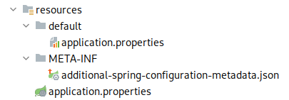

== Opis rozwiązania

Rozdział opisuje zawartość repozytorium, w którym przechowywany jest między innymi kod źródłowy wszystkich komponentów
aplikacji oraz dokumentacja. Każdy podrozdział opisuje jeden z przechowywanych komponentów, wraz z omówieniem kodu
i samego rozwiązania od strony technicznej.

=== Struktura repozytorium

Wszystkie pliki związane z projektem znajdują się w jednym repozytorium zgodnie z podejściem _monorepo_. Oznacza
to, że każda część systemu znajduje się w osobnym folderze wewnątrz jednego repozytorium. Aplikacja nie składa się z
wielu komponentów oraz nie pracuje nad nim dużo osób, więc rozwiązanie sprawdza się tutaj perfekcyjnie. Wszystko,
łącznie z dokumentacją i diagramami znajduje się w jednym miejscu. Ułatwia to wprowadzanie zmian do kilku
komponentów jednocześnie, a także usprawnia proces _code review_, ponieważ zadanie będzie zawsze zawarte w jednym
_pull requeście_. Repozytorium przechowywane w serwisie Github, z którego wykorzystywane są również wbudowane narzędzia
do CI/CD. Główny folder projektu prezentuje się następująco:

.Zawartość folderu głównego w programie Intellij IDEA.
image::../images/root_dir_tree.png[]

Poszczególne komponenty i zależności mają swoje foldery:

* .github → Zawiera pliki konfiguracyjne dla repozytorium w serwisie _Github_. Znajdują się tam pliki konfigurujące
CI/CD przy pomocy _Github Actions_, a także szablon i konfiguracja dla _pull requestów_.
* devtools → Projekt polega na kilku programach, które wspomagają i ułatwiają proces tworzenia oprogramowania.
W tym folderze znajdują się ich pliki konfiguracyjne oraz dokumentacja użytkowania w kontekście tworzonego systemu.
* docs → Przechowuje większość dokumentacji stworzonej przez cały okres tworzenia projektu. Zawiera między innymi
dokumenty KP, DZW i SWS, a także wszystkie rozdziały i pliki budujące pracę dyplomową. W poszczególnych folderach
znajdują się również diagramy, fragmenty kodu i zdjęcia.
* mobileapp → Znajduje się w nim kod źródłowy aplikacji mobilnej dla systemu Android.
* webapp → Zawiera kod źródłowy aplikacji internetowej oraz kod testów E2E. Plik obsługujący proces budowania tego
komponentu zawiera ustawienia do uruchomienia same aplikacji webowej oraz uruchomienia testów E2E dla całego serwisu
(z wyłączeniem testów dla aplikacji mobilnej).
* webservice → Przechowuje kod źródłowy dla serwera.

Pozostałe pliki znajdujące się w tym folderze to _.gitignore_, zawierające ścieżki i pliki, które będą ignorowane przez
system kontroli wersji _Git_, oraz _README.md_, które zawiera informacje o aplikacji oraz instrukcje potrzeba do jej
uruchomienia.

=== Serwer

Do stworzenia serwera dla tworzonej aplikacji zdecydowano się na język programowania Java oraz framework Spring.
Zastosowane narzędzia pozwalają w łatwy i szybki sposób tworzyć kompletne aplikacje webowe, a zapewnione dodatkowe
moduły ułatwiają między innymi komunikację z bazą danych czy obsługę kolejek wiadomości. Do procesu budowania
wykorzystywane jest narzędzie Maven, które wymusza określoną hierarchię katalogów w projekcie. Wykorzystano również
wiele narzędzi wspomagających pracę jak CheckStyle, wspomagający utrzymanie jednolitego stylu kodu w projekcie.

==== Opis API

czy na pewno?

==== Struktura i pakiety

Główny katalog aplikacji serwerowej zawiera przede wszystkim pliki konfiguracyjne dla wykorzystywanych narzędzi oraz
jeden katalog, w którym znajduje się kod źródłowy aplikacji.

.Układ katalogów w folderze głównym serwera.
image::../images/webservice_root_dir.png[]

Katalog główny zawiera znany już plik _.gitignore_, dzięki któremu można ustawić ignorowane przez program Git ścieżki.
Plik _checkstyle.xml_ zawiera zestaw reguł dotyczących sposobu formatowania kodu. Na jego podstawie wymuszana jest
spójność stylu kodu w projekcie. Jeżeli kod nie spełnia reguł, nie może zostać włączony do głównej gałęzi projektu.
Weryfikowane jest to poprzez zadanie podczas uruchamiania procesu CI. W pliku _lombok.config_ znajduje się konfiguracja
dla biblioteki lombok, upraszczającej tworzenie i zarządzanie klasami modelowymi w Javie. Plik _README.md_ zawiera
podstawowe informacje o komponencie oraz instrukcje uruchomienia samej aplikacji, testów oraz konfiguracje środowiska
deweloperskiego. W pliku _pom.xml_ znajduje się konfiguracja dla narzędzia budowania aplikacji Maven. Zawiera on
metadane projektu, wykorzystywane zależności oraz instrukcje do budowania aplikacji w określony sposób, na przykład
warunki sprawdzania pokrycia kodu testami. Pozwala również na zbudowanie pliku zawierającego aplikację webową i serwer
w jednym pliku wykonywalnym. Na koniec został folder _src_ zawierający kod źródłowy posegregowany zgodnie ze
standardowym układem dla programu Maven<<maven_directories>>. Jego zawartość prezentuje się następująco:

.Układ katalogów w folderze _src_.
image::../images/webservice_src_content.png[]

Folder zawiera dwa katalogi: main i test. Pierwszy z nich zawiera kod źródłowy aplikacji, natomiast drugi kod źródłowy
testów jednostkowych i integracyjnych. Więcej o testach opisane jest w rozdziale <<_testy,"Testy">>. Oba katalogi
zawierają takie same podkatalogi. Folder _java_ zawiera pakiety zawierające kod źródłowy, a _resources_ pliki statyczne
wymagane do uruchomienia aplikacji, a które nie wymagają kompilacji.

Kod w Javie grupowany jest w pakietach domenowych. Zdecydowane się na grupowanie kodu w pakietach pod względem
funkcjonalności. Jest to rozwiązanie zwiększające czytelność oraz ułatwiające rozwój aplikacji według tych
funkcjonalności. Zazwyczaj są one w jakimś stopniu niezależne od innych, ewentualnie wykorzystują publiczne serwisy,
więc zapewnia to pewien poziom enkapsulacji. Oczywiście lepszy zastosowaniem tutaj byłyby moduły dodane w Javie 9,
gdyż eliminują one kompletnie problem niechcianego dostępu do klas. Pozwalają one na jawne zdefiniowanie dostępu do
klas publicznych poza modułem. Nie zdecydowano się na ich użycie ze względu na duży poziom skomplikowania oraz rozmiar
projektu. Niektóre pakiety zawierają niewiele klas, a wyodrębnienie ich do modułów zwiększyłoby ilość niepotrzebnych
plików oraz wymaganej konfiguracji. Kolejnym powodem było uproszczenie procesu deweloperskiego, gdyż o wiele łatwiej
modyfikuje się kod znajdujący się w jednym projekcie i jednym katalogu, a nie w kilku osobnych. Finalny układ pakietów
prezentuje się następująco:

.Pakiety Java wykorzystywane w serwerze.
image::../images/webservice_root_packages.png[]

Wszystkie pakiety pogrupowane są w ścieżce pakietów _pl.edu.pjatk.lnpayments.webservice_. Pakiet _webservice_ zawiera
jedną klasę _Webservice application_ odpowiedzialną tylko i wyłącznie za uruchomienie aplikacji. Pozostałą zawartością
są pakiety domenowe oraz jeden pakiet _common_ zawierający ogólną konfigurację, oraz klasy wspólne dla całej aplikacji.
Wewnątrz każdego pakiety pliki pogrupowane zostały według innego popularnego podejścia, czyli grupowania według
warstw. Zdecydowano się na stworzenie aplikacji według architektury warstwowej, więc osobne warstwy, takie jak
repozytoria, kontrolery i serwisy znajdują się w swoich pakietach. Po niżej przykład zawartości jednego z
pakietów domenowych.

.Przykład podziału warstwowego pakietów na przykładzie pakietu _payment_.
image::../images/webservice_domain_package_content.png[]

==== Baza danych

Zdecydowano się na użycie relacyjnej bazy danych PostgreSQL, gdyż dane przechowywane w bazie danych są wyraźnie
ustrukturyzowane. Ze względu na charakter przechowywanych danych ważna jest również obsługa transakcji na poziomie
bazy danych. W tym komponencie wykorzystujemy do obsługi bazy danych framework Spring Data JPA oraz Hibernate.
Pozwoliło to na znaczne ułatwienie procesu tworzenia bazy danych. JPA pozwala na mapowanie relacyjnej bazy danych na
zwykłe klasy Java z wykorzystaniem specjalnych adnotacji. Hibernate natomiast oferuje funkcjonalność automatycznego
tworzenia bazy danych na podstawie mapowań w JPA. Dzięki temu nie było potrzeby ręcznego pisania kwerend SQL, a baza
danych była tworzona w ramach zwykłych zadań dodających nowe funkcjonalności. Na początku prac wykonana została
konfiguracja połączenia z bazą danych oraz wymaganych bibliotek i frameworków. Cała reszta działa się automatycznie na
podstawie kodu tworzonego w Javie.

Schemat bazy danych nie różni się znacząco od diagramu domenowego prezentowanego w rozdziale Analiza.
Znajduje się tam opis każdej z tabeli, jak i relacje pomiędzy nimi. Główne różnice to przede wszystkim nazwy oraz ilość
pól w poszczególnych tabelach. Oczywiście prawie każda z tabel zawiera kolumny _id_, która służy jako klucz publiczny,
a także odpowiednie pola, które są kluczami obcymi.

.Schemat bazy danych wygenerowany przez plugin JPA Buddy dla programu IntelliJ IDEA.
image::../images/database.png[]

Niektóre z pól zostały wymuszone przez względy techniczne, na przykład pole _version_ w tabeli _Transaction_.
Zapobiega ono problemowi utraconych zapisów przy podpisywaniu transakcji. W przypadku tabeli _Notification_
zdecydowano się na wykorzystanie złożonego klucza publicznego składającego się z ID pochodzącego z tabel _Notification_
oraz _User_ (technicznie tylko dla AdminUser, gdyż tylko administrator może otrzymywać powiadomienia o
nowej transakcji). Dzięki temu dla jednego użytkownika oraz jednej transakcji w bazie danych może powstać tylko jedno
powiadomienie. Tabela _Notification_ zawiera również pole identifier, które wyliczane jest na podstawie klucza
złożonego. Wykorzystywane jest do odnoszenia się do rekordu danych podczas wysyłania żądań do API powiadomień.
Reszta kolumn została dodana, aby ułatwić pracę niektórych algorytmów bądź uatrakcyjnić widok danych prezentowany
użytkownikowi. Wszystkie relacje pomiędzy tabelami zostały bez zmian względem diagramu domenowego.

==== Pakiet wspólny

W pakiecie wspólnym znajdują się klasy, interfejsy i adnotacje wspólne dla wszystkich innych pakietów. Zawiera również
mniejsze elementy systemu, których nie było sensu wyodrębniać do osobnego pakietu. Pakiet posiada również ogólną
konfigurację komponentów używanych w aplikacji oraz globalną obsługę wyjątków. Dodatkowo
znajdują się tutaj adnotacje służące do walidacji parametrów wejściowych oraz klasa zawierająca wartości stałe
aplikacji. Zawartość pakietu prezentuje się następująco:

.Zawartość pakietu _common_.
image::../images/webservice_common_content.png[]

Pakiet ten dodatkowo obsługuje dwie funkcjonalności: profile użytkowników i ich edycje oraz zarządzanie ustawieniami
serwera przez administratorów. Kontrolery obsługujące żądania HTTP, wraz z ich DTO znajdują się w pakiecie _resource_.

Omawianie obu funkcjonalności można zacząć od obsługi ustawień serwera. Obsługiwana jest przez klasę
_ConfigurationResource_. Jedyną zależnością klasy jest serwis SettingsService, dostarczający metody
obsługujące pobieranie i aktualizowanie ustawień. Przy każdym nadchodzącym żądaniu jedyne co robią
metody to wywołanie odpowiedniej metody z SettingsService oraz opakowanie zwróconej wartości w obiekt klasy
_ResponseEntity_, zawierający metadane odpowiedzi HTTP. Dostępne są dwa punkty końcowe:

.API ustawień serwera znajdujące się we wspólnym pakiecie.

Ustawienia przechowywane są w pliku tekstowym, który znajduje się w folderze _.lnpayments_ w katalogu domowym
użytkownika. Dzięki zastosowaniu zewnętrznego pliku istnieje możliwość zmiany ustawień bez konieczności uruchamiania
aplikacji webowej. Dane z pliku ładowane są przy uruchamianiu aplikacji przez klasę konfiguracyjną
_SettingsPropertiesConfig_. Posiada ona jedną metodę publiczną _propertiesConfig_ oznaczoną za pomocą adnotacji
_@Bean_, co sprawia, że zwracany przez metodę obiekt będzie zainicjowany w kontekście Springa. Metoda zwraca obiekt
_PropertiesConfiguration_ z biblioteki _Apache Commons Configuration2_, która używana jest do automatycznego
zarządzania plikami konfiguracyjnymi.

[source, java]
----
include::../../../webservice/src/main/java/pl/edu/pjatk/lnpayments/webservice/common/config/SettingsPropertiesConfig.java[lines=31..45]
----

Metoda ta konfiguruje obiekt klasy _PropertiesConfiguration_, aby automatycznie ładowała dane z pliku, a także
dokonywała zapisu przy każdej modyfikacji obiektu. Jeżeli plik konfiguracyjny (bądź folder) nie istnieje, jest tworzony
przez prywatną metodę _initializeProperties_.

[source, java]
----
include::../../../webservice/src/main/java/pl/edu/pjatk/lnpayments/webservice/common/config/SettingsPropertiesConfig.java[lines=47..55]
----

Jeżeli folder nie istnieje, to jest tworzony przez metodę _Files.createDirectory_. Następnie domyślna konfiguracja
kopiowana jest do ścieżki docelowej. Plik z domyślną konfiguracją znajduje się w folderze _resources_ aplikacji.
Mając skonfigurowany obiekt _PropertiesConfiguration_, można jej użyć w _SettingsService_ do operowania na ustawieniach.
Klasa _SettingsService_ implementuje interfejs PropertyService, definiujący metody odpowiedzialne za pobieranie
poszczególnych ustawień wspieranych przez aplikację. Dodatkowo posiada dwie metody odpowiadające obsługiwanym
funkcjonalnością, czyli zapisywaniem i pobieraniem ustawień.

[source, java]
----
include::../../../webservice/src/main/java/pl/edu/pjatk/lnpayments/webservice/common/service/SettingsService.java[lines=18..47]
----

W przypadku pobierania ustawień, dane z pliku są najpierw mapowane na tablicę asocjacyjną mapującą ciąg znaków z
dowolnym obiektem, gdyż wartości z pliku mogą być zarówno tekstem, jak i liczbą. Następnie przy pomocy biblioteki
_Jackson_ tablica mapowana jest na obiekt, który zostanie zwrócony użytkownikowi. Aktualizacja ustawień wymagała
dodania dodatkowego pola _lastModification_. Zabezpiecza ono ustawienia przed problemem utraconych zapisów. Jeżeli
otrzymana do aktualizacji wartość nie będzie miała tej samej daty modyfikacji co dane w pliku, to znaczy, że ustawienia
zostały już zaktualizowane przez innego użytkownika, co oznacza, że operacja nie może się powieść. Jeżeli data jest
poprawna, to obiekt _PropertyValues_ mapowany jest ponownie na tablicę asocjacyjną i zapisywany do pliku. Pozostałe
metody tej klasy zdefiniowane są w interfejsie _PropertyService_ i służą pobieraniu pojedynczych wartości ustawień.
Zdecydowano się na zastosowanie interfejsu, ponieważ w przeszłości na wczesnym etapie prac istniały też inne jego
implementacje, zawierające sztywno określone wartości wymagane na potrzeby testów. Po zaimplementowaniu
_SettingsService_ zostały one usunięte.

Następną funkcjonalnością jest pobieranie i aktualizowanie danych o użytkowniku. W przypadku aktualizacji w tym wydaniu
wspierana jest jedynie zmiana hasła.

.API dla kont użytkowników znajdujące się we wspólnym pakiecie.

Kontrolerem obsługującym te punkty końcowe jest UserResource. Jak widać na powyższym rzucie ekranu, ścieżki nie
zawierają żadnego ID użytkownika, ponieważ autoryzacja użytkownika odbywa się poprzez token JWT, z którego też
otrzymujemy dane o użytkowniku. Ciągnie to za sobą ograniczenie, w którym tylko dany użytkownik może pobrać swoje dane,
aczkolwiek nigdy nie było planów na dodanie takiej funkcjonalności.

.Klasa _UserResource_.
[source, java]
----
include::../../../webservice/src/main/java/pl/edu/pjatk/lnpayments/webservice/common/resource/UserResource.java[lines=16..38]
----

Dane o użytkowniku pobierane są z obiektu _Principal_, który zawiera kontekst aktualnie zalogowanego użytkownika.
W przypadku obu metod dane z żądania HTTP oraz informacja o użytkowniku przekazywana jest dalej do serwisu
_UserService_, pochodzącego z pakietu auth. Wykorzystywane są jego dwie metody _getUserDetails_ i _updatePassword_.
W przypadku pobierania danych o użytkowniku sprawa jest oczywista. Dane pobierane są z bazy danych, a następnie mapowane
na obiekt _UserDto_, który zwracany jest użytkownikowi. W przypadku zmiany hasła po pobraniu danych użytkownika
należy zweryfikować, czy podane aktualne hasło pasuje do tego zapisanego w bazie danych. Jeżeli wszystko się zgadza,
następuje aktualizacja hasła. Warto wspomnieć, że walidacja danych wejściowych następuje automatycznie dzięki
_Bean Validation_ i odbywa się przed wywołaniem odpowiedniej metody kontrolera.

.Metoda updatePassword klasy UserService.
[source, java]
----
include::../../../webservice/src/main/java/pl/edu/pjatk/lnpayments/webservice/auth/service/UserService.java[lines=72..79]
----

Poza konfiguracją zapewniającą obsługę pliku zawierającego ustawienia, w pakiecie wspólnym konfigurowane są również
takie komponenty jak klient HTTP, ustawienia logowania dla nadchodzących żądań oraz konfiguracja automatycznego
generowania dokumentacji API, czyli narzędzia _Swagger_.

Pakiet _exception_ zawiera wyjątki, które wykorzystywane są aplikacji oraz klasę _GlobalExceptionHandler_, zajmującą
się obsługą wyjątków. W przypadku kiedy w jakiejś części aplikacji zostanie rzucony wyjątek czasu wykonania, trafi
on do odpowiedniej metody w _GlobalExceptionHandler_.

.Definicja klasy GlobalExceptionHandler oraz wybrana przykładowa metoda.
[source, java]
----
include::../../../webservice/src/main/java/pl/edu/pjatk/lnpayments/webservice/common/exception/GlobalExceptionHandler.java[lines=15..23]
    // pozostałe metedy obsługujące wyjątki
}
----

Przechwytywanie wyjątków przez tę klasę jest możliwe dzięki dziedziczeniu po klasie Stringa
_ResponseEntityExceptionHandler_. Każda metoda posiada również adnotację _@ExceptionHandler_, która definiuje
przechwytywany wyjątek. W przypadku aplikacji jedyna wykonywana operacja to mapowanie wyjątku na odpowiedni kod błędu
HTTP. W niektórych przypadkach metoda obsługująca wyjątek loguje potrzebne informacje.

Tak jak już zostało wcześniej wspomniane, do walidacji parametrów wejściowych wykorzystywane jest _Bean Validation_.
Biblioteka ta pozwala na weryfikację danych na podstawie specjalnych adnotacji umieszczanych na polu klasy. Specyfika
projektu wymagała stworzenia niestandardowych adnotacji, aby dodać walidację niewspieraną domyślnie przez bibliotekę.
Pierwszą z nich jest walidacja adresu Bitcoin. Odbywa się ona poprzez umieszczenie na polu typu _String_ adnotacji
_@BitcoinAddress_.

.Kod adnotacji BitcoinAddress.
[source, java]
----
include::../../../webservice/src/main/java/pl/edu/pjatk/lnpayments/webservice/common/validation/BitcoinAddress.java[lines=10..17]
----

Można ją umieścić zarówno na polu, jak i na metodzie, zgodnie ze specyfikacją _Bean Validation_. Sama walidacja odbywa
się w klasie _BitcoinAddressValidator_, która implementuje interfejs _ConstraintValidation<BitcoinAddress, String>_.
Wykorzystano do niej klasę _Address_ biblioteki _BitcoinJ_, która w przypadku podania błędnego adresu Bitcoin rzuca
wyjątek.

.Metoda isValid klasy BitcoinAddressValidator.
[source, java]
----
include::../../../webservice/src/main/java/pl/edu/pjatk/lnpayments/webservice/common/validation/BitcoinAddressValidator.java[lines=19..27]
----

Drugą niestandardową walidacją jest sprawdzenie poprawności przesłanego przez administratora klucza publicznego, który
wymagany jest do wygenerowania adresu portfela oraz weryfikacji podpisów transakcji. Kod adnotacji _PublicKey_ niewiele
różni się od adnotacji _BitcoinAddress_. Walidacja wartości tekstowej odbywa się także dzięki bibliotece BitcoinJ, w
klasie implementującej ten sam interfejs, z wyjątkiem innych parametrów (zgodnie z danymi z adnotacji).

.Klasa PublicKeyValidator.
[source, java]
----
include::../../../webservice/src/main/java/pl/edu/pjatk/lnpayments/webservice/common/validation/PublicKeyValidator.java[lines=9..28]
----

W tym przypadku biblioteka udostępnia metodę statyczną _isPubKeyCanonical_, która pozwala na walidację klucza w prosty
sposób, bez potrzeby dodawania obsługi wyjątków, która w przypadku Javy jest mało wydajna.

Pakiet _common_ zawiera również kilka klas modelowych reprezentujących tabele w bazie danych. Są to klasy odpowiedzialne
za hierarchię użytkowników oraz ich pola. Tak jak to było opisane na diagramie domenowym oraz schemacie bazy danych,
hierarcha rozpoczyna się od klasy abstrakcyjnej _User_, Która zawiera podstawowe informacje o wszystkich typach
użytkownika. Struktura widoczna na diagramach osiągnięta została przez zastosowanie adnotacji _@Inheritance_
pochodzącej z JPA. Użyto strategii _Joined_, aby każda klasa w Javie miała swoją własną tabelę w bazie danych.

.Klasa PublicKeyValidator.
[source, java]
----
include::../../../webservice/src/main/java/pl/edu/pjatk/lnpayments/webservice/common/entity/User.java[lines=9..28]
----

Dzięki zastosowaniu modyfikatora dostępu _protected_ nie można dziedziczyć po tej klasie poza pakietem entity. Pole
_email_ oznaczone jest jako unikatowe, ponieważ służy ono jako dodatkowe pole do identyfikacji encji. Metoda _getRole_
jest abstrakcyjna, co umożliwia zdefiniowanie odpowiedniej roli w każdej klasie potomnej, bez zapisywania tej informacji
w bazie danych. Bezpośrednio po abstrakcyjnej klasie _User_ dziedziczą _TemporaryUser_ oraz _StandardUser_.
_TemporaryUser_ reprezentuje użytkownika tymczasowego, który chce zakupić tokeny bez rejestracji w serwisie.
Aby umożliwić śledzenie zamówienia oraz zapisać adres email zdecydowano się na dodanie specjalnego typu użytkownika,
aby ten proces znacznie ułatwić poprzez ujednolicenie obsługi płatności dla wszystkich użytkowników. Aby zapobiec
konfliktom adresów email, użytkownicy tymczasowi mają dołączoną do adresu email wartość powstałą z przeliczenia
aktualnej daty przez funkcję mieszającą.

.Klasa TemporaryUser.
[source, java]
----
include::../../../webservice/src/main/java/pl/edu/pjatk/lnpayments/webservice/common/entity/TemporaryUser.java[lines=9..27]
----

Drugą klasą wyprowadzoną z klasy _User_ jest _StandardUser_, która reprezentuje zwykłego zarejestrowanego użytkownika,
który ma już normalny dostęp do aplikacji. Względem klasy abstrakcyjnej _User_ pojawiły się nowe pola, które są
wymagane przez każdego zarejestrowanego użytkownika, takie jak imię i nazwisko, hasło oraz data utworzenia konta.
Dodatkowo po klasie _StandardUser_ dziedziczy _AdminUser_, reprezentujący administratora serwera. Dodaje nowe pole
zawierające klucz publiczny oraz pole będące kluczem obcym z tabeli _Wallet_. Dodatkowo pojawiło się kilka metod
ułatwiających operacje z wykorzystaniem klas administratorów. Są to proste metody takie jak _hasKey_, która sprawdza,
czy użytkownik posiada klucz publiczny oraz _isAssignedToWallet_ sprawdzająca przypisanie do portfela. Dodatkowo
znajduje się również metoda _notificationsChannelId_, która zwraca nazwę kanału Websocket, na który wysyłane będą
powiadomienia o nowych transakcjach.

.Klasa AdminUser.
[source, java]
----
include::../../../webservice/src/main/java/pl/edu/pjatk/lnpayments/webservice/common/entity/AdminUser.java[lines=13..47]
----

Ostatnią wartą uwagi klasą jest Constants. Posiada ona prywatny konstruktor, a co za tym idzie stworzenie instancji tej
klasy, nie jest możliwe. Zawiera ona zestaw stałych statycznych pól zawierających stałe aplikacji. Dostępne są w niej
na przykład wszystkie nazwy ścieżek do zasobów czy wyrażenia regularne do weryfikacji niektórych parametrów wejściowych.

==== Uwierzytelnianie i autoryzacja

Obsługa autoryzacji i procesu uwierzytelniania znajduje się w pakiecie _auth_. Posiada on wszystkie klasy
konfiguracyjne, filtry i serwisy odpowiedzialne za bezpieczeństwo aplikacji. Znajdują się tutaj również pozostałości
po wcześniejszej wersji aplikacji, kiedy nie było w planach profilu użytkownika ani edycji jgo danych. Z tego powodu w
tym pakiecie znajdują się repozytoria, serwis i konwerter dla klas modelowych użytkowników (znajdujące się w pakiecie
_common_).

.Zawartość pakietu _auth_.
image::../images/webservice_auth_content.png[]

Autoryzacja w aplikacji odbywa się poprzez token JWT. Każdy użytkownik posiada taki token, a bez niego nie da się
uzyskać dostępu do większości API. Jedynym niezabezpieczonym punktem końcowym jest _/payments/info_ oraz punkty
odpowiedzialne za logowanie i rejestrację. Konfiguracja bezpieczeństwa dla API HTTP znajduje się w klasie
_WebSecurityConfig_. Do obsługi zabezpieczeń wykorzystywany jest moduł Springa — _String Security_. Dodaje on
kompleksowe narzędzia pozwalające na implementację procesów autoryzacji. Uruchomienie zabezpieczeń _Spring Security_
dodanie na poziomie klasy adnotacji _@EnableWebSecurity_ oraz dziedziczenie po klasie _WebSecurityConfigurerAdapter_.
Dzięki temu programista otrzymuje zestaw narzędzi pozwalający na dowolną konfigurację zabezpieczeń. W przypadku
klasy _WebSecurityConfig_ odbywa się to za pomocą nadpisanej metody _configure_, przeciążonej z parametrem
_HttpSecurity_.

.Metoda _configure_ klasy WebSecurityConfig nadpisana z parametrem HttpSecurity.
[source, java]
----
include::../../../webservice/src/main/java/pl/edu/pjatk/lnpayments/webservice/auth/config/WebSecurityConfig.java[lines=69..79]
----

Konfiguracja zaczyna się od wyłączenia zabezpieczeń CORS i CSRF, ponieważ w innych metodach są one konfigurowane w inny
niż domyślny sposób. Metoda _exceptionHandling_ pozwala na przechwytywanie wyjątków przez klasy Springa przez zwróceniem
błędu użytkownikowi, dzięki temu można samemu ustawić kod błędu dla wyjątku, co zostało opisane przy klasie
_GlobalExceptionHandler_. Następnie znajduje się ustawienie parametrów sesji na sesję bezstanową. Całe API stworzone
jest zgodnie ze stylem architektury _REST_, według której wszystkie punkty końcowe oraz sesje użytkowników są
bezstanowe<<rest_tutorial_stateless>>. Kolejne metody konfigurują zabezpieczenia punktów końcowych. Domyślnie
wszystkie ścieżki wymagają przynajmniej roli użytkownika, następnie jawnie definiowane są ścieżki dostępne tylko dla
administratorów oraz ścieżki ogólnodostępne. Na koniec dodany jest filtr, który zajmuje się sprawdzaniem tokena JWT.
Wstrzykiwany jest przed domyślny filtr Springa _UsernamePasswordAuthenticationFilter_, aby dokonać walidacji przed
wywołaniem domyślnych mechanizmów autoryzacji. Filtr _AuthTokenFilter odpowiedzialny jest za walidację tokena. W
przypadku gdy token jest poprawny, użytkownik, którego dane się w nim znajdują, zostaje ustawiony jako uwierzytelniony
użytkownik w kontekście bezpieczeństwa.

.Kod klasy _AuthTokenFilter_ odpowiedzialny za filtrowanie żądań i uwierzytelnianie użytkowników.
[source, java]
----
include::../../../webservice/src/main/java/pl/edu/pjatk/lnpayments/webservice/auth/filter/AuthTokenFilter.java[lines=34..54]
----

Kod klasy jest dość prosty. Gdy żądanie HTTP zawiera token w nagłówku _Authorization_, a także token test ważny, czyli
dane zawarte w nim są poprawne oraz gdy jeszcze nie wygasł, to użytkownik zostaje zalogowany. Odbywa się to poprzez
pobranie z bazy danych użytkownika, który implementuje interfejs _UserDetails_. Następnie obiekt ten opakowany jest
w token uwierzytelniający z biblioteki _Spring Security_. Na koniec utworzony token dodawany jest do kontekstu
bezpieczeństwa. Wywołanie filtra kończy się metodą _chain.doFilter_, powodującą wywołanie następnego filtra
w łańcuchu. Mechanizm filtrów w _Spring Security_ zaimplementowany jest przy pomocy wzorca projektowego
_Filter Chain_. Klasa _AuthTokenFilter_ wywołuje wiele metod z serwisu _JwtService_. Zawiera on wiele użytecznych
metod służących do obsługi tokenów JWT. Wykorzystywana jest do tego biblioteka _jsonwebtoken_. Warte uwagi są w
tej klasie dwie metody. Pierwszą jest metoda _generateToken_, odpowiedzialna za generowanie nowych tokenów.

.Metoda generateToken klasy JwtService.
[source, java]
----
include::../../../webservice/src/main/java/pl/edu/pjatk/lnpayments/webservice/auth/service/JwtService.java[lines=25..33]
----

Generowanie odbywa się przez klasę _Jwts_, która posiada zaimplementowany wzorzec projektowy Budowniczy do tworzenia
nowych tokenów. Email użytkownika jest ustawiony jako temat tokena. Dodatkowo ustawiana jest data wydania oraz data
wygaśnięcia. Niestety biblioteka ta nie jest aktywnie utrzymywana, przez co daty obsługiwane są przez bardzo starą
klasę _Date_. Na koniec token podpisywane jest przy pomocy odpowiedniego algorytmu oraz klucza zdefiniowanego w
plikach konfiguracyjnych serwera. Drugą metodą wartą uwagi jest _retrieveEmail_, ekstraktujący adres email z tokena
JWT. Do otrzymania adresu email potrzebny jest ponownie klucz, z którym został wygenerowany token. Następnie z ciała
rozszyfrowanego tokena wyciągany jest adres email, który można zwrócić.

.Metoda retrieveEmail klasy JwtService.
[source, java]
----
include::../../../webservice/src/main/java/pl/edu/pjatk/lnpayments/webservice/auth/service/JwtService.java[lines=40..46]
----

Drugą klasą konfiguracyjną odpowiedzialną za zabezpieczenia jest _WebSocketSecurityConfig_, która konfiguruje
zabezpieczenia kanałów protokołu Websocket. Dostęp do wszystkich kanałów wymaga posiadania przez użytkowników ważnego
tokena. Dodatkowo w pakiecie _interceptor_ znajduje się klasa _AuthTokenInterceptor_. Odpowiada ona za uwierzytelnianie
użytkowników próbujących połączyć się z jednym z kanałów Websocket. Klasa ta jest wykorzystywana przy konfiguracji
ścieżek kanałów znajdujących się w pakiecie _payment_.

.Zaimplementowana metoda preSend klasy AuthTokenInterceptor, pochodząca z interfejsu ChannelInterceptor.
[source, java]
----
include::../../../webservice/src/main/java/pl/edu/pjatk/lnpayments/webservice/auth/interceptor/AuthChannelInterceptor.java[lines=31..46]
----

Metoda preSend przechwytuje wiadomość otwierającą nowe połączenie protokołu Websocket, po czym uwierzytelnia
użytkownika. Kod tej metody jest dosyć podobny do fragmentu klasy _AuthTokenFilter_. Również z nagłówka wyodrębniany
jest token, po czym następuje walidacja oraz zalogowanie użytkownika. W tym przypadku nie jest to kontekst
bezpieczeństwa, tylko w obiekcie klasy StompHeaderAccessor, który zarządza dostępem do przechwyconej przez interceptor
wiadomości.

Pakiet _auth_ obsługuje również część API odpowiedzialną za uwierzytelnianie. Dostępne są 4 punkty końcowe: _login_
służący do logowania, _register_ służący do rejestracji, _refreshToken_ służący do odświeżenia tokena JWT oraz
_temporary_ pozwalający na pozyskanie tokena przez niezalogowanego użytkownika.

.API służące do uwierzytelniania.
image::../images/webservice_auth_api.png[]

Obsługa powyższego API znajduje się w klasie _AuthResource_. Spora część logiki znajduje się bezpośrednio w
kontrolerze, gdyż kodu jest często zbyt mało do wyodrębnienia do osobnego serwisu. Łamana jest przez to zasada
_Single Responsibility Principle_ z akronimu SOLID, aczkolwiek dzięki temu uniknięto tworzenia kolejnego niepotrzebnego
serwisu.

.Metoda login klasy _UserResource_.
[source, java]
----
include::../../../webservice/src/main/java/pl/edu/pjatk/lnpayments/webservice/auth/resource/AuthResource.java[lines=39..48]
----

Omówienie zaczniemy od metody _login_, pozwalającej na logowanie użytkownika. Do uwierzytelniania wykorzystana
została klasa _AuthenticationManager_ pochodząca ze Spring Security. Jej konfiguracja znajduje się w klasie
konfiguracyjnej _WebSecurityConfig_. Pozwala ona na automatyczne przeprowadzenie logowania przy pomocy tego samego
tokena uwierzytelniającego, który użyty został wcześniej przy logowaniu w filtrze HTTP. Po udanym logowaniu
generowany jest token JWT przy pomocy _JwtService_, który zwracany jest użytkownikowi wraz z podstawowymi danymi
o użytkowniku, takimi jak ważność tokena czy posiadana rola. W przypadku nieudanego logowania Spring automatycznie
zwraca kod HTTP 403, oznaczający zabroniony dostęp do zasobu. Na uwagę zasługuje również metoda _obtainTemporaryToken_,
generująca token przeznaczony dla tymczasowego użytkownika.

.Metoda obtainTemporaryToken klasy _UserResource_.
[source, java]
----
include::../../../webservice/src/main/java/pl/edu/pjatk/lnpayments/webservice/auth/resource/AuthResource.java[lines=56..63]
----

Na początku tworzony jest nowy użytkownik tymczasowy w bazie danych. Jest to obiekt klasy _TemporaryUser_, więc
do adresu email będzie miał dołączoną specjalną wartość zapewniającą unikatowość użytkowników z tym samym adresem email.
Następnie generowany jest token JWT i zwracany użytkownikowi. Dzięki temu rozwiązaniu nawet użytkownik nieposiadający
konta ma tworzony obiekt w bazie danych na potrzeby śledzenia zamówienia. Będzie on ważny tak długo, jak ważny będzie
token JWT. Po wygaśnięciu tokena użytkownik tymczasowy będzie musiał poprosić o nowy token, a co za tym idzie o
nowego użytkownika.

Pozostałe metody klasy _UserResource_ nie mają interesującej logiki. Delegują one wywołania do odpowiednich serwisów.
Metoda _refreshToken_ przekazuje dane do serwisu _JwtService_, gdzie na podstawie danych z otrzymanego tokena
generowany jest nowy token ze zaktualizowaną datą ważności. W przypadku metody _register_ wywołanie delegowane jest
do metody tworzącej użytkownika w klasie _UserService_. Serwis ten zajmuje się obsługą wszystkich typów użytkowników.
Posiada metody pozwalające na tworzenie zarówno tymczasowych, jak i standardowych użytkowników oraz posiada metody
operujące na abstrakcyjnej klasie _User_. Wracając do rejestracji, odbywa się ona poprzez wywołanie metody
_createUser_.

.Metoda createUser klasy _UserService_.
[source, java]
----
include::../../../webservice/src/main/java/pl/edu/pjatk/lnpayments/webservice/auth/service/UserService.java[lines=42..47]
----

Metoda oznaczona jest jako @Transactional, co zapobiega jednoczesnemu dodaniu tego samego użytkownika przez kilka
wątków. Na początku wywołanie poddany walidacji zostaje adres email, czyli wykonywane jest sprawdzenie, czy dany email
jest wolny. Następnie model parametru konwertowany jest na klasę User (a konkretnie StandardUser) i zapisywany jest
przy pomocy klasy repozytorium. Sama hierarchia klas repozytorium użytkowników jest dosyć ciekawa. Zaczyna się
od generycznego interfejsu _BaseUserRepository_.

.Interfejs BaseUserRepository.
[source, java]
----
include::../../../webservice/src/main/java/pl/edu/pjatk/lnpayments/webservice/auth/repository/BaseUserRepository.java[lines=9..15]
----

Adnotacja _NoRepositoryBean_ sprawia, że pomimo dziedziczenia po _JpaRepository_, interfejs nie zostanie zainicjowany
jako komponent w kontenerze Springa. Dzięki zastosowaniu typów generycznych można utworzyć interfejsy dla każdego z
typów użytkowników, bez większego nakładu pracy dodając metody pozwalające na operacje na każdym modelu hierarchii.

.Interfejsy UserRepository, StandardUserRepository i AdminUserRepository.
[source, java]
----
include::../../../webservice/src/main/java/pl/edu/pjatk/lnpayments/webservice/auth/repository/UserRepository.java[lines=6..8]

include::../../../webservice/src/main/java/pl/edu/pjatk/lnpayments/webservice/auth/repository/StandardUserRepository.java[lines=6..8]

include::../../../webservice/src/main/java/pl/edu/pjatk/lnpayments/webservice/auth/repository/AdminUserRepository.java[lines=8..13]
----

Repozytorium administratorów posiada dodatkową metodę, która pozwala na wyszukanie administratorów, którzy posiadają
klucze publiczne. Dzieje się to za pomocą specjalnej składni metod Spring Data, dzięki której kwerendy można pisać
przy pomocy słów kluczowych w nazwie metody. Ogranicza to potrzebę pisania zapytań SQL, gdyż zostaną one wygenerowane
automatycznie w czasie wykonania. Jak już zostało wspomniane, obecnie najlepszym miejscem dla klas repozytorium, a
także dla klas _UserService_ i _UserConverter_ jest pakiet _common_, gdyż są one wykorzystywane w wielu różnych
pakietach. Jest plan na uporządkowanie tych klas w odpowiednich pakietach, niestety odbędzie się to dopiero w następnych
wydaniach projektu.

==== Płatności

Pakiet payment oferuje jedną z głównych funkcjonalności projektu, czyli sprzedaż tokenów za Bitcoiny w sieci
Lightning. Obsługuje również funkcje związane z pobieraniem historii płatności czy też z agregowaniem danych
statystycznych.

.Zawartość pakietu _payment_.
image::../images/webservice_payment_content.png[]

Aby płatności były w ogóle możliwe, należy ustanowić połączenie z węzłem sieci Lightning. W projekcie zdecydowano
się na wykorzystanie węzła o nazwie _LND_, który działa w kontenerze obok aplikacji. Do poprawnego działania wymagany
jest jeszcze drugi kontener, który zawiera pełny węzeł sieci Bitcoin. Teoretycznie istnieje możliwość uruchomienia
_LND_, wykorzystując jeden publicznych węzłów Bitcoin, aczkolwiek własna instancja daje większą niezależność oraz
ułatwia rozwój projektu. Do obsługi węzła w kodzie Java wykorzystana została biblioteka _LightningJ_. Jej
konfiguracja odbywa się w klasie _LndConfig_, która standardowo znajduje się w pakiecie _config_.

.Metody klasy konfiguracyjna LndConfig.
[source, java]
----
include::../../../webservice/src/main/java/pl/edu/pjatk/lnpayments/webservice/payment/config/LndConfig.java[lines=41..57]
----

Do kontenera Springa wprowadzone zostają dwie nowe zależności obsługujące komunikację z _LND_. Różnią się tym, że
jedna z nich jest synchroniczna, a druga asynchroniczna. W obu przypadkach konfiguracja odbywa się poprzez podanie
portu, na którym działa węzeł, oraz przez podanie plików zawierających certyfikat TSL, oraz plik _macaroon_.
Dodatkowo w przypadku asynchronicznego obiektu dodany został subskrybent, który jest aktywowany przy zmianie statusu
_invoice_ w węźle Lightning. Klasa _InvoiceObserver_ zostanie umówiona w dalszej części podrozdziału.

Funkcjonalności pakietu _payment_ udostępnione poprzez API dotyczą obsługi płatności. Użytkownicy mogą tworzyć nowe
płatności, co wiąże się z generowaniem _invoice_ przez węzeł sieci Lightning. Pozwala także na pobieranie danych
o płatnościach z bazy danych, zarówno dla zalogowanego użytkownika, jak i wszystkich płatności. Oczywiście dane
zwracane przez punkty końcowe różnią się, aby zapobiec nieautoryzowanemu udostępnianiu danych poufnych. Dodatkowo
dostępna jest ścieżka _/payments/info_, zwracająca informacje o aktualnych szczegółach płatności takich jak cena czy
opis. Dane te są wyświetlane na powitalnej stronie modułu płatności w aplikacji mobilnej. Warto wspomnieć, że jest to
jedyny niezabezpieczony punkt końcowy poza tymi związanymi z uwierzytelnianiem.

.API dostępne dla płatności.
image::../images/webservice_payment_api.png[]

Omówienie zawartości klas polegać będzie tym razem na przejście przez cały proces płatności, w przeciwieństwie do
omawiania zawartości poszczególnych klas. Proces jest dosyć skomplikowany, dlatego też podczas implementacji powstał
diagram sekwencji obrazujący cały przepływ danych.

.Diagram sekwencji dla implementacji procesu płatności.
[plantuml]
----
include::../diagrams/payment_sequence.puml[]
----

Diagram powstał przed implementacją rozwiązania, dlatego niektóre nazwy i drobne szczegóły mogą się różnic ze stanem
faktycznym. Aby ukazać proces rozwoju aplikacji, zdecydowano się na pokazanie go w niezmienionej formie.
Jak widać na diagramie, proces zaczyna się od żądania na adres _/payments/info_. Wszystkie żądania HTTP obsługiwane są
w klasie _PaymentResource_.

.Metoda paymentInfo klasy PaymentResource.
[source, java]
----
include::../../../webservice/src/main/java/pl/edu/pjatk/lnpayments/webservice/payment/resource/PaymentResource.java[lines=45..51]
----

Dostęp do tej ścieżki nie wymaga żadnej autoryzacji, dlatego w pierwszej linijce następuje próba pozyskania adresu
email. Zostaje on opakowany w obiekt klasy _Optional_, gdyż wartość obiektu _Principal_ będzie nieobecna w przypadku
nieautoryzowanego użytkownika. Następnie wywoływana jest metoda _buildInfoResponse_ klasy _PaymentFacade. Przyrostek
_Facade_ miał początkowo oznaczać odrębną warstwę w architekturze aplikacji, zbierającą w sobie wszystkie serwisy. Miała
być dostępna tylko dla klas kontrolerów. Model ten się nie przyjął w innych pakietach, gdyż zysk z tego rozwiązania był
niewielki, a generował dużo nadmiarowego kodu.

.Metoda buildInfoResponse klasy PaymentFacade.
[source, java]
----
include::../../../webservice/src/main/java/pl/edu/pjatk/lnpayments/webservice/payment/facade/PaymentFacade.java[lines=69..79]
----

W przypadku kiedy parametr email zawiera w sobie wartość, następuje zapytanie do bazy danych o aktualnie trwającą
płatność. Dzięki temu użytkownik po ponownym zalogowaniu będzie mógł wznowić swoją płatność. Klasa
_PaymentDataService_ jest tylko serwisem opakowującym metody z repozytorium. W przypadku metody
_findPendingPaymentsByUser_ następuje tylko zwykłe wywołanie odpowiedniej metody z repozytorium płatności.
Wartością zwracaną przez metodę _buildInfoResponse_ jest obiekt klasy _PaymentInfo_. Tworzony jest on przy
pomocy wzorca projektowego budowniczy (builder), zaimplementowanego przy pomocy biblioteki _Lombok_. Cena oraz
opis pobierane są z serwisu _PropertyService_. Jest to interfejs, którego jedyną implementacją jest _SettingsService_.
Został on już omówiony przy okazji pakietu _common_. Jak już zostało powiedziane, oczekujące płatności pochodzą z
bazy danych. Adres węzła Lightning pochodzi z osobnego serwisu _NodeDetailsService_. Zajmuje się on tylko i wyłącznie
tworzeniem adresu węzła.

.Metoda buildInfoResponse klasy PaymentFacade.
[source, java]
----
include::../../../webservice/src/main/java/pl/edu/pjatk/lnpayments/webservice/payment/service/NodeDetailsService.java[lines=26..59]
----

Adres węzła składa się z dwóch części: klucza publicznego węzła oraz jego adresu IP. Pełny adres tworzony jest w
konstruktorze. Adres raczej nie zmieni się w trakcie działania serwera, więc obliczanie go przy każdym żądaniu jest
niepotrzebną stratą mocy obliczeniowej. Klucz publiczny pobierany jest bezpośrednio z węzła sieci Lightning poprzez
wywołanie `synchronousLndAPI.getInfo().getIdentityPubKey()`. Adres IP węzła można uzyskać na dwa sposoby. Pierwszy i
zarazem domyślny sposób to pozyskanie go z zewnętrznego serwisu. Wykorzystywany jest do tego serwis AWS o nazwie
_checkIp_. Drugą opcją jest ręczne podanie adresu przez użytkownika. Adres IP serwera jest jednym z pól znajdujących
się w ustawieniach serwera. Można je ustawić poprzez plik konfiguracyjny bądź w aplikacji internetowej. Jeżeli
adres w ustawieniach nie jest pusty, to zostanie on użyty do budowania adresu węzła. Adres ten zapisany jest finalnie
jako pole klasy, więc _PaymentFacade_ wykorzystuje zwykłą metodę dostępową _getNodeUrl_. Na koniec procesu pozyskiwania
szczegółów potrzebnych do płatności obiekt PaymentInfo zwracany jest do kontrolera, po czym przekazany jest dalej do
użytkownika. Przykładowa odpowiedź ze ścieżki _/payments/info_ prezentuje się następująco:

.Przykładowa odpowiedź z punktu /payments/info.
[source, json]
----
include::../../../webservice/src/test/resources/integration/payment/response/profileinfo-GET-valid.json[]
----

Następnym elementem procesu jest utworzenie nowej płatności. Dzieje się to poprzez żądanie POST na ścieżkę _/payments_.
W tym przypadku klasa _PaymentResource_ nie zawiera praktycznie żadnej logiki. Deleguje ona wywołanie do fasady
_PaymentFacade_, po czym konwertuje zwrócony obiekt i wysyła użytkownikowi.

.Metoda createNewPayment klasy PaymentFacade.
[source, java]
----
include::../../../webservice/src/main/java/pl/edu/pjatk/lnpayments/webservice/payment/facade/PaymentFacade.java[lines=81..103]
----

Wywołanie metody zaczyna się od pobrania wybranych ustawień z _PropertyService_. Do utworzenia płatności potrzebne są
czas ważności faktury Lightning oraz cena pojedynczego tokena. Następnie pobierany jest obiekt użytkownika z bazy
danych. Właśnie dla tej linijki kodu potrzebna była osobna klasa dla tymczasowych użytkowników. Dzięki temu kod
jest ujednolicony, a proces generowania faktury jest jednakowy dla wszystkich użytkowników. Wywołanie metody
_createInvoice_ klasy _InvoiceService_ powoduje wygenerowanie żądania zapłaty, czyli łańcucha znaków, którego można użyć
do opłacenia faktury.

.Metoda createInvoice klasy InvoiceService.
[source, java]
----
include::../../../webservice/src/main/java/pl/edu/pjatk/lnpayments/webservice/payment/service/InvoiceService.java[lines=33..43]
----

Metoda ta wylicza wartość faktury, a następnie tworzy obiekt klasy _Invoice_ przy pomocy metody prywatnej
_generateInvoice_. Następnie utworzony obiekt rejestrowany jest w węźle sieci Lightning, a w przypadku sukcesu
zwrócone zostaje żądanie zapłaty. Obsługa wyjątków w tej metodzie wymuszona jest przez bibliotekę _LightningJ_.
Prawie każda metoda tej biblioteki rzuca wyjątki przechwytywalne (ang. _checked exceptions_<<hortsmann>>), więc od
użytkownika wymagane jest tworzenie dodatkowego kodu obsługującego je. W prawie każdym przypadku jest to logowanie
odpowiedniej wiadomości oraz rzucanie nowego wyjątku klasy _LightningException_. Wyjątek ten jest mapowany na kod błędu
500. Wracając do klasy _PaymentFacade_, po otrzymaniu żądania płatności budowany jest obiekt klasy _Payment_ przy
pomocy wzorca projektowego budowniczy. Utworzony obiekt zapisywany jest w bazie danych przy pomocy repozytorium
płatności. Na koniec tworzony jest nowy wątek _PaymentStatusUpdateTask_, który wysyłany jest do planisty zadań
zainicjowanego w klasie konfiguracyjnej _SchedulerConfig_. Planista uruchomi wątek po takim samym czasie, jaki wynosi
ważność _invoice_. Wątek ten odpowiada za automatyczną zmianę statusu płatności. Klasa ta implementuje interfejs
_Runnable_, posiadający jedną metodę _run_, która wywoływana jest automatycznie czy uruchomieniu wątku.

.Metoda run klasy PaymentStatusUpdateTask.
[source, java]
----
include::../../../webservice/src/main/java/pl/edu/pjatk/lnpayments/webservice/payment/task/PaymentStatusUpdateTask.java[lines=19..26]
----

Logika metody jest prosta. Pobierana jest płatność z bazy danych, która została przekazana w konstruktorze. Nie jest
to komponent Springa, co za tym idzie, obiekt nie jest już w _persistence context_<<persistence_context>>.
Skutkiem tego encja płatności nie jest już zarządzana przez Hibernate, więc aktualizacje z bazy danych nie są widoczne
w posiadanym obiekcie. Z tego powodu obiekt musi zostać ponownie pobrany z bazy danych. Następnie sprawdzany jest
aktualny status płatności. Jeżeli po określonym czasie płatność dalej jest oczekująca, status zmieniany jest na
_cancelled_, czyli anulowana. Oczywiście wywołanie tej metody odbywa się asynchronicznie, domyślnie po 15 minutach od
utworzenia płatności. Zaraz po przekazaniu wątku do planisty, obiekt płatności zwrócony zostaje do kontrolera, gdzie
jest on mapowany na obiekt DTO, który zostaje zwrócony użytkownikowi. Finalna odpowiedź może prezentować się
następująco:

.Przykładowa odpowiedź z punktu POST /payments.
[source, json]
----
include::../../../webservice/src/test/resources/integration/payment/response/payments-POST.json[]
----

Poza polami omówionymi wcześniej, jak cena, żądanie zapłaty czy data utworzenia i wygaśnięcia, odpowiedź zawiera również
pole _paymentTopic_, które zawiera adres kanału Websocket, na który wysyłane jest powiadomienie o zaksięgowaniu
transakcji wraz z tokenami, po wcześniejszym opłaceniu żądania zapłaty. Konfiguracja dla protokołu Websocket odbywa się
w klasie konfiguracyjnej _WebSocketConfig_. Rejestrowane są tam nazwy ścieżek do odpowiednich kanałów oraz
rejestrowany jest interceptor _AuthChannelInterceptor_, który był omawiany wcześniej.

Aby kontynuować proces płatności, użytkownik musi opłacić fakturę, wykorzystując otrzymane żądanie zapłaty. Opłacenie
faktury rejestruje węzeł sieci Lightning. Status faktur obserwowany jest przez klasę _InvoiceObserver_. Klasa ta
została wcześniej zainicjowana w klasie konfigurującej bibliotekę _LightningJ_. Nasłuchuje ona na każdą zmianę statusu
faktury. Jeżeli nadejdzie taka ze statusem _settled_, jej żądanie zapłaty zostaje przekazane do metody _finalizePayment_
klasy _PaymentFacade_.

.Metoda finalizePayment klasy PaymentFacade.
[source, java]
----
include::../../../webservice/src/main/java/pl/edu/pjatk/lnpayments/webservice/payment/facade/PaymentFacade.java[lines=105..115]
----

Metoda ta pobiera z bazy danych płatność, wyszukując ją przy pomocy żądania zapłaty. Przypisywane są tokeny, które
są aktualnie wartością funkcji mieszającej wybranych pól płatności. Za generowanie tokenów odpowiada _TokenService_.
Oczywiście status transakcji zmienia się na zakończoną. Następnie wywoływana jest metoda _send_, serwisu
TokenDeliveryService. Odpowiada on za wysyłanie tokenów do wybranego przez administratorów zewnętrznego serwisu.
Umożliwia to późniejsze procesowanie tokenów w innych aplikacjach. Jest to funkcjonalność opcjonalna, którą można
wyłączyć poprzez ustawienie pustego adresu HTTP w ustawieniach bądź w pliku konfiguracyjnym. W przypadku błędów
logowane są odpowiednie komunikaty.

.Wybrane metody klasy TokenDeliveryService.
[source, java]
----
include::../../../webservice/src/main/java/pl/edu/pjatk/lnpayments/webservice/payment/service/TokenDeliveryService.java[lines=39..60]
----

Ostatnim krokiem do finalizacji płatności jest wysłanie tokenów na odpowiedni kanał Websocket. Odbywa się to w klasie
_PaymentSocketController_. Wykorzystuje on klasę _SimpMessagingTemplate_ pochodzącą z modułu _Spring Messaging_ do
wysłania tokenów.

.Metoda send klasy PaymentSocketController.
[source, java]
----
include::../../../webservice/src/main/java/pl/edu/pjatk/lnpayments/webservice/payment/resource/PaymentSocketController.java[lines=25..27]
----

Jest to ostatni krok ze skomplikowane procesu płatności. Użytkownik może już w pełnie cieszyć się zakupionymi tokenami.
Wszystkie płatności rejestrowane są w bazie danych. Serwer ma możliwość pobierania danych o historycznych
płatnościach. Zaimplementowano 2 punkty końcowe: GET /payments oraz GET /payments/all. Jeden z nich pobiera dane
o historii użytkownika, a drugi historię wszystkich płatności. Logika obu punktów jest podobna, główną różnicą jest
format zwracanych danych. Opisany zostanie przede wszystkim /GET /payments, gdyż posiada on kilka dodatkowych funkcji
względem drugiej metody.

.Metoda getAllUserPayments klasy PaymentResource.
[source, java]
----
include::../../../webservice/src/main/java/pl/edu/pjatk/lnpayments/webservice/payment/resource/PaymentResource.java[lines=61..67]
----

Nowością jest tutaj obiekt Pageable. Pochodzi on z modułu Spring Data i pozwala na automatyczną implementację
paginacji danych. Dodatkowo przy pomocy adnotacji _@SortDefault_ ustawiane jest domyślne sortowanie, w tym przypadku
malejąco według daty. Pole pochodzi z klasy _Payment__, która została wygenerowana podczas kompilacji przez bibliotekę
_hibernate-jpamodelgen_, która tworzy klasy opisujące encję bazy danych. Dzięki temu automatycznie powstaje obiekt,
który zawiera pola modelu jako stałe. Zadaniem metody jest delegacja wywołania do _PaymentFacade_. W przypadku
wszystkich płatności metody różnią się tylko metodą wywoływaną w _PaymentFacade._

.Metoda getPaymentsByEmail klasy PaymentFacade.
[source, java]
----
include::../../../webservice/src/main/java/pl/edu/pjatk/lnpayments/webservice/payment/facade/PaymentFacade.java[lines=132..135]
----

Następuje wywołanie do klasy _PaymentDataService_, które ma na celu pobranie wszystkich płatności. Aby umożliwić
ich pobieranie względem różnych pól, również zagnieżdżonych, stworzono dwa typy wyliczeniowe: SearchableField oraz
SearchableTable. Warto wspomnieć, że w przypadku wyszukiwania wszystkich płatności następuje zwykłe wywołanie metody
findAll, które delegowane jest aż to repozytorium w niezmienionej formie, co kończy działanie tego procesu.

.Typ wyliczeniowy SearchableField.
[source, java]
----
include::../../../webservice/src/main/java/pl/edu/pjatk/lnpayments/webservice/payment/repository/enums/SearchableField.java[lines=7..21]
----

Każda wartość typu wyliczeniowego zawiera dwa parametry. Mapowana jest nazwa tabeli z tekstową nazwą pola w obiekcie
modelowym. Tekstowe nazwy pól ponownie pochodzą z automatycznie wygenerowanych klas z metadanymi. Aby znaleźć
płatności według nazwy użytkownika, wystarczy wywołać metodę _findAll_ przeciążoną z typem SearchableField.

.Przeciążona metoda findAll klasy PaymentDataService.
[source, java]
----
include::../../../webservice/src/main/java/pl/edu/pjatk/lnpayments/webservice/payment/service/PaymentDataService.java[lines=39..41]
----

Ponownie wywołanie jest delegowane do następnej warstwy. Tym razem parametrem będzie obiekt klasy PaymentSpecification.
Implementuje ona interfejs _Specification_, który umożliwia na tworzenie na ręczne tworzenie kwerend do bazy danych
przy pomocy kodu Javy. Spring Data jest później w stanie stworzyć zapytanie do bazy danych na podstawie tych
implementacji.

.Przeciążona metoda findAll klasy PaymentDataService.
[source, java]
----
include::../../../webservice/src/main/java/pl/edu/pjatk/lnpayments/webservice/payment/repository/specification/PaymentSpecification.java[lines=21..30]
----

Jedyna metoda pochodząca z interfejsu _Specification_ to _toPredicate_. Pozwala ona na sformułowanie reguły, według
której filtrowane będą wyniki. W zależności od tabeli wyrażonej wartością typu wyliczeniowego SearchableTable
budowane jest odpowiednie twierdzenie. W przypadku zagnieżdżonego pola, jakim jest użytkownik, należy wykonać
złączenie tabel znane z SQL. Repozytorium płatności jako jedyne implementuje interfejs _JpaSpecificationExecutor_,
który umożliwia procesowanie implementacji interfejsu _Specification_. Jest to jedyne repozytorium w projekcie,
które implementuje ten interfejs.

.Interfejs PaymentRepository
[source, java]
----
include::../../../webservice/src/main/java/pl/edu/pjatk/lnpayments/webservice/payment/repository/PaymentRepository.java[lines=12..18]
----

Ostatnio funkcjonalnością pakietu _payment_ jest agregowanie danych, które później mogą zostać wyświetlone na przykład
przy pomocy wykresu. Obecnie wspierane jest zbieranie danych o sumie przychodów w poszczególnych miesiącach.
Odbywa się to oczywiście w klasie _PaymentFacade_.

.Metoda getPaymentsByEmail klasy PaymentFacade.
[source, java]
----
include::../../../webservice/src/main/java/pl/edu/pjatk/lnpayments/webservice/payment/facade/PaymentFacade.java[lines=117..130]
----

Jest to dość zaawansowany algorytm stworzony przy użyciu Java Stream API, wprowadzonego w Javie 8. Dodaje on do Javy
elementy programowania funkcyjnego. Na początek pobierane są dane o płatnościach z bazy danych. Filtrowane są tylko
te płatności, które zostały zakończone sukcesem. Później transakcje są sortowane według daty oraz mapowane tablicę
asocjacyjną, łączącą miesiąc i rok z sumą przychodów. Zastosowanym obiektem jest _TreeMap_, który przechowuje klucze
w strukturze drzewa, co zapewnia kolejność kluczy. Na koniec pozycje tablicy mapowane są na kolekcję _List_, która
zawiera gotowe dane do wyświetlenia na wykresie po stronie aplikacji internetowej. Ta funkcjonalność nie posiada
własnego punktu końcowego w API, a jest używana w pakiecie _wallet_, który zostanie opisany w dalszej części rozdziału.

==== Zarządzanie administratorami

Pakiet _admin_ jest zdecydowanie najmniejszy pod względem ilości klas. Zajmuje się on obsługą zarządzania
administratorami. Poszczególne serwisy i zasoby podobne są do klas znajdujących się w pakiecie _auth_, aczkolwiek
dotyczą tylko i wyłącznie administratorów. Dodatkową funkcjonalnością jest możliwość odbierania kluczy publicznych od
administratorów. Zawartość pakietu prezentuje się następująco:

.Zawartość pakietu _admin_.
image::../images/webservice_admin_content.png[]

Interfejs HTTP zawiera kilka metod dostępnych pod adresem /admins. Są to metody służące do pobierania, dodawania
oraz usuwania administratorów. Dodatkowo ścieżka /admins/keys z metodą PATH pozwala na przesłanie klucza publicznego.

.API dostępne dla zarządzania administratorami.

Kod klasy _AdminResource_, obsługującej żądania HTTP jest bardzo prosta. Każda metoda deleguje wywołanie do klasy
_AdminService_, która zawiera prawie całą logikę w tym pakiecie. Zawiera ona wiele metod bardzo podobnych do tych
pochodzących z _AdminService_, tylko operujące na administratorach. Nową funkcjonalnością względem tamtej klasy
jest usuwanie użytkowników.

.Metoda removeAdmin klasy AdminService.
[source, java]
----
include::../../../webservice/src/main/java/pl/edu/pjatk/lnpayments/webservice/admin/service/AdminService.java[lines=65..73]
----

Aby usunąć administratora, należy najpierw pobrać jego obiekt bazy danych. Ważnym krokiem jest sprawdzenie, czy
pobrany administrator jest członkiem aktualnego portfela. Gdyby administrator był członkiem portfela, usunięcie go
mogłoby spowodować utratę środków, ponieważ przepadłaby możliwość podpisania i walidacji transakcji. Po udanej
walidacji użytkownik może zostać usunięty przy pomocy repozytorium administratorów. Klasa _AdminService_ pozwala
na przesłanie z aplikacji mobilnej klucza publicznego. Umożliwia on stworzenie adresu multisig przy tworzeniu portfela
oraz weryfikację podpisów transakcji.

.Metoda removeAdmin klasy AdminService.
[source, java]
----
include::../../../webservice/src/main/java/pl/edu/pjatk/lnpayments/webservice/admin/service/AdminService.java[lines=55..63]
----

Zasada działania jest dosyć podobny do poprzednio omawianej metody. Po pobraniu administratora z bazy danych następuje
weryfikacja. Tym razem jest to sprawdzenie, czy użytkownik przesłał już swój klucz publiczny. Następnie wartość
pola przechowującego klucz jest aktualizowana, a sam obiekt zapisywany w bazie danych. Ostatnim elementem pakietu
jest klasa _InitialAdminLoader_, która służy do automatycznego tworzenia administratora przy starcie serwera.
Zawsze bowiem musi istnieć jedno konto administracyjne, aby umożliwić wstępną konfigurację serwera.

.Metoda run klasy InitialAdminLoader.
[source, java]
----
include::../../../webservice/src/main/java/pl/edu/pjatk/lnpayments/webservice/admin/startup/InitialAdminLoader.java[lines=29..44]
----

Klasa ta implementuje interfejs _ApplicationRunner_, dzięki czemu nadpisana metoda _run_ zostanie automatycznie
wywołana przed załadowanie kontekstu Springa. Metoda ta pobiera domyślną nazwę użytkownika oraz hasło, po czym
buduje obiekt DTO służący do tworzenia administratorów i wysyła go do odpowiedniego serwisu. W przypadku nieudanego
zapisu odpowiedni komunikat jest logowany. Aktualnie próba dodania administratora następuje przy każdym uruchomieniu
serwera. W przyszłości planowane jest uruchamianie jej tylko przy pierwszym uruchomieniu na danym komputerze.

==== Portfel

Pakiet _wallet_ obsługuje funkcjonalność portfela. Nie jest to portfel w rozumieniu ekosystemu Bitcoina. W tworzonym
systemie jest to parę adresów Bitcoin, połączonych w jedną przejrzystą dla użytkownika funkcję systemu. Portfel w
kontekście systemu zawiera w sobie obsługę kanałów Lightning, portfel w węźle Lightning, na który początkowo trafiają
fundusze oraz adres multisig, z którego administratorzy mogą tworzyć transakcje. Przepływ środków jest kaskadowy:
środki z płatności zablokowane są w kanałach, po ich zamknięciu trafiają do portfela Lightning, skąd trafiają na
adres multisig, gdzie użytkownicy mogą dopiero samemu dysponować środkami. Pakiet ten zawiera klasy służące
do operowania we wszystkich trzech częściach portfela, a także umożliwia wyświetlanie zebranych danych użytkownikowi w
aplikacji webowej.

.Zawartość pakietu _wallet_
image::../images/webservice_wallet_content.png[]

Pakiet posiada kilka funkcjonalności, które są dostępne z odpowiedniego panelu w aplikacji webowej. Dostępna jest
ścieżka _/wallet_, przy pomocy której dzięki metodzie GET można pobrać wszystkie dane o portfelu. Metoda POST pozwala
na utworzenie nowego portfela, a w przypadku gdy takowy już istnieje, uruchomi proces rekreacji portfela. Dzieje się
tak, ponieważ istnieje limit jednego aktywnego portfela. Przepływ środków odbywa się automatycznie, przy osiągnięciu
odpowiednich limitów zgromadzonych środków, natomiast użytkownik w kryzysowych sytuacjach może zrobić to manualnie
z wykorzystaniem punktów końcowych _/wallet/closeChannels_ i _/wallet/transfer_. Pierwszy z nich służy do zamykania
kanałów Lightning, a drugi wykonuje przelew funduszy z portfela Lightning na adres multisig.

.API dostępne do zarządzania portfelem.
image::../images/webservice_wallet_api.png[]

Aby rozpocząć operacje związane z portfelem, należy najpierw skonfigurować bibliotekę BitcoinJ. Służy ona do
obsługi różnych aspektów protokołu Bitcoin. Konfiguracja odbywa się w klasie _WalletConfig_.

.Metoda konfigurująca obiekt WalletAppKit
[source, java]
----
include::../../../webservice/src/main/java/pl/edu/pjatk/lnpayments/webservice/wallet/config/WalletConfig.java[lines=26..38]
----

Konfiguracja polega na utworzeniu obiektu klasy _WalletAppKit_. Zawiera ona wszystkie zasoby potrzebne do operowania
na portfelach Bitcoin oraz pozwala na pozyskanie obiektów do operowania na innych aspektach protokołu. Do konfiguracji
wymagana jest nazwa sieci Bitcoin, do której podłączy się biblioteka. Pochodzi ona aktualnie uruchomionego profilu
aplikacji. Drugim parametrem jest ścieżka do pliku, który przechowywać będzie szczegóły portfela. Następnie
portfel jest uruchamiany, co powoduje połączenie się z innymi węzłami Bitcoin i rozpoczęcie pracy przy synchronizacji
i aktualizacji łańcucha bloków. W przypadku sieci _regtest_ biblioteka połączy się tylko i wyłącznie z węzłem
działającym lokalnie.

Mając skonfigurowaną bibliotekę obsługującą protokół Bitcoin, można przystąpić do operacji na portfelu, które należy
zacząć od jego utworzenia z pomocą ścieżki _/wallet_. Proces rozpoczyna się w _WalletResource_, skąd wywoływana
jest metoda  _createWallet_ klasy _WalletService_.

.Metoda createWallet klasy WalletService
[source, java]
----
include::../../../webservice/src/main/java/pl/edu/pjatk/lnpayments/webservice/wallet/service/WalletService.java[lines=51..58]
----

W zależności od tego, czy portfel już istnieje, wywoływana jest odpowiednia metoda prywatna. W przypadku odtwarzania
portfela jest to metoda _recreateWallet_. Wywołuje ona w swoim czasie metodę _buildNewWallet_, dlatego zostaną omówione
po kolei.

.Metoda prywatna recreateWallet klasy WalletService
[source, java]
----
include::../../../webservice/src/main/java/pl/edu/pjatk/lnpayments/webservice/wallet/service/WalletService.java[lines=98..112]
----

Metoda ta dokonuje wielu walidacji przed właściwym utworzeniem portfela. Najpierw sprawdzane jest, czy istnieje już
portfel w procesie tworzenia. Sytuacja, w której tworzone byłyby dwa portfele jednocześnie, nie jest możliwa, ponieważ
proces odtwarzania wymaga utworzenia transakcji, która również może być tylko jedna w tym samym czasie. Jest to również
sprawdzane w następnej walidacji. Transakcja nie musi być przypisana do odtwarzania portfela, więc musi to zostać
wcześniej sprawdzone, aby uniknąć konfliktów. Ostatnim sprawdzeniem danych jest weryfikacja, czy użytkownik
przypadkiem nie podał tym samych danych, z którymi został stworzony obecny portfel. Nie ma to żadnego sensu, ponieważ
utworzony adres będzie dokładnie taki sam, a administratorzy poniosą koszty transakcyjne z przelania środków na ten
sam adres. Po zakończeniu walidacji wywoływana jest metoda _buildNewWallet_, po czym tworzona jest transakcja
przelewająca wszystkie pozostałe środki ze starego na nowy adres. Klasa _TransactionService_ zostanie omówiona przy
okazji pakietu _transaction_.

.Metoda prywatna buildNewWallet klasy WalletService
[source, java]
----
include::../../../webservice/src/main/java/pl/edu/pjatk/lnpayments/webservice/wallet/service/WalletService.java[lines=114..123]
----

W pierwszej kolejności poddawana walidacji jest liczba użytkowników. Nie może ona przekroczyć minimalnej ilości
wymaganych podpisów. Następnie administratorzy wybrani do portfela pobierani są z bazy danych. Obiekt portfela
generowany jest w klasie _BitcoinService_, gdyż wiąże się to z utworzeniem skryptów i adresu. Następnie
administratorom przypisywany jest portfel, po czym obiekt zostaje zwrócony. Wartość zwracana potrzebna jest na użytek
metody _recreateWallet_.

_BitcoinService_ jest bardzo rozbudowaną klasą, oferującą wszystkie zaawansowane operacje na Bitcoinach
wykorzystywane w projekcie. Można dzięki niej tworzyć adresy i transakcje, weryfikować podpisy czy też propagować
transakcje po sieci. Część z tych metod może być podobna do tych stworzonych na potrzeby prototypu, aczkolwiek
zostały poprawione i zmodyfikowane. A aktualnie omawianym procesie wykorzystana została metoda _createWallet_:

.Metoda createWallet klasy BitcoinService
[source, java]
----
include::../../../webservice/src/main/java/pl/edu/pjatk/lnpayments/webservice/wallet/service/BitcoinService.java[lines=39..52]
----

Na początku lista administratorów mapowana jest na listę kluczy publicznych. Są one potrzebne do stworzenia
_redeem script_. Następnie wykorzystując _redeem script_, tworzony jest skrypt blokujący, z którego można wyprowadzić
adres. Utworzony adres zostaje dodany do obiektu portfela biblioteki _BitcoinJ_, aby nasłuchiwać na operacje związane z
nim. Na koniec nowo utworzony obiekt portfela zwracany jest do _WalletService_, gdzie zostaje zapisany w bazie danych.
Aby zwiększyć czytelność, pozostałe metody tego serwisu opisane przy okazji następnych funkcjonalności, które go
wykorzystują.

Następną funkcjonalnością obsługiwaną przez pakiet jest pobieranie aktualnych informacji. Są one wyświetlane w
panelu portfela w aplikacji internetowej. Proces standardowo zaczyna się w _WalletResource_, skąd wywoływana jest
metoda _getDetails_ klasy _WalletService_.

.Metoda getDetails klasy WalletService.
[source, java]
----
include::../../../webservice/src/main/java/pl/edu/pjatk/lnpayments/webservice/wallet/service/WalletService.java[lines=73..83]
----

Działanie metody polega na pobraniu portfela z bazy danych, a następnie odwołaniu się do wielu serwisów w celu pobrania
wszystkich wymaganych danych. Adres portfela oraz lista administratorów pobierani są bezpośrednio z obiektu klasy
_Wallet_. Następne dane dotyczą środków znajdujących się na adresie multisig. Pobraniem tych informacji zajmuje się
_BitcoinService_.

.Metoda getBalance klasy BitcoinService
[source, java]
----
include::../../../webservice/src/main/java/pl/edu/pjatk/lnpayments/webservice/wallet/service/BitcoinService.java[lines=53..63]
----

Wszystkie dane dostępne są w obiekcie _Wallet_, który pochodzi z biblioteki BitcoinJ. Aby uniknąć konfliktów nazw
musiano użyć pełnej kwalifikowanej nazwy klasy. Wyliczane są wszystkie potrzebne kwoty oraz budowany jest obiekt
zawierający informacje o balansie. Warto wspomnieć, że obliczanie aktualnej opłaty transakcyjnej jest zaimplementowane
w naiwny sposób. Za każdym razem brana jest minimalna kwota opłaty akceptowana przez węzły sieci Bitcoin. W przyszłości
planowana jest poprawna implementacja, polegająca na pobranie średniej aktualnej kwoty transakcji z zewnętrznego,
serwisu. W przypadku tworzenia transakcji ta wartość będzie przeliczona przez rozmiar transakcji w bajtach. Niestety
ta funkcjonalność planowana jest dopiero w następnych wydaniach.

Następną częścią informacji o portfelu jest aktualny stan środków, które zablokowane są w kanałach płatności.
Obsługą tych danych zajmuje się _ChannelService_. Za kanały płatności odpowiedzialna jest biblioteka LightningJ. Przy
pomocy odpowiednich funkcji tej biblioteki pobierane są informacje o zablokowanym balansie oraz o sumie otwartych
kanałów.

.Metoda getChannelsBalance klasy ChannelService.
[source, java]
----
include::../../../webservice/src/main/java/pl/edu/pjatk/lnpayments/webservice/wallet/service/ChannelService.java[lines=57..67]
----

Kolejne dane dotyczą środków pochodzących z portfela znajdującego się w węźle Lightning, na które trafiają środki
po zamknięciu kanałów płatności. Zajmuje się tym _LightningWalletService_, a konkretnie metoda _getBalance_. Tak samo,
jak w przypadku balansu adresu multisig, pobierane informacje dotyczą dostępnego i niepotwierdzonego balansu.
Dodatkowo zwracana jest wartość wymagana do automatycznego transferu środków pomiędzy adresami.

.Metoda getBalance klasy LightningWalletService.
[source, java]
----
include::../../../webservice/src/main/java/pl/edu/pjatk/lnpayments/webservice/wallet/service/LightningWalletService.java[lines=43..54]
----

Ostatnie informacje pochodzą już z omawianej wcześniej klasy _PaymentFacade_. Są to dane o przychodach z płatności na
pogrupowane według miesięcy. Dane te są później wyświetlane na wykresie w aplikacji internetowej. Tak zbudowana
odpowiedź przesyłana jest użytkownikowi.

Kolejne dwie funkcjonalności pakietu _wallet_ dotyczą kaskadowego transferu środków. Tak jak to zostało wcześniej
omówione, środki z kanałów trafiają do portfela Lightning, z którego trafiają na adres multisig. Domyślnym
sposobem obsługi tych transferów są automatyczne zaplanowane zadania, które co 15 minut sprawdzają, czy osiągnięto
limit potrzebny do danej operacji. Oba zadania zdefiniowane są w klasie _WalletActionsScheduler_.

.Metody odpowiedzialne za zaplanowane cyklicznie zadania do obsługi portfela.
[source, java]
----
include::../../../webservice/src/main/java/pl/edu/pjatk/lnpayments/webservice/wallet/scheduler/WalletActionsScheduler.java[lines=24..50]
----

Obie metody działają dzięki modułowi Spring Scheduling. Pozwala to na uruchamianie cyklicznych zadań bez pisania
własnego wielowątkowego kodu. Wystarczy dodać adnotację _@Scheduled_ i podać parametry, aby stworzyć zadanie. Metody
są do siebie bardzo podobne, operują tylko na innych polach i metodach klasy _WalletService_. W obu przypadkach
odpowiednia metoda jest wywoływana, kiedy balans w odpowiednim miejscu osiągnął limit ustawiony przez użytkownika.
W rozdziale _Analiza_ omówiona została zasada działania zamykania kanałów. Można je zamknąć kooperacyjnie i siłowo.
W przypadku automatycznego zamykania odbywa się to zawsze z kooperacyjnie, chyba że kanał jest nieaktywny dłużej
niż tydzień. Powyższe operacje można również uruchomić ręcznie. Dostępne są dwie metody w API HTTP:
_/wallet/closeChannels_ oraz _/wallet/transfer_. W przypadku tej pierwszej użytkownik może samemu wybrać, czy chce
zamknąć kanały kooperacyjnie, czy siłowo.

.Metoda closeAllChannels klasy WalletResource.
[source, java]
----
include::../../../webservice/src/main/java/pl/edu/pjatk/lnpayments/webservice/wallet/resource/WalletResource.java[lines=38..42]
----

Informacje o zamknięciu siłowym przekazać można w parametrze zapytania. W przypadku braku tego parametru domyślną
wartością będzie fałsz. Zamknięcie siłowe blokuje środki na około tydzień, co nie jest pożądane w większości
przypadków. Będąc przy zamykaniu kanałów, omówiona zostanie teraz logika stojąca za tą funkcjonalnością.
Wywołania metod w zaplanowanym zadaniu i w kontrolerze są przekazywane przez _WalletService_ do klasy _ChannelService_.

.Metoda closeAllChannels klasy ChannelService.
[source, java]
----
include::../../../webservice/src/main/java/pl/edu/pjatk/lnpayments/webservice/wallet/service/ChannelService.java[lines=46..55]
----

Najpierw pobrana zostaje lista otwartych kanałów, a następnie na każdym jej obiekcie wywoływana jest metoda prywatna
_closeChannel_.

.Metoda closeAllChannels klasy ChannelService.
[source, java]
----
include::../../../webservice/src/main/java/pl/edu/pjatk/lnpayments/webservice/wallet/service/ChannelService.java[lines=69..86]
----

Do zamknięcia każdego kanału płatności wymagany jest _channel point_, który jest swojego rodzaju adresem kanału w
sieci Lightning. Niestety twórcy biblioteki LightningJ nie pomyśleli o tym przypadku użycia, gdyż metoda
_getChannelPoint_ zwraca łańcuch znaków, a metoda _closeChannel_ wymaga obiektu klasy _ChannelPoint_. Co więcej,
klasa _ChannelPoint_ nie posiada przeciążonego konstruktora, aby utworzyć obiekt z wartości tekstowej zwróconej
z metody _getChannelPoint_. Z tego powodu pierwszą częścią metody jest manualna transformacja wartości tekstowej na
obiekt. Następnie sprawdzane są warunki dotyczące siłowego zamknięcia kanałów. Jeżeli kanał jest nieaktywny
dłużej niż tydzień bądź podana wartość flagi _withForce_ wynosi prawda, to nastąpi zamknięcie siłowe. Na koniec
żądanie zamknięcia kanału wysyłane jest do węzła Lightning.

Drugą funkcjonalnością dotyczącą przepływu funduszy są transfery z portfela przy węźle Lightning na adres multisig.
Zaczyna się od wywołania metody _transferToWallet_ w klasie _WalletService_.

.Metoda transferToWallet klasy WalletService.
[source, java]
----
include::../../../webservice/src/main/java/pl/edu/pjatk/lnpayments/webservice/wallet/service/WalletService.java[lines=60..67]
----

Transfery funduszy są zablokowane podczas procesu odtwarzania portfela. Przy obsłudze żądania nowego portfela tworzona
jest transakcja przesyłająca środki, natomiast stary portfel dalej pozostaje aktywny na wypadek odrzucenia transakcji.
Z tego powodu nie sposób przewidzieć, który portfel powinien być tym docelowym. Następnym krokiem jest pobranie
aktywnego portfela oraz przekazanie jego adresu do metody _transfer_ w klasie _LightningWalletService_.

.Metoda transfer klasy LightningWalletService.
[source, java]
----
include::../../../webservice/src/main/java/pl/edu/pjatk/lnpayments/webservice/wallet/service/LightningWalletService.java[lines=28..41]
----

Pierwszym krokiem jest sprawdzenie, czy portfel Lightning posiada środki, które można przesłać. Jeżeli tak,
to do węzła Lightning wysyłane jest żądanie wysłania wszystkich znajdujących się tam środków.

==== Transakcje

Pakiet _transaction_ odpowiedzialny jest za tworzenie nowych transakcji oraz pobieranie historii. Współpracuje on
ściśle z pakietami _wallet_ i _notification_, gdyż te funkcjonalności są ze sobą powiązane. Transakcje tworzy się
ze środków znajdujących w portfelu oraz należy je potwierdzić w aplikacji mobilnej przy pomocy powiadomienia.
Podobnie jak pakiet _admin_, zawiera dość mało klas.

.Zawartość pakietu _transaction_

Ogranicza się on przede wszystkim do zestawu klas pogrupowanych według warstwy aplikacji. Dostępne API pozwala na
tworzenie nowych transakcji oraz na pobieranie danych historycznych, z wyszczególnieniem tych oczekujących. Dostępne są
one pod ścieżką _/transactions_. Dodatkowym punktem końcowym _/transactions/info_, który pozwala na pobranie danych
potrzebnych do utworzenia nowej transakcji.

.API dostępne dla transakcji
image::../images/webservice_transaction_api.png[]

Do utworzenia transakcji, podobnie jak w przypadku płatności, należy najpierw pobrać wymagane dane. Proces
pobierania tych danych standardowo zaczyna się w kontrolerze, w tym przypadku w _TransactionResource_, skąd wywoływana
jest metoda _getNewTransactionDetails_ klasy _TransactionService_.

.Metoda getNewTransactionDetails klasy TransactionService.
[source, java]
----
include::../../../webservice/src/main/java/pl/edu/pjatk/lnpayments/webservice/transaction/service/TransactionService.java[lines=147..150]
----

Odpowiedź składa się z aktualnego balansu adresu multisig oraz wartości determinującej istnienie aktualnie oczekująca
transakcja. Dane te wymagane są w aplikacji internetowej do poprawnej obsługi dostępu do formularza, a także do
wyświetlania informacji o dostępnych środkach. Kolejnym krokiem jest utworzenie nowej transakcji. Odbywa się to w
metodach _createTransaction_. Dostępne są dwie przeciążone wersje tej metody. Obie z nich przyjmują jako parametr
adres docelowy, natomiast tylko jedna przyjmuje kwotę transakcji. Drugie przeciążenie wykonuje transakcję na
wszystkie dostępne w portfelu środki. Obecnie ta metoda wykorzystywana jest tylko w procesie odtwarzania portfela.

.Metoda createTransaction klasy TransactionService przeciążona z dwoma parametrami.
[source, java]
----
include::../../../webservice/src/main/java/pl/edu/pjatk/lnpayments/webservice/transaction/service/TransactionService.java[lines=56..65]
----

Metoda prywatna _validateAndObtainWallet_ sprawdza, czy istnieje aktualnie istniejąca transakcja. Jeżeli nie, to
zwracany jest aktualnie używany portfel. Następnie obie przeciążone metody _createTransaction_ wywołują również
przeciążone metody _createTransaction_, ale pochodzące z klasy _BitcoinService_. Ciało obu metod test bardzo obszerne,
dlatego cała uwaga zostanie poświęcona wersji z możliwością określenia kwoty transakcji.

.Metoda createTransaction klasy BitcoinService, przeciążona z kwotą transakcji.
[source, java]
----
include::../../../webservice/src/main/java/pl/edu/pjatk/lnpayments/webservice/wallet/service/BitcoinService.java[lines=65..89]
----

Na początku parametry wejściowe mapowane są na odpowiednie obiekty z biblioteki _BitcoinJ_. Pomiędzy mapowaniami
znajduje się pobranie balansu adresu multisig, raz utworzenie transakcji. Odbywa się ono w metodzie prywatnej
_buildTxWithInputs_.

.Metoda prywatna buildTxWithInputs klasy BitcoinService.
[source, java]
----
include::../../../webservice/src/main/java/pl/edu/pjatk/lnpayments/webservice/wallet/service/BitcoinService.java[lines=110..118]
----

Tworzy ona nowy obiekt klasy _Transaction_, pochodzącej z pakietu biblioteki _BitcoinJ, a następnie przy pomocy
_WalletAppKit_ pobierane są adresy obserwowane przez bibliotekę. Filtrowane są w taki sposób, aby uzyskać wszystkie
dostępne wyjścia transakcji, które dodawane są jako wejścia tej nowo powstałej. Wracając do metody _createTransaction_,
po przygotowaniu danych następuje sprawdzenie, czy dostępne są środki w portfelu, aby dokonać transakcji, z
uwzględnieniem opłaty transakcyjnej. Po udanej walidacji tworzone są dwa wyjścia transakcji: jedno wysyłające środki
na wskazany adres, a drugie zwracające resztę na adres multisig. Tak utworzona transakcja mapowana jest na obiekt
_Transaction_, tym razem będąca modelem aplikacji. Po utworzeniu obiektu transakcji metoda _createTransaction_ z klasy
_TransactionService_ może kontynuować pracę. Wywoływana jest wtedy metoda prywatna _finishTransaction_.

.Metoda finishTransaction klasy TransactionService.
[source, java]
----
include::../../../webservice/src/main/java/pl/edu/pjatk/lnpayments/webservice/transaction/service/TransactionService.java[lines=129..138]
----

Metoda ta kończy tworzenie obiektu _Transaction_, po czym zapisuje go w bazie danych. Zajmuje się również wysłaniem
powiadomień do użytkowników. Przy pomocy powiadomień może on podpisać transakcję w aplikacji mobilnej. Tworzona
jest kolekcja powiadomień, zawierająca jeden obiekt dla każdego administratora portfela. Następnie przy pomocy klasy
_NotificationSocketController_ pochodzącej z pakietu _notification_ wysyłane są do administratorów.

.Metody klasy NotificationSocketController.
[source, java]
----
include::../../../webservice/src/main/java/pl/edu/pjatk/lnpayments/webservice/notification/resource/NotificationSocketController.java[lines=29..38]
----

Wywoływana jest metoda _sendAllNotifications_, która dla każdego otrzymanego powiadomienia wywołuje metodę
_sendNotification_. Zapisuje ona transakcje w bazie danych, po czym wysyła powiadomienia na indywidualny kanał
użytkownika protokołu Websocket.

Ostatnią funkcjonalnością pakietu jest pobieranie historii o płatnościach. Dodatkowym aspektem jest oddzielenie w
odpowiedzi transakcji oczekującej. Dzięki temu może być ona wyświetlana oddzielnie od innych transakcji, aby
użytkownik dokładnie wiedział o jej istnieniu.

.Metoda findTransactions klasy TransactionService.
[source, java]
----
include::../../../webservice/src/main/java/pl/edu/pjatk/lnpayments/webservice/transaction/service/TransactionService.java[lines=84..90]
----

Osobno pobierana jest transakcja oczekująca oraz wszystkie inne transakcje. Następnie wszystkie klasy modelowe
konwertowane są na obiekty DTO, po czym gotowy obiekt zwracany jest użytkownikowi.

==== Powiadomienia mobilne

.Zawartość pakietu _notification_

.API dostępne dla powiadomień mobilnych
image::../images/webservice_notification_api.png[]

==== Zasoby

.Zawartość folderu _resources.

=== Aplikacja webowa

=== Aplikacja mobilna

=== Dokumentacja

=== Pozostałe <- lepsza nazwa

=== .github

==== Postman

==== Docker
