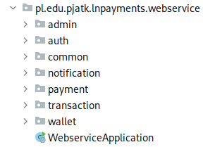
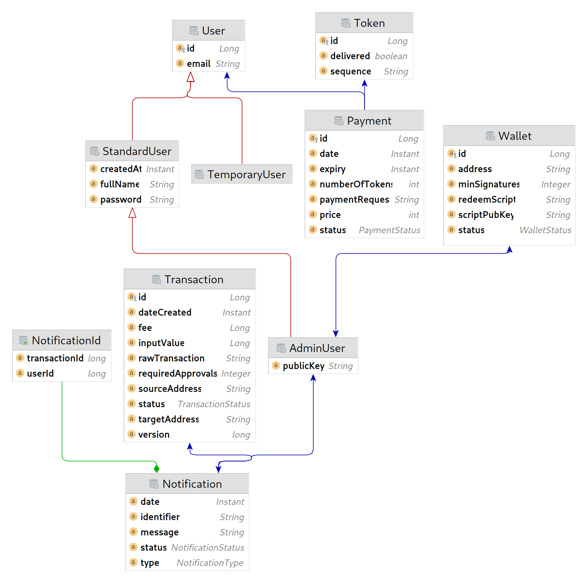

== Opis rozwiązania

Rozdział opisuje zawartość repozytorium, w którym przechowywany jest między innymi kod źródłowy wszystkich komponentów
aplikacji oraz dokumentacja. Każdy podrozdział opisuje jeden z przechowywanych komponentów, wraz z omówieniem kodu
i samego rozwiązania od strony technicznej.

=== Struktura repozytorium

Wszystkie pliki związane z projektem znajdują się w jednym repozytorium zgodnie z podejściem _monorepo_. Oznacza
to, że każda część systemu znajduje się w osobnym folderze wewnątrz jednego repozytorium. Aplikacja nie składa się z
wielu komponentów oraz nie pracuje nad nim dużo osób, więc rozwiązanie sprawdza się tutaj perfekcyjnie. Wszystko,
łącznie z dokumentacją i diagramami znajduje się w jednym miejscu. Ułatwia to wprowadzanie zmian do kilku
komponentów jednocześnie, a także usprawnia proces _code review_, ponieważ zadanie będzie zawsze zawarte w jednym
_pull requeście_. Repozytorium przechowywane w serwisie Github, z którego wykorzystywane są również wbudowane narzędzia
do CI/CD. Główny folder projektu prezentuje się następująco:

.Zawartość folderu głównego w programie Intellij IDEA.
image::../images/root_dir_tree.png[]

Poszczególne komponenty i zależności mają swoje foldery:

* .github → Zawiera pliki konfiguracyjne dla repozytorium w serwisie _Github_. Znajdują się tam pliki konfigurujące
CI/CD przy pomocy _Github Actions_, a także szablon i konfiguracja dla _pull requestów_.
* devtools → Projekt polega na kilku programach, które wspomagają i ułatwiają proces tworzenia oprogramowania.
W tym folderze znajdują się ich pliki konfiguracyjne oraz dokumentacja użytkowania w kontekście tworzonego systemu.
* docs → Przechowuje większość dokumentacji stworzonej przez cały okres tworzenia projektu. Zawiera między innymi
dokumenty KP, DZW i SWS, a także wszystkie rozdziały i pliki budujące pracę dyplomową. W poszczególnych folderach
znajdują się również diagramy, fragmenty kodu i zdjęcia.
* mobileapp → Znajduje się w nim kod źródłowy aplikacji mobilnej dla systemu Android.
* webapp → Zawiera kod źródłowy aplikacji internetowej oraz kod testów E2E. Plik obsługujący proces budowania tego
komponentu zawiera ustawienia do uruchomienia same aplikacji webowej oraz uruchomienia testów E2E dla całego serwisu
(z wyłączeniem testów dla aplikacji mobilnej).
* webservice → Przechowuje kod źródłowy dla serwera.

Pozostałe pliki znajdujące się w tym folderze to _.gitignore_, zawierające ścieżki i pliki, które będą ignorowane przez
system kontroli wersji _Git_, oraz _README.md_, które zawiera informacje o aplikacji oraz instrukcje potrzeba do jej
uruchomienia.

=== Serwer

Do stworzenia serwera dla tworzonej aplikacji zdecydowano się na język programowania Java oraz framework Spring.
Zastosowane narzędzia pozwalają w łatwy i szybki sposób tworzyć kompletne aplikacje webowe, a zapewnione dodatkowe
moduły ułatwiają między innymi komunikację z bazą danych czy obsługę kolejek wiadomości. Do procesu budowania
wykorzystywane jest narzędzie Maven, które wymusza określoną hierarchię katalogów w projekcie. Wykorzystano również
wiele narzędzi wspomagających pracę jak CheckStyle, wspomagający utrzymanie jednolitego stylu kodu w projekcie.

==== Opis API

czy na pewno?

==== Struktura i pakiety

Główny katalog aplikacji serwerowej zawiera przede wszystkim pliki konfiguracyjne dla wykorzystywanych narzędzi oraz
jeden katalog, w którym znajduje się kod źródłowy aplikacji.

.Układ katalogów w folderze głównym serwera.
image::../images/webservice_root_dir.png[]

Katalog główny zawiera znany już plik _.gitignore_, dzięki któremu można ustawić ignorowane przez program Git ścieżki.
Plik _checkstyle.xml_ zawiera zestaw reguł dotyczących sposobu formatowania kodu. Na jego podstawie wymuszana jest
spójność stylu kodu w projekcie. Jeżeli kod nie spełnia reguł, nie może zostać włączony do głównej gałęzi projektu.
Weryfikowane jest to poprzez zadanie podczas uruchamiania procesu CI. W pliku _lombok.config_ znajduje się konfiguracja
dla biblioteki lombok, upraszczającej tworzenie i zarządzanie klasami modelowymi w Javie. Plik _README.md_ zawiera
podstawowe informacje o komponencie oraz instrukcje uruchomienia samej aplikacji, testów oraz konfiguracje środowiska
deweloperskiego. W pliku _pom.xml_ znajduje się konfiguracja dla narzędzia budowania aplikacji Maven. Zawiera on
metadane projektu, wykorzystywane zależności oraz instrukcje do budowania aplikacji w określony sposób, na przykład
warunki sprawdzania pokrycia kodu testami. Pozwala również na zbudowanie pliku zawierającego aplikację webową i serwer
w jednym pliku wykonywalnym. Na koniec został folder _src_ zawierający kod źródłowy posegregowany zgodnie ze
standardowym układem dla programu Maven<<maven_directories>>. Jego zawartość prezentuje się następująco:

.Układ katalogów w folderze _src_.
image::../images/webservice_src_content.png[]

Folder zawiera dwa katalogi: main i test. Pierwszy z nich zawiera kod źródłowy aplikacji, natomiast drugi kod źródłowy
testów jednostkowych i integracyjnych. Więcej o testach opisane jest w rozdziale <<_testy,"Testy">>. Oba katalogi
zawierają takie same podkatalogi. Folder _java_ zawiera pakiety zawierające kod źródłowy, a _resources_ pliki statyczne
wymagane do uruchomienia aplikacji, a które nie wymagają kompilacji.

Kod w Javie grupowany jest w pakietach domenowych. Zdecydowane się na grupowanie kodu w pakietach pod względem
funkcjonalności. Jest to rozwiązanie zwiększające czytelność oraz ułatwiające rozwój aplikacji według tych
funkcjonalności. Zazwyczaj są one w jakimś stopniu niezależne od innych, ewentualnie wykorzystują publiczne serwisy,
więc zapewnia to pewien poziom enkapsulacji. Oczywiście lepszy zastosowaniem tutaj byłyby moduły dodane w Javie 9,
gdyż eliminują one kompletnie problem niechcianego dostępu do klas. Pozwalają one na jawne zdefiniowanie dostępu do
klas publicznych poza modułem. Nie zdecydowano się na ich użycie ze względu na duży poziom skomplikowania oraz rozmiar
projektu. Niektóre pakiety zawierają niewiele klas, a wyodrębnienie ich do modułów zwiększyłoby ilość niepotrzebnych
plików oraz wymaganej konfiguracji. Kolejnym powodem było uproszczenie procesu deweloperskiego, gdyż o wiele łatwiej
modyfikuje się kod znajdujący się w jednym projekcie i jednym katalogu, a nie w kilku osobnych. Finalny układ pakietów
prezentuje się następująco:

.Pakiety Java wykorzystywane w serwerze.

Wszystkie pakiety pogrupowane są w ścieżce pakietów _pl.edu.pjatk.lnpayments.webservice_. Pakiet _webservice_ zawiera
jedną klasę _Webservice application_ odpowiedzialną tylko i wyłącznie za uruchomienie aplikacji. Pozostałą zawartością
są pakiety domenowe oraz jeden pakiet _common_ zawierający ogólną konfigurację, oraz klasy wspólne dla całej aplikacji.
Wewnątrz każdego pakiety pliki pogrupowane zostały według innego popularnego podejścia, czyli grupowania według
warstw. Zdecydowano się na stworzenie aplikacji według architektury warstwowej, więc osobne warstwy, takie jak
repozytoria, kontrolery i serwisy znajdują się w swoich pakietach. Po niżej przykład zawartości jednego z
pakietów domenowych.

.Przykład podziału warstwowego pakietów na przykładzie pakietu _payment_.
image::../images/webservice_domain_package_content.png[]

==== Baza danych

Zdecydowano się na użycie relacyjnej bazy danych PostgreSQL, gdyż dane przechowywane w bazie danych są wyraźnie
ustrukturyzowane. Ze względu na charakter przechowywanych danych ważna jest również obsługa transakcji na poziomie
bazy danych. W tym komponencie wykorzystujemy do obsługi bazy danych framework Spring Data JPA oraz Hibernate.
Pozwoliło to na znaczne ułatwienie procesu tworzenia bazy danych. JPA pozwala na mapowanie relacyjnej bazy danych na
zwykłe klasy Java z wykorzystaniem specjalnych adnotacji. Hibernate natomiast oferuje funkcjonalność automatycznego
tworzenia bazy danych na podstawie mapowań w JPA. Dzięki temu nie było potrzeby ręcznego pisania kwerend SQL, a baza
danych była tworzona w ramach zwykłych zadań dodających nowe funkcjonalności. Na początku prac wykonana została
konfiguracja połączenia z bazą danych oraz wymaganych bibliotek i frameworków. Cała reszta działa się automatycznie na
podstawie kodu tworzonego w Javie.

Schemat bazy danych nie różni się znacząco od diagramu domenowego prezentowanego w rozdziale Analiza.
Znajduje się tam opis każdej z tabeli, jak i relacje pomiędzy nimi. Główne różnice to przede wszystkim nazwy oraz ilość
pól w poszczególnych tabelach. Oczywiście prawie każda z tabel zawiera kolumny _id_, która służy jako klucz publiczny,
a także odpowiednie pola, które są kluczami obcymi.

.Schemat bazy danych wygenerowany przez plugin JPA Buddy dla programu IntelliJ IDEA.

Niektóre z pól zostały wymuszone przez względy techniczne, na przykład pole _version_ w tabeli _Transaction_.
Zapobiega ono problemowi utraconych zapisów przy podpisywaniu transakcji. W przypadku tabeli _Notification_
zdecydowano się na wykorzystanie złożonego klucza publicznego składającego się z ID pochodzącego z tabel _Notification_
oraz _User_ (technicznie tylko dla AdminUser, gdyż tylko administrator może otrzymywać powiadomienia o
nowej transakcji). Dzięki temu dla jednego użytkownika oraz jednej transakcji w bazie danych może powstać tylko jedno
powiadomienie. Tabela _Notification_ zawiera również pole identifier, które wyliczane jest na podstawie klucza
złożonego. Wykorzystywane jest do odnoszenia się do rekordu danych podczas wysyłania żądań do API powiadomień.
Reszta kolumn została dodana, aby ułatwić pracę niektórych algorytmów bądź uatrakcyjnić widok danych prezentowany
użytkownikowi. Wszystkie relacje pomiędzy tabelami zostały bez zmian względem diagramu domenowego.

==== Pakiet wspólny

W pakiecie wspólnym znajdują się klasy, interfejsy i adnotacje wspólne dla wszystkich innych pakietów. Zawiera również
mniejsze elementy systemu, których nie było sensu wyodrębniać do osobnego pakietu. Pakiet posiada również ogólną
konfigurację komponentów używanych w aplikacji oraz globalną obsługę wyjątków. Dodatkowo
znajdują się tutaj adnotacje służące do walidacji parametrów wejściowych oraz klasa zawierająca wartości stałe
aplikacji. Zawartość pakietu prezentuje się następująco:

.Zawartość pakietu _common_.

Pakiet ten dodatkowo obsługuje dwie funkcjonalności: profile użytkowników i ich edycje oraz zarządzanie ustawieniami
serwera przez administratorów. Kontrolery obsługujące żądania HTTP, wraz z ich DTO znajdują się w pakiecie _resource_.

Omawianie obu funkcjonalności można zacząć od obsługi ustawień serwera. Obsługiwana jest przez klasę
_ConfigurationResource_. Jedyną zależnością klasy jest serwis SettingsService, dostarczający metody
obsługujące pobieranie i aktualizowanie ustawień. Przy każdym nadchodzącym żądaniu jedyne co robią
metody to wywołanie odpowiedniej metody z SettingsService oraz opakowanie zwróconej wartości w obiekt klasy
_ResponseEntity_, zawierający metadane odpowiedzi HTTP. Dostępne są dwa punkty końcowe:

.API ustawień serwera znajdujące się we wspólnym pakiecie.
image::../images/webservice_common_config_api.png[]

Ustawienia przechowywane są w pliku tekstowym, który znajduje się w folderze _.lnpayments_ w katalogu domowym
użytkownika. Dzięki zastosowaniu zewnętrznego pliku istnieje możliwość zmiany ustawień bez konieczności uruchamiania
aplikacji webowej. Dane z pliku ładowane są przy uruchamianiu aplikacji przez klasę konfiguracyjną
_SettingsPropertiesConfig_. Posiada ona jedną metodę publiczną _propertiesConfig_ oznaczoną za pomocą adnotacji
_@Bean_, co sprawia, że zwracany przez metodę obiekt będzie zainicjowany w kontekście Springa. Metoda zwraca obiekt
_PropertiesConfiguration_ z biblioteki _Apache Commons Configuration2_, która używana jest do automatycznego
zarządzania plikami konfiguracyjnymi.

[source, java]
----
include::../../../webservice/src/main/java/pl/edu/pjatk/lnpayments/webservice/common/config/SettingsPropertiesConfig.java[lines=31..45]
----

Metoda ta konfiguruje obiekt klasy _PropertiesConfiguration_, aby automatycznie ładowała dane z pliku, a także
dokonywała zapisu przy każdej modyfikacji obiektu. Jeżeli plik konfiguracyjny (bądź folder) nie istnieje, jest tworzony
przez prywatną metodę _initializeProperties_.

[source, java]
----
include::../../../webservice/src/main/java/pl/edu/pjatk/lnpayments/webservice/common/config/SettingsPropertiesConfig.java[lines=47..55]
----

Jeżeli folder nie istnieje, to jest tworzony przez metodę _Files.createDirectory_. Następnie domyślna konfiguracja
kopiowana jest do ścieżki docelowej. Plik z domyślną konfiguracją znajduje się w folderze _resources_ aplikacji.
Mając skonfigurowany obiekt _PropertiesConfiguration_, można jej użyć w _SettingsService_ do operowania na ustawieniach.
Klasa _SettingsService_ implementuje interfejs PropertyService, definiujący metody odpowiedzialne za pobieranie
poszczególnych ustawień wspieranych przez aplikację. Dodatkowo posiada dwie metody odpowiadające obsługiwanym
funkcjonalnością, czyli zapisywaniem i pobieraniem ustawień.

[source, java]
----
include::../../../webservice/src/main/java/pl/edu/pjatk/lnpayments/webservice/common/service/SettingsService.java[lines=18..47]
----

W przypadku pobierania ustawień, dane z pliku są najpierw mapowane na tablicę asocjacyjną mapującą ciąg znaków z
dowolnym obiektem, gdyż wartości z pliku mogą być zarówno tekstem, jak i liczbą. Następnie przy pomocy biblioteki
_Jackson_ tablica mapowana jest na obiekt, który zostanie zwrócony użytkownikowi. Aktualizacja ustawień wymagała
dodania dodatkowego pola _lastModification_. Zabezpiecza ono ustawienia przed problemem utraconych zapisów. Jeżeli
otrzymana do aktualizacji wartość nie będzie miała tej samej daty modyfikacji co dane w pliku, to znaczy, że ustawienia
zostały już zaktualizowane przez innego użytkownika, co oznacza, że operacja nie może się powieść. Jeżeli data jest
poprawna, to obiekt _PropertyValues_ mapowany jest ponownie na tablicę asocjacyjną i zapisywany do pliku. Pozostałe
metody tej klasy zdefiniowane są w interfejsie _PropertyService_ i służą pobieraniu pojedynczych wartości ustawień.
Zdecydowano się na zastosowanie interfejsu, ponieważ w przeszłości na wczesnym etapie prac istniały też inne jego
implementacje, zawierające sztywno określone wartości wymagane na potrzeby testów. Po zaimplementowaniu
_SettingsService_ zostały one usunięte.

Następną funkcjonalnością jest pobieranie i aktualizowanie danych o użytkowniku. W przypadku aktualizacji w tym wydaniu
wspierana jest jedynie zmiana hasła.

.API dla kont użytkowników znajdujące się we wspólnym pakiecie.
image::../images/webservice_common_user_api.png[]

Kontrolerem obsługującym te punkty końcowe jest UserResource. Jak widać na powyższym rzucie ekranu, ścieżki nie
zawierają żadnego ID użytkownika, ponieważ autoryzacja użytkownika odbywa się poprzez token JWT, z którego też
otrzymujemy dane o użytkowniku. Ciągnie to za sobą ograniczenie, w którym tylko dany użytkownik może pobrać swoje dane,
aczkolwiek nigdy nie było planów na dodanie takiej funkcjonalności.

.Klasa _UserResource_.
[source, java]
----
include::../../../webservice/src/main/java/pl/edu/pjatk/lnpayments/webservice/common/resource/UserResource.java[lines=16..38]
----

Dane o użytkowniku pobierane są z obiektu _Principal_, który zawiera kontekst aktualnie zalogowanego użytkownika.
W przypadku obu metod dane z żądania HTTP oraz informacja o użytkowniku przekazywana jest dalej do serwisu
_UserService_, pochodzącego z pakietu auth. Wykorzystywane są jego dwie metody _getUserDetails_ i _updatePassword_.
W przypadku pobierania danych o użytkowniku sprawa jest oczywista. Dane pobierane są z bazy danych, a następnie mapowane
na obiekt _UserDto_, który zwracany jest użytkownikowi. W przypadku zmiany hasła po pobraniu danych użytkownika
należy zweryfikować, czy podane aktualne hasło pasuje do tego zapisanego w bazie danych. Jeżeli wszystko się zgadza,
następuje aktualizacja hasła. Warto wspomnieć, że walidacja danych wejściowych następuje automatycznie dzięki
_Bean Validation_ i odbywa się przed wywołaniem odpowiedniej metody kontrolera.

.Metoda updatePassword klasy UserService.
[source, java]
----
include::../../../webservice/src/main/java/pl/edu/pjatk/lnpayments/webservice/auth/service/UserService.java[lines=72..79]
----

Poza konfiguracją zapewniającą obsługę pliku zawierającego ustawienia, w pakiecie wspólnym konfigurowane są również
takie komponenty jak klient HTTP, ustawienia logowania dla nadchodzących żądań oraz konfiguracja automatycznego
generowania dokumentacji API, czyli narzędzia _Swagger_.

Pakiet _exception_ zawiera wyjątki, które wykorzystywane są aplikacji oraz klasę _GlobalExceptionHandler_, zajmującą
się obsługą wyjątków. W przypadku kiedy w jakiejś części aplikacji zostanie rzucony wyjątek czasu wykonania, trafi
on do odpowiedniej metody w _GlobalExceptionHandler_.

.Definicja klasy GlobalExceptionHandler oraz wybrana przykładowa metoda.
[source, java]
----
include::../../../webservice/src/main/java/pl/edu/pjatk/lnpayments/webservice/common/exception/GlobalExceptionHandler.java[lines=15..23]
    // pozostałe metedy obsługujące wyjątki
}
----

Przechwytywanie wyjątków przez tę klasę jest możliwe dzięki dziedziczeniu po klasie Stringa
_ResponseEntityExceptionHandler_. Każda metoda posiada również adnotację _@ExceptionHandler_, która definiuje
przechwytywany wyjątek. W przypadku aplikacji jedyna wykonywana operacja to mapowanie wyjątku na odpowiedni kod błędu
HTTP. W niektórych przypadkach metoda obsługująca wyjątek loguje potrzebne informacje.

Tak jak już zostało wcześniej wspomniane, do walidacji parametrów wejściowych wykorzystywane jest _Bean Validation_.
Biblioteka ta pozwala na weryfikację danych na podstawie specjalnych adnotacji umieszczanych na polu klasy. Specyfika
projektu wymagała stworzenia niestandardowych adnotacji, aby dodać walidację niewspieraną domyślnie przez bibliotekę.
Pierwszą z nich jest walidacja adresu Bitcoin. Odbywa się ona poprzez umieszczenie na polu typu _String_ adnotacji
_@BitcoinAddress_.

.Kod adnotacji BitcoinAddress.
[source, java]
----
include::../../../webservice/src/main/java/pl/edu/pjatk/lnpayments/webservice/common/validation/BitcoinAddress.java[lines=10..17]
----

Można ją umieścić zarówno na polu, jak i na metodzie, zgodnie ze specyfikacją _Bean Validation_. Sama walidacja odbywa
się w klasie _BitcoinAddressValidator_, która implementuje interfejs _ConstraintValidation<BitcoinAddress, String>_.
Wykorzystano do niej klasę _Address_ biblioteki _BitcoinJ_, która w przypadku podania błędnego adresu Bitcoin rzuca
wyjątek.

.Metoda isValid klasy BitcoinAddressValidator.
[source, java]
----
include::../../../webservice/src/main/java/pl/edu/pjatk/lnpayments/webservice/common/validation/BitcoinAddressValidator.java[lines=19..27]
----

Drugą niestandardową walidacją jest sprawdzenie poprawności przesłanego przez administratora klucza publicznego, który
wymagany jest do wygenerowania adresu portfela oraz weryfikacji podpisów transakcji. Kod adnotacji _PublicKey_ niewiele
różni się od adnotacji _BitcoinAddress_. Walidacja wartości tekstowej odbywa się także dzięki bibliotece BitcoinJ, w
klasie implementującej ten sam interfejs, z wyjątkiem innych parametrów (zgodnie z danymi z adnotacji).

.Klasa PublicKeyValidator.
[source, java]
----
include::../../../webservice/src/main/java/pl/edu/pjatk/lnpayments/webservice/common/validation/PublicKeyValidator.java[lines=9..28]
----

W tym przypadku biblioteka udostępnia metodę statyczną _isPubKeyCanonical_, która pozwala na walidację klucza w prosty
sposób, bez potrzeby dodawania obsługi wyjątków, która w przypadku Javy jest mało wydajna.

Pakiet _common_ zawiera również kilka klas modelowych reprezentujących tabele w bazie danych. Są to klasy odpowiedzialne
za hierarchię użytkowników oraz ich pola. Tak jak to było opisane na diagramie domenowym oraz schemacie bazy danych,
hierarcha rozpoczyna się od klasy abstrakcyjnej _User_, Która zawiera podstawowe informacje o wszystkich typach
użytkownika. Struktura widoczna na diagramach osiągnięta została przez zastosowanie adnotacji _@Inheritance_
pochodzącej z JPA. Użyto strategii _Joined_, aby każda klasa w Javie miała swoją własną tabelę w bazie danych.

.Klasa PublicKeyValidator.
[source, java]
----
include::../../../webservice/src/main/java/pl/edu/pjatk/lnpayments/webservice/common/entity/User.java[lines=9..28]
----

Dzięki zastosowaniu modyfikatora dostępu _protected_ nie można dziedziczyć po tej klasie poza pakietem entity. Pole
_email_ oznaczone jest jako unikatowe, ponieważ służy ono jako dodatkowe pole do identyfikacji encji. Metoda _getRole_
jest abstrakcyjna, co umożliwia zdefiniowanie odpowiedniej roli w każdej klasie potomnej, bez zapisywania tej informacji
w bazie danych. Bezpośrednio po abstrakcyjnej klasie _User_ dziedziczą _TemporaryUser_ oraz _StandardUser_.
_TemporaryUser_ reprezentuje użytkownika tymczasowego, który chce zakupić tokeny bez rejestracji w serwisie.
Aby umożliwić śledzenie zamówienia oraz zapisać adres email zdecydowano się na dodanie specjalnego typu użytkownika,
aby ten proces znacznie ułatwić poprzez ujednolicenie obsługi płatności dla wszystkich użytkowników. Aby zapobiec
konfliktom adresów email, użytkownicy tymczasowi mają dołączoną do adresu email wartość powstałą z przeliczenia
aktualnej daty przez funkcję mieszającą.

.Klasa TemporaryUser.
[source, java]
----
include::../../../webservice/src/main/java/pl/edu/pjatk/lnpayments/webservice/common/entity/TemporaryUser.java[lines=9..27]
----

Drugą klasą wyprowadzoną z klasy _User_ jest _StandardUser_, która reprezentuje zwykłego zarejestrowanego użytkownika,
który ma już normalny dostęp do aplikacji. Względem klasy abstrakcyjnej _User_ pojawiły się nowe pola, które są
wymagane przez każdego zarejestrowanego użytkownika, takie jak imię i nazwisko, hasło oraz data utworzenia konta.
Dodatkowo po klasie _StandardUser_ dziedziczy _AdminUser_, reprezentujący administratora serwera. Dodaje nowe pole
zawierające klucz publiczny oraz pole będące kluczem obcym z tabeli _Wallet_. Dodatkowo pojawiło się kilka metod
ułatwiających operacje z wykorzystaniem klas administratorów. Są to proste metody takie jak _hasKey_, która sprawdza,
czy użytkownik posiada klucz publiczny oraz _isAssignedToWallet_ sprawdzająca przypisanie do portfela. Dodatkowo
znajduje się również metoda _notificationsChannelId_, która zwraca nazwę kanału Websocket, na który wysyłane będą
powiadomienia o nowych transakcjach.

.Klasa AdminUser.
[source, java]
----
include::../../../webservice/src/main/java/pl/edu/pjatk/lnpayments/webservice/common/entity/AdminUser.java[lines=13..47]
----

Ostatnią wartą uwagi klasą jest Constants. Posiada ona prywatny konstruktor, a co za tym idzie stworzenie instancji tej
klasy, nie jest możliwe. Zawiera ona zestaw stałych statycznych pól zawierających stałe aplikacji. Dostępne są w niej
na przykład wszystkie nazwy ścieżek do zasobów czy wyrażenia regularne do weryfikacji niektórych parametrów wejściowych.

==== Uwierzytelnianie i autoryzacja

Obsługa autoryzacji i procesu uwierzytelniania znajduje się w pakiecie _auth_. Posiada on wszystkie klasy
konfiguracyjne, filtry i serwisy odpowiedzialne za bezpieczeństwo aplikacji. Znajdują się tutaj również pozostałości
po wcześniejszej wersji aplikacji, kiedy nie było w planach profilu użytkownika ani edycji jgo danych. Z tego powodu w
tym pakiecie znajdują się repozytoria, serwis i konwerter dla klas modelowych użytkowników (znajdujące się w pakiecie
_common_).

.Zawartość pakietu _auth_.

Autoryzacja w aplikacji odbywa się poprzez token JWT. Każdy użytkownik posiada taki token, a bez niego nie da się
uzyskać dostępu do większości API. Jedynym niezabezpieczonym punktem końcowym jest _/payments/info_ oraz punkty
odpowiedzialne za logowanie i rejestrację. Konfiguracja bezpieczeństwa dla API HTTP znajduje się w klasie
_WebSecurityConfig_. Do obsługi zabezpieczeń wykorzystywany jest moduł Springa — _String Security_. Dodaje on
kompleksowe narzędzia pozwalające na implementację procesów autoryzacji. Uruchomienie zabezpieczeń _Spring Security_
dodanie na poziomie klasy adnotacji _@EnableWebSecurity_ oraz dziedziczenie po klasie _WebSecurityConfigurerAdapter_.
Dzięki temu programista otrzymuje zestaw narzędzi pozwalający na dowolną konfigurację zabezpieczeń. W przypadku
klasy _WebSecurityConfig_ odbywa się to za pomocą nadpisanej metody _configure_, przeciążonej z parametrem
_HttpSecurity_.

.Metoda _configure_ klasy WebSecurityConfig nadpisana z parametrem HttpSecurity.
[source, java]
----
include::../../../webservice/src/main/java/pl/edu/pjatk/lnpayments/webservice/auth/config/WebSecurityConfig.java[lines=69..79]
----

Konfiguracja zaczyna się od wyłączenia zabezpieczeń CORS i CSRF, ponieważ w innych metodach są one konfigurowane w inny
niż domyślny sposób. Metoda _exceptionHandling_ pozwala na przechwytywanie wyjątków przez klasy Springa przez zwróceniem
błędu użytkownikowi, dzięki temu można samemu ustawić kod błędu dla wyjątku, co zostało opisane przy klasie
_GlobalExceptionHandler_. Następnie znajduje się ustawienie parametrów sesji na sesję bezstanową. Całe API stworzone
jest zgodnie ze stylem architektury _REST_, według której wszystkie punkty końcowe oraz sesje użytkowników są
bezstanowe<<rest_tutorial_stateless>>. Kolejne metody konfigurują zabezpieczenia punktów końcowych. Domyślnie
wszystkie ścieżki wymagają przynajmniej roli użytkownika, następnie jawnie definiowane są ścieżki dostępne tylko dla
administratorów oraz ścieżki ogólnodostępne. Na koniec dodany jest filtr, który zajmuje się sprawdzaniem tokena JWT.
Wstrzykiwany jest przed domyślny filtr Springa _UsernamePasswordAuthenticationFilter_, aby dokonać walidacji przed
wywołaniem domyślnych mechanizmów autoryzacji. Filtr _AuthTokenFilter odpowiedzialny jest za walidację tokena. W
przypadku gdy token jest poprawny, użytkownik, którego dane się w nim znajdują, zostaje ustawiony jako uwierzytelniony
użytkownik w kontekście bezpieczeństwa.

.Kod klasy _AuthTokenFilter_ odpowiedzialny za filtrowanie żądań i uwierzytelnianie użytkowników.
[source, java]
----
include::../../../webservice/src/main/java/pl/edu/pjatk/lnpayments/webservice/auth/filter/AuthTokenFilter.java[lines=34..54]
----

Kod klasy jest dość prosty. Gdy żądanie HTTP zawiera token w nagłówku _Authorization_, a także token test ważny, czyli
dane zawarte w nim są poprawne oraz gdy jeszcze nie wygasł, to użytkownik zostaje zalogowany. Odbywa się to poprzez
pobranie z bazy danych użytkownika, który implementuje interfejs _UserDetails_. Następnie obiekt ten opakowany jest
w token uwierzytelniający z biblioteki _Spring Security_. Na koniec utworzony token dodawany jest do kontekstu
bezpieczeństwa. Wywołanie filtra kończy się metodą _chain.doFilter_, powodującą wywołanie następnego filtra
w łańcuchu. Mechanizm filtrów w _Spring Security_ zaimplementowany jest przy pomocy wzorca projektowego
_Filter Chain_. Klasa _AuthTokenFilter_ wywołuje wiele metod z serwisu _JwtService_. Zawiera on wiele użytecznych
metod służących do obsługi tokenów JWT. Wykorzystywana jest do tego biblioteka _jsonwebtoken_. Warte uwagi są w
tej klasie dwie metody. Pierwszą jest metoda _generateToken_, odpowiedzialna za generowanie nowych tokenów.

.Metoda generateToken klasy JwtService.
[source, java]
----
include::../../../webservice/src/main/java/pl/edu/pjatk/lnpayments/webservice/auth/service/JwtService.java[lines=25..33]
----

Generowanie odbywa się przez klasę _Jwts_, która posiada zaimplementowany wzorzec projektowy Budowniczy do tworzenia
nowych tokenów. Email użytkownika jest ustawiony jako temat tokena. Dodatkowo ustawiana jest data wydania oraz data
wygaśnięcia. Niestety biblioteka ta nie jest aktywnie utrzymywana, przez co daty obsługiwane są przez bardzo starą
klasę _Date_. Na koniec token podpisywane jest przy pomocy odpowiedniego algorytmu oraz klucza zdefiniowanego w
plikach konfiguracyjnych serwera. Drugą metodą wartą uwagi jest _retrieveEmail_, ekstraktujący adres email z tokena
JWT. Do otrzymania adresu email potrzebny jest ponownie klucz, z którym został wygenerowany token. Następnie z ciała
rozszyfrowanego tokena wyciągany jest adres email, który można zwrócić.

.Metoda retrieveEmail klasy JwtService.
[source, java]
----
include::../../../webservice/src/main/java/pl/edu/pjatk/lnpayments/webservice/auth/service/JwtService.java[lines=40..46]
----

Drugą klasą konfiguracyjną odpowiedzialną za zabezpieczenia jest _WebSocketSecurityConfig_, która konfiguruje
zabezpieczenia kanałów protokołu Websocket. Dostęp do wszystkich kanałów wymaga posiadania przez użytkowników ważnego
tokena. Dodatkowo w pakiecie _interceptor_ znajduje się klasa _AuthTokenInterceptor_. Odpowiada ona za uwierzytelnianie
użytkowników próbujących połączyć się z jednym z kanałów Websocket. Klasa ta jest wykorzystywana przy konfiguracji
ścieżek kanałów znajdujących się w pakiecie _payment_.

.Zaimplementowana metoda preSend klasy AuthTokenInterceptor, pochodząca z interfejsu ChannelInterceptor.
[source, java]
----
include::../../../webservice/src/main/java/pl/edu/pjatk/lnpayments/webservice/auth/interceptor/AuthChannelInterceptor.java[lines=31..46]
----

Metoda preSend przechwytuje wiadomość otwierającą nowe połączenie protokołu Websocket, po czym uwierzytelnia
użytkownika. Kod tej metody jest dosyć podobny do fragmentu klasy _AuthTokenFilter_. Również z nagłówka wyodrębniany
jest token, po czym następuje walidacja oraz zalogowanie użytkownika. W tym przypadku nie jest to kontekst
bezpieczeństwa, tylko w obiekcie klasy StompHeaderAccessor, który zarządza dostępem do przechwyconej przez interceptor
wiadomości.

Pakiet _auth_ obsługuje również funkcjonalności.

.API służące do uwierzytelniania.

==== Płatności

.Zawartość pakietu _payment_.

.API dostępne dla płatności.

==== Zarządzanie administratorami

.Zawartość pakietu _admin_.

.API dostępne dla zarządzania administratorami.
image::../images/webservice_admin_api.png[]

==== Portfel

.Zawartość pakietu _wallet_

.API dostępne do zarządzania portfelem.

==== Transakcje

.Zawartość pakietu _transaction_
image::../images/webservice_transaction_content.png[]

.API dostępne dla transakcji

==== Powiadomienia mobilne

.Zawartość pakietu _notification_
image::../images/webservice_notification_content.png[]

.API dostępne dla powiadomień mobilnych

==== Zasoby

.Zawartość folderu _resources.
image::../images/webservice_resources.png[]

=== Aplikacja webowa

=== Aplikacja mobilna

=== Dokumentacja

=== Pozostałe <- lepsza nazwa

=== .github

==== Postman

==== Docker
