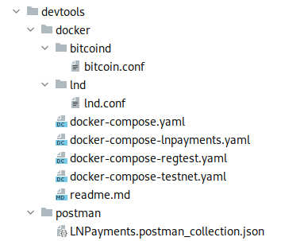

[#_opis_rozwiazania]
== Opis rozwiązania

Rozdział opisuje zawartość repozytorium, w którym przechowywany jest między innymi kod źródłowy wszystkich komponentów
aplikacji oraz dokumentacja. Każdy podrozdział opisuje jeden z przechowywanych komponentów, wraz z omówieniem kodu
i samego rozwiązania od strony technicznej.

=== Struktura repozytorium

Wszystkie pliki związane z projektem znajdują się w jednym repozytorium zgodnie z podejściem _monorepo_. Oznacza
to, że każda część systemu znajduje się w osobnym folderze wewnątrz jednego repozytorium. Aplikacja nie składa się z
wielu komponentów oraz nie pracuje nad nim dużo osób, więc rozwiązanie sprawdza się tutaj perfekcyjnie. Wszystko,
łącznie z dokumentacją i diagramami znajduje się w jednym miejscu. Ułatwia to wprowadzanie zmian do kilku
komponentów jednocześnie, a także usprawnia proces _code review_, ponieważ zadanie będzie zawsze zawarte w jednym
_pull requeście_. Repozytorium przechowywane w serwisie Github, z którego wykorzystywane są również wbudowane narzędzia
do CI/CD. Główny folder projektu zaprezentowany jest na rysunku 39.

.Zawartość folderu głównego w programie Intellij IDEA.

Poszczególne komponenty i zależności mają swoje foldery:

* .github → Zawiera pliki konfiguracyjne dla repozytorium w serwisie _Github_. Znajdują się tam pliki konfigurujące
CI/CD przy pomocy _Github Actions_, a także szablon i konfiguracja dla _pull requestów_.
* devtools → Projekt polega na kilku programach, które wspomagają i ułatwiają proces tworzenia oprogramowania.
W tym folderze znajdują się ich pliki konfiguracyjne oraz dokumentacja użytkowania w kontekście tworzonego systemu.
* docs → Przechowuje większość dokumentacji stworzonej przez cały okres tworzenia projektu. Zawiera między innymi
dokumenty KP, DZW i SWS, a także wszystkie rozdziały i pliki budujące pracę dyplomową. W poszczególnych folderach
znajdują się również diagramy, fragmenty kodu i zdjęcia.
* mobileapp → Znajduje się w nim kod źródłowy aplikacji mobilnej dla systemu Android.
* webapp → Zawiera kod źródłowy aplikacji internetowej oraz kod testów E2E. Plik obsługujący proces budowania tego
komponentu zawiera ustawienia do uruchomienia samej aplikacji oraz testów E2E dla całego serwisu
(z wyłączeniem testów E2E dla aplikacji mobilnej).
* webservice → Przechowuje kod źródłowy serwera.

Pozostałe pliki znajdujące się w tym folderze to _.gitignore_, zawierające ścieżki i pliki, które będą ignorowane przez
system kontroli wersji _Git_, oraz _README.md_, które zawiera informacje o aplikacji oraz instrukcje potrzebne do jej
uruchomienia.

include::../sections/webservice_solution.adoc[]

include::../sections/webapp_solution.adoc[]

include::../sections/mobileapp_solution.adoc[]

=== Dokumentacja

Pisanie dokumentacji w graficznych programach jest często kłopotliwe. Bardzo ciężko zarządza się problem z jednolitym
formatowaniem dużej ilości dokumentów. W przypadku pisania książki pojawia się również problem wprowadzania dużych
zmian czy też dodawania automatycznej numeracji obrazów i tabel. Plików tych nie da się również śledzić w systemach
kontroli wersji, gdyż zapisane są zazwyczaj w formacie binarnym. Wymaga to przechowywania kopii dokumentu na
współdzielonym dysku. Nie rozwiązuje to jednak często problemu równoczesnej pracy nad plikiem przez kilka osób.
Aby temu zapobiec, zdecydowano się na użycie języka znaczników _asciidoc_, dzięki któremu można w łatwy sposób
automatycznie formatować dokumenty, które zapisane są w zwykłych plikach tekstowych. Dzięki temu zespół nie musiał się
kompletnie martwić stylem dokumentu, gdyż sformatowane pliki _pdf_ oraz _html_ tworzone są automatycznie przez narzędzie
_asciidoctor_. Cała dokumentacja projektu, czyli dokumenty wstępne i książka do pracy dyplomowej zostały napisane
z wykorzystaniem tej technologii. Wszystkie pliki są przechowywane tak samo, jak kod źródłowy w folderze _docs_.
Jego zawartość można zobaczyć na rysunku 79.

.Zawartość katalogu docs.

Katalog główny zawiera standardowo pliki _.gitignore_ oraz _readme_, obecne w każdym z poprzednich modułów. Folder
_src_ zawiera kod źródłowy, a katalog _target_ zbudowane dokumenty. Jest on tworzony automatycznie podczas budowania
plików, co odbywa się z użyciem narzędzia _make_. Plikiem konfiguracyjnym dla tego programu, który zawiera informację
o krokach potrzebnych do zbudowania projektu, jest _makefile_. Jego zawartość pokazana została w kodzie 156.

.Plik makefile obsługujący budowanie dokumentacji
[source, make]
----
include::../../makefile[]
----

Zdefiniowane są reguły pozwalające na zbudowanie całej dokumentacji w formatach _pdf_ oraz _html_. Kompilowane są
wszystkie pliki z rozszerzeniem _.adoc_, a ich plik wyjściowy generowany jest w folderze _target_. Proces budowania
całej książki ma kilka dodatkowych kroków. Główny plik zawierający pracę dyplomową nie zawiera w sobie strony
tytułowej i karty projektu. Są one osobnymi dokumentami, stworzonymi z innym zestawem stylów. Aby złączyć wszystkie
pliki _pdf_ w całość, dodana została specjalna reguła, która łączy je przy pomocy narzędzia _pdftk_.

Części składowe plików dokumentacji zostały podzielone w hierarchii folderów znajdującej się w katalogu _src_. Główny
folder zawiera przede wszystkim pliki dokumentów. Są to KP, SWS, DZW oraz właściwa praca dyplomowa. W pozostałych
folderach znajdują się tylko pliki dotyczące pracy dyplomowej. Katalog _chapters_ przechowuje rozdziały, natomiast
_sections_ podrozdziały. Wszystkie pliki są napisane w formacie _asciidoc_, co sprawia, że tekst można bardzo łatwo
modyfikować przy pomocy prostego języka znaczników. Niesformatowany fragment jednego z rozdziałów można zobaczyć
w kodzie 157.

.Fragment kodu źródłowego rozdziału 4.
[source, asciidoc]
----
include::./../sections/architecture.adoc[]
----

W folderze _dependencies_ znajdują się dodatkowe pliki _asciidoc_, które łączone są z innymi dokumentami po
wcześniejszej kompilacji. Aktualnie znajduje się tam jeden plik, który reprezentuje stronę tytułową oraz oświadczenie
autorów pracy dyplomowej. Folder _themes_ zawiera pliki konfigurujące style dla dokumentów. Dzięki nim konfigurowane
są ustawienia czcionki czy też układ elementów dokumentu. W katalogu _snippets_ znajdują się niektóre fragmenty
kodu prezentowane w tej pracy. Większość pochodzi z odniesienia bezpośrednio do prawdziwego kodu źródłowego systemu.
W tym folderze znajdują się głównie fragmenty niepowiązane z kodem produkcyjnym, a głównie przykłady i kod prototypu
(przechowywany jest on w innym repozytorium). W folderze _images_ znajdują się wszystkie zdjęcia użyte w tej pracy.
Są to między innymi różnego rodzaju wykresy i zrzuty ekranu. Ostatnim folderem zawierającym kod źródłowy dokumentacji
jest _diagrams_, zawierający diagramy stworzone na potrzeby systemu. Większość z nim została wykonana przy użyciu
narzędzia _plantuml_. Pozwala ono na tworzenie diagramów w zwykłych plikach tekstowych, tak samo, jak w przypadku
dokumentów w formacie _asciidoc_. Dzięki wykorzystaniu wtyczki _asciidoctor-diagram_, diagramy w plantuml mogą
być dołączone do kodu pracy w taki sam sposób, jak w przypadku wszystkich innych zależności. Kompilowane są one razem
z całością dokumentacji. Przykładowy diagram zaprezentowano w kodzie 158.

.Przykładowy schemat blokowy w formacie _plantuml_.
[source, puml]
----
include::./../diagrams/channel_close_flow.puml[]
----

Zastosowane technologie do tworzenia dokumentacji sprawiają, że wszystkie pliki są śledzone w systemie kontroli wersji
razem z kodem źródłowym projektu. Umożliwia to między innymi recenzje kodu poprzez serwis _Github_. Pliki są czytelne,
a prostej składni wykorzystywanych języków znaczników można szybko nauczyć się z oficjalnej dokumentacji. Rozwiązanie
to sprawdza się o wiele lepiej niż graficzne programy biurowe do tworzenia dokumentów.

=== Pozostałe elementy projektu

Ostatnim folderem w repozytorium projektu jest _devtools_. Jest on widoczny na rysunku 80. Zawiera on dodatkowe pliki
związane z programami wykorzystywanymi w pracach nad projektem. Aktualnie zawiera on foldery dla programów _postman_
oraz _docker_.

.Zawartość katalogu devtools.

Folder _postman_ zawiera tylko kolekcję dokumentującą wszystkie żądania obsługiwane przez serwer. Wystarczy tylko
zaimportować ją do programu, aby zyskać natychmiastowy dostęp do przykładowych żądań. Programista nie musi dzięki
temu samemu przygotowywać wielokrotnie tych samych żądań. Drugim katalogiem jest _docker_. Przechowywane są w nim
pliki _docker-compose_, pozwalające na uruchomienie wszystkich kontenerów z programami potrzebnymi do działania
systemu, czyli węzeł sieci Lightning, węzeł sieci Bitcoin oraz bazę danych. Dostępne są cztery pliki _docker-compose_.
Jeden z nich jest plikiem bazowym, zawierającym podstawową konfigurację i nie powinno się go uruchamiać samemu.
Następne dwa pliki odpowiadają dwóm aktualnie wspieranym sieciom Bitcoina, czyli _regtest_ oraz _testnet_.
Ostatni plik zawiera konfigurację pozwalającą na uruchomienie serwera oraz aplikacji internetowej w kontenerze.
Obraz aplikacji został wcześniej przesłany do repozytorium _docker'a_. Katalog ten zawiera również konfigurację dla
obu węzłów. Dostępne są one odpowiednio w folderach _bitcoind_ oraz _lnd_. Są one przesyłane do kontenera podczas jego
rozruchu i zawierają ustawienia dopasowane do tworzonego systemu.
