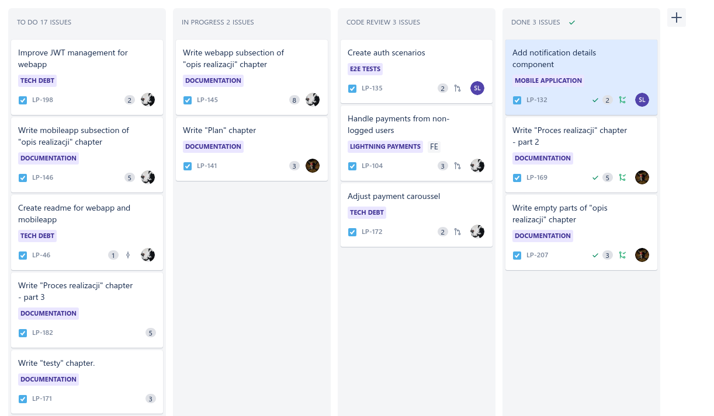
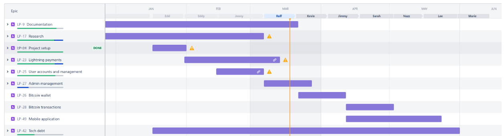

== Plan realizacji

W momencie rozpoczęcia prac nad projektem zespół nie posiadał wymaganej wiedzy. Wizja finalnej aplikacji również nie
była znana, a przed zespołem stało wiele niewiadomych. Postanowiono podzielić plan realizacji na dwie części.
Pierwsza miała objąć mniej więcej pierwsze cztery miesiące prac. Ten czas planowano poświęcić na naukę technologii,
zebranie wymagań oraz zaprojektowanie całego systemu. Druga część planowana była na pół roku, a dotyczyć miała
implementacji projektu na podstawie danych wejściowych opracowanych w trakcie pierwszego etapu realizacji.

=== Analiza i prototyp

Pierwsza część realizacji zakładała zebranie kompletnej wiedzy wymaganej do rozpoczęcia praz nad implementacją
systemu. Zdecydowano się na realizację tego etapu prac w modelu kaskadowym. Zespół nie miał jasno zdefiniowanych
celów ani wizji produktów do dostarczenia. Model kaskadowy umożliwił rozpoczęcie prac nad systemem od fazy określenia
wymagań oraz projektowania systemu. Produktami tego etapu miało być zebranie wiedzy oraz zaprojektowanie systemu.
Postanowiono wykorzystać w tym etapie technikę prototypowania<<pragmatic_prog>>, aby stworzyć działającą i interaktywną
aplikację o podobnych funkcjonalnościach do finalnego systemu. Miał on posłużyć tylko i wyłącznie do zebrania wiedzy i
nauki technologii, po czym zostać usunięty. Plan obejmował zebranie wiedzy, stworzenie dokumentacji,
zebranie wymagań, ustalenie finalnej wizji systemu, a na koniec utworzenie prototypu i makiety interaktywnej. Stworzony
prototyp był dowodem uzyskania pełnej wiedzy o wymaganych technologiach. Makieta interaktywna miała na celu pomoc w
zaprojektowaniu interfejsu użytkownika aplikacji internetowej. Produkty opracowane w tej fazie miały zamknąć proces
zbierania wymagań, a gotowe produkty miały pozwolić na przejście do implementacji bez potrzeby ponownego cofania się do
poprzednich faz realizacji projektu. W trakcie tej fazy zespół spotykał się głównie co dwa tygodnie na spotkaniach
z promotorem, gdzie dyskutowane były osiągnięte rezultaty, a także dalsze plany.

=== Realizacja projektu

W tej części realizacji planowano implementację systemu oraz tworzenie książki do pracy dyplomowej. Obejmować miał
okres aż do momentu złożenia pracy dyplomowej. Mając ustalone cele oraz wymaganą wiedzę, zdecydowano się na zmianę
metodyki na zwinną, bardziej odpowiadającą charakterowi prowadzonych prac. Od tego momentu proces realizacji został
uporządkowany i zestandaryzowany. Stworzone zostały kanały komunikacji, a także rozpoczętą korzystanie z narzędzi do
śledzenia postępów prac. Celem było stworzenie całości pracy dyplomowej oraz jej obrona.

==== Dobór strategii

Zdecydowano się na zmianę metodologii, w której realizowany był projekt. Postanowiono wykorzystać metodykę zwinną
_Scrum_<<scrum_guide>>. Przy rozpoczęciu prac zespół nie posiadał pełnej listy zadań, które musiały zostać wykonane.
Wybrana metodyka pozwala nie tylko na regularne planowanie następnych zadań do implementacji, ale również daje możliwość
dopasowania intensywności prac zespołu w każdej iteracji. Praca w iteracjach pozwoliła na ich synchronizację ze
spotkaniami z promotorem. Efekty każdej iteracji mogły być na jej koniec prezentowane zainteresowanym udziałowcom.
Wszyscy członkowie zespołu, studiując zaocznie, mieli w tym samym czasie również pracę na pełen etat. Elastyczność
procesu była ważnym czynnikiem podczas wyboru strategii, aby dopasować nakład pracy do możliwości zaangażowanych osób.
Model kaskadowy wymagałby ogromnego nakładu prac na ułożenie wszystkich zadań przed implementacją projektu oraz
ustalenia sztywnego harmonogramu prac, co w przypadku zespołu było bardzo niepożądane. Jako dodatek do metodyki _Scrum_,
wykorzystana została tablica _Kanban_. Pozwoliła ona na przejrzyste śledzenie postępów przez członków zespołu.

==== Komunikacja

Głównym narzędziem do komunikacji w zespole jest komunikator _Discord_. Stworzony na nim został serwer, zawierający
wiele kanałów odpowiadających za komunikację o danych tematach. W odpowiednich kanałach przetrzymywane są
materiały, czy też prośby o wykonanie przeglądu kodu. Wykorzystywano również platformę _MS Teams_. Odbywały się na niej
głównie spotkania z promotorem, szczególnie kiedy obowiązywała nauka zdalna. Tablica kanban znajdowała się na
platformie _Jira_, która wykorzystywana była do śledzenia zadań. Ostatnim narzędziem wykorzystywanym do komunikacji
jest serwis _Github_, który wykorzystywano do przechowywania repozytorium. Posiada on funkcjonalność
pozwalający robić przegląd kodu przed włączeniem go do głównej gałęzi. Odbywały się tam wszelkie dyskusje dotyczące
jakości tworzonego oprogramowania.

==== Opis procesu

Ze względu na rozmiar zespołu oraz pracę nad projektem w niepełnym wymiarze godzin, należało zmodyfikować podejście
_Scrum_ w taki sposób, aby odpowiadało charakterowi projektu. Nie udało się przypisać rół do członków zespołu unikatowo,
gdyż jednej osobie przypisano ich kilka. Podział rół prezentuje się następująco:

* Aleksander Konieczny → Product Owner, Scrum Master, Tech Lead (serwer), Deweloper
* Jan Pieczul → Tech Lead (aplikacja mobilna oraz internetowa), Deweloper
* Sebastian Lewandowski → Deweloper, Tester

Oczywiście istniała możliwość bardziej równomiernego podziału ról, jednak byłoby to mniej praktyczne, gdyż często
jedna osoba była odpowiedzialna za planowanie rozwoju aplikacji oraz organizowanie i koordynowanie spotkań. Tą osobą
był Aleksander Konieczny, który poza kierowaniem projektem odpowiedzialny był również za spotkania oraz nadzorowanie
całego procesu. Dodatkowo kierował on rozwojem technicznym części serwerowej systemu. Jan Pieczul z kolei kierował
rozwojem zarówno aplikacji internetowej, jak i aplikacji mobilnej. Sebastian Lewandowski natomiast zajmował się
testowaniem aplikacji. Wszyscy członkowie projektu dodatkową są deweloperami, którzy tworzą nowe funkcjonalności w
systemie.

Spotkania nie były organizowane według zasad opisanych w _Scrum Guide_<<scrum_guide>>. Zdecydowano się na zrezygnowanie
z codziennego spotkania _daily scrum_, na którym członkowie zespołu synchronizują się nawzajem o postępach prac.
Projekt realizowany był w wolnym czasie, po pracy. Czas pracy nad systemem nie był równomiernie rozłożony przez
wszystkich programistów. Jedna osoba pracowała głównie w weekendy, a druga po godzinach pracy. Codzienne spotkania
nie miały sensu, ponieważ bardzo często nie byłoby czego na nich dyskutować. Wszelkie problemy i propozycje
w trakcie iteracji opisywane były na odpowiednik kanale w komunikatorze _Discord_. Przed każdą iteracją planowano
spotkanie, które było połączeniem spotkań _Sprint Planning_ oraz _Sprint Retrospective_. Dyskutowano na nich plan
na najbliższą iterację. Omawiane były wszystkie zaplanowane przez _Product Owner'a_ zadania. Następnie cały zespół
głosował nad ilością punktów historii dla każdego zadania. Głosowania odbywały się przy pomocy aplikacji _Voting Poker_.
Raz na jakiś czas organizowano spotkanie _Backlog Refinement_, na którym układano nowe zadania, a także dyskutowano
o dalszych planach zespołu. Oba omówione spotkania zazwyczaj trwały godzinę, a odbywały się na kanale głosowym
platformy _Discord_. Średnio co dwa tygodnie w budynku uczelni odbywały się spotkania z promotorem. Prezentowano na nich
postępy prac, pokazywano demo aplikacji, a także dyskutowano plany na następnie iterację. Rozmawiano również o
tematach technicznych, szczególnie gdy zespół zajmował się krytycznymi funkcjonalnościami związanymi z kryptowalutami.

Zadania przechowywano oraz śledzona przy użyciu serwisu _Jira_. Wydzielono dwa typy zadań, zwykłe oraz _spike_.
Zwykła zadania posiadały estymację w postaci punktów historii. Polegały one głównie na implementacji nowych
funkcjonalności bądź pisaniu fragmentów książki do pracy dyplomowej. Zadania typu _spike_ polegały na badaniu różnych
zagadnień. Nie miały one przypisanych punktów historii, gdyż nauka i zdobywanie wiedzy ciężko jest rozplanować w czasie.
Większość zadań nie miała na początku przypisanej osoby. Rozpoczynając iterację, wszystkie zadania mogły być wzięte
przez dowolnego członka zespołu. Tylko zadania krytyczne, wymagające konkretnej osoby były od razu przypisywane do
członka zespołu. Tablica _Kanban_ w każdej iteracji posiadała cztery kolumny. Pokazana ona została na rysunku 25.

.Fragment tablicy kanban w trakcie trwania sprintu trzynastego.

Pierwszą było _to do_, czyli zadania gotowe do realizacji. Druga nazywała się _in progress_. Zawierała ona zadania,
które były aktualnie realizowane przez członków zespołu. Trzecią kolumną jest _code review_. Zadania tam znajdujące są
w procesie recenzji kodu. W serwisie _Github_ tworzony był _pull request_, czyli prośba o włączenie kodu do głównej
gałęzi repozytorium. Aby zadanie mogło zostać przeniesione do czwartej kolumny, czyli _done_, zawierającej ukończone
zadania, prośba o dołączenie kodu musiała uzyskać dwie zgody od innych członków zespołu. Każda zmiana mogła zostać
odrzucona, na przykład przez złą jakość kodu, bądź niewykonanie warunków obecnych w kryteriach akceptacji zadania.
Niektóre zadania, które nie wymagały modyfikacji kodu źródłowego, uznawane były za zakończone przez _Product Owner'a_.

==== Harmonogram prac

Harmonogram prac powstał jeszcze w pierwszej fazie realizacji projektu i był później wielokrotnie modyfikowany.
Zawierał ramy czasowe określający początek i koniec prac nad daną funkcjonalnością. Ułożony został w taki sposób, aby
na każdą funkcjonalność poświęcić około 3 tygodnie. W ten sposób zespół spokojnie zdążyłby zrealizować cały projekt
do końca maja 2022 roku. Niektóre funkcjonalności są silnie powiązane z innymi, dlatego zaplanowano równoległe
prace nad niektórymi z nich. Harmonogram z marca 2022 można zobaczyć na rysunku 26.

.Oryginalny harmonogram prac na implementację projektu.

==== Zmiany w trakcie realizacji

W trakcie prac nad projektem proces był na bieżąco aktualizowany według potrzeb. Układ spotkań był czasem modyfikowany
w taki sposób, aby w trakcie jednego dnia odbyć kilka z nich. Podyktowane to było brakiem regularnej dyspozycyjności
wszystkich członków zespołu. Jedną z poważnych zmian w jednej z pierwszych iteracji była modyfikacja wymogów procesu
recenzji kodu. Ze względu na długie oczekiwanie na recenzje od innych członków zespołu, zdecydowano się zmniejszyć
ilość wymaganych akceptacji kodu do jednej. Usprawniło to znacząco proces regularnego dostarczania nowych
funkcjonalności. Ciągłej modyfikacji poddawany był harmonogram. Na pewnym etapie realizacji powstały bardzo duże
opóźnienia w realizacji projektu. Początkowo zakres iteracji oraz harmonogram były aktualizowane. Gdy data zakończenia
projektu przesunięta została na wrzesień roku 2022, zaniechano dalszej modyfikacji harmonogramu, gdyż stało się to
niepotrzebnym dodatkiem. Harmonogram praktycznie nie był realizowany, więc nie było sensu jego dalszego utrzymywania.
W trakcie ostatniej iteracji tymczasowo wprowadzono spotkanie _daily scrum_. Odbywało się ono codziennie przez
ponad tydzień, aby zespół mógł się synchronizować o postępach prac w ostatniej fazie realizacji projektu.
