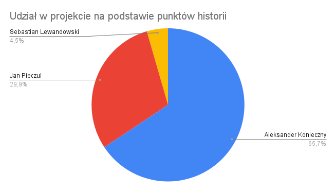

== Podsumowanie realizacji

Realizacja projektu trwała prawie 11 miesięcy, od października 2021 do końca sierpnia 2022. Został on opóźniony o dwa
miesiące, gdyż zespołowi nie udało się zakończyć prac w pierwszym, czerwcowym terminie. W tym czasie zespołowi
udało się zbadać kompletnie nieznaną im wcześniej technologię kryptowalut. W okresie analizy zebrano wymagania,
ustalono cel projektu, a także zaprojektowano rozwiązanie. Stworzony został prototyp oraz makieta interaktywna.
Na ich podstawie stworzono w etapie implementacji cały system, obejmujący dwie nowoczesne aplikacje, internetową
oraz mobilną. Całość obsługiwana jest przez serwer, w którym znajduje się logika obsługująca zaawansowane
funkcjonalności sieci Bitcoin oraz Lightning. Stworzony produkt jest kompletnym rozwiązaniem wykorzystującym
młodą jeszcze technologię, której potencjał nie został jeszcze w pełni wykorzystany. Sprawia to, że projekt ma
szansę zyskać uznanie wśród społeczności technologi Blockchain.

// TODO tej fajny wykres z jiry
//.Wykres obrazujący łączny nakład prac w projekcie.
//image::../images/cumulative_report.png[]

W trakcie prac nad implementacją projektu zrealizowano łącznie 156 zadań. Ich estymacja w postaci punktów historii
wyniosła 392. Zespół nie śledził, ile czasu zostało poświęcone na zadania. Można przyjąć, że 1 punkt warty był 4
godziny. Daje to wtedy wynik 1568 godzin poświęconych na realizację implementacji projektu. Jest to jednak wynik
bardzo nieprecyzyjny i należy go interpretować tylko jako ciekawostkę.

.Wykres obrazujący ilość punktów historii poświęcony na każdy z elementów projektu.
image::../images/total_storypoints.png[]

.Wykres pokazujący ilość zadań dotyczących poszczególnych elementów projektu.
image::../images/total_tasks.png[]

Najwięcej nakładów pracy wymagał serwer aplikacji. Zespół ukończył 49 zadań wartych 124 punkty historii. Na
drugim miejscu uplasowała się dokumentacja, z 38 zadaniami wartymi 104 punty. Ta kategoria uwzględnia zarówno
pisanie pracy dyplomowej, jak i poprawki do pozostałych dokumentów oraz stworzenie i zarządzanie projektem _asciidoc_.
Następną kategorią jest aplikacja internetowa. Zrealizowano również 38 zadań, tym razem wartych 93 punty historii.
Najmniej zadań dotyczyło aplikacji mobilnej. Tej kategorii dotyczyło 17 zdań, których estymacja wynosi 52 punkty.
Ukończono również wiele mniejszych zadań, niepasujących do wymienionych wcześniej kategorii. Są to na przykład
poprawki w repozytorium projektu, pisanie testów E2E oraz tworzenie plików _readme_. Tych zadań było jedynie 14,
a ich wartość to 19 punktów. W trakcie realizacji projektu nie zrealizowano wszystkich zadań. W rejestrze znajduje się
dalej 10 zadań, większość z nich nie ma jeszcze ustalonej estymacji. Ich realizacja planowana jest w następnych
wydaniach.

.Wkład członków zespołu w realizację projektu na podstawie zrealizowanych punktów historii.

Największy udział w implementacji projektu miał Aleksander Konieczny. Zrealizował on zadania warte 262 punkty historii.
Jest to aż 65.2% wszystkich dostarczonych punktów. Jan Pieczul dostarczył 120 punktów historii, dających 29,9%.
Sebastianowi Lewandowskiemu udało się ukończyć zadania o wartości 20 punktów historii, co daje 5% udziału w
implementacji. Statystyki te nie uwzględniają pierwszego etapu historii. W tamtym czasie nad nauką, dokumentacją i
projektowaniem systemu pracował cały zespół. Autorem makiety interaktywnej był w całości Jan Pieczul, natomiast przy
prototypie rozkład udziału jest podobny jak w przypadku implementacji końcowego produktu.

// TODO contributions z githuba
//.Ilość commit'ów w projekcie na przestrzeni czasu.
//image::../images/storypoints_by_person.png[]

W trakcie realizacji kod był _commit'owany_ 154 razy. Mała liczba wynika z podejścia do zarządzania zmianami w
projekcie. Przy każdym zmianie włączonej do głównej gałęzi kodu, wszystkie _commit'y_ były łączone w jeden, aby
zachować czytelność historii. Nazwy zmian wykonanych na każdej gałęzi jest dalej widoczna w wiadomości dołączonej do
każdego _commit'a_. Wykres idealnie obrazuje czas trwania projektu. Widać na nim wyraźnie momenty utworzenia
repozytorium, rozpoczęcia implementacji oraz okres wzmożonych prac przy zbliżających się terminach.

Projekt rozwijany był jako rozwiązanie _open-source_. Każdy mógł wejść i przeglądać publiczne repozytorium projektu.
Ciekawym faktem jest to, że cieszyło się ono małym zainteresowaniem, co zaskoczyło zespół projektowy. Strona
repozytorium została łącznie wyświetlona 811 razy przez 13 unikatowych użytkowników. Pobrany został 220 razy przez
12 unikatowych użytkowników. Jedna osoba stworzyła dodatkowo _fork_ projektu, a 3 osoby niezwiązane z projektem go
obserwują.

Po bardzo długim okresie realizacji oraz pokonaniu wielu przeciwności losu udało się ukończyć projekt dyplomowy.
Zespół przeszedł bardzo długą drogę, od kompletnego braku wiedzy z zakresu kryptowalut do stworzenia kompleksowego
rozwiązania pozwalającego na przyjmowanie płatności w sieci Lightning oraz transakcje multisig w Bitcoinach. Pliki
wykonywalne zostały udostępnione w serwisie Github, więc każda osoba chcąca wdrożyć rozwiązanie może to zrobić
kompletnie za darmo. Zespół ma nadzieję, że system zyska popularność w środowisku i pomoże wielu osobom w otwarciu
swojego biznesu na płatności w kryptowalutach. W trakcie realizacji tymczasowo zawieszono rozmowy o wdrożeniu projektu
w ramach projektu _iNGENIOUS_. Istnieje szansa, że teraz, po zrealizowaniu całego systemu będą one kontynuowane.
