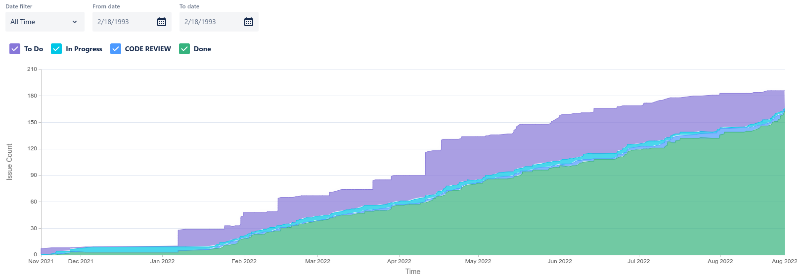
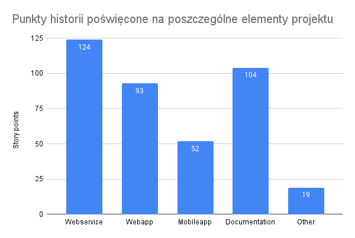
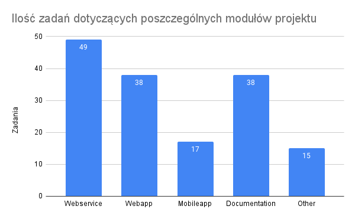
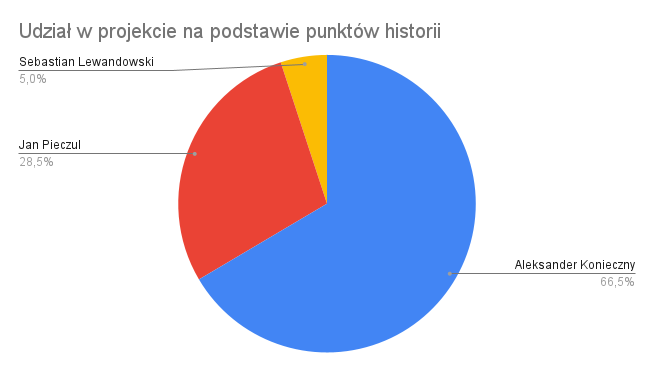
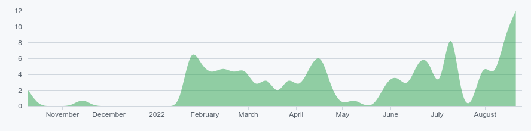

== Podsumowanie i dalszy rozwój

Realizacja projektu trwała prawie 11 miesięcy, od października 2021 do końca sierpnia 2022. Został on opóźniony o dwa
miesiące, gdyż zespołowi nie udało się zakończyć prac w pierwszym, czerwcowym terminie. W tym czasie zespołowi
udało się zbadać kompletnie nieznaną im wcześniej technologię kryptowalut. W okresie analizy zebrano wymagania,
ustalono cel projektu, a także zaprojektowano rozwiązanie. Stworzony został prototyp oraz makieta interaktywna.
Na ich podstawie stworzono w etapie implementacji cały system, obejmujący dwie nowoczesne aplikacje, internetową
oraz mobilną. Całość obsługiwana jest przez serwer, w którym znajduje się logika obsługująca zaawansowane
funkcjonalności sieci Bitcoin oraz Lightning. Stworzony produkt jest kompletnym rozwiązaniem wykorzystującym
młodą jeszcze technologię, której potencjał nie został jeszcze w pełni wykorzystany. Sprawia to, że projekt ma
szansę zyskać uznanie wśród społeczności technologi Blockchain.

.Wykres obrazujący łączny nakład prac w projekcie.

W trakcie prac nad implementacją projektu zrealizowano łącznie 156 zadań. Ich estymacja w postaci punktów historii
wyniosła 392. Łączny nakład prac zaprezentowano na rysunku 135. Zespół nie śledził, ile czasu zostało poświęcone na
zadania. Można przyjąć, że 1 punkt warty był 4 godziny. Daje to wtedy wynik 1568 godzin poświęconych na realizację
implementacji projektu. Jest to jednak wynik bardzo nieprecyzyjny i należy go interpretować tylko jako ciekawostkę.

.Wykres obrazujący ilość punktów historii poświęcony na każdy z elementów projektu.

.Wykres pokazujący ilość zadań dotyczących poszczególnych elementów projektu.

Nakład prac na poszczególne komponenty systemu pokazano na rysunkach 136 oraz 137.
Najwięcej nakładów pracy wymagał serwer aplikacji. Zespół ukończył 49 zadań wartych 124 punkty historii. Na
drugim miejscu uplasowała się dokumentacja, z 38 zadaniami wartymi 104 punty. Ta kategoria uwzględnia zarówno
pisanie pracy dyplomowej, jak i poprawki do pozostałych dokumentów oraz stworzenie i zarządzanie projektem _asciidoc_.
Następną kategorią jest aplikacja internetowa. Zrealizowano również 38 zadań, tym razem wartych 93 punty historii.
Najmniej zadań dotyczyło aplikacji mobilnej. Tej kategorii dotyczyło 17 zdań, których estymacja wynosi 52 punkty.
Ukończono również wiele mniejszych zadań, niepasujących do wymienionych wcześniej kategorii. Są to na przykład
poprawki w repozytorium projektu, pisanie testów E2E oraz tworzenie plików _readme_. Tych zadań było jedynie 14,
a ich wartość to 19 punktów. W trakcie tworzenia projektu nie zrealizowano wszystkich zadań. W rejestrze znajduje się
dalej 10 zadań, większość z nich nie ma jeszcze ustalonej estymacji. Ich realizacja planowana jest w następnych
wydaniach.

.Wkład członków zespołu w realizację projektu na podstawie zrealizowanych punktów historii.

Największy udział w implementacji projektu miał Aleksander Konieczny. Zrealizował on zadania warte 264 punkty historii.
Jest to aż 65.7% wszystkich dostarczonych punktów. Jan Pieczul dostarczył 120 punktów historii, dających 29.9%.
Sebastianowi Lewandowskiemu udało się ukończyć zadania o wartości 18 punktów historii, co daje 4.5% udziału w
implementacji. Wkład własny członków zespołu porównano na rysunku 138. Statystyki te nie uwzględniają pierwszego etapu
historii. W tamtym czasie nad nauką, dokumentacją i projektowaniem systemu pracował cały zespół. Autorem makiety
interaktywnej był w całości Jan Pieczul, natomiast przy prototypie rozkład udziału jest podobny jak w przypadku
implementacji końcowego produktu.

.Ilość commit'ów w projekcie na przestrzeni czasu.

W trakcie realizacji kod był _commit'owany_ 154 razy Mała liczba wynika z podejścia do zarządzania zmianami w
projekcie. Przy każdym zmianie włączonej do głównej gałęzi kodu, wszystkie _commit'y_ były łączone w jeden, aby
zachować czytelność historii. Nazwy zmian wykonanych na każdej gałęzi jest dalej widoczna w wiadomości dołączonej do
każdego _commit'a_. Wykres z rysunku 139 idealnie obrazuje czas trwania projektu. Widać na nim wyraźnie momenty
utworzenia repozytorium, rozpoczęcia implementacji oraz okres wzmożonych prac przy zbliżających się terminach.

Projekt rozwijany był jako rozwiązanie _open-source_. Każdy mógł wejść i przeglądać publiczne repozytorium projektu.
Ciekawym faktem jest to, że cieszyło się ono małym zainteresowaniem, co zaskoczyło zespół projektowy. Strona
repozytorium została łącznie wyświetlona 811 razy przez 13 unikatowych użytkowników. Kod pobrany został 220 razy przez
12 unikatowych użytkowników. Jedna osoba stworzyła dodatkowo _fork_ projektu, a 3 osoby niezwiązane z projektem go
obserwują.

Po bardzo długim okresie realizacji oraz pokonaniu wielu przeciwności losu udało się ukończyć projekt dyplomowy.
Zespół przeszedł bardzo długą drogę, od kompletnego braku wiedzy z zakresu kryptowalut do stworzenia kompleksowego
rozwiązania pozwalającego na przyjmowanie płatności w sieci Lightning oraz transakcje multisig w Bitcoinach. Pliki
wykonywalne zostały udostępnione w serwisie Github, więc każda osoba chcąca wdrożyć rozwiązanie może to zrobić
kompletnie za darmo. Zespół ma nadzieję, że system zyska popularność w środowisku i pomoże wielu osobom w otwarciu
swojego biznesu na płatności w kryptowalutach. W trakcie realizacji tymczasowo zawieszono rozmowy o wdrożeniu projektu
w ramach projektu _iNGENIOUS_. Istnieje szansa, że teraz, po zrealizowaniu całego systemu będą one kontynuowane.

=== Dalsze plany rozwoju

W ramach pierwszego wydania nie zostały ukończone wszystkie początkowo zaplanowane zadania. Jest to związane z nierównym
wkładem własnym członków zespołu projektowego. W rejestrze zadań znajduje się jeszcze kilkanaście zadań. Większość
z nich dotyczy zmniejszenia długu technicznego oraz mniej znaczących poprawek. Znalazły się tam również ważne
zadania. Funkcjonalność odtwarzania portfela dodana jest tylko po stronie serwera. Integracja procesu w aplikacji
internetowej nie została dodana. Drugą ważną funkcjonalnością jest dynamiczne obliczanie opłaty transakcyjnej w
zależności od rozmiaru transakcji. W aktualnej wersji jest to sztywno ustalona kwota, która powinna być zaakceptowana
w większości przypadków. Opłata transakcyjna powinna być obliczana automatycznie na podstawie danych o opłatach z
ostatnich bloków przeliczonych przez rozmiar bloku w bajtach. W aplikacji zabrakło również kompletnych testów E2E.
Zrealizowano je tylko dla procesu uwierzytelniania, a w planach były jeszcze dla całej reszty aplikacji internetowej
oraz aplikacji mobilnej. Planowane też było usprawnienie procesu budowania artefaktów projektu. Na potrzeby
pierwszego wydania pliki te zostały zbudowane ręcznie, natomiast w rejestrze znajdują się zadania automatyzujące
ten proces w ramach procesu CI/CD. Ostatnią brakującą funkcjonalnością jest przesyłanie zakupionych tokenów na adres
email użytkownika. Już w karcie wymagań projektu zadanie było oznaczone jako opcjonalne, więc odpowiedni wpis nie
znalazł się w rejestrze. Planowano jego realizację tylko w przypadku ukończenia projektu długo przed terminem, co nie
miało miejsca. Wszystkie z wymienionych nieukończonych funkcjonalności będą ukończone w najbliższym czasie i zostaną
uwzględnione w następnym wydaniu.

Aplikacja ma duży potencjał do rozwoju. Nowe funkcjonalności można dodawać praktycznie bez końca. Projekt powstał
jako połączenie dwóch innych projektów, które miały powstać w ramach projektu _iNGENIOUS_. Był to serwer do przyjmowania
płatności wraz z generowaniem tokenów oraz portfel multisig z aplikacją mobilną do podpisywania transakcji.
Naturalną rzeczą jest, że połączenie dwóch projektów skutkowało zmniejszeniem liczby funkcjonalności obu z nich.
Wiele z nich planowane jest na przyszłe wydania. Moduł płatności powinien być bardziej uniwersalny. Jedną z możliwości
jest dodanie funkcjonalności pozwalającej na dostosowanie stylu aplikacji przez administratorów. Może to się odbywać
przykładowo poprzez kaskadowe arkusze stylów. Dobrym pomysłem dyskutowanym na początku było stworzenie serwera z
wykorzystaniem architektury mikroserwisów. Dzięki temu klienci mogliby uruchomić tylko część serwera odpowiedzialną za
płatności, wykorzystując stworzone rozwiązanie tylko i wyłącznie jako bramki płatności. Prawdopodobnie dodanie tej
funkcjonalności zwiększyłoby szansę na komercjalizację, gdyż pozwoliłoby to na integrację z istniejącymi już sklepami
internetowymi. Bardzo wiele funkcjonalności można dodać do części odpowiedzialnej za portfel oraz transakcje.
A aplikacji mobilnej brakuje zarządzania kluczami. W planach jest implementacja odzyskiwania klucza z _mnemonic phase_,
a także możliwość importu oraz eksportu pliku z kluczem. Można również pomyśleć nad implementacją części funkcjonalności
aplikacji internetowej w aplikacji mobilnej, takich jak podgląd środków w portfelu czy też przeglądanie historii
płatności. Planowane jest również rozwinięcie zarządzania kanałami. W tym celu planowany jest nowy panel wyświetlający
szczegóły aktualnie otwartych kanałów. Administrator będzie mógł zamykać tylko wybrane przez siebie kanały, a nie
wszystkie jednocześnie jak to jest zaimplementowane obecnie. Dodatkowo chciano dodać możliwość skorzystania z funkcji
_LND_ o nazwie _Autopilot_. Pozwala ona na automatyczne otwieranie kanałów z popularnymi węzłami. Zmniejszyłoby to
ilość użytkowników, którzy muszą za każdym razem samemu otwierać kanały. Byłoby to szczególnie przydatne na serwerach
z dużą ilością użytkowników. Gdyż większość użytkowników sieci Lightning miałoby cały czas pośrednio otwarty kanał z
serwerem.

Sam projekt dostępny jest w serwisie Github jako rozwiązanie open-source. Wydany został na licencji MIT, która pozwala
każdemu na dowolne użytkowanie i modyfikację programu. W tym modelu planowane jest dalsze rozwijanie systemu.
Po dodaniu wielu nowych funkcjonalności może wzrosnąć wartość biznesowa rozwiązania. W tym wypadku licencja nie
zabrania kontynuowania rozwoju oprogramowania na innej licencji, niekoniecznie open-source. Zespół nadal myśli o
integracji projektu w ramach programu _iNGENIOUS_. Cały czas prowadzone są rozmowy dotyczące wdrożenia systemu w ramach
projektu, które prawdopodobnie przyspieszą po zakończeniu prac. Nieważne czy projekt ma szanse na komercjalizację,
czy nie, prawdopodobnie dalej będzie on rozwijany jako projekt poboczny jego autorów.
