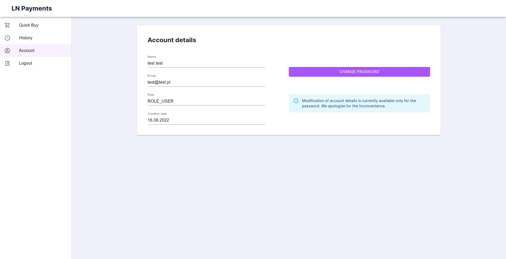
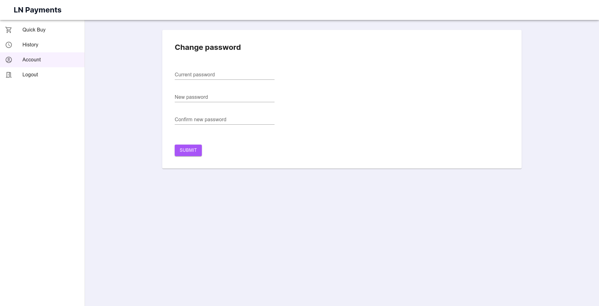
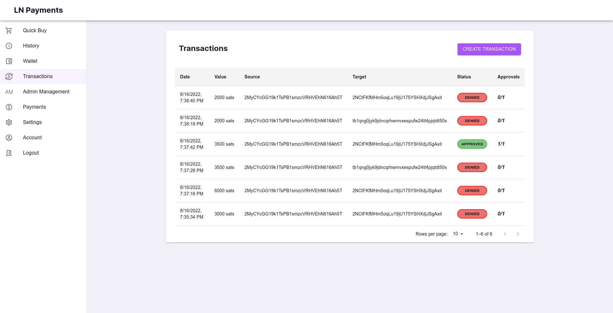

:mobile-size: pdfwidth=30%

== Prezentacja w działaniu

W procesie implementacji projektu wytworzono trzy główne komponenty, czyli serwer, aplikację mobilną oraz aplikację
internetową. API serwera nie zostało zaprojektowane do użytku publicznego. Jego jedynym zadaniem jest obsługiwanie
_backend'owej_ części projektu. W tym rozdziale zostanie zaprezentowana aplikacja mobilna oraz aplikacja webowa.
Pokazane zostaną wszystkie dostępne funkcjonalności i procesy.

Przy wejściu do aplikacji internetowej użytkownik trafia na stronę główną, która zaprezentowana została na
rysunku 81. Zawiera ona krótki komunikat powitalny oraz 3 guziki, pozwalające przejść do dalszych części aplikacji.
Z tego ekranu można przejść do formularzy logowania, rejestracji oraz płatności dla niezalogowanych użytkowników.

.Strona główna aplikacji internetowej.

Omawianie zostanie rozpoczęte od płatności. W systemie każdy typ użytkownika może wykonać płatność. Użytkownicy
niezalogowani różnią się tym, że nie będą oni mieli wglądu w swoją osobistą historię płatności. Wymaga to od nich
zapisania wszystkich zakupionych tokenów, gdyż po wyjściu z aplikacji nie będą oni mogli ich więcej wyświetlić.
Użytkownik jest wielokrotnie informowany o tym fakcie na różnych ekranach procesu. Po kliknięciu przycisku _QuickBuy_,
na stronie głównej, następuje przekierowania do pierwszego ekranu procesu, czyli formularza płatności, widocznego
na rysunku 82. W górnej części ekranu widać pasek informujący o aktualnym ekranie procesu oraz komunikat o braku
możliwości późniejszego wyświetlenia tokenów po zakończeniu płatności.
W centralnej części ekranu znajduje się sam formularz. Od niezalogowanego
użytkownika wymagane jest podanie liczby tokenów oraz adresu email. Służy on do wygenerowania specjalnego tokena JWT,
pozwalającego na dokonanie płatności oraz jej identyfikację w bazie danych. W przyszłych wydaniach planowane jest
również dodanie serwisu wysyłającego zakupione produkty na wskazany adres email. Formularz zawiera również informacje
o oferowanym produkcie, czyli opis oraz cenę. Po wysłaniu formularza użytkownik zostaje przekierowany na drugi
ekran procesu.

.Formularz płatności dla niezalogowanego użytkownika.
image::../images/system_presentation/webapp/anonymous_qb_1.png[]

Drugi ekran służy do opłacenia zamówienia. Zaprezentowany on został na rysunku 83. Zawiera on informację o finalnej
cenie zakupu, a także komponent
wyświetlający dwa kody QR. Pierwszy zawiera żądanie zapłaty w sieci Lightning, a drugi adres węzła. Pomiędzy kodami
QR użytkownik może przełączać się za pomocą przełącznika w dolnej części komponentu. Oba kody można zeskanować przy
pomocy portfela Bitcoin wspierającego płatności w sieci Lightning. Na ekranie znajduje się również minutnik, pokazujący
czas pozostały na wykonanie płatności. Po jego upływie transakcja automatycznie zmieni status na anulowany. Gdy
użytkownik opłaci żądanie zapłaty, zostanie automatycznie przekierowany na następny ekran.

.Ekran z kodem QR dla niezalogowanego użytkownika.
image::../images/system_presentation/webapp/anonymous_qb_2.png[]

Ostatnim ekranem, widocznym na rysunku 84, jest podsumowanie płatności. Zawiera on listę zakupionych tokenów. Można je
wyświetlić bądź skopiować do schowka przy pomocy odpowiednich przycisków.
Przy kopiowaniu, a także wielu innych akcjach w aplikacji internetowej
wyświetlane są w lewym dolnym roku powiadomienia o dokonanej akcji. Przycisk _close_ powoduje powrót na pierwszy
ekran formularza płatności. Aby wrócić na stronę główną, należy kliknąć nagłówek strony w lewym górnym rogu ekranu.

.Podsumowanie płatności dla niezalogowanego użytkownika.

Aby zyskać dostęp do indywidualnej historii płatności, należy założyć konto w serwisie. Formularz znajduje się
pod przyciskiem _register_ na stronie głównej aplikacji. Formularz ten zawiera tylko cztery pola. Są to
adres email, imię i nazwisko, oraz dwa pola dotyczące wprowadzenia hasła. Strona rejestracji zaprezentowana została
na rysunku 85.

.Formularz rejestracji użytkownika.
image::../images/system_presentation/webapp/register.png[]

Wszystkie pola w całej aplikacji zawierają walidację danych wejściowych. W tym przypadku sprawdzany jest między innymi
odpowiedni format adresu email, czy też wymogi dotyczące siły hasła. Użytkownik jest proszony o
potwierdzenie hasła poprzez wpisanie go w dwóch polach formularza, aby zminimalizować szansę na pomyłkę. Po wysłaniu
formularza użytkownik może od razu spróbować się zalogować. Dodatkowo w dolnej części ekranu rejestracji cały czas
widoczny jest przycisk, pozwalający na nawigowanie do podstrony logowania. Walidację formularza rejestracji
zaprezentowano na rysunku 86.

.Prezentacja walidacji pól formularza rejestracji.
image::../images/system_presentation/webapp/register_validation.png[]

Logowanie odbywa się poprzez formularz logowania, widoczny na rysunku 87. Jest on dostępny przez przycisk _Login_ na
stronie głównej aplikacji. Zawiera on dwa pola, adres email oraz hasło. W dolnej części formularza obecne są przyciski
pozwalające na wysłane formularza oraz przejście do ekranu rejestracji.

.Formularz logowania.
image::../images/system_presentation/webapp/login.png[]

Po zalogowaniu użytkownik trafia automatycznie na pierwszy ekran procesu płatności. Cały ten proces wygląda tak samo,
jak w przypadku użytkownika niezalogowanego. Różnią się jedynie brakiem komunikatów o potrzebie zapisu tokenów we
własnym zakresie. Nowością na tym ekranie jest obecność menu bocznego. Służy ono do nawigacji po panelach dostępnych
dla zalogowanych użytkowników oraz administratorów. Zwykły zalogowany użytkownik może dokonać płatności, przeglądać
swoją historię, wyświetlić profil, a także się wylogować. Omawiany ekran pokazano na rysunku 88.

.Formularz płatności dla zalogowanego użytkownika.
image::../images/system_presentation/webapp/qb_1.png[]

Gdy zalogowany użytkownik dokona płatności, może on ją wyświetlić w historii. Jest ona dostępna pod przyciskiem
_History_ w menu bocznym aplikacji. Ekran ten pokazano na rysunku 89. Dane prezentowane są w formie tabeli. Zawiera ona
żądanie zapłaty, które jest również numerem identyfikacyjnym, datę utworzenia, cenę za jeden token, ilość zakupionych
tokenów oraz status płatności. Dodatkowo w ostatniej kolumnie dla płatności zakończonych sukcesem znajduje się guzik
pozwalający na wyświetlenie zakupionych tokenów. Każda tabela w aplikacji zawiera wbudowaną paginację. Użytkownik może
zmieniać strony, a także ilość elementów na niej wyświetlanych.

.Indywidualna historia płatności użytkownika.
image::../images/system_presentation/webapp/history.png[]

Następną funkcjonalnością dostępną dla standardowego użytkownika jest jego profil, który pokazano na rysunku 90.
Dostępny on jest pod przyciskiem _Account_ w menu bocznym.
Panel ten pozwala na wyświetlenie danych użytkownika podanych podczas rejestracji oraz
jego roli. Zawiera on również przycisk pozwalający na zmianę hasła. Obecnie użytkownik może edytować tylko swoje
hasło, a umożliwienie modyfikacji pozostałych pól planowane jest w następnych wydaniach. Aby przejść do formularza,
należy kliknąć przycisk _change password_.

.Profil użytkownika.

Formularz, widoczny na rysunku 91, zawiera tylko trzy pola. Jest to pole na obecne hasło oraz dwa pola na nowe hasło.
Walidacja pól odbywa się w taki sam sposób jak przy formularzu rejestracji.
Po wysłaniu formularza hasło zostanie zaktualizowane w bazie danych.

.Formularz zmiany hasła.

Kolejne funkcjonalności wymagają posiadania konta administratora. Przy pierwszym uruchomieniu aplikacji do bazy danych
zostaje dodany użytkownik _admin_ z hasłem _admin. Jest to konto, które powinno się używać tylko i wyłącznie do
konfiguracji serwera. Dobrą praktyką jest jego usunięciu po dodaniu administratorów i utworzeniu portfela.
Administrator posiada wszystkie te same funkcjonalności co zwykły użytkownik. Proces płatności czy też ekran
historii niczym się nie różnią. Administrator ma możliwość przeglądania historii wszystkich płatności
odbywających się na serwerze. Ekran ten widoczny jest na rysunku 92. Dane prezentowane w tej tabeli różnią się jednak
od indywidualnej historii. Zamiast żądania zapłaty wyświetlany jest adres email osoby, która dokonała płatności.
Płatności przez niezalogowanych użytkowników można rozróżnić poprzez sześcioznakową wartość poprzedzoną hasztagiem,
która jest dodana na końcu adresu email. Administrator nie może również wyświetlać tokenów zakupionych przez innych
użytkowników.

.Historia płatności wszystkich użytkowników.
image::../images/system_presentation/webapp/payments_all.png[]

Ważnym zadaniem, które powinno zostać wykonane zaraz po pierwszym uruchomieniu, jest konfiguracja serwera. Ustawienia
dostępne są poprzez przycisk _Settings_ w menu bocznym. Panel ten zaprezentowano na rysunku 93.
Pozwalają one na skonfigurowanie wielu aspektów serwera.
Można ustawić opis i cenę tokenów, które są wyświetlane w formularzu płatności, a także opis, który dołączany
jest do żądania płatności Lightning. Administrator może również ustalić czas, jaki użytkownik ma na dokonanie
płatności. Następne dwa pola dotyczą limitu automatycznych transferów środków z portfela Lightning do portfela Bitcoin
oraz limitu automatycznego zamknięcia kanałów. Ostatnie dwa pola są opcjonalne, dlatego też zabezpieczone są
wcześniej polem typu _checkbox_. Pierwszym polem jest adres url, na który wysyłane będą zakupione przez użytkowników
tokeny. Drugie pole pozwala na ręczne ustalenie adresu ip węzła Lightning. Domyślnie pozyskiwane jest publiczne ip
z wykorzystaniem serwisu Amazon AWS, natomiast użytkownik ma możliwość podania własnego adresu. Może to być przydatne
na przykład, gdy serwer ma działać tylko w sieci prywatnej.

.Ustawienia serwera.

Aby móc operować środkami pozyskanymi ze sprzedaży tokenów, musi zostać utworzony portfel. Jednak aby tego
dokonać, należy najpierw dodać administratorów, a następnie przesłać z ich aplikacji mobilnych klucze publiczne na
serwer. Zarządzanie administratorami odbywa się poprzez dedykowany panel, który dostępny jest pod przyciskiem _admin
management_ w menu bocznym. Jest on widoczny na rysunku 94. Ekran ten zawiera tabelę wszystkich administratorów w
serwerze. Każdy wiersz zawiera adres email, imię i nazwisko oraz 2 ikony, które informują czy użytkownik ma przesłany
klucz publiczny, a także czy jest przypisany do aktualnego portfela. Dodatkowo w ostatniej kolumnie znajduje się
przycisk pozwalający na usunięcie administratora, który nie jest przypisany do portfela.

.Panel zarządzania administratorami.

Dodawanie nowego użytkownika odbywa się w formularzu, który jest dostępny pod przyciskiem _add new_ w panelu zarządzania
administratorami. Formularz, który widać na rysunku 95, wygląda dokładnie tak samo, jak ten w przypadku rejestracji dla
standardowego użytkownika.
W przyszłości planowana jest możliwość automatycznego generowania hasła i wysłania go nowo utworzonemu administratorowi,
jednak zostanie to dodane dopiero w przyszłych wydaniach. Zalecane jest, aby nowo utworzony administrator od razu
po pierwszym logowaniu zmienił swoje hasło.

.Formularz dodawania nowego administratora.
image::../images/system_presentation/webapp/add_admin.png[]

Administrator, który chce być członkiem portfela, musi wygenerować parę kluczy, po czym przesłać swój klucz publiczny
na serwer. Odbywa się to automatycznie przy pierwszym logowaniu do aplikacji mobilnej. Przy jej pierwszym uruchomieniu
użytkownik zostanie przywitany ekranem logowania, widocznym na rysunku 96. Warto wspomnieć, że aplikacja mobilna
dostępna jest tylko dla administratorów. Próba zalogowania się jako zwykły użytkownik zakończy się niepowodzeniem i
wyświetleniem odpowiedniego komunikatu. Formularz logowania zawiera dwa oczywiste pola, czyli adres email i hasło.
Dodatkowym polem jest adres url serwera. Rozwiązanie _LN Payments_ przewidziane jest do samodzielnego wdrożenia.
Użytkownik musi ręcznie podać adres, ponieważ nie ma jednego centralnego serwera zarządzającego instancjami. Od osoby
wdrażającej zależy sposób, w jaki system zostanie wdrożony. Adres url zostaje zapisany lokalnie, dzięki czemu nie
trzeba go ponownie wpisywać przy każdym logowaniu.

.Strona logowania w aplikacji mobilnej

Przy pierwszym logowaniu odbędzie się proces generowania kluczy i przesłania klucza publicznego. Etap składa się
z kilku kroków. Najpierw generowane są klucze, następnie zapisywane są one na dysku, a na koniec klucz publiczny
wysyłany jest na serwer. Użytkownik informowany jest o statusie procesu poprzez odpowiednią wiadomość wyświetlaną na
ekranie ładowania. Jeden z wybranych komunikatów zaprezentowano na rysunku 97.

.Jeden z komunikatów wyświetlanych podczas tworzenia i zapisywania pary kluczy.

Po udanym przesłaniu klucza publicznego użytkownik zyska dostęp do aplikacji mobilnej. Dla nowo utworzonego
administratora wyświetlony zostanie pusty komponent powiadomień. Jest on widoczny na rysunku 98. Został on
zaprojektowany w taki sposób, aby powiadomienia nie były powiązane z transakcjami. W przyszłości możliwe będzie
wyświetlanie tutaj innych powiadomień. Na chwilę obecną administrator musi czekać na dodanie do portfela, aby pojawiły
się powiadomienia.

.Pusty panel powiadomień.

Gdy wszyscy administratorzy, którzy mają zostać członkami portfela, przesłali swoje klucze, można przejść do formularza
jego tworzenia, który zaprezentowano na rysunku 99. Gdy na serwerze nie istnieje aktualnie żaden portfel, użytkownik
zostanie do niego przekierowany automatyczne po kliknięciu przycisku _Wallet_ w panelu bocznym. Formularz zawiera dwa
pola. Pierwsze z nich określa ilość podpisów wymaganych do wykonania transakcji. Liczba ta nie może być większa od
administratorów portfela, którzy określani są w drugim polu formularza. Jest to lista rozwijana wielokrotnego wyboru,
na której wskazuje się adresy email administratorów.

.Formularz tworzenia nowego portfela.
image::../images/system_presentation/webapp/add_wallet.png[]

Po przesłaniu formularza zostanie utworzony portfel. Od tego momentu serwer będzie obserwował balans środków w
kanałach i portfelu Lightning, aby samemu uruchamiać transfery środków. Panel portfela widoczny jest na rysunku 100.
Postęp do uruchomienia transferów można obserwować na kafelkach w górnej części panelu.
Prezentowany zrzut ekranu jest z portfela działającego już jakiś czas,
dzięki czemu wyświetlane są w nich duże ilości danych. Każdy z kafelków w górnym rzędzie zawiera również kwotę
zebraną w poszczególnych częściach portfela. Od lewej są to portfel Bitcoin, kanały Lightning oraz portfel Lightning.
Dolny rząd zawiera wykres, obrazujący przychody serwera w poszczególnych miesiącach. Ostatnim kafelkiem jest
panel akcji, pozwalający na ręczne zamykanie kanałów oraz przelewanie środków z portfela Lightning na portfel Bitcoin.
Dodatkowo panel zawiera adres Bitcoin portfela w jego prawym górnym rogu.

.Ekran portfela.

Mając już skumulowane środki ze sprzedaży w portfelu Bitcoin, można dokonać transakcji. Zarządzanie transakcjami
odbywa się w panelu dostępnym pod przyciskiem _Transactions_ w menu bocznym. Jest on widoczny na rysunku 101.
Ekran ten zawiera tabelę z wykonanymi
wcześniej transakcjami. Każdy wiersz zawiera datę transakcji, kwotę, adresy źródłowy oraz docelowy, status oraz
ilość zebranych podpisów. Aby serwer spróbował rozpropagować transakcję, należy uzbierać ilość podpisów podaną
wcześniej w formularzu tworzenia portfela.

.Ekran transakcji.

Tworzenie nowych transakcji odbywa się w formularzu widocznym na rysunku 102. Jest on dostępny poprzez przycisk
_create transaction_ na ekranie powiadomień. Formularz ten nie jest dostępny,
gdy istnieje aktualnie trwająca transakcja. Formularz składa się z dwóch pól, w których należy podać kwotę transakcji
oraz adres docelowy. Po prawej stronie panelu wyświetlane są informacje wymagane do utworzenia transakcji.
Jest to aktualny balans w portfelu oraz estymowana
wartość opłaty. Obecnie jest to zawsze 1000 SAT, jednak w przyszłych wydaniach zaplanowano dodanie kalkulacji na
podstawie rozmiaru transakcji i wysokości opłat w poprzednim bloku. Przesłanie formularza spowoduje dodanie transakcji
w bazie danych oraz wysłanie powiadomień do wszystkich administratorów będących członkami portfela.

.Formularz tworzenia nowej transakcji.
image::../images/system_presentation/webapp/add_transaction.png[]

W tym momencie administrator zostanie przekierowany z powrotem na panel transakcji, który widoczny jest na rysunku 103.
W tabeli można zobaczyć, że oczekująca transakcja jest wyróżniana specjalnym kolorem.
Będzie ona również wyświetlana na samej górze każdej strony w tabeli.
Dodatkowo zauważyć można również, że zniknął przycisk pozwalający na tworzenie transakcji, gdyż
jest on dostępny tylko wtedy, gdy nie ma aktualnie trwającej transakcji.

.Ekran transakcji z transakcją oczekującą.

Przy utworzeniu nowej transakcji zostaje ona zapisana w bazie danych, razem z powiadomieniami dla każdego użytkownika.
Każde powiadomienie zostaje również wysłane do aplikacji mobilnej, która wyświetla je jako systemowe powiadomienie push.
Zawiera ono podstawowe informacje o transakcji, a kliknięcie go uruchomi aplikację mobilną i przekieruje użytkownika
na ekran ze szczegółami powiadomienia. Powiadomienie w systemie _Android_ pokazano na rysunku 104.

.Powiadomienie push informujące o nowej transakcji.

Powiadomienie o nowej transakcji zostanie również wyświetlone na wcześniej pokazanym komponencie aplikacji mobilnej.
Lista ma zaimplementowaną paginację oraz odświeżanie. Następne strony ładowane są dynamicznie przy przesuwaniu
ekranu palcem z dołu do góry. Odświeżanie wywołuje się poprzez pociągnięcie ekranu w dół. Ekran ten widoczny jest na
rysunku 105. Każde powiadomienie na liście zawiera jego tytuł, typ oraz ikonkę odpowiadającą jego statusowi. Po
kliknięciu powiadomienia użytkownik zostanie przeniesiony na ekran zawierający jego szczegóły.

.Ekran powiadomień wraz z oczekującą transakcją.
image::../images/system_presentation/mobileapp/notifications.png[{mobile-size}]

Jedynymi aktualnie wspieranymi powiadomieniami są transakcje. Każde z nich zawiera id, wiadomość, adres docelowy,
kwotę transakcji, typ powiadomienia oraz jego status. W przypadku powiadomienia dotyczącego oczekującej transakcji
na dole ekranu wyświetlane są dwa guziki, które pozwalają na jej potwierdzenie bądź odrzucenie. Ten widok
zaprezentowano na rysunku 106. Potwierdzenie transakcji powoduje pobranie z serwera aktualnej wartości transakcji w
formacie szesnastkowym. Następnie wykonywane jest jej podpisanie i odesłanie z powrotem na serwer. Jeżeli osiągnięto
wymaganą ilość podpisów, serwer propaguje transakcję w sieci, a status innych oczekujących powiadomień zmienia się na
wygasły. W przypadku odrzucenia transakcji aktualizowana jest odpowiednia encja w bazie danych. Tak samo, jak przy
potwierdzeniu, gdy zebrana ilość odrzuceń uniemożliwi akceptację jej przez inne węzły, oczekujące powiadomienia
zostaną wygaszone.

.Szczegóły powiadomienia.

Jeżeli podpisanie bądź odrzucenie transakcji zakończy się powodzeniem, wyświetlany jest specjalny ekran, który
informuje o sukcesie wykonanej akcji. Przykładowy komunikat pokazano na rysunku 107. Istnieje kilka wariantów tego
ekranu. Różnią się one zawartością, czyli wiadomością, kolorem tła i ikoną. Po kliknięciu przycisku _OK_ użytkownik
przekierowany zostanie z powrotem na listę powiadomień.

.Komunikat wyświetlany po udanym potwierdzeniu powiadomienia.
image::../images/system_presentation/mobileapp/notification_confirmation.png[{mobile-size}]

Wracając do aplikacji mobilnej po zebraniu odpowiedniej ilości podpisów, można zauważyć, że dotychczasowa transakcja
oczekująca zmieniła swój status na zatwierdzony. Zachowanie to jest widoczne na rysunku 108.

.Ekran transakcji, na którym widać właśnie potwierdzoną transakcję.

Przeszukując dane o blockchainie Bitcoina, można znaleźć przesłaną właśnie transakcję. Pozwala na to na przykład
serwis _blockchain.info_. Wykonaną właśnie transakcję można znaleźć po adresie wychodzącym portfela czy też przy użyciu
id transakcji, które jest logowane przez serwer podczas propagowania transakcji.

.Dowód udanego rozgłoszenia transakcji w serwisie blockchain.info.

Jak widać na zrzucie ekranu z rysunku 109, dane w portalu zgadzają się z informacjami dostępnymi w systemie LN Payments.
Adres, z którego pobrano środki, to adres portfela multisig, a wykorzystano jedno UTXO o wartości ponad 96000 SAT.
Wyjściami transakcji jest adres docelowy na kwotę podaną w formularzu oraz reszta środków UTXO zwracana na adres
multisig. Każda transakcja jest publicznie dostępna, dzięki czemu można wyświetlić jej szczegóły w niezależnym
źródle. Pozwala to również na zweryfikowanie, że transakcja oraz jej propagacja zakończyły się sukcesem.
