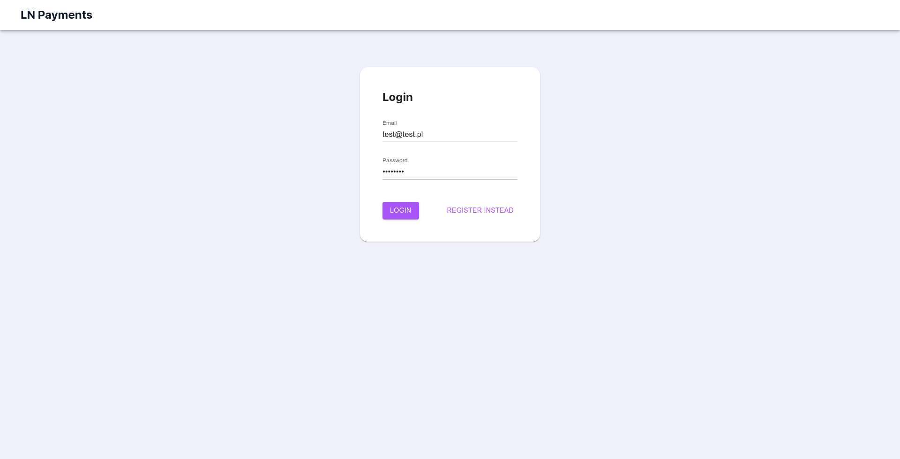
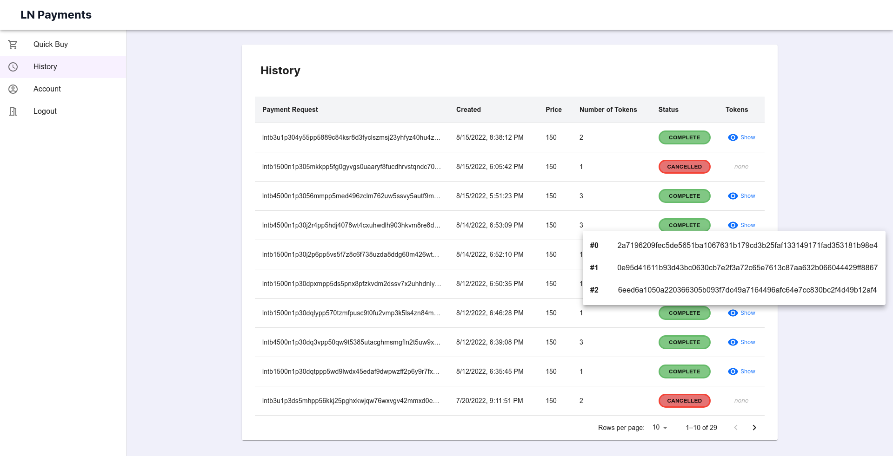
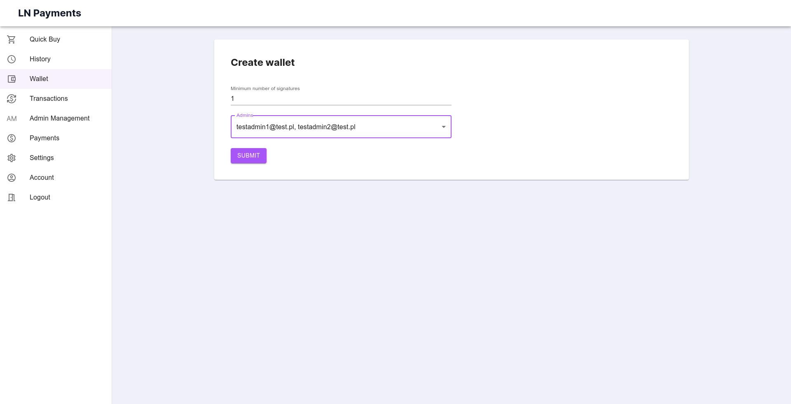
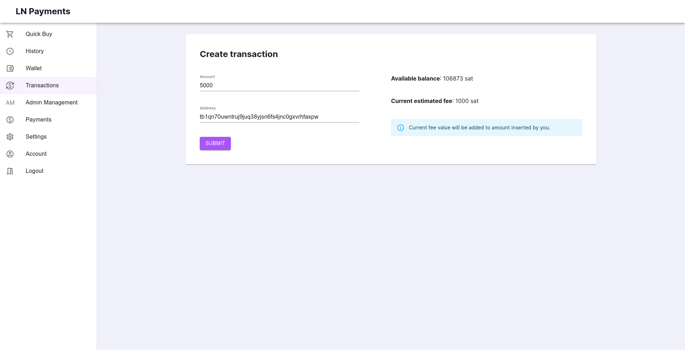

== Prezentacja w działaniu

. strona główna $
. płatność niezalogowanym $
. rejestracja $
. walidacja formularza? $
. logowanie na usera $ -> jako user?
. płatność userem? $ -> jako user?
. historia indywidualna -> jako user?
. konto $ -> jako user?
. zmiana hasła $ -> jako user?
. historia ogólna $
. ustawienia serwera $
. admin management $
. dodanie admina -> brak!
. mobilka -> logowanie $
. mobilka -> upload kluczy $
. mobilka -> pusty notifications $
. stworzenie portfela $ -> wywalić swój email
. ekran portfela $
. ekran transakcji $
. stworzenie nowej transakcji $
. again ekran transakcji, bo teraz jest pending -> brak
. mobilka -> lista powiadomień -> brak
. mobilka -> powiadomienie -> brak
. mobilka -> potwierdzenie -> brak
. again ekran transakcji + dowód z blockchain.info $

W procesie implementacji projektu wytworzono trzy główne komponenty, czyli serwer, aplikację mobilną oraz aplikację
internetową. API serwera nie zostało zaprojektowane do użytku publicznego. Jego jedynym zadaniem jest obsługiwanie
_backend'owej_ części projektu. W tym rozdziale zostanie zaprezentowana aplikacja mobilna oraz aplikacja webowa.
Pokazane zostaną wszystkie dostępne funkcjonalności i procesy.

Przy wejściu do aplikacji internetowej użytkownik trafia na stronę główną. Zawiera ona krótki komunikat powitalny
oraz 3 guziki, pozwalające przejść do dalszych części aplikacji. Z tego ekranu można przejść do formularzy logowania,
rejestracji oraz płatności dla niezalogowanych użytkowników.

.Strona główna aplikacji internetowej.
image::../images/system_presentation/webapp/landing_page.png[]

Omawianie zostanie rozpoczęte od płatności. W systemie każdy typ użytkownika może wykonać płatność. Użytkownicy
niezalogowani różnią się tym, że nie będą oni mieli wglądu w swoją osobistą historię płatności. Wymaga to od nich
zapisania wszystkich zakupionych tokenów, gdyż po wyjściu z aplikacji nie będą oni mogli ich więcej wyświetlić.
Użytkownik jest wielokrotnie informowany o tym fakcie na różnych ekranach procesu. Po kliknięciu przycisku _QuickBuy_,
na stronie głównej, następuje przekierowania do pierwszego ekranu procesu, czyli formularza płatności. W górnej
części ekranu wydać pasek informujący o aktualnym ekranie procesu oraz komunikat o braku możliwości późniejszego
wyświetlenia tokenów po zakończeniu płatności. W centralnej części ekranu znajduje się sam formularz. Od niezalogowanego
użytkownika wymagane jest podanie liczby tokenów oraz adresu email. Służy on do wygenerowania specjalnego tokena JWT,
pozwalającego na dokonanie płatności oraz jej identyfikację w bazie danych. W przyszłych wydaniach planowane jest
również dodanie serwisu wysyłającego zakupione produkty na wskazany adres email. Formularz zawiera również informacje
o oferowanym produkcie, czyli opis oraz cenę. Po wysłaniu formularza użytkownik zostaje przekierowany na drugi
ekran procesu.

.Formularz płatności dla niezalogowanego użytkownika.

Drugi ekran służy do opłacenia zamówienia. Zawiera on informację o finalnej cenie zakupu, a także komponent
wyświetlający dwa kody QR. Pierwszy zawiera żądanie zapłaty w sieci Lightning, a drugi adres węzła. Pomiędzy kodami
QR użytkownik może przełączać za pomocą przełącznika w dolnej części komponentu. Oba kody można zeskanować przy pomocy
portfela Bitcoin wspierającego płatności w sieci Lightning. Na ekranie znajduje się również minutnik, pokazujący
czas pozostały na wykonanie płatności. Po jego upływie transakcja automatycznie zmieni status na anulowany. Gdy
użytkownik opłaci żądanie zapłaty, zostanie automatycznie przekierowany na następny ekran.

.Ekran z kodem QR dla niezalogowanego użytkownika.

Ostatnim ekranem jest podsumowanie płatności. Zawiera on listę zakupionych tokenów. Można je wyświetlić bądź skopiować
do schowka przy pomocy odpowiednich przycisków. Przy kopiowaniu, a także wielu innych akcjach w aplikacji internetowej
wyświetlane są w lewym dolnym roku powiadomienia o dokonanej akcji. Przycisk _close_ powoduje powrót na pierwszy
formularza płatności. Aby wrócić na stronę główną, należy kliknąć nagłówek strony w lewym górnym rogu ekranu.

.Podsumowanie płatności dla niezalogowanego użytkownika.
image::../images/system_presentation/webapp/anonymous_qb_3.png[]

Aby zyskać dostęp do indywidualnej historii płatności, należy założyć konto w serwisie. Formularz znajduje się
pod przyciskiem _register_ na stronie głównej aplikacji. Formularz ten zawiera tylko cztery pola. Są to
adres email, imię i nazwisko, oraz dwa pola dotyczące wprowadzenia hasła.

.Formularz rejestracji użytkownika.
image::../images/system_presentation/webapp/register.png[]

Wszystkie pola w całej aplikacji zawierają walidację danych wejściowych. W tym przypadku sprawdzany jest między innymi
odpowiedni format adresu email, czy też wymogi długości i znaków specjalnych hasła. Użytkownik jest proszony o
potwierdzenie hasła poprzez wpisanie go w dwóch polach formularza, aby zminimalizować szansę na pomyłkę. Po wysłaniu
formularza użytkownik może od razu spróbować się zalogować. Dodatkowo w dolnej części formularza cały czas widoczny
jest przycisk, pozwalający na nawigowanie do formularza logowania.

.Prezentacja walidacji pól formularza rejestracji.

Logowanie odbywa się poprzez formularz logowania. Jest on dostępny przez przycisk _Login_ na stronie głównej
aplikacji. Zawiera on dwa pola, adres email oraz hasło. W dolnej części formularza obecne są przyciski pozwalające na
wysłane formularza oraz przejście do ekranu rejestracji.

.Formularz logowania.

Po zalogowaniu użytkownik trafia automatycznie na pierwszy ekran procesu płatności. Cały proces wygląda tak samo.
Różnie się jedynie brakiem komunikatów o potrzebie zapisu tokenów we własnym zakresie. Nowością na tym ekranie jest
obecność menu bocznego. Służy ono do nawigacji po panelach dostępnych dla zalogowanych użytkowników oraz
administratorów. Zwykły zalogowany użytkownik może dokonać płatności, przeglądać swoją historię, wyświetlić profil,
a także się wylogować.

.Formularz płatności dla zalogowanego użytkownika.

Gdy zalogowany użytkownik dokona płatności, może on ją wyświetlić w historii. Jest ona dostępna pod przyciskiem
_History_ w menu bocznym aplikacji. Dane prezentowane są w formie tabeli. Zawiera ona żądanie zapłaty, które jest
również numerem identyfikacyjnym, datę utworzenia, cenę za jeden token, ilość zakupionych tokenów oraz status
płatności. Dodatkowo w ostatniej kolumnie dla płatności zakończonych sukcesem znajduje się guzik pozwalający na
wyświetlenie zakupionych tokenów. Każda tabela w aplikacji zawiera wbudowaną paginację. Użytkownik może zmieniać
strony, a także ilość elementów na niej wyświetlanych.

.Indywidualna historia płatności użytkownika.

Następną funkcjonalnością dostępną dla standardowego użytkownika jest jego profil. Dostępny on jest pod przyciskiem
_Account_ w menu bocznym. Panel ten pozwala na wyświetlenie danych użytkownika podanych podczas rejestracji oraz
jego roli. Zawiera on również przycisk pozwalający na zmianę hasła. Obecnie użytkownik może edytować tylko swoje
hasło, a następne pola planowane są w następnych wydaniach. Aby przejść do formularza, należy kliknąć przycisk
_change password_.

.Profil użytkownika.
image::../images/system_presentation/webapp/account.png[]

Formularz zawiera tylko trzy pola. Jest to pole na obecne hasło oraz dwa pola na nowe hasło. Walidacja pól odbywa się
taki sam sposób jak przy formularzu rejestracji. Po wysłaniu formularza hasło zostanie zaktualizowane w bazie danych.

.Formularz zmiany hasła.
image::../images/system_presentation/webapp/password_change.png[]

Kolejne funkcjonalności wymagają posiadania konta administratora. Przy pierwszym uruchomieniu aplikacji do bazy danych
zostaje dodany użytkownik _admin_ z hasłem _admin. Jest to konto, które powinno się używać tylko i wyłącznie do
konfiguracji serwera. Dobrą praktyką jest jego usunięciu po dodaniu administratorów i utworzeniu portfela.
Administrator posiada wszystkie te same funkcjonalności co zwykły użytkownik. Proces płatności czy też ekran
historii niczym się nie różnią. Administrator ma możliwość przeglądania historii wszystkich płatności
odbywających się na serwerze. Dane prezentowane w tej tabeli różnią się jednak od indywidualnej historii.
Zamiast żądania zapłaty wyświetlany jest adres email osoby, która dokonała płatności. Płatności przez niezalogowanych
użytkowników można rozróżnić poprzez sześcioznakową wartość poprzedzoną hasztagiem, która jest dodana na końcu adresu
email. Administrator nie może również wyświetlać tokenów zakupionych przez innych użytkowników.

.Historia płatności wszystkich użytkowników.

Ważnym zadaniem, które powinno zostać wykonane zaraz po pierwszym uruchomieniu, jest konfiguracja serwera. Ustawienia
dostępne są poprzez przycisk _Settings_ w menu bocznym. Pozwalają one na skonfigurowanie wielu aspektów serwera.
Można skonfigurować opis i cenę tokenów, które są wyświetlane w formularzu płatności, a także opis, który dołączany
jest do żądania płatności Lightning. Administrator może również ustalić czas, jaki użytkownik ma na dokonanie
płatności. Następne dwa pola dotyczą limitu automatycznych transferów środków z portfela Lightning do portfela Bitcoin
oraz limitu automatycznego zamknięcia kanałów. Ostatnie dwa pola są opcjonalne, dlatego też zabezpieczone są
wcześniej polem typu _checkbox_. Pierwszym polem jest adres url, na który wysyłane będą zakupione przez użytkowników
tokeny. Drugie pole pozwala na ręczne ustalenie adresu ip węzła Lightning. Domyślnie pozyskiwane jest publiczne ip
z wykorzystaniem serwisu Amazon AWS, natomiast użytkownik ma możliwość podania własnego adresu. Może to być przydatne
na przykład, gdy serwer ma działać tylko w sieci prywatnej.

.Ustawienia serwera.
image::../images/system_presentation/webapp/settings.png[]

.Panel zarządzania administratorami.
image::../images/system_presentation/webapp/admin_management.png[]

.Formularz dodawania nowego administratora.

.Strona logowania w aplikacji mobilnej
image::../images/system_presentation/mobileapp/login.png[]

.Jeden z komunikatów wyświetlanych podczas tworzenia i zapisywania pary kluczy.
image::../images/system_presentation/mobileapp/keys.png[]

.Pusty panel powiadomień.
image::../images/system_presentation/mobileapp/notifications_empty.png[]

.Formularz tworzenia nowego portfela.

.Ekran portfela.
image::../images/system_presentation/webapp/wallet.png[]

.Ekran transakcji.
image::../images/system_presentation/webapp/transactions.png[]

.Formularz tworzenia nowej transakcji.

.Ekran transakcji z transakcją oczekującą.
image::../images/system_presentation/webapp/transactions_pending.png[]

.Ekran powiadomień wraz z oczekującą transakcją.

.Szczegóły powiadomienia.
image::../images/system_presentation/mobileapp/notification_details.png[]

.Komunikat wyświetlany po udanym potwierdzeniu powiadomienia.

.Ekran transakcji, na którym widać właśnie potwierdzoną transakcję.
image::../images/system_presentation/webapp/transactions_completed.png[]

.Dowód udanego rozgłoszenia transakcji w serwisie blockchain.info.
image::../images/broadcast_proof.png[]
