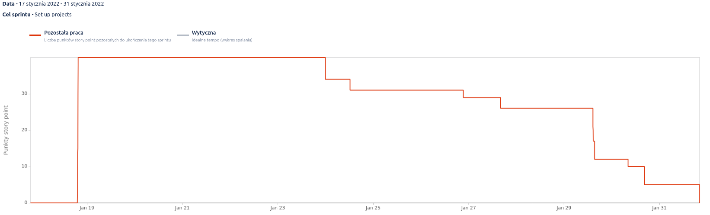
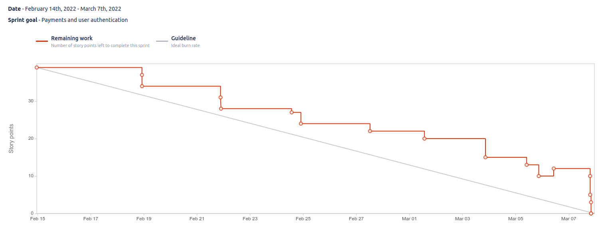
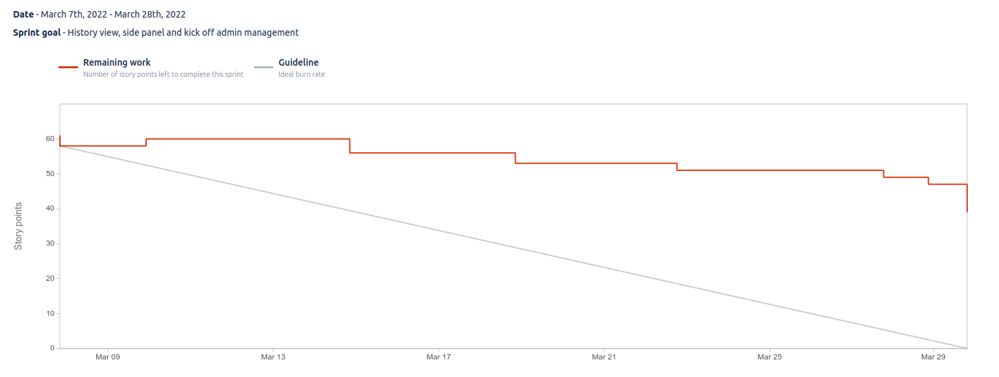

== Proces realizacji

=== Model kaskadowy (10.10.2021 - 16.01.2022)

Pierwszy etap realizacji rozpoczął się w październiku 2022, razem z przedmiotem "Projekt Zespołowy". Etap ten
polegał na zbieraniu wiedzy domenowej oraz wypracowaniu finalnego kształtu aplikacji. Metodyki zwinne
nie miały racji bytu z powodu braku zdefiniowanych celów do implementacji. Podczas wybierania
tematu projektu, nie istniała wizja działania projektu. Z tego powodu zdecydowano się na pracę w modelu kaskadowym.
W terminie do końca pierwszego semestru realizacji projektu celem było pozbycie się wszystkich niewiadomych przed
implementacją projektu. Zdecydowano się zakończyć, dopiero gdy zespół będzie miał wymaganą wiedzę i działający prototyp
finalnego rozwiązania. Większość zadań w tym okresie nie była śledzonych w żadnych narzędziu. Podstawą była
komunikacja poprzez program _Discord_ oraz spotkania z promotorem. Tylko cześć zadań dotyczących analizy
technologii była śledzona na tablicy Kanban.

==== Przebieg prac

Po pierwszym spotkaniu z promotorem zakres projektu obejmował tylko przyjmowanie płatności w sieci Lightning. Przez
następne półtora miesiąca zespół dokształcał się zarówno z dziedziny kryptowalut, jak i architektury oprogramowania.
Członkowie zespołu projektowego przeczytali wiele książek i artykułów, z których wiele zawartych jest w bibliografii.
W międzyczasie trwały prace nad samą wizją i kształtem projektu. Co dwa tygodnie zespół spotykał się z promotorem,
aby omówić wiele znaczących kwestii. Zajmowano się między innymi analizą konkurencyjnych rozwiązań. Do analizy
płatności skonfigurowano _BTCPayServer_, dzięki czemu można było samemu wypróbować płatności przez sieć Lightning.
Wraz ze wzrostem wiedzy domenowej odkryto, że zakres projektu obejmujący tylko płatności w sieci Lightning może
okazać się niewystarczający. Z tego powodu zdecydowano się na połączenie ówczesnego tematu z drugim projektem
opracowywanym w ramach projektu _Ingenious_, czyli zarządzania portfelem multisig oraz podpisywania transakcji
poprzez aplikację mobilną. Na podstawie tam wybranego tematu pracy kontynuowano naukę oraz wypracowywanie wymagań.
Zmieniały się one wielokrotnie, aż do końca listopada, gdy wizja projektu przybrała obecną formę. W międzyczasie
wybrano również większość używanych technologii i bibliotek.

Mając ustalony kształt finalnego rozwiązania oraz solidną wiedzę z zakresu kryptowalut, rozpoczęto przygotowywanie
dokumentacji wstępnej. Stworzono w tym czasie dokumenty KP, DZW oraz SWS. Znajdują się one w załącznikach pracy.
Opracowano również wstępne schematy blokowe dla niektórych procesów, a także diagram architektury systemu.
Dodatkowo w tym czasie stworzono repozytorium dla właściwej części projektu w serwisie _Github.

Po ukończeniu wymaganej dokumentacji rozpoczęło się opracowywanie ostatnich produktów dostarczanych tej fazy, czyli
prototypu oraz makiety interaktywnej. Za wykonanie makiety odpowiedzialny był Jan Pieczul, a Aleksander Konieczny
pełnił w procesie rolę konsultanta. Wówczas nie wykonano całej pracy związanej z makietą. Zawierała ona widoki
niezbędne do zrealizowania zakresu płatności w sieci Lightning. Reszta paneli była dodawana do makiety na bieżąco
podczas implementacji projektu. Zdecydowano się na ten krok ze względu na opóźnienia powstawania odpowiedniej części
po stronie prototypu, która również powstała już w czasie implementacji. Na początku prac nad prototypem zdecydowano
się na równy podział zadań pomiędzy członków zespołu.

.Lista zadań podczas implementacji prototypu.
[cols="1,7,3"]
|===
|Numer|Nazwa|Osoba przypisana
|1|Konfiguracja środowiska i stworzenie projektu|Aleksander Konieczny
|2|Implementacja interfejsu CLI|Aleksander Konieczny
|3|Wyświetlanie adresu węzła Lightning|Aleksander Konieczny
|4|Generowanie _invoice_ i informowanie jego opłaceniu|Jan Pieczul
|5|Sprawdzanie salda w portfelu Lightning i Bitcoin|Jan Pieczul
|6|Zamykanie kanałów i przesyłanie środków pomiędzy portfelami|Sebastian Lewandowski
|7|Wysyłanie transakcji w Bitcoinach (w pierwszej wersji tylko ze zwykłego portfela)|Sebastian Lewandowski
|===

Prototyp postanowiono opracować z użyciem tych samych technologii, co rzeczywistą implementację. Pozwoliło to na
późniejsze użycie części napisanego już kodu. Pierwszym, a jak się okazało najtrudniejszym zadaniem, była konfiguracja
projektu i środowiska. Utworzenie projektu odbyło się bez problemowo. Stworzony nowy projekt Java wykorzystujący
narzędzie do budowania _Maven_, a także dodano zależności _LightningJ_ oraz _BitcoinJ_. Problematyczna okazała się
konfiguracja węzłów sieci Bitcoin oraz Lightning. Zdecydowano się na użycie kontenerów _Docker_ oraz programu
orkiestrującego kontenery _docket-compose_. Stworzony został plik _docker-compose_ uruchamiający oba węzły
w osobnych kontenerach, skonfigurowane w taki sposób, aby węzeł Lightning mógł komunikować się z węzłem Bitcoin.
Pierwszym problemem była konfiguracja węzła Bitcoin w testowej sieci _testnet3_. Węzeł stale próbował
pobierać pełną historię głównej sieci, co zajmuje w dniu pisania tego rozdziału 418 GB na dysku <<blockchain_size>>.
Sieć testowa zajmuje tylko około 30 GB, a także środki do testowania można pozyskiwać za darmo, więc wybór sieci
testowej jest oczywisty. Po uporaniu się z konfiguracją sieci wystąpił problem z czasem pobieranie blockchaina.
Czas pobierania powinien wynosić około godzinę, w zależności od prędkości internetu. W przypadku prototypu
szacowany czas wynosił 10 godzin. Oba problemy z węzłem Bitcoin rozwiązano poprzez dostosowanie parametrów
konfiguracyjnych węzła. Następne napotkane problemy dotyczyły komunikacji obu węzłów, które również naprawiono
poprzez odpowiednią konfigurację, tym razem węzła Lightning. Ostatnim problemem było ustanowienie połączenia
biblioteki _LightningJ_ z węzłem sieci Lightning. Konfiguracja ta mocno różniła się do tej, która znajdowała się
w analizowanym rozwiązaniu _BTCPayServer_. Po serii prób i błędów udało się skonfigurować wszystkie komponenty
prototypu i można było przystąpić do realizacji zadań. Problemy te spowodowały spore opóźnienia, ponieważ
poprawna konfiguracja zajęła aż 2 tygodnie. Następnie opracowano interfejs CLI, pobieranie i wyświetlanie adresów,
generowanie i płacenie żądań płatności oraz sprawdzanie salda w poszczególnych elementach. Przy dwóch ostatnich
zadania pojawił się problem z dostępnością osoby odpowiedzialnej. Zadania od Sebastiana Lewandowskiego przejął
Aleksander Konieczny. Spowodowało to kolejne opóźnienia, przez co nie ukończono prototypu do końca grudnia, co było
początkowym planem. Prezentacja prototypu została już opisana w podrozdziale <<_prototyp,"Prototyp">>.

==== Podsumowanie

Finalnie prototyp, a także wszystkie inne cele związane z pierwszym etapem rozwoju osiągnięte zostały w połowie
stycznia 2022 roku. Po zaprezentowaniu osiągniętych rezultatów promotorowi postanowiono o przejściu do następnej fazy
projektu, czyli implementacji rozwiązania. Pomimo wielu przeciwności udało się zakończyć pierwszy etap dwa tygodnie
przed pierwotnie planowanym terminem, co jest sukcesem.

=== Sprint 1 (17.01.2022 - 31.01.2022)

Pierwszym sprintem jest tak zwany sprint zero. Polega on na przygotowaniu infrastruktury oraz środowiska, aby móc
rozpocząć implementację już w następnym sprincie. Głównym celem tej iteracji było utworzenie projektów oraz
konfiguracja środowisk, tak aby powstała niezbędna baza do rozbudowy aplikacji.

.Lista zadań w Sprincie pierwszym.
[cols="1,5,3,1,2"]
|===
|Klucz|Nazwa|Osoba przypisana|Story points|Status
|LP-29|Set up java project|Aleksander Konieczny|3|Ukończone
|LP-30|Set up react project|Jan Pieczul|3|Ukończone
|LP-33|Set up mobile app project|Jan Pieczul|5|Ukończone
|LP-43|Migrate documents to asciidoc|Aleksander Konieczny|2|Ukończone
|LP-35|Create makefile for documents|Aleksander Konieczny|5|Ukończone
|LP-34|Research CI available options|Jan Pieczul|-|Ukończone
|LP-36|Create pipeline for Java webservice|Aleksander Konieczny|2|Ukończone
|LP-37|Create pipeline for React webapp|Jan Pieczul|3|Ukończone
|LP-38|Create pipeline for mobile app|Jan Pieczul|5|Ukończone
|LP-39|Pipeline for documents|Aleksander Konieczny|5|Ukończone
|LP-40|Add git hooks|-|3|Anulowane
|LP-41|Prepare docker-compose for lnd and bitcoind|Aleksander Konieczny|3|Ukończone
|LP-44|Configure container for PostgreSQL|Jan Pieczul|1|Ukończone
|===

Sprint zaplanowano na 40 punktów historii. Żadne zadania nie zostały dodane w trakcie. Zostało anulowane jedno zadanie
dotyczące dodania własnych _hook'ów_ programu git. Miały one na celu blokowanie nadpisywania historii w głównej gałęzi
oraz wymuszanie określonej wiadomości _commit'ów_. Zadanie anulowano, możliwe okazało się osiągnięcie takich samych
celów z pomocą konfiguracji repozytorium w serwisie _Github_.

==== Przebieg prac

Pierwszymi trzema zadaniami było stworzenie projektów odpowiednio dla każdego z komponentów systemu. Stworzono
folder zawierający serwer, wykorzystujący Javę 17, framework Spring oraz narzędzie budowania Maven. Drugim komponentem
jest komponent aplikacji internetowej. Zainicjowano nowy projekt bazujący na szablonie React, wykorzystujący język
programowania TypeScript. W ramach tego zadania dodano również narzędzia do analizy i formatowania kodu Eslint oraz
Prettier. Cała aplikacja budowana jest przy pomocy narzędzi _Yarn_ oraz _Vite_. Ostatnim komponentem jest aplikacja
mobilna, wykorzystująca ponownie TypeScript oraz mobilną wersję _React'a_, czyli _React Native_. Całość była uruchamiana
przez zestaw narzędzi _Expo_. Zadanie to otrzymało więcej punktów od pozostałych dwóch, ponieważ zespół nie posiadał
wcześniejszego doświadczenia z aplikacjami mobilnymi. Dodatkowe dwa punkty zostały przydzielone w celu zdobyciu
odpowiedniej wiedzy.

Następne dwa zadania dotyczyło folderu repozytorium zawierającego wszystkie dokumenty zapisane w zwykłych plikach
tekstowych. Członkowie zespołu uznali, że najlepszym rozwiązaniem będzie stworzenie całej dokumentacji w Asciidoc i
przechowywanie jej w głównym repozytorium projektu. Pierwsze zadanie dotyczyło konwersji dokumentów z formatu programu
Microsoft Word na format Asciidoc. Dzięki temu zyskano możliwość nie tylko przeglądania historii dokumentów, ale także
łatwiejszą kontrolę i wyłapywanie błędów po ich edycji dzięki systemowi kontroli wersji. Przeniesione zostały dokumenty
KP, DZW oraz SWS. Pojawił się wtedy problem automatycznego tworzenia plików w formacie _pdf. Przy większej liczbie
plików ich budowanie stawało się czasochłonne i niewygodne, wiec pojawiła się potrzeba stworzenia _makefile_ do
automatycznego budowanie wszystkich dokumentów. Dzięki temu wystarczy tylko wywołać komendę _make_ w terminalu i każdy
dokument zostaje zbudowany w formie pliku _html_ oraz _pdf_. Plik ten powstał w taki sposób, abu umożliwić późniejsze
dodawanie nowych dokumentów do folderu bez potrzeby modyfikacji pliku budującego.

Kolejne cztery zadania w sprincie dotyczy procesu automatycznego budowania aplikacji. Pierwszym krokiem było zbadanie
dostępnych rozwiązań pasujących do używanych już technologii. Analizie zostały poddane głównie _Github Actions_
oraz _Travis_. Analiza wykazała, że najlepszym rozwiązaniem będzie _Github Actions_, ponieważ jest już ono zintegrowane
z serwisem _Github_ oraz jest darmowe. _Travis_ posiada limit darmowych uruchomień o wiele niższy niż w przypadku
wybranego rozwiązania i istniało ryzyko jego osiągnięcia. Projekt nie posiada budżetu, więc było to bardzo ważne
kryterium. Po dokonaniu wyboru technologi rozpoczęto tworzenie konfiguracji dla serwera i aplikacji webowej.
W obu folderach zawierających kod źródłowy dodano automatyczne budowanie aplikacji, uruchomianie testów
automatycznych, a także sprawdzanie stylu kodu. W tym sprincie nie uwzględniono automatyzacji budowania dla aplikacji
mobilnej ze względu na potrzebne dodatkowe nakłady pracy przy zdobywaniu wiedzy. Zadanie to zostało uwzględnione w
następnym sprincie. W przypadku folderu z dokumentami dodano automatyczne budowanie oraz serie walidacji dla plików.
Sprawdzane są między innymi długość linijek, nadmiarowe spacje czy też poprawne zakończenie linijek.

Ostatnie dwa zadania dotyczyły utworzenia plików docker-compose zawierających kontenery wymagane do tworzenia
oprogramowania. Pierwsze zadanie polegało na konfiguracji węzłów Lightning oraz Bitcoin. Plik ten został już stworzony
w prototypie, więc zadanie sprowadziło się do przekopiowania go oraz zmiany ustawień obu węzłów. Dodatkowo
konfiguracja została rozdzielona na kilka plików w taki sposób, aby można było uruchomić węzły w różnych sieciach
Bitcoina. Stworzone zostały konfiguracje dla sieci _regtest_ oraz _testnet_. Nie razie nie ma planów uruchamiania
projektu w sieci głównej _mainnet_, więc konfiguracja ta została pominięta. Drugie zadanie polegało na skonfigurowaniu
kontenera zawierającego bazę danych _PostgreSQL_ w plikach _docker-compose_.

==== Podsumowanie

Wszystkie planowane zadania udało się zamknąć, więc cel Sprintu został osiągnięty. Wstępnie w Sprincie znalazło się 13
zadań wycenionych na 40 punktów. Wykonanych zostało 12 z nich, ponieważ jedno zadanie zostało anulowane w trakcie
iteracji. Przełożyło się na uzyskanie 37 punktów historii na koniec pierwszej iteracji.

.Wykres spalania sprintu pierwszego.

Zespołowi udało się poprawnie skonfigurować większość części projektu potrzebnych do właściwej implementacji. Udało
się uzyskać podstawę, z której rozpoczęte zostaje realizowanie funkcjonalności w następnym sprincie.

=== Sprint 2 (31.01.2022 - 14.02.2022)

Jest to pierwszy sprint, w którym implementowano właściwe funkcjonalności aplikacji. Celem było dostarczenie modułu
płatności w pierwszej działającej wersji oraz dodanie podstawowych komponentów aplikacji internetowej.
Zostało również kilka zadań związanych z konfiguracją projektu. Zaplanowano również rozpoczęcie prac nad dokumentem
pracy dyplomowej.

.Lista zadań w Sprincie drugim.
[cols="1,5,3,1,2"]
|===
|Klucz|Nazwa|Osoba przypisana|Story points|Status
|LP-38|Create pipeline for mobile app|Jan Pieczul|5|Ukończone
|LP-48|Run pipelines in PR when there are changes|Aleksander Konieczny|2|Ukończone
|LP-61|Connect backend with database|Aleksander Konieczny|1|Ukończone
|LP-52|Set up document and write introduction|Aleksander Konieczny|3|Ukończone
|LP-53|Write 'Problem description' chapter|Aleksander Konieczny|3|Ukończone
|LP-55|Create landing page|Jan Pieczul|2|Ukończone
|LP-56|Update quick buy page mockup|Jan Pieczul|3|Ukończone
|LP-57|Create quick buy page|Jan Pieczul|3|Ukończone
|LP-58|Create service that generates tokens|Aleksander Konieczny|3|Ukończone
|LP-59|Create invoice service|Aleksander Konieczny|3|Ukończone
|LP-60|Implement payment process|Aleksander Konieczny|5|Ukończone
|LP-67|Implement websocket endpoint for payment processing|Aleksander Konieczny|5|Ukończone
|LP-62|Investigate and implement multisig wallet in prototype|Sebastian Lewandowski|-|Nieukończone
|===

Sprint zaplanowano na 37 punkty historii. W trakcie trwania nie dodano żadnych nowych zadań, a także nie anulowano.
Jedyne modyfikacje dotyczyły zmiany kryteriów akceptacji niektórych z zadań.

==== Przebieg prac

Pierwsze trzy zadania były pozostałością po poprzednim sprincie, ponieważ dotyczą one konfiguracji repozytorium
projektu. Należało stworzyć konfigurację procesu automatycznego budowania dla aplikacji mobilnej. Tak samo, jak w
przypadku dwóch poprzednich zadań z poprzedniego sprintu, wymagano od procesu automatycznego budowania aplikacji,
uruchamiania testów jednostkowych oraz sprawdzania stylu kodu źródłowego. W pierwszej wersji wszystkich konfiguracji
proces uruchamiał się tylko przy tworzeniu prośby o dołączenie kodu w serwisie Github. Spowodowało to, że przy
późniejszych zmianach kodu proces nie był uruchamiany, a co za tym idzie, nie były przykładowo sprawdzane testy
jednostkowe. Z tego powodu zdecydowano się na modyfikacje wszystkich konfiguracji, aby proces uruchamiał się
przy każdej zmianie kodu w utworzonej już prośbie o dołączenie. Ostatnim z tych zadań było konfiguracja połączenia z
bazą danych po stronie serwera. Wykonano niezbędną konfigurację połączenia oraz ustawień _Hibernate_, tak aby
tabele bazy danych były automatycznie tworzone na podstawie odpowiadających im obiektów modelowych aplikacji.

Następne zadania dotyczyły dokumentacji pracy dyplomowej. Należało rozpocząć pracę od utworzenia głównego pliku
tekstowego zawierającego odniesienia do przyszłych rozdziałów. Zostały napisane także dwa pierwsze rozdziały, czyli
<<_wstep,"Wstęp">> oraz <<_omowienie_problemu,"Omówienie problemu">>.

Kolejne trzy zadania dotyczyły prac nad aplikacją internetową. Pierwszym krokiem było stworzenie strony głównej
aplikacji. Zawiera ona odniesienia do stron logowania, rejestracji oraz płatności dla niezalogowanych użytkowników.
Kolejne dwa zadania dotyczą ekranu płatności. W pierwszej planowej wersji miał to być jeden ekran, na którym będą
wyświetlane wszystkie dane. W trakcie planowania iteracji zdecydowano się na zmianę podejścia do tego ekranu.
Wzorem innym popularnych sklepów internetowych, funkcjonalność rozbito na kilka ekranów. Miały one reprezentować
wstępny formularz, ekran płatności oraz podsumowanie zakupu. Zmiana ta wymagała aktualizacji makiety interaktywnej,
aby osoba odpowiedzialna miała już gotowy do zaimplementowania styl i układ komponentów. Zadanie poskutkowało
dodaniem wielu nowych zadań polegających na stworzeniu stylów dla każdego komponentu. Aby nie zmieniać zakresu
iteracji, zadania te zdecydowano się zaimplementować w następnych iteracjach. A ramach zadania LP-61 postanowiono
stworzyć cały mechanizm karuzeli ekranów. Utworzone zostały stosowne podstrony, a także została zaimplementowana część
logiki odpowiedzialnej za przechodzenie pomiędzy nimi. Resztę funkcjonalności zdecydowano się rozdzielić na zadania
dedykowane osobno każdej podstronie.

W sprincie znajdowała się również seria zadań dotycząca implementacji części serwerowej płatności. Zadania te
dotyczyły implementacji procesu płatności. Pierwsze dwa zadnia obejmowały stworzenie odpowiednich serwisów.
Pierwszy z nich zajmować się miał generowaniem jednorazowych tokenów. Drugim serwis odpowiedzialny jest za
generowanie _invoice_ przy użyciu węzła sieci Lightning oraz zwracania żądania zapłaty. Było to proste zadanie,
gdyż ta część nie różniła się mocno od kodu stworzonego na potrzeby prototypu. Następne zadanie polegało na
implementacji serwerowej części procesu z wyłączeniem zwracania tokenów po zakupie. Stworzone zostały dodatkowe serwisy,
tworzący adres węzła sieci Lightning oraz odpowiedzialny za obsługę repozytorium bazy danych. Dodane zostały dwa
punkty końcowe API, jeden zwracający aktualne dane potrzebne do utworzenie płatności, takie jak cena czy adres węzła,
a drugi pozwalający na stworzenie nowej płatności. Dodatkowo dodano klasę obserwującą na przychodzące zmiany statusu
_invoice_ w węźle Sieci Lightning. Przy opłaceniu transakcji, w konsoli wyświetlana była odpowiednia wiadomość. Kolejne
zadanie dotyczyło dokończenia tego procesu, czyli zwracania tokenów przez kanał Websocket przy opłaceniu żądania
zapłaty. W tym celu stworzono odpowiednią konfigurację dla protokołu Websocket, a następnie dodano kontroler wysyłający
wiadomości na odpowiedni kanał. Generowanie oraz wysyłanie tokenów uruchamiane jest poprzez informację o opłaconym
rachunków pochodzącą z węzła Lightning. Tym sposobem zaimplementowano pierwszą działającą obsługę płatności w aplikacji.

Ostatnie zadanie w iteracji było typu _spike_. Jest to zadanie wydzielone z zakresu iteracji i nie ma przydzielonych
punktów historii. Polega na zbadaniu zagadnienia oraz zdobyciu wiedzy potrzebnej do wykonania zadania. W tym przypadku
należało zbadać wykonywanie z adresu multisig. Nie zostało to wykonane w pierwszym etapie realizacji projektu,
ponieważ plan zakładał implementacje tej funkcjonalności dopiero za kilka miesięcy. Niestety tego zadania nie udało
się ukończyć w tej iteracji.

==== Podsumowanie

Większość celów tej iteracji została osiągnięta. Udało się dokończyć konfigurację projektu, stworzono pierwszą wersję
obsługi płatności po stronie serwera. Nie udało się zrealizować płatności po stronie aplikacji internetowej, ponieważ
w trakcie sprintu zdecydowano się dodać trzy nowe zadania polegające na implementacji każdego z ekranów płatności.
Zrealizowano natomiast stronę główną oraz szablon dla karuzeli ekranów w procesie płatności. Nie udało się zrealizować
zadania polegającego na zbadaniu płatności multisig oraz dodania ich do prototypu. Zadanie to zostało przeniesione
do następnej iteracji. Finalnie udało się ukończyć wszystkie 37 punktów historii.footnote:[Niestety nie udało
się tym razem pobrać diagramu spalania dla tego sprintu przez złe ustawienia oprogramowania Jira] Pomimo
nieosiągnięcia wszystkich celów sprintu, udało się poczynić duże postępy w implementacji procesu płatności.

=== Sprint 3 (14.02.2022 - 07.03.2022)

Założeniem na tę iterację było dokończenie płatności. Zaplanowano również prace nad procesem uwierzytelniania i
autoryzacji, łącznie z integracją jej z procesem płatności.

.Lista zadań w Sprincie trzecim.
[cols="1,5,3,1,2"]
|===
|Klucz|Nazwa|Osoba przypisana|Story points|Status
|LP-64|Polish form carousel view|Jan Pieczul|3|Ukończone
|LP-65|Polish checkout carousel view|Jan Pieczul|5|Nieukończone
|LP-66|Polish payment summary view|Jan Pieczul|2|Nieukończone
|LP-70|Create services for JWT|Aleksander Konieczny|2|Ukończone
|LP-71|Integrate JWT with spring security|Aleksander Konieczny|3|Ukończone
|LP-72|Create endpoint for JWT renewal|Jan Pieczul|2|Ukończone
|LP-73|Create endpoint for logging in|Aleksander Konieczny|3|Ukończone
|LP-74|Create endpoint for user registration|Aleksander Konieczny|3|Ukończone
|LP-78|Integrate authorization|Jan Pieczul|3|Ukończone
|LP-76|Create login page|Jan Pieczul|2|Ukończone
|LP-77|Create registration page|Aleksander Konieczny|2|Ukończone
|LP-75|Handle temporary users|Aleksander Konieczny|5|Ukończone
|LP-84|Integrate user authorization with payments|Aleksander Konieczny|3|Ukończone
|LP-88|Automatically change expired payments status|Aleksander Konieczny|2|Ukończone
|LP-69|Set up swagger|Jan Pieczul|1|Ukończone
|LP-62|Investigate and implement multisig wallet in prototype|Sebastian Lewandowski|-|Nieukończone
|===

Iterację początkowo zaplanowano na 15 zadań o łącznej wartości 38 punktów. Jedno zadanie było nieukończone w poprzednim
sprincie, więc zostało przeniesione dalej. Dodatkowo w trakcie sprintu dodano zadanie LP-88, warte 2 punkty historii.
Finalnie zakres planowanych prac wyniósł 16 zadań oraz 40 punktów.

==== Przebieg prac

Pierwszymi zadaniami są implementacje wszystkich trzech ekranów procesu płatności, czyli formularz, płatność oraz
podsumowanie. Niestety udało się zrealizować tylko zadanie dotyczące formularza płatności. Na tym etapie prac użytkownik
mógł wypełnić formularz oraz go wysłać, natomiast późniejsze przekierowanie prowadziło na pustą stronę. Zadania
LP-65 oraz LP-66 zostały później przeniesione do następnego sprintu.

Następna grupa zadań dotyczyła implementacji uwierzytelniania przy pomocy tokena JWT. Pierwsze zadanie polegało
na stworzeniu serwisu, który odpowiada za generowanie, walidację oraz pobieranie danych tokena. Następnie token JWT
został zintegrowany z aplikacją przy pomocy _Spring Security_. Stworzono do tego odpowiednią konfigurację oraz filtr
żądań HTTP kontrolujący token. Następnie zajęto się API HTTP odpowiedzialnym za cały proces. Stworzono punkty
końcowe pozwalające na logowanie i rejestrację użytkowników. Dodano także możliwość odświeżenia tokena, gdyż ustawiono
jego ważność na 15 min. Aby sesja użytkownika w aplikacji internetowej nie wygasła w trakcie korzystania z aplikacji,
mechanizm ten musiał zostać zaimplementowany.

Po zakończeniu prac nad częścią serwerową uwierzytelniania rozpoczęto integrację w aplikacji internetowej. Stworzone
zostały strony logowania oraz rejestracji, a także zintegrowano istniejący już kod z systemem autoryzacji. Przy
logowaniu zwracana jest rola użytkownika, która wskazuje, do jakich podstron użytkownik ma dostęp z otrzymanym tokenem.
Integracja okazała się dosyć problematyczna, ponieważ modyfikacji wymagała spora ilość napisanego już kodu. Udało się
zadanie ukończyć, dzięki czemu dostęp do płatności był tylko dla zalogowanych użytkowników. Użytkownicy niezalogowani
mieli dostęp do strony głównej, rejestracji oraz logowania. W tamtym momencie istniała tylko jedna rola użytkownika,
czyli zwykły użytkownik.

Kolejnym zadaniem było opracowanie rozwiązania pozwalającego na obsłudze płatności od niezalogowanych użytkowników
po stronie serwera. Było to problematyczne, ponieważ chciano zapisywać wszystkie płatności w bazie danych. Wymagane
to było do przeglądania historii przed administratorów w przyszłości oraz do przesłania tokenów konkretnej osobie.
Zdecydowano się wtedy na stworzenie hierarchii użytkowników z wykorzystaniem klasy abstrakcyjnej _User_. Dzięki
temu udało się wydzielić klasę dla niezalogowanego użytkownika i dwie klasy dla zalogowanych użytkowników. Dodatkowo
stworzono generyczne repozytoria dla różnych typów użytkowników, a także serwisy odpowiedzialne za zarządzanie nimi.
Na koniec dodano punkt końcowy HTTP, pozwalający na uzyskanie tokena JWT bez wcześniejszego logowania. Token ten ma
uprawienia tylko do procesu płatności (poza punktami ogólnodostępnymi). Szczegóły tego, jak i innych rozwiązań znajduje
się w rozdziale <<_opis_rozwiazania,"Opis rozwiązania">>.

Następnie należało zintegrować proces płatności z uwierzytelnianiem. Punkty końcowe zostały odpowiednio zabezpieczone,
a encje płatności powiązano z użytkownikami. Dzięki temu każda płatność ma przypisanego użytkownika, co pozwala na
późniejszą identyfikację. Drugim zadaniem powiązanym z płatnościami było stworzenie nowego wątku podczas tworzenia
płatności, który w razie nieopłacenia przez 15 minut żądania zapłaty zmieni automatycznie jej status. Zadanie zostało
dodane w trakcie sprintu, ponieważ pojawiły się problemy podczas testowania. Aplikacja internetowa nie pozwalała wówczas
na tworzenie nowej płatności, kiedy poprzednia była aktywna. Brak tej funkcjonalności skutkował utkwieniem płatność
w staniu oczekującym, dlatego zdecydowano się na jak najszybsze naprawienie tego błędu.

Zadanie LP-69 dotyczy integracji serwera z biblioteką _Swagger_, pozwalającą na automatyczne generowanie dokumentacji
dla API HTTP. Zdecydowano się na dodanie jej dla poprawienia komunikacji przy integracji backend'u z frontend'em.
Całe API było automatycznie udokumentowane wraz z przykładami użycia, co ułatwiało implementację aplikacji internetowej.

Ostatnim zadanie uwzględnionym w tym sprincie jest LP-62. Zadanie to nie zostało ukończone w poprzednim sprincie.
Niestety jego realizacja ponownie się nie powiodła, więc zespół zmuszony został na przeniesienie go do następnego
sprintu.

==== Podsumowanie

Aby spróbować ukończyć cały zakres prac tej iteracji, zdecydowano się na zmianę jej długości o tydzień.
Zespołowi udało się dodać do aplikacji uwierzytelnianie, a także ją poprawnie zabezpieczyć. Proces ten został również
z integrowany z płatnościami, które zostały dokończone po stronie serwera. Integracja uwierzytelniania powiodła się
również po stronie aplikacji internetowej, niestety nie udało się ukończyć procesu płatności. Zbadanie płatności
multisig niestety również zakończyło się porażką, a zadanie przeniesione zostało ponownie do następnego sprintu.

.Wykres spalania sprintu trzeciego.

Sprint rozpoczęto z 15 zadaniami i 38 punktami historii. W trakcie sprintu dodali jedno zadanie warte 2 punktu.
Nie udało się ukończyć trzech zadań wartych 7 punktów. Finalnie spring udało się ukończyć zakres prac warty 33 punkty
w postaci 13 zadań. Nie jest to wciąż zły wynik. Udało się zamknąć większość zadań, a prawie wszystkie cele zostały
osiągnięte. Zadania polegające na dokończeniu karuzeli płatności oraz zbadanie płatności multisig zostały przeniesione
do następnego sprintu.

Dodatkowo w tym sprincie podjęto decyzję o zmianie ilości wymaganych zatwierdzeń zmian w procesie oceny kodu.
Dotychczasowo wymagano zgody od dwóch osób. Częsta nieobecność członków zespołu znacząco wydłużało ten proces, dlatego
zdecydowano się zmniejszyć ten limit do jednej osoby.

=== Sprint 4 (07.03.2022 - 28.03.2022)

W tej iteracji planowano dodać przeglądanie historii płatności przez użytkowników oraz rozpocząć pracę nad kontami
administratorów i ich zarządzaniem. W ramach dodatkowych prac zaplanowano również poprawki do dokumentacji oraz
dokończenie procesu płatności, co było początkowo zaplanowane na poprzedni sprint.

.Lista zadań w sprincie czwartego.
[cols="1,5,3,1,2"]
|===
|Klucz|Nazwa|Osoba przypisana|Story points|Status
|LP-65|Polish checkout carousel view|Jan Pieczul|5|Ukończone
|LP-66|Polish payment summary view|Jan Pieczul|2|Ukończone
|LP-93|Secure and authenticate ws connections|Aleksander Konieczny|2|Ukończone
|LP-81|Create user side panel|Aleksander Konieczny|2|Ukończone
|LP-82|Add endpoint for querying user payments|Aleksander Konieczny|2|Ukończone
|LP-83|Create history panel|Aleksander Konieczny|3|Ukończone
|LP-90|Create endpoints for admin creation and querying|Aleksander Konieczny|2|Ukończone
|LP-89|Add root admin at server startup|Aleksander Konieczny|2|Ukończone
|LP-91|Create panel for admin management|Jan Pieczul|3|Nieukończone
|LP-92|Add admin creation form|Jan Pieczul|2|Nieukończone
|LP-63|Update DZW after review|Aleksander Konieczny|1|Ukończone
|LP-95|Research E2E tests|Aleksander Konieczny|-|Ukończone
|LP-62|Investigate and implement multisig wallet in prototype|Sebastian Lewandowski|-|Ukończone
|===

Zaplanowane zostało 11 zadań, a zakres ich prac oceniono na 24 punkty historii. Trzy z tych zadań nie zostały ukończone
w poprzednim sprincie i zostały przeniesione dalej. W trakcie sprintu dodano kolejne 2 zadania, jedno polegające
na zbadaniu technologii, a drugie techniczne warte 2 punktu historii. Finalnie planowany zakres prac objął 13 zadań
o wartości 26 punktów. Jest to zdecydowanie mniej niż w poprzednich iteracjach. Nie wszystkie zadania były dostarczane
na czas, więc bazując na wynikach poprzednich sprintów, zmniejszono odpowiednio zakres prac.

==== Przebieg prac

Priorytetem prac z powodów opóźnienia było zdecydowanie ukończenie procesu płatności. Dwa zadania LP-65 oraz LP-66
polegały na dokończeniu odpowiadających im ekranów karuzeli płatności. Podczas implementacji zadania dotyczącego
ekranu podsumowania odkryto, że po stronie serwera nie zostały zabezpieczenia kanałów Websocket. Spowodowało to, że
domyślne ustawienia blokowały dostęp do kanałów. Część płatności aplikacji była zaimplementowana przed
uwierzytelnianiem, przez co przeoczone ten aspekt wcześniej. Z tego powodu do sprintu dodano zadanie LP-93, polegające
na integracji kanałów Websocket z autoryzacją. Prace rozpoczęte zostały natychmiast, aczkolwiek spowodowały kolejne
opóźnienia. Na szczęście udało się ukończyć cały proces płatności w tej iteracji.

Kolejne zadanie dotyczyło rozwoju aplikacji internetowej. Aby dodać następne panele dostępne dla użytkowników, należało
zaimplementować komponent gromadzący linki do nich. Zostało dodane boczne menu zawierające linki. Napotkany został
problem z wyświetlaniem aktualnie stworzonych już komponentów. Musiano zmodyfikować kod _CSS_ odpowiadający za
pozycjonowanie elementów prawie na całej stronie internetowej. Był to większy wysiłek, niż początkowo zaplanowano, ale
pozwoliło to na zbudowanie solidnego szablonu do dodawania następnych podstron.

Zrealizowanie menu bocznego pozwoliło na kontynuację rozwoju aplikacji. Rozpoczęto implementację historii płatności.
Najpierw dodano tę funkcjonalność do części serwerowe. Rozwiązanie zaimplementowano w taki sposób, aby w przyszłości
istniała możliwość sortowania oraz wyszukiwania płatności po wszystkich dostępnych polach. Następnie został dodany
ekran wyświetlający płatności w tabeli, włącznie z paginacją.

Następna seria zadań dotyczy kont administratorów. Do tego momentu administrator nie różnił się niczym od zwykłego
użytkownika. Nie można było go również stworzyć. Implementację rozpoczęto od stworzenia API pozwalającego na dodawanie
oraz pobieranie administratorów. Zgodnie z wymaganiami, zarządzanie administratorami miało odbywać się z poziomu panela
administratora. Aby umożliwić wstępną konfigurację serwera i dodanie administratorów, postanowiono automatycznie
tworzyć administratora z predefiniowanymi danymi logowania. Jest to rozwiązanie znane z wielu systemów istniejących już
na rynku, takich jak _Jenkins_ czy _Sonarqube_. W tej wersji aplikacji próba dodania administratora odbywała się
przy każdym uruchomieniu aplikacji. Oczywiście adres email jest polem unikatowym, więc zawsze był stworzony maksymalnie
jeden administrator domyślny. Planowano również dodać część aplikacji internetowej odpowiedzialnej za zarządzanie
administratorami. W sprincie znalazły się zadania LP-91, dodające ekran z tabelą zawierającą administratorów, oraz
LP-92, implementujące formularz ich dodawania. Niestety obu zadań nie udało się ukończyć w tej iteracji.

Ostatnie trzy zadania dotyczyły zadań mniejszej wagi jak poprawek w dokumentacji oraz badania technologii. Pierwszym
zadaniem było naniesienie poprawek do dokumentu DZW zgłoszonych przez promotora. Następne zadanie zostało dodane
w trakcie sprintu. Dotyczyło ono zbadania implementacji testów E2E obejmujących serwer oraz aplikację mobilną.
Zadanie to zostało dodane dopiero teraz, ponieważ początkowo tego typu testy nie były planowane. Jak rezultat tego
zadania zdecydowano, że najlepiej będzie je zrealizować przy pomocy oprogramowania _Cypress_. Scenariusze testowe
miały natomiast zostać wykonane z pomocą biblioteki _Cucumber_ oraz specjalnego języka _Gherkin_. Te narzędzia
pozwalają na pisanie bardzo czytelnych scenariuszy zgodnie z procesem wytwórczym _BDD_. W tym sprincie udało się także
nareszcie ukończyć badanie płatności z adresu multisig. Zmiany zostały naniesione w prototypie. Niestety badania te
okazały się niewystarczające i zdecydowano się na utworzenie kolejnego zadania badającego to zagadnienie.

==== Podsumowanie

Udało się osiągnąć część początkowo planowanych celów. Zaimplementowana została historia płatności oraz część serwerowa
zarządzania administratorami. Ukończono również proces płatności, a także zdobyto wiedzę pozwalającą na implementację
adresów multisig i testów E2E. Zaimplementowanie komponentów zarządzania administratorami w aplikacji internetowej
zakończyło się niepowodzeniem.

.Wykres spalania sprintu czwartego.

Podczas tworzenia wykresu wdarł się błąd, przez który wszystkie zadania z poprzedniego sprintu znalazły się w tym
sprincie. Z tego powodu od wartości na wykresie należy odjąć około 30 punktów historii.

Ukończone zostało 11 zadań, czyli tyle ile zaplanowano. Niestety wartość dostarczonych punktów historii wyniosła 19,
czyli o 5 mniej niż zakładano. Wynikło to z przeniesienia dwóch zadań do następnego sprintu, a także dodania dwóch
innych zadań w trakcie iteracji. Niestety dostarczono mniej funkcjonalności względem planu, a opóźnienie w realizacji
projektu cały czas rosło.

=== Sprint 5 (28.03.2022 - 11.04.2022)

==== Przebieg prac

==== Podsumowanie

=== Sprint 6 (11.04.2022 - 25.04.2022)

==== Przebieg prac

==== Podsumowanie

=== Sprint 7 (25.04.2022 - 16.05.2022)

==== Przebieg prac

==== Podsumowanie

=== Sprint 8 (16.05.2022 - 30.05.2022)

==== Przebieg prac

==== Podsumowanie

=== Sprint 9 (30.05.2022 - 13.06.2022)

==== Przebieg prac

==== Podsumowanie

=== Sprint 10 (13.06.2022 - 27.06.2022)

==== Przebieg prac

==== Podsumowanie

=== Sprint 11 (27.06.2022 - 11.07.2022)

==== Przebieg prac

==== Podsumowanie

=== Sprint 12 (11.07.2022 - 01.08.2022)

==== Przebieg prac

==== Podsumowanie

=== Sprint 13 (01.08.2022 - 15.08.2022)

==== Przebieg prac

==== Podsumowanie

=== Sprint 14 (15.08.2022 - 29.08.2022)

==== Przebieg prac

==== Podsumowanie
