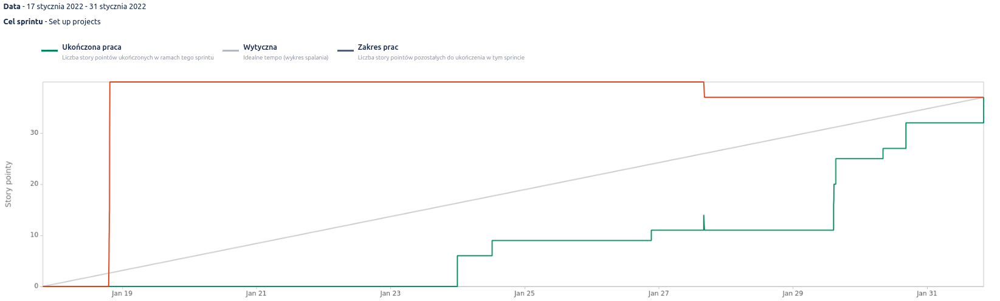
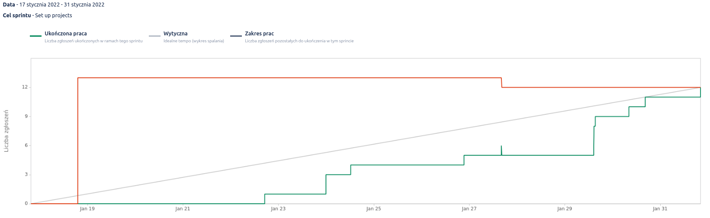
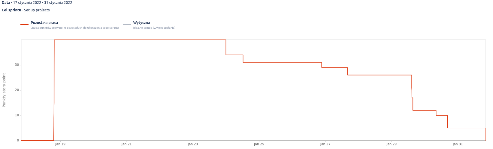
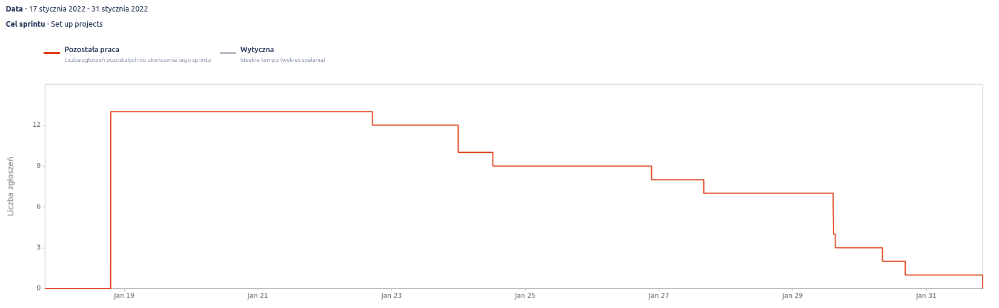

== Proces realizacji

=== Model kaskadowy

W związku ze zbyt małą wiedzą członków zespołu na temat kryptowalut zdecydowano, aby pracę nad projektem rozpocząć w modelu kaskadowym. +
Na początku, w celu zrozumienia tematu i poszerzenia swojej wiedzy każda z osób miała za zadanie zapoznanie się z publikacjami odnośnie bitcoin <<btcbook>> oraz Lightning Network <<lnbook>>. +
Kolejnym etapem było poszukiwanie bibliotek, które najlepiej pasowałyby do wymagań projektu. Przyjrzano się również konkurencyjnym rozwiązaniom istniejącym już na rynku, aby upewnić się, że żadnego z nich nie można wykorzystać przy implementacji aplikacji.
Finalnie, członkowie zespołu utwierdzili się w przekonaniu, że na rynku nie istnieje rozwiązanie spełniające w pełni wymagania projektu oraz wyselekcjonowali biblioteki BitcoinJ i LightningJ, o których można dowiedzieć się więcej w punkcie <<_uzyte_technologie,"Użyte technologie i biblioteki">>. +
Aby zwizualizować to, jak powinna wyglądać aplikacja, zespół projektowy stworzył makietę interaktywną, która została opisana w punkcie <<_makieta_interaktywna,"Makieta interaktywna">>. +
Ostatnim krokiem, podjętym przed rozpoczęciem implementacji rozwiązania było stworzenie prototypu, który został opisany w punkcie <<#_prototyp,"Prototyp">>. +
Oprócz tego, zespół sporządził niezbędne dokumenty, takie jak: dokument założeń wstępnych czy też specyfikacja wymagań systemowych.

Wszelkie pytania, niejasności, a także postęp prac były na bieżąco przedstawiane promotorowi- doktorowi Tadeuszowi Puźniakowskiemu.
Dzięki podjętym krokom wyklarowała się finalna wizja aplikacji, dlatego zespół zdecydował o przejściu do metodyki SCRUM i rozpoczęciu pracy w dwutygodniowych Sprintach.

=== Sprint 1

==== Cel

Głównym celem tego Sprintu było utworzenie projektów oraz konfiguracja środowisk, tak aby powstała niezbędna baza do rozbudowy aplikacji.

==== Zadania

include::../sections/sprints/first_sprint_tab.adoc[]

==== Przebieg pracy

include::../sections/sprints/first_sprint_desc.adoc[]

==== Podsumowanie

Cel Sprintu został osiągnięty, ponieważ wszystkie zaplanowane zadania udało się ukończyć. +
Wstępnie w Sprincie znalazło się 13 zadań wycenionych na 40 story pointów. Wykonanych zostało 12 z nich(1 zadanie usunięte), co złożyło się na uzyskanie 37 story pointów na koniec pierwszej iteracji. Na poniższych wykresach można zauważyć, jak prezentował się postęp prac w Sprincie 1.

.Raport Burnup(story pointy)

.Raport Burnup(liczba zgłoszeń)

.Wykres spalania sprintu(story pointy)

.Wykres spalania sprintu(story pointy)

=== Sprint 2
==== Cel
==== Zadania
==== Przebieg pracy
==== Testy??

=== Sprint 3

=== Sprint 4

=== Sprint 5

=== Sprint 6

=== Sprint 7

=== Sprint 8

=== Sprint 9

=== Sprint 10

=== Sprint 11
