[#_testy]
== Testy
Aby już na wczesnym etapie wykrywać powstałe błędy, zespół zdecydował o tworzeniu testów podczas pisania poszczególnych
elementów systemu. Dzięki takiemu podejściu udało się uniknąć wielu błędów w trakcie rozbudowy aplikacji. Ułatwiło to
również dokonywanie _code review_, ponieważ osoba sprawdzająca mogła w łatwy sposób zweryfikować czy dana funkcjonalność
działa w taki sposób, w jaki została zaplanowana.
Podczas implementacji należało pamiętać również o tym, że tworzony kod musi być testowalny, w konsekwencji czego był on
czytelniejszy i prostszy do zrozumienia.

W celu zautomatyzowania procesu uruchamiania testów, członkowie zespołu zdecydowali się na użycie narzędzia
_ciągłej integracji_ Github Actions.
Wystarczyło tylko stworzyć odpowiedni skrypt _YAML_, który czuwał nad tym, aby każdorazowo uruchomić testy po
wypchnięciu zmian do repozytorium.
Katalog _workflows_ z plikami zaprezentowano na rysunku 110.

.Zawartość folderu workflows z plikami YAML.
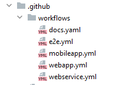

We fragmencie kodu 159 można zauważyć listę kroków wykonywanych każdorazowo po wypchnięciu zmian do części
backendowej aplikacji. Testy w tym wypadku uruchamiane są przez narzędzie _Maven_.

.Fragment pliku webservice.yml prezentujący listę wykonywanych kroków
[source, yaml]
----
include::../../../.github/workflows/webservice.yml[lines=17..37]
----

=== Testy jednostkowe i integracyjne

==== Serwer
Kod źródłowy dla testów jednostkowych i integracyjnych umieszczony został w katalogu _test_, znajdującym się w folderze
_src_. Testy, tak samo, jak główny kod _Javy_, podzielone zostały na pakiety pogrupowane według funkcjonalności. Ich
układ można zaobserwować na rysunku 111.

.Pakiety testów Java dla serwera.
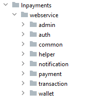

W każdym z widocznych katalogów utworzone zostały foldery, gdzie umiejscowiono pliki z testami.

* admins - Katalog _admins_ zawiera w sobie 4 foldery oraz 5 plików z testami co jest widoczne na zrzucie
ekranu z rysunku 112. Jak sama nazwa wskazuje, znajdują się tam testy związane z administratorami np. sprawdzanie, czy
ich tworzenie działa prawidłowo.

.Katalog admins.
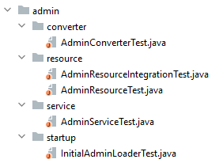

* auth - Zawiera 7 plików z testami rozmieszczonymi w 5 folderach. Sprawdzane jest tutaj m.in. działanie
uwierzytelniania. Jego zawartość jest widoczna na rysunku 113.

.Katalog auth.
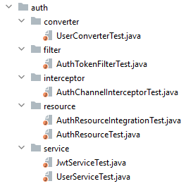

* common - W tym pakiecie znalazły się testy mające na celu walidację np. tego, czy podany adres jest adresem Bitcoin,
lub czy wpisany klucz może być kluczem publicznym. Jest on widoczny na rysunku 114.

.Katalog common.
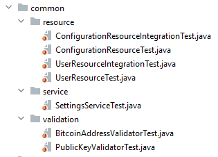

* helper - W tym folderze umieszczona została implementacja pomocnicza. Jego zawartość pokazano na rysunku 115.
Stworzona tutaj została np. metoda _resetSettings_, odpowiadająca za powrót do domyślnych właściwości, czy też
implementacja klasy _BaseIntegrationTest_ wykorzystywana w testach integracyjnych.

.Katalog helper.
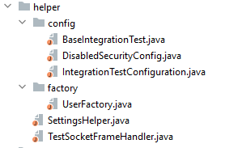

* notification - W tym katalogu umieszczono testy, które związane były z powiadomieniami. Sprawdzano np. czy
powiadomienie o danym _id_ zostanie prawidłowo zwrócone oraz czy jego typ jest zgodny z oczekiwaniami. Jego
zawartość widoczna jest na rysunku 116.

.Katalog notification.
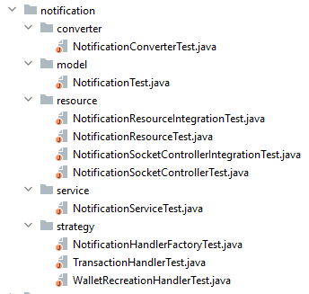

* payment - Tak jak sama nazwa wskazuje, w folderach pokazanych na rysunku 117, umieszczone zostały testy związane z
płatnościami. Miały one na celu np. sprawdzić, czy status płatności zachowuje się zgodnie z oczekiwaniami.

.Katalog payments.
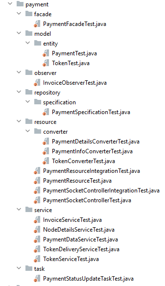

* transaction - Katalog ten zawiera 4 pliki z testami. Ich celem było sprawdzenie, czy funkcjonalności związane z
transakcjami działają prawidłowo. Zawartość zaprezentowano na rysunku 118.

.Katalog transaction.
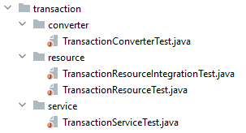

* wallet - W tym pakiecie znalazły się testy sprawdzające funkcjonalności związane z portfelem. Jego zawartość
pokazano na rysunku 119.

.Katalog wallet.
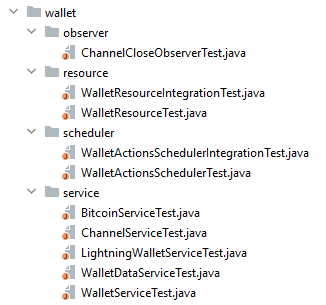

W kodzie 160 zaprezentowano przykładowy test jednostkowy. Oczekuje się, że po prawidłowym dodaniu administratora
zwrócony zostanie kod odpowiedzi HTTP 201(_utworzono_).

.Test jednostkowy z pliku AdminResourceTest.java.
[source, java]
----
include::../../../webservice/src/test/java/pl/edu/pjatk/lnpayments/webservice/admin/resource/AdminResourceTest.java[lines=30..38]
----
Kolejny fragment kodu, pokazany w kodzie 161, zawiera natomiast test integracyjny. Służy on do sprawdzenia, czy w
przypadku wprowadzenia nieprawidłowych danych zwrócony zostanie kod odpowiedzi HTTP 400(_złe zapytanie_).

.Test integracyjny z pliku AdminResourceIntegrationTest.java.
[source, java]
----
include::../../../webservice/src/test/java/pl/edu/pjatk/lnpayments/webservice/admin/resource/AdminResourceIntegrationTest.java[lines=82..89]
----

Do tworzenia testów wykorzystane zostały biblioteki _JUnit_ oraz _Mockito_. Warto również wspomnieć o tym, że wszystkie
klasy z testami integracyjnymi korzystają z klasy _BaseIntegrationTest_.

Na zrzucie ekranu, widocznym na rysunku 120, został załączony raport dotyczący pokrycia testami kodu związanego z
częścią serwerową aplikacji. Wynik na poziomie 91% świadczy o solidnym podejściu do testowania stworzonego kodu.
Niektóre klasy zostały pokryte testami nawet w 100%, co wymagało poświęcenia trochę dodatkowego czasu.
Napisanych zostało 333 testów, które rozlokowano w 61 plikach.

.Raport z pokrycia testami kodu części backendowej.
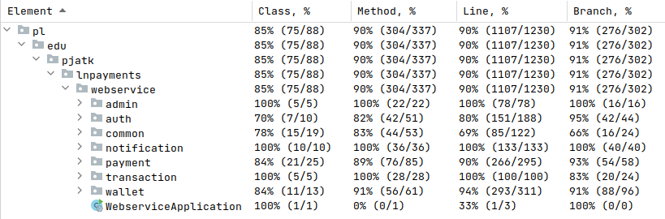

Zamieszczony raport pochodzi z programu _Intellij IDEA_. Wygenerowany on został również przez narzędzie _Jacoco_
do pliku _index.html_ i przedstawia trochę inne dane. Według niego pokrycie testami kodu serwera wyniosło 95%.
Raport ten można znaleźć w załącznikach do pracy dyplomowej.

==== Aplikacja internetowa

Testy dotyczące części frontendowej aplikacji zostały umieszczone w katalogu _tests_. Znajdujące się w nim foldery
zostały przedstawione na rysunku 121.

.Folder zawierający testy do części frontendowej aplikacji.
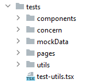

W związku z tym, że zespół zdecydował się na użycie _React Testing Library_ to testy jednostkowe dla komponentów
_React-a_ to tak naprawdę testy integracyjne. Świadczą o tym słowa wypowiedziane przez twórców tejże biblioteki "ciężko
stwierdzić granicę pomiędzy testami jednostkowymi a integracyjnymi".
Testy napisane w "czystym" _Typescript-cie_ są testami jednostkowymi.
W głównym katalogu _tests_ zostały umieszczone następujące foldery:

* components - Znalazły się tutaj testy sprawdzające, czy poszczególne elementy renderują się poprawnie. Zawartość
wyświetlono na rysunku 122.

.Folder zawierający testy komponentów.
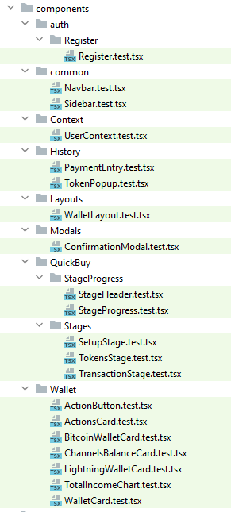

* concern - W folderze na rysunku 123 umieszczony został plik zawierający atrapę historii przeglądarki, jednakże
głównym przeznaczeniem znajdujących się tam elementów jest zadbanie o to, aby testy uruchamiały się prawidłowo.
W podfolderze _polyfills_ usytuowane zostały implementacje, które wykorzystywane są do rozszerzenia funkcjonalności
istniejącego już kodu.

.Folder zawierający atrapę historii.
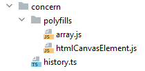

* mockData - Jak sama nazwa wskazuje, zostały tutaj utworzone pliki z atrapami danych zwracanych przez serwer
m.in. płatności oraz transakcji. Zawartość katalogu widoczna jest na rysunku 124.

.Folder zawierający atrapy.
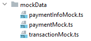

* pages - Znalazły się tutaj testy, w których sprawdzano, czy poszczególne widoki działają poprawnie np. czy po podaniu
odpowiednich danych w formularzu administrator zostanie prawidłowo utworzony. Zawartość folderu pokazano na rysunku
125.

.Folder zawierający testy różnych funkcjonalności.
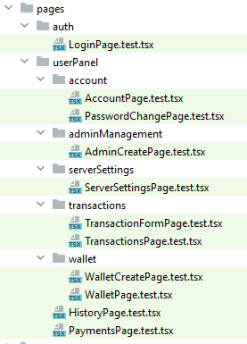

* utils - Katalog ten zawiera testy sprawdzające datę oraz czas, jest on widoczny na rysunku 126.

.Folder zawierający testy związane z czasem.
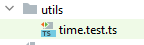

Fragment kodu umieszczony w kodzie 162 przedstawia test odpowiedzialny za sprawdzanie, czy komponent _navbar_ zostanie
wygenerowany w poprawny sposób.

.Test generujący komponent z pliku Navbar.test.tsx.
[source, tsx]
----
include::../../../webapp/tests/components/common/Navbar.test.tsx[lines=6..12]
----

Kolejny test zaprezentowany w kodzie 163 odpowiedzialny jest za sprawdzenie formularza zmiany hasła. Po wprowadzeniu
prawidłowych danych oczekiwany jest komunikat o powodzeniu operacji.

.Test sprawdzający formularz zmiany hasła z pliku PasswordChangePage.test.tsx.
[source, tsx]
----
include::../../../webapp/tests/pages/userPanel/account/PasswordChangePage.test.tsx[lines=25..42]
----

Kod napisany w _Typescript_ został pokryty testami w ponad 65%. Stworzono 32 pliki zawierające 93 testy.
Jest to rezultat widocznie gorszy niż w przypadku części serwerowej. Pewien wpływ miały na to zapewne opóźnienia w pracy
nad projektem i brak dodatkowego czasu na implementację kolejnych testów. Raport z testów pokazano na rysunku 127.

.Raport z pokrycia testami kodu części frontendowej.
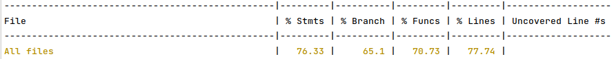

==== Aplikacja mobilna

Testy dla aplikacji mobilnej, podobnie jak w przypadku części frontendowej, zostały umieszczone w folderze _tests_,
którego zawartość widoczna jest 128.

.Folder zawierający testy dla aplikacji mobilnej.
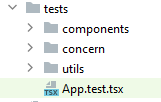

Testy umieszczone zostały w 3 katalogach:

* components - Podobnie jak w przypadku aplikacji frontendowej, w tym folderze znalazły się testy odpowiedzialne za
sprawdzanie poszczególnych komponentów. Jego zawartość widoczna jest na rysunku 129.

.Folder zawierający testy związane z komponentami.
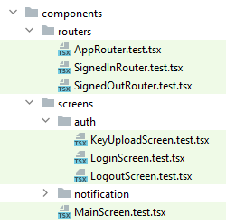

* concern - W tym katalogu znalazła się np. deklaracja komponentu pomocniczego, czy też atrap. Zawartość widoczna
jest na rysunku 130.

.Folder zawierający m.in. atrapy oraz komponent pomocniczy.
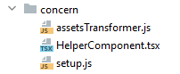

* utils - Znalazły się tutaj pliki testujące np. konwersję tablic na zmienne tekstowe, czy też generujące parę kluczy.
Zaprezentowany on został na rysunku 131.

.Folder zawierający testy związane z generowaniem par kluczy oraz konwersją.
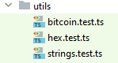

Przykładowy test odpowiedzialny za generowanie komponentu zaprezentowano w kodzie 164.

.Przykładowy test z pliku SignedInRouter.test.tsx.
[source, tsx]
----
include::../../../mobileapp/tests/components/routers/SignedInRouter.test.tsx[lines=20..35]
----

Mimo że aplikacja mobilna jest najmniejszą częścią projektu, to pokrycie jej kodu testami wyniosło około 50%. Wynik
ten nie może zbytnio dziwić, ponieważ na implementację tego elementu poświęcono stosunkowo najmniej czasu.
W pewnym momencie podczas implementacji testy przestały całkowicie działać. Do czasu rozwiązania problemu, nie było wiec
możliwości tworzenia nowych testów w trakcie pisania kolejnych komponentów.
Stworzonych zostało 13 plików zawierających 39 testów, co jest przeciętnym wynikiem. Raport z testów widoczny jest na
rysunku 132.

.Raport z pokrycia testami kodu aplikacji mobilnej.
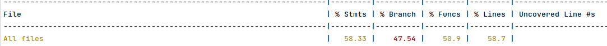

=== Testy E2E

Obecnie istnieją narzędzia, które umożliwiają napisanie testów sprawdzających, jak aplikacja funkcjonuje jako całość,
bez konieczności robienia tego manualnie.
Testy te powiązane są ze zwinnym procesem wytwarzania oprogramowania zwanym _BDD_. Polega on na stworzeniu
wymagań(napisaniu scenariuszy) z wykorzystaniem języka _Gherkin_. W związku z tym, że wykorzystuje się do tego celu
język naturalny, nawet osoba nietechniczna jest w stanie stworzyć taką dokumentację. Pomaga to również na etapie
implementacji rozwiązania oraz testów, ponieważ wymagane kroki dla określonej funkcjonalności zostały jasno opisane.
Zespół zdecydował się na utworzenie również testów tego typu. Do tego celu wykorzystano framework _Cypress_ wraz
z pluginem _Cucumber_.

==== Aplikacja internetowa i serwer

Pliki odpowiedzialne za testy E2E serwera wraz z aplikacją internetową umieszczono w katalogu _cypress_, co zostało
przedstawione na zrzucie ekranu widocznym na rysunku 133.

.Katalog zawierający pliki do testów E2E.
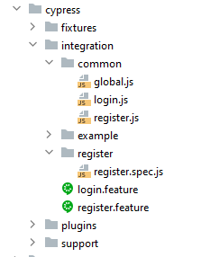

Scenariusze testowe _login.feature_ i _register.feature_ stworzone zostały z wykorzystaniem biblioteki _Cucumber_
oraz języka _Gherkin_. Przykładowy scenariusz został zamieszczony w kodzie 165.

.Przykładowy scenariusz testowy w języku Gherkin.
[source, gherkin]
----
include::../../../webapp/cypress/integration/login.feature[lines=8..13]
----

Do realizacji napisanych scenariuszy użyto biblioteki _Cypress_. Dzięki zastosowaniu parametrów w napisanych
scenariuszach udało się stworzyć uniwersalne metody, które drastycznie zmniejszyły ilość kodu. Jedną z nich można
zobaczyć na załączonym kodzie 166.

.Przykładowa metoda w _Cypress_.
[source, javascript]
----
include::../../../webapp/cypress/integration/common/global.js[lines=17..19]
----

Obecnie testy E2E zostały napisane tylko dla przypadków rejestracji oraz logowania, ale planowane jest dodanie kolejnych
w następnych wydaniach.

==== Aplikacja mobilna

Z powodu opóźnień w realizacji, dla aplikacji mobilnej udało się tylko napisać scenariusze testowe w języku _Gherkin_.
Pliki _auth.feature_ oraz _notifications.feature_ zostały umieszczone w katalogu _e2e_, widocznym na rysunku 134.

.Scenariusze testowe dla aplikacji mobilnej.
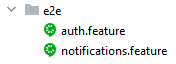

Przykładowy scenariusz wygląda tak samo, jak w przypadku aplikacji webowej. Różnią się one tylko zaplanowanymi akcjami.
W następnych wydaniach planowana jest implementacja metod odpowiedzialnych za wykonywanie istniejących już scenariuszy.

include::../sections/manual_tests.adoc[]
