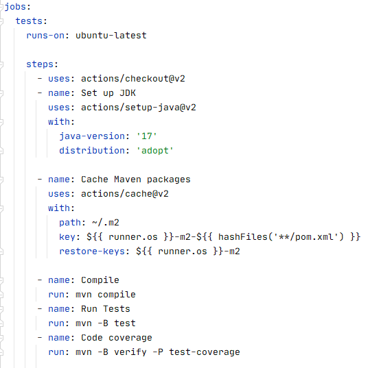
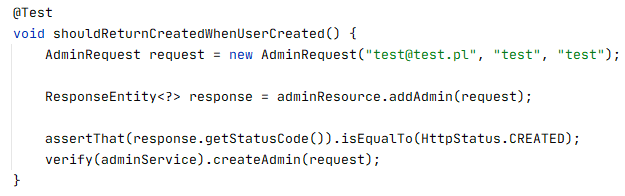
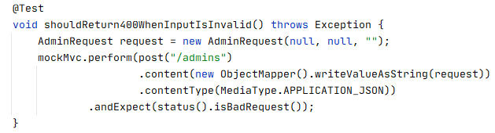
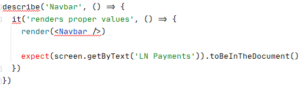
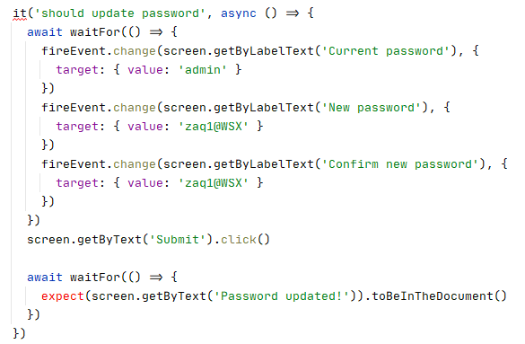
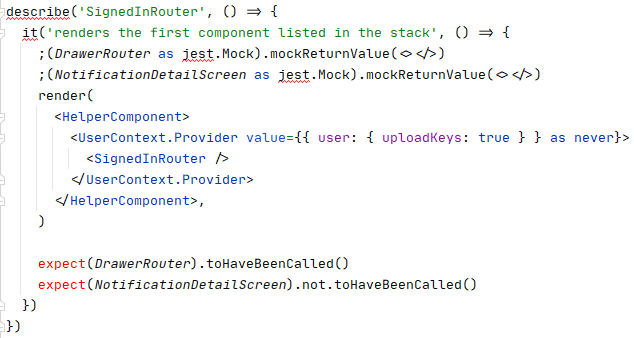
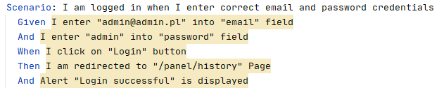
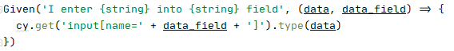

[#_testy]
== Testy
Aby już na wczesnym etapie wykrywać powstałe błędy, zespół zdecydował o tworzeniu testów podczas pisania poszczególnych elementów systemu. Dzięki takiemu podejściu udało się uniknąć wielu błędów w trakcie rozbudowy aplikacji. Ułatwiło to również dokonywanie _code review_, ponieważ osoba sprawdzająca mogła w łatwy sposób zweryfikować czy dana funkcjonalność działa w taki sposób, jak to zaplanowano.
Podczas implementacji należało pamiętać również o tym, że tworzony kod musi być testowalny i w konsekwencji tego czytelniejszy i prostszy do zrozumienia.

W celu zautomatyzowania procesu uruchamiania testów, członkowie zespołu zdecydowali się na użycie narzędzia _ciągłej integracji_ Github Actions.
Wystarczyło tylko stworzyć odpowiedni skrypt _YAML_, który czuwał nad tym, aby każdorazowo uruchomić testy po wypchnięciu zmian na repozytorium.
Katalog _workflows_ z plikami prezentuje się następująco:

.Zawartość folderu workflows z plikami YAML
image::../images/tests_chapter/workflows_CI.png[]

Na poniższym zrzucie ekranu można zauważyć listę kroków wykonywanych każdorazowo, po wypchnięciu zmian do części backendowej aplikacji. Testy w tym wypadku uruchamiane są przez narzędzie _Maven_.

.Fragment pliku webservice.yml prezentujący listę wykonywanych kroków

=== Testy jednostkowe i integracyjne

==== Backend
Kod źródłowy dla testów jednostkowych i integracyjnych umieszczony został w katalogu _test_, znajdującego się w folderze _src_. Testy tak samo, jak główny kod _Javy_ podzielone zostały na pakiety pogrupowane według funkcjonalności. Ich układ można zaobserwować na zrzucie ekranu poniżej.

.Pakiety testów Java dla serwera
image::../images/tests_chapter/test_folders_server.png[]

W każdym z widocznych katalogów utworzone zostały foldery, gdzie umiejscowiono pliki z testami.

* admins- Katalog _admins_ zawiera w sobie 4 foldery oraz 5 plików z testami co jest widoczne na poniższym zrzucie ekranu. Jak sama nazwa wskazuje, znajdują się tam testy związane z administratorami np. sprawdzanie, czy ich tworzenie działa prawidłowo.

.Katalog admins
image::../images/tests_chapter/admins_folder.png[]

* auth- Zawiera 7 plików z testami rozmieszczonymi w 5 folderach. Sprawdzane jest tutaj m.in. działanie uwierzytelniania.

.Katalog auth
image::../images/tests_chapter/auth_folder.png[]

* common- W tym pakiecie znalazły się testy mające na celu walidację np. tego, czy podany adres jest adresem Bitcoin, lub czy wpisany klucz, może być kluczem publicznym.

.Katalog common
image::../images/tests_chapter/common_folder.png[]

* helper-

.Katalog helper
image::../images/tests_chapter/helper_folder.png[]

* notification- W tym katalogu umieszczono testy, które związane były z powiadomieniami. Sprawdzano np. czy powiadomienie o danym _id_ zostanie zwrócone oraz, czy jego typ jest zgodny z oczekiwaniami.

.Katalog notification
image::../images/tests_chapter/notification_folder.png[]

* payment- Tak jak to sama nazwa wskazuje, w poniższych folderach umieszczone zostały testy związane z płatnościami. Miały one na celu np. sprawdzić, czy status płatności zachowuje się zgodnie z oczekiwaniami.

.Katalog payments
image::../images/tests_chapter/payments_folder.png[]

* transaction- Katalog ten zawiera 4 pliki z testami. Ich celem było sprawdzenie, czy funkcjonalności związane z transakcjami działają prawidłowo.

.Katalog transaction
image::../images/tests_chapter/transaction_folder.png[]

* wallet- W tej paczce znalazły się testy sprawdzające funkcjonalności związane z portfelem.

.Katalog wallet
image::../images/tests_chapter/wallet_folder.png[]

Na poniższym zrzucie ekranu zaprezentowany został przykładowy test jednostkowy. Oczekujemy w nim, że po prawidłowym dodaniu administratora zwrócony zostanie kod odpowiedzi HTTP _utworzono_

.Test jednostkowy z pliku AdminResourceTest.java

Kolejny fragment kodu zawiera natomiast test integracyjny. Służy on do sprawdzenia, czy w przypadku wprowadzenia nieprawidłowych danych zwrócony zostanie kod odpowiedzi HTTP _złe zapytanie_.

.Test integracyjny z pliku AdminResourceIntegrationTest.java

Do tworzenia testów wykorzystane zostały biblioteki _JUnit_ oraz _Mockito_. Warto również wspomnieć o tym, że wszystkie klasy z testami integracyjnymi korzystają z klasy _BaseIntegrationTest_.

TODO test coverage

==== Frontend

Testy dotyczące części frontendowej aplikacji zostały umieszczone w katalogu _tests_. Znajdujące się w nim foldery zostały przedstawione na poniższym zrzucie ekranu, są to:

.Folder zawierający testy do części frontendowej aplikacji
image::../images/tests_chapter/tests_folders_frontend.png[]

* components- Znalazły się tutaj testy sprawdzające, czy poszczególne elementy renderują się poprawnie

.Folder zawierający testy komponentów
image::../images/tests_chapter/components_tests.png[]

* concern- W folderze umieszczony został plik zawierający atrapę historii przeglądarki.

.Folder zawierający atrapę historii
image::../images/tests_chapter/concern_folder.png[]

* mockData- Jak sama nazwa wskazuje, zostały tutaj ustworzone pliki z atrapami dla m.in. płatności oraz transakcji.

.Folder zawierający atrapy
image::../images/tests_chapter/mockdata_folder.png[]

* pages- Znalazły się tutaj testy, w których sprawdzano np, czy po podaniu odpowiednich danych w formularzu administrator zostanie prawidło utworzony.

.Folder zawierający testy różnych funkcjonalności
image::../images/tests_chapter/pages_folder.png[]

* utils- Katalog ten zawiera testy sprawdzające datę oraz czas

.Folder zawierający testy związane z czasem
image::../images/tests_chapter/utils_folder.png[]

Na poniższym zrzucie ekranu znajduje się przykładowy test odpowiedzialny za sprawdzanie, czy komponent _navbar_ generuje się poprawnie.

.Test generujący komponent z pliku Navbar.test.java

Kolejny test zaprezentowany poniżej odpowiedzialny jest za sprawdzenie formularza zmiany hasła. Po wprowadzeniu prawidłowych danych spodziewany jest komunikat o powodzeniu operacji.

.Test sprawdzający formularz zmiany hasła z pliku PasswordChangePage.test.java

TEST COVERAGE TODO ( + podmienić przykładowe testy)

==== Aplikacja mobilna

Testy dla aplikacji mobilnej, podobnie jak w przypadku części frontendowej zostały umieszczone w folderze _tests_.

.Folder zawierający testy dla aplikacji mobilnej
image::../images/tests_chapter/mobileapp_tests.png[]

Testy umieszczone zostały w 3 katalogach:

* components- Podobnie jak w przypadku aplikacji frontendowej, w tym folderze znalazły się testy odpowiedzialne za sprawdzanie poszczególnych komponentów.

.Folder zawierający testy związane z komponentami
image::../images/tests_chapter/mobileapp_components_folders.png[]

* concern- W tym katalogu znalazła się np. deklaracja komponentu pomocniczego, czy też atrap.

.Folder zawierający m.in. atrapy oraz komponent pomocniczy
image::../images/tests_chapter/mobileapp_concern_folder.png[]

* utils- Znalazły się tutaj pliki testujące np. konwersję tablic na zmienne tekstowe, czy też generujące parę kluczy.

.Folder zawierający testy związane z generowaniem par kluczy oraz konwersją.
image::../images/tests_chapter/mobileapp_utils_folder.png[]

Przykładowy test odpowiedzialny za generowanie komponentu prezentuje się następująco:

.Przykładowy test z pliku SignedInRouter.test.tsx

TODO (klasycznie test coverage + screeny kodu)

=== Testy E2E

Obecnie istnieją narzędzia, które umożliwiają napisanie testów sprawdzających, jak aplikacja funkcjonuje jako całość, bez konieczności robienia tego manualnie. Zespół zdecydował się na utworzenie również testów tego typu.

==== Serwer

Pliki odpowiedzialne za testy E2E dla aplikacji webowej umieszczono w katalogu _cypress_, co zostało przedstawione na poniższym zrzucie ekranu.

.Katalog zawierający pliki do testów E2E
image::../images/tests_chapter/webapp_e2e.png[]

Scenariusze testowe _login.feature_ oraz _register.feature_ stworzone zostały z wykorzystaniem biblioteki _Cucumber_, oraz języka Gherkin. Przykładowy scenariusz został zamieszczony poniżej.

.Przykładowy scenariusz testowy w języku Gherkin

Do realizacji napisanych scenariuszy użyto biblioteki _Cypress_. Dzięki zastosowaniu parametrów w napisanych scenariuszach udało się stworzyć uniwersalne metody, które drastycznie zmniejszyły ilość kodu. Jedną z nich można zobaczyć na załączonym niżej zrzucie ekranu.

.Przykładowa metoda w _Cypress_

Obecnie testy E2E zostały napisane tylko dla przypadków rejestracji oraz logowania, ale planowane jest dodanie kolejnych w następnych wydaniach.

==== Aplikacja mobilna

Z powodu opóźnień w realizacji dla aplikacji mobilnej udało się tylko napisać scenariusze testowe w języku _Gherkin_. Pliki _auth.feature_ oraz _notifications.feature_ zostały umieszczone w katalogu _e2e_.

.Scenariusze testowe dla aplikacji mobilnej
image::../images/tests_chapter/mobileapp_e2e.png[]

Przykładowy scenariusz wygląda tak samo, jak w przypadku aplikacji webowej. Różnią się one tylko zaplanowanymi akcjami. W następnych wydaniach planowana jest implementacja metod odpowiedzialnych za wykonywanie istniejących już scenariuszy.

=== Testy manualne
TODO