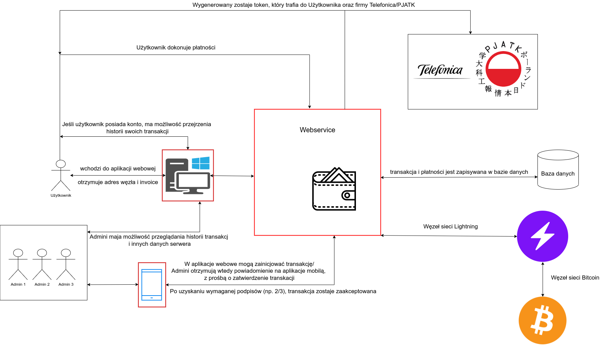

=== Architektura systemu

Rozwiązanie opiera się na serwerze działającym na zasadzie klient-serwer, z którym będą się komunikowały zarówno
aplikacja internetowa, jak i aplikacja mobilna. Komunikacja będzie odbywała się poprzez protokoły HTTP/HTTPS oraz
WebSocket. Serwer będzie odpowiedzialny za łączenie się z bazą danych i komunikację z lokalnymi węzłami sieci
Lightning oraz sieci Bitcoin. Węzeł sieci Bitcoin będzie przede wszystkim wykorzystywany przez węzeł sieci Lightning
do pobierania informacji o blockchainie Bitcoina. Dodatkowo będzie również używany przez bibliotekę BitcoinJ do
szybszego podłączenia się do sieci. Dane o operacjach zachodzących na serwerze zapisywane będą w relacyjnej bazie
danych. Planowana jest również możliwość integracji z innymi systemami w celu wysyłania tokenów. Poza integracją w
ramach projektu iNGENIOUS powinna znaleźć się możliwość podania adresu URL, na który wysyłane będą tokeny. Diagram
z modelem architektonicznym systemu widoczny jest na rysunku 5.

.Model architektoniczny systemu.

