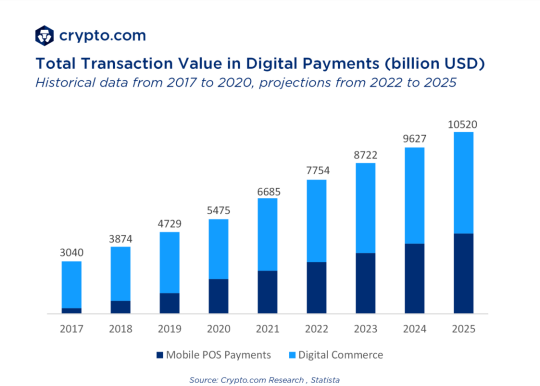
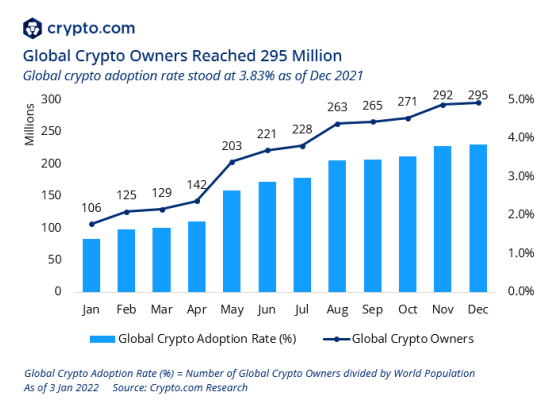
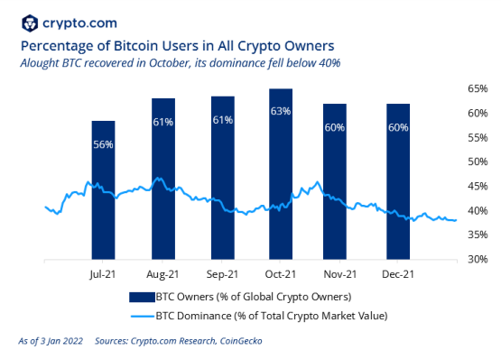
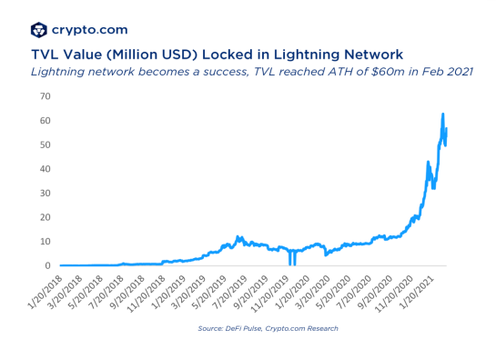

=== Komercjalizacja projektu

Projekt w swoim założeniu jest dosyć specyficzny. Posiada zaawansowane funkcjonalności takie jak płatność w sieci
Lightning, generowanie tokenów czy też podpisywanie transakcji multisig w aplikacji mobilnej. Nie będzie on
natomiast posiadać wielu podstawowych, o wiele prostszych rozwiązań. Przykładowo nie będzie możliwości standardowych
płatności w Bitcoinach, a jedynie poprzez sieć Lightning. Produkt skierowany jest do bardzo wąskiej grupy
odbiorców (przede wszystkim projekt _iNGENIOUS_), dlatego zdecydowano się na wydanie projektu w modelu open-source na
licencji MIT. Zainteresowana osoba będzie mogła sprawdzić projekt, a także wpływać na jego rozwój za darmo. Jedynym
sposobem do komercjalizacji jest oferowanie klientom biznesowym płatnego wsparcia technicznego. Obejmować ono może
pomoc przy wdrożeniu oraz utrzymanie w środowisku produkcyjnym. Licencja MIT pozwala w razie potrzeby na rozwój
projektu przy zmianie licencji, więc drzwi do szerszej komercjalizacji zostaną otwarte.

[NOTE]
Dane bazują przede wszystkim na dwóch raportach firmy _crypto.com_: _Overview of crypto payment_
<<crypro_payment_raport>> oraz _Crypto market sizing_ <<crypto_market_sizing>>.
Wykresy znajdujące się w następnych podrozdziałach pochodzą również z tychże raportów.

==== Analiza rynku

Proponowane rozwiązanie najbardziej pasuje do rynku płatności w kryptowalutach (_Crypto payments_ bądź _Crypto payment
gateways/processors_). Jest to stosunkowo nowy rynek, który dynamicznie się rozwija. Na rynku jest wiele komercyjnych
rozwiązań takich jak opisane wcześnie _Coinbase Commerce_ i _Bitrefill_, ale również popularne są _BitPay_ czy
_Coingate_. Z rozwiązań open-source najpopularniejszy jest natomiast BTCPayServer. Ze zgromadzonych przez zespół
projektowy danych wynika, że rozwiązanie _Coinbase_ ma największy udział na rynku na poziomie 90%. Wynika to z
ogólnodostępnych danych dostępnych na stronach internetowych poszczególnych rozwiązań. Tych informacji nie należy
traktować bardzo poważnie, gdyż każda firma może dowolnie manipulować prezentowanymi informacjami.

Według raportu wykonanego przez serwis _crypto.com_ suma płatności w roku 2020 przy pomocy kryptowalutach wyniosła od
15,66 do 16,52 miliardów dolarów. Daje to aktualnie 0.4% wszystkich przychodów z branży _ecommerce_. Może się to
wydawać małą kwotą, natomiast trzeba pamiętać o nowości i innowacyjności kryptowalut. Technologia ta jest dostępna od
niedawna, podczas gdy sprzedaż internetowa jest już ugruntowana na rynku od wielu lat. Szacuje się, że rynek
płatności w kryptowalutach będzie rósł o 22,8 do 23,4 procent rok do roku. Znajduje to potwierdzenie w danych
historycznych oraz w przewidywaniach serwisu _crypto.com_, co widoczne jest na rysunku 21.

.Łączna wartość transakcji w kryptowalutach (w miliardach dolarów).

==== Potencjalni użytkownicy

Z końcem 2021 roku było prawie 300 milionów użytkowników kryptowalut. Obrazuje to rysunek 22. Daje to obecnie blisko 4%
ogółu społeczeństwa. Liczba ta stale rośnie, a według analityków może osiągnąć nawet 1 miliard do końca 2022 roku. Przy
tak dużym napływie użytkowników będzie prawdopodobnie rosło zainteresowanie technologiami operującymi na kryptowalutach.
Dzięki temu jest szansa na to, że proponowany projekt znajdzie swoje grono odbiorców, a co za tym idzie potencjalnych
klientów.

.Użytkownicy kryptowalut w ciągu ostatnich lat wraz ze współczynnikiem adaptacji.

Dla wielu użytkowników problemem mógł być brak regulacji prawnych. Dla wielu firm mogło to być barierą nie
do przejścia, gdyż chcąc działać w pełni legalnie, chcieli zastosować się do panujących regulacji, które nie
istniały. Problemem jest to, że technologia blockchain jest rozproszoną i anonimową strukturą danych, przez co
kontrola finansów w sposób znany z tradycyjnych nie jest możliwe. Na szczęście coraz więcej krajów decyduje się na
prawne uregulowanie kwestii kryptowalut. Wiele firm znając obowiązujące przepisy, może zdecydować się na wprowadzenie
w swoim przedsiębiorstwie płatności przy pomocy Bitcoinów. Zainteresowanie płatnościami w kryptowalutach powinno rosnąć
proporcjonalnie do ilości użytkowników, więc można spodziewać się wzrostów na tym runku w najbliższym czasie.

==== Zainteresowanie technologią

Obecnie na rynku dostępnych jest wiele różnych kryptowalut. Zdecydowanie najbardziej ugruntowane na rynku są Bitcoin
oraz Ethereum, gdzie najpopularniejszą jest ta pierwsza. Odpowiada obecnie aż za 38% udziału wśród kryptowalut.
W ostatnim czasie stracił trochę udziałów, aczkolwiek dalej jest na pozycji dominującej rynek. Widać to wyraźnie na
rysunku 23.

.Udział użytkowników Bitcoina spośród wszystkich użytkowników kryptowalut.

Bitcoin jest także walutą wartą najwięcej w przeliczeniu na dolary amerykańskie. Wartość transakcji również jest
najwyższa właśnie w tej kryptowalucie. Bitcoin posiada tak ugruntowaną pozycję na rynku, że ograniczanie się w
proponowanym rozwiązaniu tylko do niego nie powinno być błędem.

Drugą wykorzystywaną technologią w projekcie z zakresu kryptowalut jest sieć Lightning. Działa ona jako druga
warstwa płatności, która pozwala znacząco obniżyć koszty transakcji poprzez zastosowanie kanałów płatności. Jest to
stosunkowo nowa technologia, która została uruchomiona w głównej sieci Bitcoina w 2018 roku. Od tego momentu jej
popularność stale rośnie. Szacuje się, że w kanałach płatności zablokowanych jest obecnie nawet 58 milionów dolarów,
co widoczne jest na rysunku 24.

.Środki zablokowane w sieci Lightning.

Obniżka opłaty transakcyjnej jest sporą zaletą i rozwiązuje wiele innych problemów związanych z Bitcoinem takich jak
niski limit transakcji na sekundę czy brak możliwości dokonywania mikropłatności. Popularność sieci rośnie dosyć
dynamicznie, a niewiele rozwiązań obecnych na rynku jest z nią kompatybilnych. Jest to obszar rynku, który dopiero się
rozwija, co może być szansą na zdobycie popularności przez proponowane rozwiązanie.

==== Podsumowanie

Rynki kryptowalut i płatności w kryptowalutach jest stosunkowo młody i stale się rozwija. Sprawia to, że jest to
idealne miejsce do tworzenia nowych i innowacyjnych projektów. Przewidywane są duże wzrosty ilości użytkowników, a co
za tym idzie, rozwiązania będą mogły liczyć na większe zyski. Wielu sprzedawców adaptuje się do przyjmowania płatności
w kryptowalutach właśnie teraz, co może być dobrym momentem do wejścia na rynek. Szacuje się również że współczynnik
adaptacji kryptowalut będzie rósł aż o 13% rok do roku.

Pomimo tego, że na rynku jest dużo miejsca dla nowej konkurencji, tworzone rozwiązanie nie ma szans na zdobycie dużego
udziału wśród procesorów płatności. Wynika to z faktu krótkiej i bardzo wyspecjalizowanej listy funkcjonalności.
Obsługa Bitcoina tylko przez sieć Lightning sprawia, że potencjalny rynek bardzo się kurczy. Około 38% użytkowników
używa Bitcoinów, jednak nie każdy z nich korzysta z sieci Lightning, co zmniejsza ilość potencjalnych klientów.
Nie każdy również będzie potrzebować portfela multisig oraz generowania tokenów. Rozwiązanie jest dedykowane dla bardzo
wąskiego grona użytkowników, którzy poszukują produktu zawierającego wyłącznie proponowane przez projekt
funkcjonalności. Z tych powodów wydanie projektu w pierwszym wydaniu jako open-source z ewentualnym płatnym wsparciem
ma najwięcej sensu. Komercjalizacja na większą skalę będzie wymagała dodania bardzo wielu funkcjonalności, które
posiada obecnie konkurencja, a które nie są planowane w tym, ani następnych wydaniach projektu.
