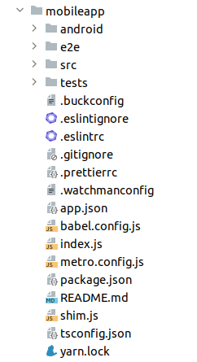
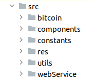
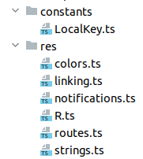
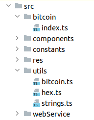
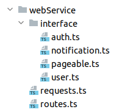
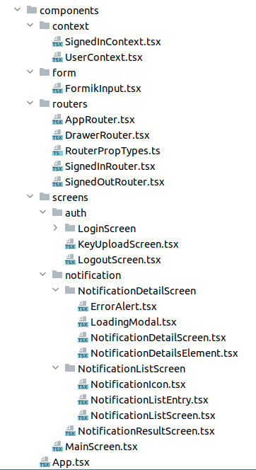

=== Aplikacja mobilna

Aplikacja mobilna została wykonana z pomocą podobnych technologii i narzędzi jak w przypadku aplikacji internetowej.
Podstawę stanowią język programowania TypeScript oraz framework React Native, który jest wersją framework'a React
dostosowaną do tworzenia natywnych aplikacji mobilnych. Pozwala on na równoczesne tworzenie kodu na platformy
Android oraz iOS, jednak w projekcie zdecydowano się wspierać tylko system Android. Jest to podyktowane brakiem
potrzebnych urządzeń oraz funduszy. Tak samo, jak w aplikacji mobilnej, projekt budowany jest przy pomocy programu
_yarn_, a za jakość kodu odpowiadają _prettier_ oraz _eslint_.

Od czytelnika wymagana jest podstawowa znajomość języka JavaScript w standardzie ECMA2017 oraz TypeScript w wersji co
najmniej 4.4. Tłumaczone będą niektóre mechanizmy charakterystyczne dla framework'a React Native, natomiast jego
znajomość również jest zalecana, gdyż wiele pojęć związanych z tą technologią nie zostanie opisanych szczegółowo.

==== Struktura modułu

Główny katalog projektu aplikacji mobilnej zawiera przede wszystkim pliki konfiguracyjne dla wykorzystywanych narzędzi,
a także kilka folderów, zawierających kod źródłowy, testy oraz folder _android_ zawierający natywny kod w Javie,
który został automatycznie wygenerowany przez framework React Native. Jest on widoczny na rysunku 73.

.Układ katalogów w folderze głównym aplikacji mobilnej.

Folder zawiera znany już plik _.gitignore_, dodający wyjątki dla programu git. Konfiguracja narzędzi do stylizacji
kodu odbywa się w plikach _.eslintignore_ i _.eslintrc_ dla programu _eslint_ oraz _.prettierrc_ dla programu
_prettier_. Transpilatory języka javascript wykorzystywane w projekcie to _babel_ oraz _metro_. Pozwalają one
na używanie niestandardowej składni języka w kodzie jak na przykład wykorzystywanie kodu html. Ich konfiguracja
zawiera się odpowiednio w _babel.config.js_ oraz _metro.config.js_. Aby umożliwić dynamiczną aktualizację
aplikacji przy zmianie kodu, wykorzystywany jest program _watchman_, który skonfigurowany jest w pliku
_.watchmanconfig_. Pliki _.buckconfig_, _app.json_ uwzględniają konfigurację dla aplikacji React Native. Sama aplikacja
uruchamiana jest poprzez plik _index.js_. Interesujący jest plik _shim.js_, gdyż zawiera on brakujący kod pozwalający
na wykorzystywanie pakietów _node_ w aplikacji React Native. Folder główny zawiera również plik _tsconfig.json_,
obejmujący ustawienia dla kompilatora TypeScript, _yarn.lock_ przechowujący metadane wykorzystywanych pakietów,
_package.json_ zawierający ustawienia procesu budowania oraz wykorzystywane biblioteki, a także _readme_ z informacjami
o tym module. Komponent mieści dwa foldery na testy. Katalog _tests_ przechowuje testy jednostkowe i integracyjne,
a _e2e_ miał przechowywać automatyczne testy end-to-end. Niestety znajdują się tam tylko scenariusze testowe w języku
Gherkin, a sama ich implementacja nie została zrealizowana. Zadanie to planowane jest na następne wydania. Ostatnim
folderem, widocznym na rysunku 74, jest _src_, zawierający sam kod źródłowy aplikacji.

.Układ katalogów w folderze _src_.

Główna część aplikacji, czyli kod odpowiedzialny za wyświetlanie stron, poszczególne komponenty czy też routing
znajdują się w folderze _components_. Katalogi _res_ i _constants_ zawierają stałe wartości oraz inne zasoby aplikacji.
Folder _utils_ przechowuje różne funkcje pomocnicze, a _bitcoin_ zawiera kod pozwalający na używanie biblioteki
_bitcoinjs_ w kodzie aplikacji mobilnej. Ostatnim katalogiem jest _webservice_, zawierający obiekty modelowe oraz
funkcje odpowiedzialne za wysyłanie żądań do serwera.

==== Wartości stałe i zasoby

Stałe oraz zasoby wykorzystywane w aplikacji niebędące plikami przechowywane są w dwóch folderach, czyli _res_ oraz
_constants_. Ich zawartość widoczna jest na rysunku 75. Dwa foldery wynikają z błędu popełnionego podczas implementacji
dwóch zadań jednocześnie przez różne osoby. Pomyłka ta obecna jest w aplikacji do dziś, gdyż były to ostatnie zadania
przed prezentacją projektu w ramach przedmiotu PAMO. Jest to jedna z rzeczy, które powinny zostać poprawione w
następnych wydaniach projektu.

.Zawartość folderów res i constants.

Oba foldery zawierają łącznie tylko 7 plików. Każdy z nich eksportuje obiekty przechowujące dane potrzebne do działania
aplikacji. W katalogu _res_ znajduje się plik o nazwie _R.ts_. Jego zadaniem jest grupowanie innych zasobów
z jednym obiekcie, aby zunifikować dostęp do nich. Nazwa pliku pochodzi z konwencji obecnej przy tworzeniu aplikacji
mobilnych w języku Java. Wszystkie zasoby w dostępne są dla programisty poprzez obiekt _R_ zapewniony przez framework
programowania aplikacji Android. Konwencja ta została przez zespół przyjęta również w aplikacji tworzonej w React
Native, aby ułatwić dostęp oraz zwiększyć czytelność kodu. Kod pliku _R.ts_ znajduje się w kodzie 125.

.Zawartość pliku R.ts.
[source, tsx]
----
include::../../../mobileapp/src/res/R.ts[lines=10..18]
----

Plik zawiera tylko definicję stałego obiektu, który grupuje pozostałe obiekty wyeksportowane w tym folderze.
Zawiera on plik ze stałymi łańcuchami znaków, nazwy ekranów używane w routingu, definicje ekranów zawierających
parametry (używane przy przekierowaniu z powiadomienia push), listę kolorów oraz dane wymagane do utworzenia
nowego powiadomienia push. Dla przykładu w kodzie 126 zaprezentowano zawartość pliku _colors.ts_.

.Zawartość pliku colors.ts.
[source, tsx]
----
include::../../../mobileapp/src/res/colors.ts[lines=4..11]
----

Drugi folder zawierający stałe to _constants_. Zawiera on tylko jeden plik, którego zawartością jest typ wyliczeniowy
reprezentujący klucze wartości zapisywanych lokalnie w trakcie działania aplikacji. Kod tego pliku widoczny
jest w kodzie 127.

.Zawartość pliku LocalKey.ts.
[source, tsx]
----
include::../../../mobileapp/src/constants/LocalKey.ts[lines=4..9]
----

Aplikacja w swojej pamięci zapisuje adres email, adres URL serwera, token JWT oraz nazwę kanału WebSocket, na który
przychodzą powiadomienia push.

==== Funkcje i pliki użytkowe

Folder _utils_, widoczny na rysunku 76, przechowuje pliki zawierające różne funkcje wykorzystywane w innych miejscach
aplikacji. Można o nich myśleć tak samo, jak o serwisach w przypadku aplikacji napisanej w Javie i framework'u Spring.
Katalog _bitcoin_ zawiera natomiast tylko jeden plik, który umożliwiający wykorzystanie biblioteki _bitcoinjs_ w kodzie
aplikacji mobilnej.

.Zawartość folderów utils i bitcoin.

W obu katalogach znajdują się zaledwie cztery pliki. Folder _bitcoin_ zawiera plik index.ts, który eksportuje
bibliotekę _bitcoinjs_ jako moduł. Plik _hex.ts_ w katalogu _utils_ zawiera funkcje służące do obsługi
konwersji pomiędzy heksadecymalnym łańcuchem znaków a tablicą bajtów. Zawiera ona dwie funkcje, _toHexString_ oraz
_toHexBytes_, które obsługują konwersje w obie strony. Następnym plikiem jest _strings.ts_. Zawiera on dwie
funkcje pozwalające na operowanie na łańcuchach znaków. Ich kod zaprezentowano w kodzie 128.

.Funkcje w pliku strings.ts.
[source, tsx]
----
include::../../../mobileapp/src/utils/strings.ts[lines=6..7]

include::../../../mobileapp/src/utils/strings.ts[lines=14..21]
----

Pierwszą funkcją jest _capitalize_. Pozwala ona na zmianę pierwszego znaku łańcucha znaków na dużą literę. Druga funkcja
służy do walidacji adresu URL. Jeżeli adres podany jako łańcuch znaków jest poprawny, funkcja zwróci wartość prawdziwą.
Ostatnim plikiem jest _bitcoin.ts_. Zawiera on funkcje obsługujące funkcjonalności związane z protokołem Bitcoina,
czyli generowanie kluczy oraz podpisywanie transakcji. Funkcje te są krytyczne dla działania aplikacji mobilnej.
Pierwsza z nich odpowiada za generowanie pary kluczy, a została pokazana w kodzie 129.

.Metody generateKeyPair z pliku bitcoin.ts.
[source, tsx]
----
include::../../../mobileapp/src/utils/bitcoin.ts[lines=46..50]
----

Funkcja ta jest prosta w działaniu. Wywoływana jest odpowiednia funkcja z biblioteki _bitcoinjs_, która generuje
parę kluczy. Jedynym jej parametrem jest sieć, w której operuje aplikacja. W obecnym wydaniu aplikacji mobilnej
wspierana jest tylko sieć _testnet_. Druga funkcja w tym pliku służy do podpisywania transakcji, a pokazano ją w kodzie
130.

.Funkcja signTx z pliku bitcoin.ts.
[source, tsx]
----
include::../../../mobileapp/src/utils/bitcoin.ts[lines=18..39]
----

Parametrami tej funkcji jest surowa transakcja zapisana jako łańcuch znaków w formacie heksadecymalnym, klucz
prywatny jako tablica bajtów, reprezentowana przez obiekt _Buffer_ oraz _redeemScript_, ponownie jako szesnastkowy
łańcuch znaków. Najpierw tworzone są obiekty _Transaction_ oraz _TransactionBuilder_ pochodzące z biblioteki
_bitcoinjs_. Następnie wykonywane jest przejście przez wszystkie wejścia transakcji, gdzie odbywa się próba ich
podpisania. Nie ma potrzeby wskazywania konkretnego wejścia do podpisania, ponieważ wszystkie środki przychodzą na
jeden adres, który został zbudowany ze wszystkich kluczy publicznych administratorów. Oznacza to, że każdy
administrator musi podpisać każde wejście transakcji. Dodatkowo w procesie następuje konwersja otrzymanej tablicy
bajtów na obiekt _ECPair_, a także przekształcenie _redeemScript'u_ z łańcucha znaków na tablicę. Na koniec w mało
elegancki sposób zwracana jest podpisana surowa transakcja jako szesnastkowy łańcuch znaków. Brak wsparcia dla PSBT po
stronie serwera zmusza do próby zbudowania kompletnej transakcji. Jeżeli zostanie rzucony wyjątek, to budowana jest
niekompletna transakcja. Jest to proste obejście braku tej kluczowej dla projektu funkcjonalności biblioteki _BitcoinJ_.

==== Klient HTTP

Zawartością folderu _webService_ są funkcje obsługujące połączenie z serwerem projektu, ścieżki do zasobów oraz
definicje typów dla ciał żądań HTTP. Katalog ten jest bardzo podobny do folderu o tej samej nazwie znajdującego się
w kodzie komponentu aplikacji internetowej. Jego zawartość widoczna jest na rysunku 77. Na pewnym etapie prac kod ten
znajdował się w osobnym module, który był importowany zarówno przez aplikację internetową, jak i aplikację mobilną.
Niestety rozwiązanie to było dalekie od ideału. Wspólny moduł musiał być przy każdej modyfikacji kompilowany oraz
ręcznie dołączany do obu projektów. Pojawiły się również spore problemy przy uruchomianiu testów jednostkowych.
Zdecydowano się na podzielenie wspólnego modułu, a także na skopiowanie niektórych plików, aby ruszyć do przodu z
implementacją, gdyż zespołowi nie udało się znaleźć satysfakcjonującego rozwiązania w akceptowalnym czasie.

.Zawartość folderu webService.

Katalog zawiera dwa pliki. W _routes.ts_ przechowywane są ścieżki do zasobów serwera. Wykorzystywane są one w pliku
_requests.ts_ do wykonywania żądań HTTP. Plik ten zawiera klasę _Requests_ typu singleton, która zawiera metody
pozwalające na wysyłanie żądań. Funkcje reprezentujące pojedyncze żądania one udostępnione programiście poprzez ich
eksport jako zwykły obiekt JavaScript. Fragment tej klasy pokazano na rysunku 131.

.Fragment klasy Requests zawierający publicznie dostępne funkcje do wysyłania żądań.
[source, tsx]
----
include::../../../mobileapp/src/webService/requests.ts[lines=43..58]
----

Wszystkie publiczne funkcje są pogrupowane w hierarchii obiektów, dzięki czemu można je w elegancki sposób wywoływać
bez potrzeby tworzenia za każdym razem obiektu klasy _Requests_. W przypadku każdej z nich wykonywane jest żądanie
z pomocą metody _request_. Parametry wejściowe są do niej przekazywane, a zwracany obiekt _Promise_ opakowuje
odpowiedź HTTP. Kod metody _request_ zaprezentowano w kodzie 132.

.Metoda request klasy Requests w pliku requests.ts.
[source, tsx]
----
include::../../../mobileapp/src/webService/requests.ts[lines=127..148]
----

Jest to metoda generyczna. Jako typy przyjmuje ona typy ciała odpowiedzi oraz żądania HTTP. Parametrami jest adres
zasobu, obiekt konfiguracyjny biblioteki _axios_ zawierający właściwe parametry żądania jak metoda czy ciało, oraz
flagę informującą o konieczności załączenia tokena JWT. Z pomocą biblioteki _axios_ wysyłane jest żądanie i zwracany
jest jego status, a także w przypadku sukcesu ciało odpowiedzi. Co więcej, jeżeli wystąpi błąd połączenia, użytkownikowi
wyświetlany jest odpowiedni komunikat. Typy obiektów przesyłanych jako ciało żądań i odpowiedzi zdefiniowane są w
plikach znajdujących się w folderze _interface_. Odzwierciedlają one obiekty przesyłane do i z serwera.

==== Komponenty

Główna część aplikacji mobilnej znajduje się w folderze _components_, widocznym na rysunku 78. Zawiera on kod
wszystkich ekranów komponentów oraz nawigacji.
Pliki mają rozszerzenie _tsx_, ponieważ zapisane są w formacie narzędzia _Babel_, które pozwala
na pisanie kodu HTML wewnątrz plików JavaScript oraz TypeScript. Warto wspomnieć, że wszystkie komponenty pisane są
w stylu funkcyjnym. Jest to nowsze rozwiązanie, które pozwala na pisanie o wiele czytelniejsze, a także ma nowsze
funkcjonalności względem stylu wykorzystującego klasy.

.Zawartość folderu components.

Pliki zostały pogrupowane w folderach według funkcji. Katalog _context_ zawiera konteksty React'a, czyli globalne
pojemniki na zmienne. Element opakowany w kontekst może uzyskać dostęp do jego zawartości. Drugim folderem jest _form_,
który zawiera niestandardowe pola formularzy. Na potrzeby aplikacji mobilnej stworzono tylko jeden komponent
reprezentujący pole tekstowe. Następny katalog, czyli _routers_ zawiera funkcje obsługujące nawigację w aplikacji.
Zdefiniowane są tam wszystkie połączenia oraz zachowania ekranów. Ostatnim folderem jest _screens_, w którym znajdują
się komponenty odpowiedzialne za wyświetlane ekrany, wraz z ich sub-komponentami. Punktem wejściowym dla aplikacji
jest plik _App.tsx_, który pokazano w kodzie 133. Zawiera on część konfiguracji oraz jest to główny komponent aplikacji
grupujący kontekst użytkownika i pierwszy element nawigacji.

.Funkcja App zwracająca pierwszy, główny komponent aplikacji.
[source, tsx]
----
include::../../../mobileapp/src/components/App.tsx[lines=28..38]
----

Komponenty React wykorzystuje się jako niestandardowe znaczniki HTML. Komponent konfiguracyjny _NativeBaseProvider_
pochodzi z biblioteki _NativeBase_. Dostarcza ona gotowe komponenty HTML dostosowane dla platformy Android. Następnym
komponentem jest _UserContextProvider_, dostarczający kontekst użytkownika. Jest on zdefiniowany w pliku
_UserContext.tsx_ w folderze _context_. Jego kod zaprezentowano w kodzie 134.

.Zawartość kontekstu użytkownika.
[source, tsx]
----
include::../../../mobileapp/src/components/context/UserContext.tsx[lines=38..50]
----

Zawiera on obiekt zalogowanego użytkownika pobrany z serwera podczas logowania. Część jego danych zapisana jest
lokalnie w urządzeniu mobilnym. Kontekst zawiera również funkcje pozwalające na manipulowanie obiektem użytkownika,
takie jak jego ustawienie, aktualizację oraz wylogowanie. Ostatnim parametrem jest flaga wskazująca, czy trwa aktualnie
ładowanie użytkownika. Warto wspomnieć, że metoda _createContext_ definiuje tylko typ oraz wartości domyślne kontekstu.
Jego prawdziwe właściwości definiowane są w komponencie _UserContextProvider_, który pokazano w kodzie 135.

.Wartość zwracana komponentu UserContextProvider
[source, tsx]
----
include::../../../mobileapp/src/components/context/UserContext.tsx[lines=155..168]
----

Tworzony jest dostawca kontekstu, którego wartości muszą odpowiadać wcześniej zdefiniowanemu typowi. Wszystkie
metody zdefiniowane są jako funkcje tego komponentu. Dane użytkownika w kontekście początkowo ładowane są tylko z
wartości zapisanych lokalnie w pamięci. Logika odpowiedzialna za pobieranie lokalnie zapisanych danych znajduje się
w kodzie 136.

.Funkcja pobierająca lokalnie zapisane dane użytkownika.
[source, tsx]
----
include::../../../mobileapp/src/components/context/UserContext.tsx[lines=86..119]
----

Przy pomocy biblioteki _AsyncStorage_ pobierane są wcześniej zapisane wartości użytkownika. Następnie w pętli dane są
ustawiane w obiekcie użytkownika. Na koniec obiekt użytkownika w kontekście jest aktualizowany poprzez funkcję
_updateUser_, widoczną w kodzie 137.

.Funkcja updateUser komponentu UserContextProvider.
[source, tsx]
----
include::../../../mobileapp/src/components/context/UserContext.tsx[lines=60..65]
----

Obiekt _Partial_ pozwala na stworzenie obiektu danego typu niezawierającego wszystkich wartości. W normalnym przypadku
zakończyłoby się to błędem kompilacji. Funkcja ta ustawia nowy stan użytkownika, łącząc stare dane ze starymi,
przekazanymi w parametrze. Kolejną funkcją kontekstu jest _loadKeysFromStorage_. Ładuje ona osobno parę kluczy
z pamięci, niezależnie od pozostałych pól użytkownika. Jest ona widoczna w kodzie 138.

.Funkcja loadKeysFromStorage komponentu UserContextProvider.
[source, tsx]
----
include::../../../mobileapp/src/components/context/UserContext.tsx[lines=124..136]
----

Podobnie jak w przypadku metody pobierającej dane użytkownika, odpowiednie pole pobierane jest przy pomocy obiektu
_AsyncStorage_, a następnie aktualizowany jest obiekt użytkownika. Ostatnią wartą uwagi funkcją w tym komponencie jest
_logoutUser_, która pozwala na wylogowanie użytkownika. Została ona zaprezentowana w kodzie 139.

.Funkcja logoutUser komponentu UserContextProvider.
[source, tsx]
----
include::../../../mobileapp/src/components/context/UserContext.tsx[lines=67..80]
----

Metoda ta polega na usunięciu lokalnie zapisanego tokena JWT oraz adresu email, a także usuwane są wartości wszystkich
pól w kontekście. Po omówieniu kontekstu użytkownika wrócić można do pliku _App.tsx_. Ostatnie dwa użyte komponenty
odpowiedzialne są za nawigację w aplikacji. Komponent _NavigationContainer_ pochodzi z biblioteki React Navigation i
tworzy kontener grupujący inne komponenty odpowiedzialne za nawigację w aplikacji. Drugim komponentem jest _AppRouter_,
zaprezentowanym w kodzie 140. Jest on punktem wejściowym do nawigacji w aplikacji mobilnej.

.Wartość zwracana komponentu _AppRouter_.
[source, tsx]
----
include::../../../mobileapp/src/components/routers/AppRouter.tsx[lines=41..45]
----

W zależności od tego, czy użytkownik jest zalogowany oraz, czy ma wygenerowany klucz prywatny, wyświetlany jest
odpowiedni komponent nawigacji. Powstały dwa osobne dla zalogowanych i niezalogowanych użytkowników. Stanowi to również
filtr przed nieautoryzowanym dostępem do aplikacji. Komponent _AppRouter_ zawiera również kod inicjujący obsługę
powiadomień push. Został on pokazany w kodzie 141.

.Kod inicjujący nawigację powiadomień push w komponencie _AppRouter_.
[source, tsx]
----
include::../../../mobileapp/src/components/routers/AppRouter.tsx[lines=20..31]
----

Funkcja ta jest opakowana w inną funkcję Reacta _useEffect_, która wywołuje się zawsze przy aktualizacji pól podanych
w tablicy jako ostatni parametr. W tym przypadku tablica jest pusta, więc funkcja wykona się tylko raz przy inicjacji
komponentu. Tworzy ona nową funkcję nasłuchująca na kliknięcie powiadomienia push. Po kliknięciu nastąpi przekierowanie
do ekranu ze szczegółami powiadomienia, a jako parametr podany jest jego identyfikator. Następnie funkcja nasłuchująca
dodana jest przy pomocy dwóch metod z biblioteki _notifee_. Sprawiają one, że obsługa powiadomień będzie działała
również, gdy aplikacja jest zminimalizowana. Ekrany aplikacji dla niezalogowanych użytkowników są obsługiwane poprzez
komponent _SignedOutRouter_, pokazany w kodzie 142.

.Fragment kodu komponentu SignedOutRouter.
[source, tsx]
----
include::../../../mobileapp/src/components/routers/SignedOutRouter.tsx[lines=21..27]
----

Wykorzystywanym typem nawigacji jest stos, który pozwala na wyświetlanie ekranów jeden nad drugim. Flaga user.uploadKeys
wskazuje, czy użytkownik jest aktualnie w trakcie procesu generowania i przesyłania kluczy. Jeżeli nie, to
przekierowywany jest na stronę logowania. Nie będzie w tym rozdziale szczególnie pokazywanego kodu HTML, gdyż jest on
bardzo długi, a nie wnosi dużej wartości. Uwaga zostanie poświęcona głównie części napisanej w TypeScript. Gdy
użytkownik wypełni formularz i go wyśle, zostanie wywołana metoda _onSubmit_, widoczna w kodzie 143.

.Metoda onSubmit komponentu LoginScreen.
[source, tsx]
----
include::../../../mobileapp/src/components/screens/auth/LoginScreen/LoginScreen.tsx[lines=70..95]
----

Działanie funkcji zaczyna się od ustawienia flagi ładowania, aby wyświetlić odpowiednią animację użytkownikowi.
Następnie walidacji poddawany jest podany przez użytkownika adres url. Jeżeli jest zgodny ze standardami,
wykonywane jest żądanie HTTP do serwera. Jego rezultat obsługują trzy funkcje zwrotne. Funkcje _onFailure_
oraz _onUnauthorized_ służą do obsługi błędów podczas logowania. Ich zadaniem jest powiadomienie użytkownika poprzez
wyświetlenie odpowiednich komunikatów. Funkcja _onSuccess_, widoczna w kodzie 144, wywoływana jest w przypadku
powodzenia logowania. Aktualizuje ona kontekst użytkownika i lokalny magazyn danych, ustawiając dane otrzymane w
odpowiedzi żądania.

.Metoda onSuccess komponentu LoginScreen.
[source, tsx]
----
include::../../../mobileapp/src/components/screens/auth/LoginScreen/LoginScreen.tsx[lines=31..44]
----

Funkcja ta najpierw ustawia token i adres hosta w obiekcie _Requests_, odpowiedzialnym za komunikację z serwerem.
Następnie dane zapisywane są w pamięci oraz aktualizowany jest kontekst użytkownika. Gdy użytkownik nie przesłał
jeszcze kluczy, czyli jest to jego pierwsze logowanie do aplikacji mobilnej, zostanie przekierowany do ekranu
odpowiedzialnego za generowanie i przesyłanie kluczy, czyli _KeyUploadScreen_.

.Kod odpowiedzialny za wyświetlanie zawartości ekranu KeyUploadScreen.
[source, tsx]
----
include::../../../mobileapp/src/components/screens/auth/KeyUploadScreen.tsx[lines=81..89]
----

Jest to bardzo prosty ekran, na którym wyświetlany jest jedynie obracającą się ikonę ładowania, oraz wiadomość
informującą o aktualnie trwającym etapie procesu. Jego kod widoczny jest w kodzie 145. Główna logika znajduje się
natomiast w funkcji _generateKeys_, widocznej w kodzie 146. Funkcja wywoływana jest przez hak _useEffect_ przy
tworzeniu komponentu.

.Funkcja generateKeys komponentu KeyUploadScreen.
[source, tsx]
----
include::../../../mobileapp/src/components/screens/auth/KeyUploadScreen.tsx[lines=26..60]
----

Można tę funkcję podzielić na 3 części, czyli generowanie kluczy, przesyłanie klucza publicznego na serwer oraz
zapisanie ich w kontekście użytkownika. Generowanie odbywa się poprzez wywołanie funkcji _generateKeyPair_ z pliku
_bitcoin.ts_. Następnie wykonywane jest wysłanie żądania przesyłającego klucz publiczny. Proces ten zawiera wiele
przypadków krańcowych, które reprezentowane są przez różne kody błędów HTTP. Wobec każdego z nich wyświetlany jest
odpowiedni komunikat użytkownikowi. W przypadku sukcesu klucze zapisywane są w pamięci urządzenia. Na koniec
następuje aktualizacja obiektu użytkownika w jego kontekście. Komponent ten posiada 3 flagi, czyli _generated_,
_upload_ oraz _saved_. Ich wartość jest zmieniana po zakończeniu każdej z części procesu, aby wyświetlić użytkownikowi
odpowiednią wiadomość. Po zakończeniu procesu użytkownik zostanie przekierowany do komponentu nawigacji dla zalogowanych
użytkowników. Stanie się to również od razu po logowaniu, gdy użytkownik ma już wygenerowane klucze. Nawigacja dla
zalogowanych użytkowników również jest zdefiniowana w postaci stosu. Zawiera on układ ekranów, które są wyświetlane
na różnych zasadach. Znajduje się tam definicja menu bocznego, a także ekrany, które muszą być wyświetlane nad nim,
czyli szczegóły powiadomienia oraz informacja o sukcesie jego potwierdzenia bądź odrzucenia. Dodatkowo wszystkie
komponenty otoczone są kontekstem zalogowanego użytkownika. Sam kontekst zawiera tylko informacje o połączeniu WebSocket
nasłuchującym przychodzących powiadomień, natomiast komponent zawiera również metody obsługujące te powiadomienia,
jak również kod wysyłający powiadomienia push. Kod odpowiedzialny za połączenie WebSocket widać w kodzie 147.

.Funkcja ustalająca połączenie WebSocket w komponencie SignedInContext.
[source, tsx]
----
include::../../../mobileapp/src/components/context/SignedInContext.tsx[lines=39..52]
----

Przy pomocy funkcji _websocketBuilder_ tworzony jest klient dla protokołu _Stomp_. Następnie subskrybowany jest
kanał zgodnie z indywidualnym adresem użytkownika. Na koniec kanał _WebSocket_ jest aktywowany. Wywołanie funkcji
deaktywującej połączenie znajduje się w wartości zwracanej funkcji. Sprawi to, że ta funkcja ta zostanie wywołana
przy sprzątaniu komponentu. Kod ten znajduje się w haku _useEffect_, który wywoływany jest przy każdej zmianie
zmiennej _notificationChannelId_ oraz przy wywołaniu funkcji _setSocket_. Drugą funkcją wartą uwagi w tym komponencie
jest _showNotification_, która odpowiedzialna jest za wyświetlanie powiadomień push. Jej kod można zobaczyć we
fragmencie kodu 148.

.Funkcja wysyłająca powiadomienia push w komponencie SignedInContext.
[source, tsx]
----
include::../../../mobileapp/src/components/context/SignedInContext.tsx[lines=88..97]
----

Na początku tworzony jest nowy kanał powiadomień, zgodnie z identyfikatorem zdefiniowanym w zasobach aplikacji.
Następnie przy pomocy biblioteki _notifee_ wysyłane jest powiadomienie push, wraz ze szczegółami otrzymanymi wcześniej
przez kanał _WebSocket_. Za wyświetlanie zawartości aplikacji dla zalogowanych użytkowników w dużej części odpowiada
_DrawerRouter_, który odpowiedzialny jest za menu boczne aplikacji. Kod komponentu znajduje się w kodzie 149.

.Komponent DrawerRouter.
[source, tsx]
----
include::../../../mobileapp/src/components/routers/DrawerRouter.tsx[lines=12..19]
----

Definiuje on samo menu oraz jego zawartość. Generowanie całej części widoku użytkownika odbywa się automatycznie.
Zawiera ono tylko dwa guziki, stronę główną oraz przycisk pozwalający na wylogowanie użytkownika.
Komponent wyświetla tylko komunikat o trwającym procesie. Dodatkowo zawiera on hak useEffect, który wywołuje metodę
_logoutUser_ z kontekstu użytkownika przy załadowaniu ekranu. Komponent _MainScreen_ jest głównym ekranem aplikacji,
jednak renderuje on jedynie inny ekran, czyli listę wszystkich powiadomień. Sama lista powiadomień zaimplementowana
jest w komponencie NotificationListScreen, widocznym w kodzie 150.

.Fragmentu kodu komponentu NotificationListScreen
[source, tsx]
----
include::../../../mobileapp/src/components/screens/notification/NotificationListScreen/NotificationListScreen.tsx[lines=124..142]
----

Do wyświetlania listy użyto komponentu _FlatList_ z biblioteki _native-base_. Pobiera on wiele parametrów, takich
jak metody do obsługi niektórych zdarzeń, komponent wyświetlający pojedynczy element list, a także kolekcja danych
do wyświetlenia. Elementy powiadomień pobierane są przy inicjacji komponentu przez funkcję _queryElements_, pokazaną
w kodzie 151.

.Funkcja queryElement komponentu NotificationListScreen.
[source, tsx]
----
include::../../../mobileapp/src/components/screens/notification/NotificationListScreen/NotificationListScreen.tsx[lines=38..65]
----

Funkcja ta przyjmuje dwa parametry, numer strony oraz jej rozmiar. Domyślnie pobierane jest 10 elementów pierwszej
strony. Następnie wykonywane jest żądanie pobierające powiadomienia z serwera. Gdy żądanie zakończy się sukcesem,
pobrane dane dodawane są do haka stanu zawierającego powiadomienia. Paginacja polega właśnie na dodawaniu kolejnych
elementów do stanu i wyświetlanie ich wszystkich razem. Aby to umożliwić, dodano flagę _hasMore_, która wskazuje, czy
na serwerze są dostępne jeszcze elementy do pobrania.

.Funkcja loadElements komponentu NotificationListScreen.
[source, tsx]
----
include::../../../mobileapp/src/components/screens/notification/NotificationListScreen/NotificationListScreen.tsx[lines=81..85]
----

Pobieranie kolejnej strony odbywa się przy pomocy metody _loadElements_, widocznej w kodzie 152. Jeżeli wartość flagi
_hasMore_ jest prawdziwa, to wywoływana jest funkcja _loadElements_ z wartością strony większą o jeden. Komponent ten
zawiera jeszcze metodę _onRefresh_. Jest ona wywoływana przez komponent _FlatList_, gdy użytkownik wykona pociągnięcie
listy w dół. Uruchamia to odświeżenie listy. Kod ten można zobaczyć w kodzie 153.

.Funkcja onRefresh komponentu NotificationListScreen.
[source, tsx]
----
include::../../../mobileapp/src/components/screens/notification/NotificationListScreen/NotificationListScreen.tsx[lines=91..97]
----

Funkcja ta ustawia flagi _isRefreshing_ i _loading_, aby wskazać użytkownikowi, że następuje odświeżenie. Następnie
czyszczona jest lista powiadomień, a także wykonywane jest żądanie przy pomocy funkcji _queryElements_ z domyślnymi
parametrami. Efekt wywołania jest taki sam jak przy nowym wejściu na ekran powiadomień. Pojedynczy element listy
obsługiwany jest przez komponent _NotificationListEntry_. Jest to prosty element nieposiadający kodu Typescript,
a jedynie HTML w formacie _TSX_. Wykorzystuje on komponent _NotificationIcon_ służący do wyświetlania statusu
powiadomienia. Po kliknięciu pojedynczego elementu listy, użytkownik zostanie przekierowany na ekran zawierający
szczegóły powiadomienia. Odbywa się to w komponencie _NotificationDetailScreen_. Poza samym prezentowaniem detali
powiadomienia, komponent ten jest również odpowiedzialny za ich potwierdzanie i odrzucanie. Można tego dokonać poprzez
guziki na dole ekranu, które wyświetlane są tylko dla oczekujących powiadomień. Potwierdzanie obsługiwane jest przez
funkcję _confirm_, widoczną w kodzie 154.

.Funkcja confirm komponentu NotificationDetailScreen.
[source, tsx]
----
include::../../../mobileapp/src/components/screens/notification/NotificationDetailScreen/NotificationDetailScreen.tsx[lines=62..92]
----

Najpierw wysyłane jest pierwsze żądanie, pobierające surową transakcję z serwera. Jeżeli zakończy się ono powodzeniem,
to transakcja jest podpisywana przy pomocy funkcji _signTx_ z pliku _bitcoin.ts_. Po podpisaniu transakcja wysyłana
jest z powrotem na serwer. Jeżeli proces zakończy się powodzeniem, to użytkownik przekierowany zostanie do komponentu
_NotificationResultScreen_, który informuje o sukcesie wykonanej akcji. Jeżeli któryś z etapów nie powiedzie się,
zostanie wyświetlony odpowiedni komunikat o błędzie w wyskakującym oknie reprezentowanym przez komponent _ErrorAlert_.
Drugi przycisk pozwala na odrzucenie powiadomienia, co wykonywane jest przez funkcję _deny_, pokazaną w kodzie 155.

.Funkcja deny komponentu NotificationDetailScreen.
[source, tsx]
----
include::../../../mobileapp/src/components/screens/notification/NotificationDetailScreen/NotificationDetailScreen.tsx[lines=97..106]
----

Funkcja ta jest o wiele prostsza od tej obsługującej potwierdzenia. Nie ma tutaj potrzeby robienia dwóch żądań.
Wykonywane jest jedno żądanie do odrzucające transakcję, a w przypadku sukcesu wyświetlany jest ekran
_NotificationResultScreen_, tym razem z inną wiadomością, ikoną i kolorem. Ponownie w przypadku błędu wyświetlany
jest wyskakujący komunikat z wiadomością o błędzie.
