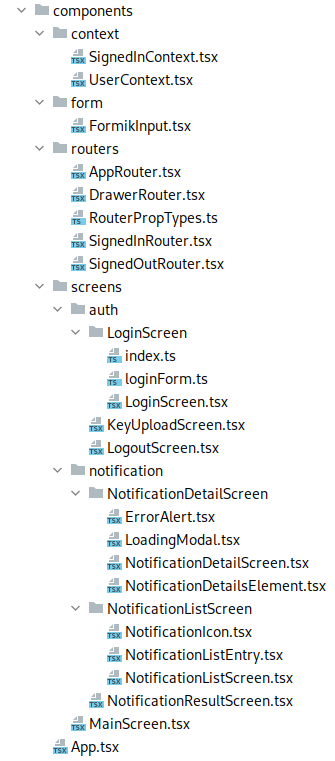

=== Aplikacja mobilna

Aplikacja mobilna została wykonana z pomocą podobnych technologii i narzędzi jak w przypadku aplikacji mobilnej.
Podstawę stanowią język programowania TypeScript oraz framework React Native, który jest wersją framework'a react
dostosowaną do tworzenia natywnych aplikacji mobilnych. Pozwala on na równoczesne tworzenie kodu na platformy
Android oraz iOS, jednak w projekcie zdecydowano się wspierać tylko system Android. Jest to podyktowane brakiem
potrzebnych urządzeń funduszy. Tak samo, jak w aplikacji mobilnej, projekt budowany jest przy pomocy programu _yarn_,
a za jakość kodu odpowiadają _prettier_ oraz _eslint_.

Od czytelnika wymagana jest podstawowa znajomość języka JavaScript w standardzie ECMA2017 oraz TypeScript w wersji co
najmniej 4.4. Tłumaczone będą niektóre mechanizmy charakterystyczne dla framework'a React Native, natomiast jego
znajomość również jest zalecana, gdyż wiele pojęć związanych z tą technologią nie zostanie opisanych szczegółowo.

==== Struktura komponentu

Główny katalog projektu aplikacji mobilnej zawiera głównie pliki konfiguracyjne dla wykorzystywanych narzędzi,
a także kilka folderów, zawierających kod źródłowy, testy oraz folder _android_ zawierający natywny kod w Javie,
który został automatycznie wygenerowany przez framework React Native.

.Układ katalogów w folderze głównym aplikacji mobilnej.
image::../images/mobileapp_root_dir.png[]

Folder zawiera znany już plik _.gitignore_, dodający wyjątki dla programu git. Konfiguracja narzędzi do stylizacji
kodu odbywa się w plikach _.eslintignore_ i _.eslintrc_ dla programu _eslint_ oraz _.prettierrc_ dla programu
_prettier_. Transpilatory języka javascript wykorzystywane w projekcie to _babel_ oraz _metro_. Pozwalają one
na używanie niestandardowej składni języka w kodzie jak na przykład wykorzystywanie kodu html. Ich konfiguracja
zawiera się odpowiednio w _babel.config.js_ oraz _metro.config.js_. Aby umożliwić dynamiczną aktualizację
aplikacji przy zmianie kodu, wykorzystywany jest program _watchman_, który skonfigurowany jest w pliku
_.watchmanconfig_. Pliki _.buckconfig_, _app.json_ zawierają konfigurację dla aplikacji React Native. Sama aplikacja
uruchamiana jest poprzez plik _index.js_. Interesujący jest plik _shim.js_, gdyż zawiera on brakujący kod pozwalający
na wykorzystywanie pakietów _node_ w aplikacji React Native. Folder główny zawiera również plik _tsconfig.json_,
zawierający ustawienia dla kompilatora TypeScript, _yarn.lock_ przechowujący metadane wykorzystywanych pakietów_,
_package.json_ zawierający ustawienia procesu budowania oraz wykorzystywane biblioteki, a także _readme_ z informacjami
o tym module. Komponent zawiera dwa foldery na testy. Katalog _tests_ przechowuje testy jednostkowe i integracyjne,
a _e2e_ miał przechowywać automatyczne testy end-to-end. Niestety znajdują się tam tylko scenariusze testowe w języku
Gherkin, a sama ich implementacja nie została zrealizowana. Zadanie to planowane jest na następne wydania. Ostatnim
folderem jest _src_, zawierający sam kod źródłowy aplikacji.

.Układ katalogów w folderze _src_.
image::../images/mobileapp_src_content.png[]

Główna część aplikacji, czyli kod odpowiedzialny za wyświetlanie stron, poszczególne komponenty czy też routing
znajdują się w folderze _components_. Katalogi _res_ i _constants_ zawierają stałe wartości oraz inne zasoby aplikacji.
Folder _utils_ przechowuje różne funkcje pomocnicze, a _bitcoin_ zawiera kod pozwalający na używanie biblioteki
_bitcoinjs_ w kodzie aplikacji mobilnej. Ostatnim katalogiem jest _webservice_, zawierający obiekty modelowe oraz
funkcje odpowiedzialne za wysyłanie żądań do serwera.

==== Wartości stałe i zasoby

Stałe oraz zasoby wykorzystywane w aplikacji niebędące plikami przechowywane są w dwóch folderach, czyli _res_ oraz
_constants_. Dwa foldery wynikają z błędu popełnionego podczas implementacji dwóch zadań jednocześnie przez różne
osoby. Pomyłka ta obecna jest w aplikacji do dziś, gdyż były to ostatnie zadania przed prezentacją projektu w ramach
przedmiotu PAMO. Jest to jedna z rzeczy, które powinny zostać poprawione w następnych wydaniach projektu.

.Zawartość folderów res i constants.
image::../images/mobileapp_res_const_content.png[]

Oba foldery zawierają łącznie tylko 7 plików. Każdy z nich eksportuje obiekty przechowujące dane potrzebne do działania
aplikacji. W katalogu _res_ znajduje się plik o nazwie _R.ts_. Jego zadaniem jest grupowanie innych zasobów
z jednym obiekcie, aby zunifikować dostęp do nich. Nazwa pliku pochodzi z konwencji obecnej przy tworzeniu aplikacji
mobilnych w języku Java. Wszystkie zasoby w dostępne są dla programisty poprzez obiekt _R_ zapewniony przez framework
programowania aplikacji Android. Konwencja ta została przez zespół przyjęty również w aplikacji tworzonej w React
Native, aby ułatwić dostęp oraz zwiększyć czytelność kodu.

.Zawartość pliku R.ts.
[source, typescript]
----
include::../../../mobileapp/src/res/R.ts[lines=10..18]
----

Plik zawiera tylko definicję stałego obiektu, który grupuje pozostałe obiekty wyeksportowane w tym folderze.
Zawiera on plik ze stałymi łańcuchami znaków, nazwy ekranów używane w routingu, definicje ekranów zawierających
parametry (używane przy przekierowaniu z powiadomienia push), listę kolorów oraz dane wymagane do utworzenia
nowego powiadomienia push. Dla przykładu zostanie zaprezentowana zawartość pliku _colors.ts_.

.Zawartość pliku colors.ts.
[source, typescript]
----
include::../../../mobileapp/src/res/colors.ts[lines=4..11]
----

Drugi folder zawierający stałe to _constants_. Zawiera on tylko jeden plik, którego zawartością jest typ wyliczeniowy
reprezentujący klucze wartości zapisywanych lokalnie w trakcie działania aplikacji.

.Zawartość pliku LocalKey.ts.
[source, typescript]
----
include::../../../mobileapp/src/constants/LocalKey.ts[lines=4..9]
----

Aplikacja w swojej pamięci zapisuje adres email, adres URL serwera, token, czyli kluczy prywatny administratora oraz
nazwę kanały WebSocket, na który przychodzą powiadomienia push.

==== Funkcje i pliki użytkowe

Folder _utils_ przechowuje pliki zawierające różne funkcje wykorzystywane w innych miejscach aplikacji. Można o
nich myśleć tak samo, jak o serwisach w przypadku aplikacji napisanej w Javie i framework'u Spring. Katalog
_bitcoin_ zawiera natomiast tylko jeden plik, który umożliwiający wykorzystanie biblioteki _bitcoinjs_ w kodzie
aplikacji mobilnej.

.Zawartość folderów utils i bitcoin.
image::../images/mobileapp_utils_btc_content.png[]

W obu katalogach znajdują się zaledwie cztery pliki. Folder _bitcoin_ zawiera plik index.ts, który eksportuje
bibliotekę _bitcoinjs_ jako moduł. Plik _hex.ts_ w katalogu _utils_ zawiera funkcje służące do obsługi
konwersji pomiędzy heksadecymalnym łańcuchem znaków a tablicą bajtów. Zawiera ona dwie funkcje, _toHexString_ oraz
_toHexBytes_, które obsługują konwersje w obie strony. Następnym plikiem jest _strings.ts_. Zawiera on dwie
funkcje pozwalające na operowanie na łańcuchach znaków

.Funkcje w pliku strings.ts.
[source, typescript]
----
include::../../../mobileapp/src/utils/strings.ts[lines=6..7]

include::../../../mobileapp/src/utils/strings.ts[lines=14..21]
----

Pierwszą funkcją jest _capitalize_. Pozwala ona na zmianę pierwszego znaku łańcucha znaków na dużą literę. Druga funkcja
służy do walidacji adresu URL. Jeżeli adres podany jako łańcuch znaków jest poprawny, funkcja zwróci wartość prawdziwą.
Ostatnim plikiem jest _bitcoin.ts_. Zawiera on funkcje obsługujące funkcjonalności związane z protokołem Bitcoina,
czyli generowanie kluczy oraz podpisywanie transakcji. Funkcje te są krytyczne dla działania aplikacji mobilnej.
Pierwsza z nich odpowiada za generowanie pary kluczy:

.Metody generateKeyPair z pliku bitcoin.ts.
[source, typescript]
----
include::../../../mobileapp/src/utils/bitcoin.ts[lines=46..50]
----

Funkcja ta jest prosta w działaniu. Wywoływana jest odpowiednia funkcja z biblioteki _bitcoinjs_, która generuje
parę kluczy. Jedynym jej parametrem jest sieć, w której operuje aplikacja. W obecnym wydaniu aplikacji mobilnej
wspierana jest tylko sieć _testnet_. Druga funkcja w tym pliku służy do podpisywania transakcji:

.Funkcja signTx z pliku bitcoin.ts.
[source, typescript]
----
include::../../../mobileapp/src/utils/bitcoin.ts[lines=18..39]
----

Parametrami tej funkcji jest surowa transakcja zapisana jako łańcuch znaków w formacie heksadecymalnym, klucz
prywatny jako tablica bajtów, reprezentowana przez obiekt _Buffer_ oraz _redeemScript_, ponownie jako szesnastkowy
łańcuch znaków. Najpierw tworzone są obiekty _Transaction_ oraz _TransactionBuilder_ pochodzące z biblioteki
_bitcoinjs_. Następnie następuje przejście przez wszystkie wejścia transakcji, gdzie następuje próba ich podpisania.
Nie ma potrzeby wskazywania konkretnego wejścia do podpisania, ponieważ wszystkie środki przychodzą na jeden adres,
który został zbudowany ze wszystkich kluczy publicznych administratorów. Oznacza to, że każdy administrator musi
podpisać każde wejście transakcji. Dodatkowo w procesie następuje konwersja otrzymanej tablicy bajtów na obiekt
_ECPair_, a także przekształcenie _redeemScript'u_ z łańcucha znaków na tablicę. Na koniec w mało elegancki sposób
zwracana jest podpisana surowa transakcja jako szesnastkowy łańcuch znaków. Brak wsparcia dla PSBT po stronie serwera
zmusza do próby zbudowania kompletnej transakcji. Jeżeli zostanie rzucony wyjątek, to budowana jest niekompletna
transakcja. Jest to proste obejście braku tej kluczowej dla projektu funkcjonalności biblioteki _BitcoinJ_.

==== Klient HTTP

Zawartością folderu _webService_ są funkcje obsługujące połączenie z serwerem projektu, ścieżki do zasobów oraz
definicje typów dla ciał żądań HTTP. Katalog ten jest bardzo podobny do folderu o tej samej nazwie znajdującego się
w kodzie komponentu aplikacji internetowej. Na pewnym etapie prac kod ten znajdował się w osobnym module, który
był importowany zarówno przez aplikację internetową, jak i aplikację mobilną. Niestety rozwiązanie to było dalekie
od ideału. Wspólny moduł musiał być przy każdej modyfikacji kompilowany oraz ręcznie dołączany do obu projektów.
Pojawiły się również spore problemy przy uruchomianiu testów jednostkowych. Zdecydowano się na podzielenie wspólnego
modułu, a także na skopiowanie niektórych plików, aby ruszyć do przodu z implementacją, gdyż zespołowi nie udało się
znaleźć satysfakcjonującego rozwiązania w akceptowalnym czasie.

.Zawartość folderu webService.
image::../images/mobileapp_webservice_content.png[]

Katalog zawiera dwa pliki. W _routes.ts_ przechowywane są ścieżki do zasobów serwera. Wykorzystywane są one w pliku
_routes.ts_ do wykonywania żądań HTTP. Plik ten zawiera klasę _Requests_ typu singleton, która zawiera metody
pozwalające na wysyłanie żądań. Funkcje reprezentujące pojedyncze żądania one udostępnione programiście poprzez ich
eksport jako zwykły obiekt JavaScript.

.Fragment klasy Requests zawierający publicznie dostępne funkcje do wysyłania żądań.
[source, typescript]
----
include::../../../mobileapp/src/webService/requests.ts[lines=43..58]
----

Wszystkie publiczne funkcje są pogrupowane w hierarchii obiektów, dzięki czemu można jest w elegancki sposób wywoływać
bez potrzeby tworzenia za każdym razem obiektu klasy _Requests_. W przypadku każdej z nich wykonywane jest żądanie
z pomocą metody _request_. Parametry wejściowe są do niej przekazywane, a zwracany obiekt _Promise_ opakowuje
odpowiedź HTTP. Kod metody _request_ prezentuje się następująco:

.Metoda request klasy Requests w pliku requests.ts.
[source, typescript]
----
include::../../../mobileapp/src/webService/requests.ts[lines=127..148]
----

Jest to metoda generyczna. Jako typy przyjmuje ona typy ciała odpowiedzi oraz żądania HTTP. Parametrami jest adres
zasobu, obiekt konfiguracyjny biblioteki _axios_ zawierający właściwe parametry żądania jak metoda czy ciało, oraz
flagę informującą o konieczności załączenia tokena JWT. Z pomocą biblioteki _axios_ wysyłane jest żądanie, a zwracany
jest jego status, a także w przypadku sukcesu ciało odpowiedzi. Co więcej, jeżeli wystąpi błąd połączenia, użytkownikowi
wyświetlany jest odpowiedni komunikat. Typy obiektów przesyłanych jako ciało żądań i odpowiedzi zdefiniowane są w
plikach znajdujących się w folderze _interface_. Odzwierciedlają one obiekty przesyłane do i z serwera.

==== Komponenty

.Zawartość folderu components..

