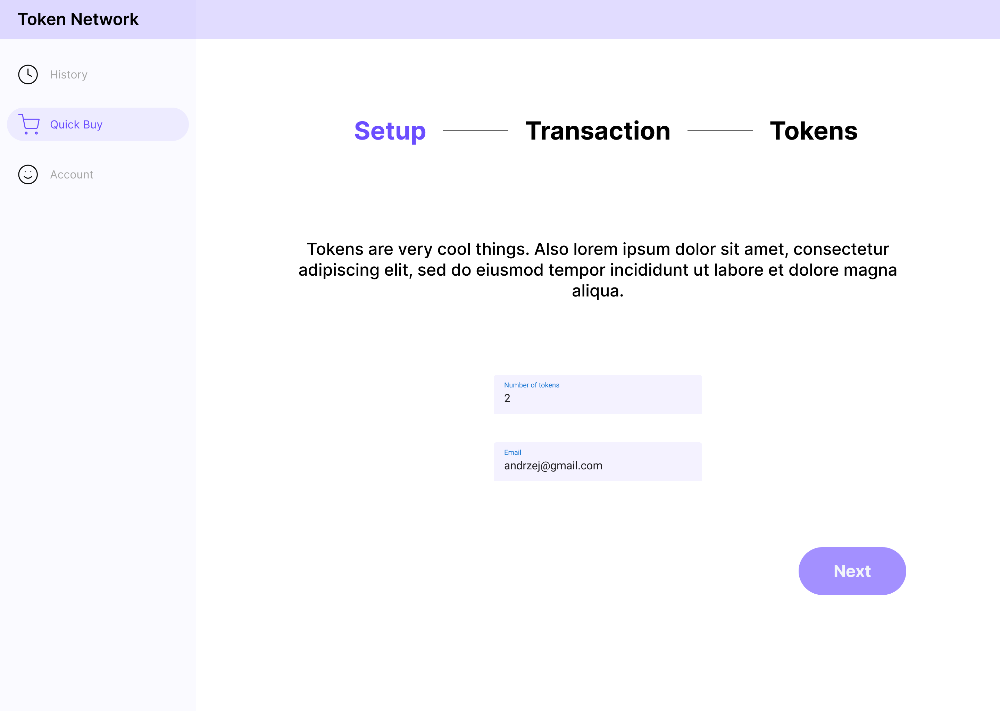
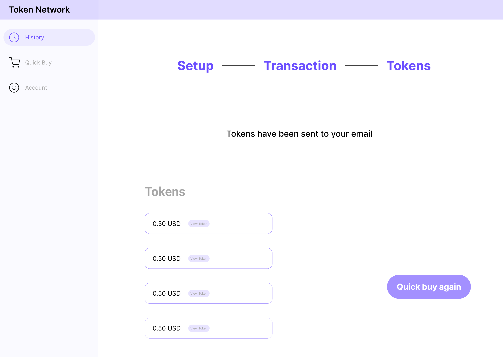

:image-size: pdfwidth=75%

[#_makieta_interaktywna]
=== Makieta interaktywna

Makieta interaktywna została stworzona w celu rozplanowania układu interfejsu użytkownika. Przedstawiono na niej
najbardziej istotne ekrany w aplikacji internetowej. Uznano, że nie ma potrzeby stworzenia makiety dla wszystkich
ekranów. Makieta została wykonana przy użyciu narzędzia Figma. Pozwala ono na stworzenie ekranów, a następnie
połączenie ich w makietę interaktywną. Pozwala to na spojrzenie na projektowaną aplikację z punktu widzenia
użytkownika przed rozpoczęciem implementacji. Dzięki temu od samego początku prac nad projektem rozwiązane zostały
wszystkie kwestie związane z interfejsem użytkownika.

Po wejściu do aplikacji użytkownik przekierowany jest na stronę główną, pokazaną na rysunku 11. Tak jak każdy ekran,
zawiera ona nagłówek strony
wraz z nazwą aplikacji (początkowo _Token Network_, później nastąpiła zmiana na _LN Payments_). W centralnej części
ekranu znajduje się tytuł strony oraz 3 guziki. _Login_ przekierowuje na podstronę logowania, natomiast _Register_
na podstronę rejestracji użytkownika. Trzeci guzik _Quick buy_ pozwala na zakup tokenów bez rejestracji. Po kliknięciu
użytkownik przekierowany jest do formularza kupowania.

.Makieta strony głównej.
image::../images/mockup/main_page.png[{image-size}]

Strona logowania, widoczna na rysunku 12, jest prostym formularzem z dwoma polami tekstowymi, email i hasło,
oraz przyciskiem wysyłającym formularz. Po zalogowaniu użytkownik zostaje przekierowany do ekranu sprzedaży.

.Makieta podstrony logowania.

Tak samo, jak w przypadku podstrony logowania, podstrona rejestracji widoczna na rysunku 13 jest prostym formularzem z
kilkoma polami tekstowymi. Jeżeli zajdzie taka potrzebna, istnieje możliwość dodania kolejnych pół formularza w
przyszłości. Po wysłaniu formularza użytkownikowi wyświetlany jest komunikat o rezultacie żądania. W przypadku sukcesu
następuje przekierowanie na stronę logowania.

.Makieta podstrony rejestracji.
image::../images/mockup/register.png[{image-size}]

Inspirując się interfejsami użytkownika popularnych sklepów internetowych, proces płatności podzielony został na trzy
części. Użytkownik może się dowiedzieć, w której części procesu się znajduje za pomocą wskaźnika w górnej części
panelu. Pierwszym ekranem jest formularz, w którym użytkownik musi wybrać ilość tokenów, którą chce zakupić.
Znajduje się on na rysunku 14. Jeżeli zakup dokonywany jest bez logowania, wymagane jest również podanie adresu email.
Dodatkowo wyświetlany jest komunikat o sprzedawanym produkcie. Planowane jest również dodanie informacji o aktualnej
cenie. Po kliknięciu guzika _Next_ następuje przejście na następny ekran.

.Makieta formularza płatności.

Drugi ekran pokazany na rysunku 15 odpowiada samej płatności. W centralnej części ekranu znajduje się kod QR, który
należy zeskanować przy pomocy osobistego portfela, aby zapłacić za tokeny. Nad kodem QR wyświetla się finalna cena
zakupu. Pod kodem QR znajduje się przełącznik, dzięki któremu można przełączyć się pomiędzy kodem służącym do płatności
a kodem zawierającym adres węzła. Należy go zeskanować, aby utworzyć kanał płatności z serwerem. Czas na wykonanie
płatności to 15 minut. Po tym czasie ekran automatycznie przełączy się z powrotem na formularz płatności (bądź stronę
główną dla niezalogowanych użytkowników). Pozostały czas do zapłacenia wyświetla się w prawym dolnym rogu.

.Makieta ekranu płatności.
image::../images/mockup/buy_2.png[{image-size}]

Po zakończeniu płatności użytkownik przekierowany jest na ostatni ekran wyświetlający podsumowanie zakupu, pokazanym
na rysunku 16. Na ekranie widoczne jest krótkie podziękowanie oraz lista zakupionych tokenów. Dodatkowo w prawym dolnym
rogu znajduje się guzik pozwalający na ponowne dokonanie zakupu.

.Makieta ekranu z podsumowaniem zakupu.

Pierwszym ekranem dostępnym tylko dla administratorów jest panel zarządzania administratorami, pokazany na rysunku 17.
Fakt zalogowania jako administrator można stwierdzić po ikonie na górnym pasku nawigacji oraz po o wiele większej
ilości ikon w panelu bocznym. Sam panel zarządzania administratorami składa się tabeli wyświetlającej szczegóły o
administratorach, w tym informację o przypisaniu do portfela oraz o statusie przesłania klucza publicznego. W górnej
części znajduje się przycisk przekierowujący do formularza pozwalającego na dodanie nowych administratorów.

.Makieta ekrany zarządzania administratorami.
image::../images/mockup/admin_management.png[{image-size}]

Aby uzyskać dostęp do portfela i wszystkich funkcjonalności z nim związanych, należy go najpierw utworzyć z
wykorzystaniem specjalnego formularza, widocznego na rysunku 18. Wyświetlać się on będzie w miejscu portfela, gdy nie
będzie on zainicjowany. Formularz składa się z pola liczbowego, określającego wymaganą liczbę podpisów do odblokowania
środków na adresie multisig. Drugim polem będzie lista rozwijana, która pozwoli na wybranie z listy administratorów z
wygenerowanymi kluczami. Po wysłaniu formularza zostanie utworzony portfel, a użytkownik zostanie przekierowany na jego
ekran.

.Makieta strony z ustawieniami serwera.

Ekran portfela składa się z kilku mniejszych komponentów wyświetlających informacje o stanie finansów serwera.
Zaprezentowany jest na rysunku 19. Pierwszym komponentem jest stan portfela Bitcoin. Wyświetlana jest aktualnie
posiadana kwota oraz kwota z niepotwierdzonych transakcji. Niepotwierdzona transakcja to taka, która pojawiła się w
puli transakcji, ale nie została jeszcze wykopana. Jeżeli nie zostanie ona wykopana przez 72 godziny, jest usuwana z
puli i nie zostanie uznana za potwierdzoną. Dodatkowo niektóre implementacje wymagają, aby transakcja nie znajdowała
się w ostatnim bloku łańcucha.
Drugim komponentem jest aktualny stan portfela znajdującego się w sieci Lightning. Tak samo, jak w przypadku
poprzedniego komponentu, wyświetlane są środki znajdujące się w portfelu, jednakowo potwierdzone oraz niepotwierdzone.
Ostatni komponent z pierwszego rzędu zawiera informację o środkach zablokowanych w kanałach płatności po stronie
serwera. Drugą informacją jest suma aktualnie otwartych kanałów płatności. W dolnej części panelu znajduje się
wykres, na którym będzie można wyświetlić różne dane statystyczne związane z serwerem. Dla przykładu został podany
całkowity dochód serwera ze sprzedaży tokenów. Ostatnim elementem znajdującym się w panelu portfela jest komponent
akcji. Zawiera on przyciski, za pomocą których można wykonywać akcje w portfelu, takie jak zamknięcie kanałów czy też
odtworzenie portfela.

.Makieta ekranu portfela.
image::../images/mockup/wallet.png[{image-size}]

Finalną częścią aplikacji internetowej jest ekran transakcji, widoczny na rysunku 20. Podobnie jak ekran zarządzania
administratorami, zawierać on będzie listę transakcji, z wyszczególnieniem transakcji aktualnie trwającej (planowany
jest limit jednej aktualnie trwającej transakcji). Przycisk w górnej części komponentu pozwala na przejście do
formularza służące do inicjacji transakcji. Przycisk ten będzie niedostępny, jeżeli już będzie przetwarzana transakcja
w danym czasie.

.Ekran tworzenia i wyświetlania transakcji.
image::../images/mockup/transactions.png[{image-size}]

Makieta interaktywna nie uwzględnia wielu paneli, ponieważ zostały one uznane za zbyt oczywiste do implementacji.
Postanowiono skupić się przede wszystkim na tych ekranach, które nie są jasne, bądź na których było do uzgodnienia i
rozplanowania więcej kwestii. Najważniejszym powodem utworzenia makiety było poznanie przyszłego układu aplikacji i to
zadanie zostało wykonane.
