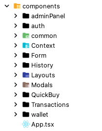
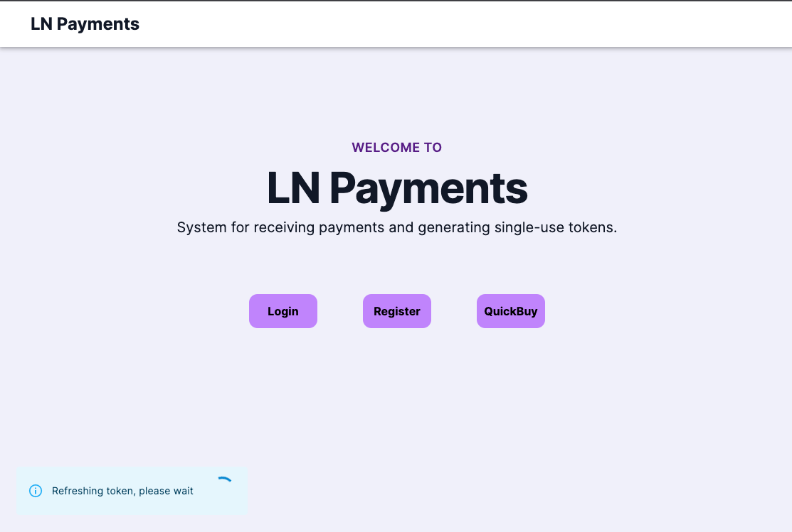
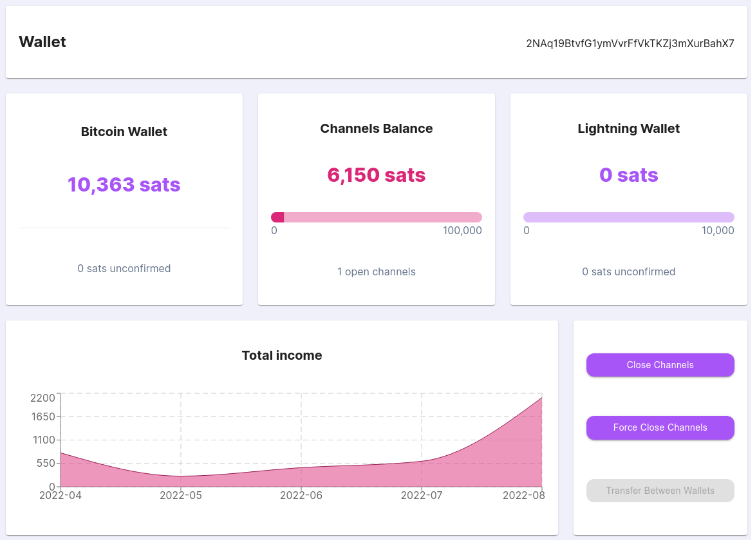
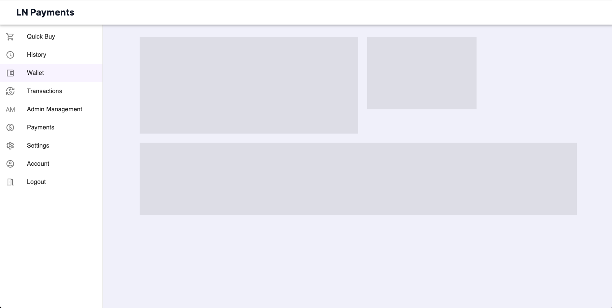
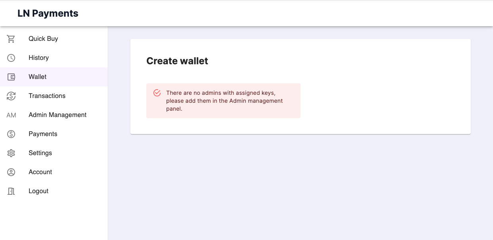
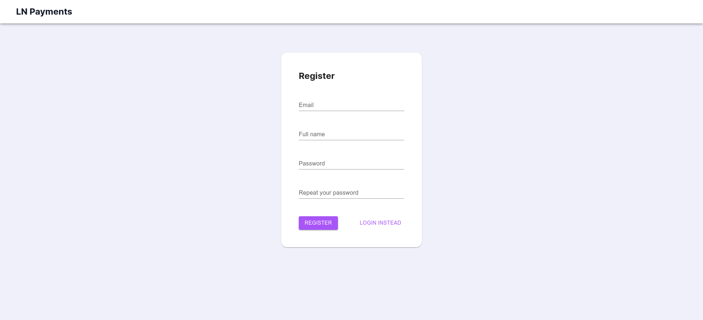

=== Aplikacja webowa

Aplikacja webowa została wykonana w oparciu o bibliotekę _React_.
Zespół zdecydował się na używanie komponentów funkcyjnych.
Biblioteka _Vite_ pomaga urochomić środowisko deweloperskie z przeładowywaniem aplikacji w czasie rzeczywistym przy każdej zmianie kodu.
Wiele komponentów bazuje na bibliotece _material-ui_. Znacznie przyspieszyła rozwój interfejsu utrzymając estetyczny wygląd.

Od czytelnika wymagana jest znajomość języka TypeScript.
Dużo elementów jest charakterystycznych dla biblioteki _React_.
Jej znajomość również jest zalecana, gdyż wiele pojęć związanych z tą technologią nie zostanie opisanych szczegółowo.

==== Struktura plików
.Układ katalogów i plików w folderze głównym aplikacji webowej
image::../../images/webapp/root_dir.png[]

W głównym folderze znajdują się pliki konfiguracyjne, katalog _src_ oraz katalog _tests_.
Katalog _tests_ przechowuje testy, mocki danych oraz kod potrzebny do konfiguracji środowiska testowego.
Katalog _src_ przechowuje kod źródłowy aplikacji webowej.

.Układ katalogów w folderze _src_
image::../../images/webapp/src_dir.png[]

Z katalogu _pages_ są udostępniane komponenty stanowiące główną część, lub cały  widok pojedyńczej strony

.Układ katalogów i plików w folderze _pages_
image::../../images/webapp/src_pages_dir.png[]

Widoki są pogrupowane na domeny. Podobne pogrupowanie widoczne jest w innych miejscach aplikacji.

* auth - autentykacja użytkowników
* quickBuy - przyjmowanie pieniędzy i zwracanie tokenów
* userPanel - widoki dla zalogowanych użytkowników
** account - edycja swojego konta
** adminManagement - zarządzanie kontami adminów
** serverSettings - zarządzanie konfiguracjami serwera
** transactions - zarządzanie transakcjami
** wallet - zarządzanie portfelem

Katalog _components_ zawiera komponenty, które nie znajdują się w katalogu _pages_

.Układ katalogów i plików w folderze _components_

* common - komponenty wykorzystywane w więcej niż jednych widoku
* Context - komponenty zwracające _Reactowy context_ z przygotowanymi danymi i hookami
* Form - komponenty do tworzenia formularzy
* Layouts - komponenty, które wyświetlają inne komponenty dodając do nich pewne elementy
* Modals - okna dialogowe

Reszta katalogów w folderze _components_ jest nazwana od widoków, gdzie są wykorzystywane

* auth
* adminPanel
* wallet
* History
* Quickbuy
* Transactions

==== Pliki konfiguracyjne

* postcss.config.js - konfiguracja narzędzia _postcss_, wymagana przez _tailwindcss_
* jest.config.js - zawiera konfiguracje takich rzeczy jak generowanie raportów z testów, czy dodawanie ścieżek modułów wykorzystywanych w testach
* .prettierrc - konfiguracja narzędzia _prettier_
* .tailwind.config.js - konfiguracja narzędzia _tailwind_
* .vite.config.ts - zawiera ścieżki, których zapytania powinny być przekazane przez _vite_ do serwera, ponieważ w środowisku deweloperskim serwer i aplikacja webowa są uruchomione na różnych portach
[source,typescript]
----
include::../../../../webapp/vite.config.ts[lines=7..20]
----
** .eslintrc - zawiera informacje o tym jakiego typu problemy ze składnią powinien zgłaszać _eslint_ przy analizowaniu kodu

==== Nawigacja

Do nawigacji została wykorzystana biblioteka _react-router-dom_.
Przypisanie komponentów do ścieżek można zobaczyć w komponencie głównym aplikacji - _src/components/App.tsx_.

.App.tsx
[source, typescriptjsx]
----
include::../../../../webapp/src/components/App.tsx[lines=40..57]
...
----

Ścieżki URL aplikacji webowej zostały zapisane w postaci _JSON_ do pliku _src/routesBuilder.ts_ w celu zwiększania elastyczności kodu.

Oprócz zdefiniowanych ścieżek, widać zagnieżdżenie większości komponentów aplikacji w _contextach_ i _layoutach_.
Layout _NavbarLayout.tsx_ zgnieżdża prawie każdy widok, ponieważ dodaje górny pasek nawigacyjny do widoków.
Jedyne widoki, które owego paska nie posiadają są _LogoutPage.tsx_ i _Error404Page.tsx_.
Do tego Sprawdza, czy _UserContext.tsx_ wczytuje token, jeśli tak to dodaje notyfikacje z informacją, że token jest w trakcie ładowania.

.NavbarLayout.tsx
[source, typescriptjsx]
----
include::../../../../webapp/src/components/Layouts/NavbarLayout.tsx[lines=9..32]
----

.Wiadomość o wczytywaniu tokenu w lewym dolnym rogu

_UserLayout.tsx_, tak samo jak _AdminLayout.tsx_ i _PublicLayout.tsx_ przekierowuje użytkownika w zależności od jego stanu.
Zagnieżdżają w sobie komponenty w zależności od tego komu należy się udostępnić dany widok.

* _UserLayout.tsx_ - przekierowuje do strony logowania jeśli użytkownik nie jest zalogowany, lub do strony głównej jeśli użytkownik ma rolę tymczasową
* _AdminLayout.tsx_ - przekierowuje do strony logowania jeśli użytkownik nie jest zalogowany, lub do strony głównej jeśli użytkownik nie jest adminem
* _PublicLayout.tsx_ - przekierowuje do panelu użytkownika jeśli użytkownik jest zalogowany i ma rolę inną niż tymczasową

.UserLayout.tsx
[source, typescriptjsx]
----
include::../../../../webapp/src/components/Layouts/UserLayout.tsx[lines=9..18]
----

_UserContext.tsx_ jest odpowiedzialny za przechowywanie danych o użytkowniku oraz sprawdzanie ważności tokenu dostępu do serwera.
Jeśli odświeżanie tokenu się nie powiedzie, użytkownik jest wylogowywany, a zarazem przekierowany przez _UserLayout.tsx_ lub _AdminLayout.tsx_ do strony logowania.
Jeśli odświeżanie się powiedzie, kolejne odświeżenie zostaje zakolejkowane do wykonania za 10 minut.
Ponieważ ważność tokenu na serwerze jest ustalona na 15 minut, token jest zawsze ważny.
Udostępnia również pomocnicze metody w celu wyeliminowania powtórzeń np. _login_, _logout_.
Wszystkie komponenty są zagnieżdżone w tym context'ście, żeby dane użytkownika nie zmieniły się przy zmienianiu widoków.

.Funkcje _login_ i _logout_ pliku UserContext.tsx
[source, typescriptjsx]
----
include::../../../../webapp/src/components/Context/UserContext.tsx[lines=47..59]
----

.Odświeżanie tokenu w pliku UserContext.tsx
[source, typescriptjsx]
----
include::../../../../webapp/src/components/Context/UserContext.tsx[lines=61..79]
----

_UserContext.tsx_ obejmuje wszystkie widoki, tak żeby dane o użytkowniku nie zostały usunięte przy zmianie widoków.
Do tego korzysta z pliku pomocnicznego _src/utils/persist.ts_, aby dane o użytkowniku zostały zapisane nawet przy zamknięciu przeglądarki.

Plik _persist.ts_ zawiera funkcje dotyczące długotrwałego zapisu danych.
Korzysta z _localStorage_, czyli API do długotrwałego zapisu danych dostępnego w przeglądarce. _localStorage_ pozwala zapisać dane typu klucz wartość, ale klucz i wartość muszą być wartością tekstową.
Zostały napisane funkcje, aby obejść te ograniczenie zamieniając obiekty na wartość tekstową przy zapisywaniu i odwrotnie przy wczytywaniu.

Funkcja _setLocalJson_ zamienia przyjętą wartość w ciąg tesktowy i zapisuje go w _localStorage_.

.Funkcja setLocalJson pliku persist.ts
[source, typescript]
----
include::../../../../webapp/src/utils/persist.ts[lines=13..15]
----

Funkcja _getLocalJson_ pobiera wartość z _localStorage_ i zamienia ją z ciagu teskstowego na _JSON_, przy okazji zamieniając ciągi tekstowe na obiekty _Date_.

.Funkcja getLocalJson pliku persist.ts
[source, typescript]
----
include::../../../../webapp/src/utils/persist.ts[lines=4..11]
----

Ponieważ w Reactcie zmienne wartości muszą być przechowywane w stanie, został napisany hook _useLocalStorage_, który oprócz zapisywania wartości w stanie, nadpisuje ją w _localStorage_.
Używa się go jak standardowego hooku _useState_, z tą różnicą, że zamiast przyjmować wartość, przyjmuje klucz, który wskazuje na wartość w _localStorage_.

.Funkcja _useLocalStorage_ pliku _persist.ts_
[source, typescript]
----
include::../../../../webapp/src/utils/persist.ts[lines=17..30]
----

Pasek nawigacyjny po lewej stronie ekranu został zaimplementowany w _src/components/common/Sidebar/Sidebar.tsx_.
Jest on dodawany do komponentów w _PanelLayout.tsx_. Każdy przycisk na tym pasku jest zdefiniowany przy pomocy komponentu _SidebarEntry.tsx_.
Jest możliwość przekazania do niego argumentu _adminOnly_, jeśli przycisk ma być wyświetlony tylko dla adminów.
Przycisk jest podświetlony, jeśli otwarta ścieżka w przeglądarce zawiera w sobie ścieżkę danego przycisku.

[source, typescript]
----
include::../../../../webapp/src/components/common/Sidebar/SidebarEntry.tsx[]
----

==== Internacjonalizacja

Korzystanie z biblioteki _i18next_ usprawnia odizolowanie wartości tekstowych wyświetlanych użytkownikowi od kodu i zmienienie języku interfejsu.
W chwili obecnej aplikacja posiada tylko jeden język - angielski, lecz taka izolacja pozwala na ograniczanie powtórzeń i łatwiejsze poprawki i zmiany.
Tekst jest zapisany w postaci plików _json_ w folderze _src/locales_ pogrupanych na domeny.

.Układ katalogów i plików w folderze _locales_
image::../../images/webapp/src_locales_dir.png[]

==== Komunikacja z serwerem
W katalogu _src/webServer_ znajduje się interfejs do komunikacji z serwerem.
Wyodrębnione zostały funkcje odpowiedzialne za pobieranie danych, w taki sposób, żeby wywołanie funkcji było czytelne i bez niepotrzebnych powtórzeń.

.Układ katalogów i plików w folderze _webService_
image::../../images/webapp/src_webService_dir.png[]

* interface - typy, opisujące dane zwracane z serwera
* routes.ts - ścieżki URL do serwera w postaci _JSON_
* requests.ts - przechowuje singleton klasy _Requests_, która jest odpowiedzialna za komunikację z serwerem

.Klasa _Requests_
[source, typescript]
----
include::../../../../webapp/src/webService/requests.ts[lines=42..51]
...
----

Klasa _Requests_ posiada pole _api_, przechowujące funkcje, które wysyłają zapytania do API serwera.
Każda funkcja jest odpowiedzialna za komunikację z jedną ścieżką serwera.

.Pole _api_ metody _Requests_
[source, typescript]
----
include::../../../../webapp/src/webService/requests.ts[lines=53..68]
...
----

Dla ujednolicenia funkcji w polu _api_, każda z nich zwraca ten sam interfejs - _Response_.

.Typ _Response_ pliku _requests.ts_
[source, typescript]
----
include::../../../../webapp/src/webService/requests.ts[lines=31..34]
----

Każda funkcja w polu _api_ wykorzystuje metodę _request_, która dodaje do zapytania nagłówek z tokenem i wykonuje je przy użyciu biblioteki _axios_.

.Metoda _request_ klasy _Requests_
[source, typescript]
----
include::../../../../webapp/src/webService/requests.ts[lines=195..216]
----

Ponieważ serwer zwraca różne kody HTTP, a biblioteka _axios_ wyrzuca błąd jeśli kod odpowiedzi nie jest kodem powodzenia, metoda _request_ wyłapuje błąd zwracany przez axios i zwraca obiekt typu _Response_ z pustym polem danych, zamiast wyrzucać błąd. Oznacza to, że nie trzeba wyłapywać błędu przy każdym wywołaniu funkcji pola _api_. Żeby zobaczyć, czy zapytanie zakończyło się powodzeniem, wystarczy sprawdzić pole _status_ zwracanego obiektu.

.Przykład użycia pliku _requests.ts_
[source, typescript]
----
import { requests } from 'webService/requests'

const { data, status } = requests.api.auth.login('admin@admin.pl', 'password1')
----

==== Portfel

Katalog _src/components/wallet_ zawiera komponenty potrzebne do stworzenia widoku wyświetlającego dane o portfelu.

===== _WalletCard.tsx_

Widok portfelu składa się z kafelek, dlatego powstał komponent _WalletCard.tsx_, z którego korzystają wszystkie komponenty reprezentujące kafelek, aby ujednolicić wygląd i uniknąć powtórzeń.

.WalletCard.tsx
[source, typescriptjsx]
----
include::../../../../webapp/src/components/wallet/WalletCard.tsx[lines=9..16]
----

.Kafelki na widoku portfelu

===== _ProgressCard.tsx_

_ProgressCard.tsx_, podobnie jak _WalletCard.tsx_, jest wykorzystywany w wielu miejscach.
Przy wyświetlaniu stanu środków portfelu i stanu środków w kanałach _Lightning Network_
Przyjmuje informacje o tym jaki tekst ma być wyświetlony na kafelce i wartości liczbowe jakie mają być wyświetlone na pasku wczytywania.

.ProgressCard.tsx
[source, typescriptjsx]
----
include::../../../../webapp/src/components/wallet/ProgressCard.tsx[lines=25..41]
----

Dane liczbowe są przekazywane do komponentu _BalanceProgressBar.tsx_, który jest odpowiedzialny za wyświetlanie paska.

.BalanceProgressBar.tsx
[source, typescriptjsx]
----
include::../../../../webapp/src/components/wallet/BalanceProgressBar.tsx[lines=11..34]
----

===== _TotalIncomeChart.tsx_

Ten komponent wyświetla dane z serwera w postaci wykresu korzystając z biblioteki _recharts_.

===== _WalletLoadingSkeleton.tsx_
Ten komponent mniej więcej odwzorowuje kafelki stanowiące interfejs widoku _WalletPage.tsx_.
Jest wyświetlany podczas wczytywania danych o portfelu.

.Widok portfelu podczas wczytywania

.WalletLoadingSkeleton.tsx
[source, typescriptjsx]
----
include::../../../../webapp/src/components/wallet/WalletLoadingSkeleton.tsx[]
----

===== _WalletCreatePage.tsx_

Jeśli na widoku portfelu serwer nie ma stworzonego portfelu zostanie wyświetlony widok _WalletCreatePage.tsx_ do jego stworzenia.
Żeby stworzyć portfel potrzebny jest conajmniej jeden admin z przypisanym kluczem publicznym.
W komponencie _WalletCreatePage.tsx_ pobierani są użytkownicy z rolą _admin_ i filtrowani sprawdzając obecność klucza publicznego.
Jeśli długość tablicy zawierającej filtrowanych adminów wynosi zero, zamiast formularza zwracany jest komunikat błędu.

.Pobieranie adminów w _WalletCreatePage.tsx_
[source, typescriptjsx]
----
include::../../../../webapp/src/pages/userPanel/wallet/WalletCreatePage.tsx[lines=24..35]
----

.Widok formularza portfelu przy

==== Płatność
.QuickBuy
image::../../images/system_presentation/webapp/qb_1.png[]
Komponent do przyjmowania płatności składa się z trzech komponentów, które są naprzemiennie wyświetlane.
Do każdego komponentu są przekazywane te same argumenty, takie jak cena pojedyńczej transakcji, funkcje do przechodzenia do następnego komponentu.
Do wyświetlania aktywnego komponentu służy komponent _QuickyBuy.tsx_.

.Fragment QuickBuy.tsx
[source, typescriptjsx]
----
include::../../../../webapp/src/components/QuickBuy/QuickBuy.tsx[lines=71..94]
----

===== SetupStage.tsx
Pierwszym krokiem jest formularz, w którym użytkownik ustawia ilość tokenów, które chce kupić.
Jeśli użytkownik nie jest zalogowany, zostanie wyświetlone pole na email, a po zatwierdzaniu formularza użytkownik zostanie zalogowany z rolą tymczasową.

.Logowanie tymczasowego użytkownika
[source, typescriptjsx]
----
include::../../../../webapp/src/components/QuickBuy/Stages/SetupStage/SetupStage.tsx[lines=31..52]
----

===== TokensStage.tsx
Drugim krokiem jest wyświetlenie informacji o transakcji i przejście na trzeci komponent, w momencie, gdy płatność zostanie wykonana.
Informacje przedstawione są w postaci kodu QR, który można zeskanować używając telefonu lub kopiując do schowka poprzez naciśnięcie na ten kod.

.QRComponent.tsx
[source, typescriptjsx]
----
include::../../../../webapp/src/components/QuickBuy/Stages/TransactionStage/QRComponent.tsx[lines=19..37]
----

Aby dostać informacje o tym, że płatność została wykonana w czasie rzeczywistym, komponent _TransactionStage.tsx_ łączy się do serwera przy pomocy _websocketu_.
Obiekt przedstawiający połączenie jest aktywowany przy wyświetleniu komponentu i deaktywowany jeśli komponent zostanie zamknięty.

.Tworzenie połączenie _websocket_ w TransactionStage.tsx
[source, typescriptjsx]
----
include::../../../../webapp/src/components/QuickBuy/Stages/TransactionStage/TransactionStage.tsx[lines=52..71]
----

Na dole komponentu znajduje się zegar odliczający czas do zamknięcia płatności.
Gdy czas dojdzie do zera, pojawi się okno dialogowe z adekwatną wiadomością, a aktywny komponent zostanie zmieniony na pierwszy.
Aktualizowaniem czasu zajmuje się _hook_ _useCountdown_ znajdujący się w pliku _src/utils/time.ts_.

._Hook_ _useCountdown_ w pliku _time.ts_
[source, typescriptjsx]
----
include::../../../../webapp/src/utils/time.ts[lines=7..32]
----

.Przykład użycia _useCountdown_ w _TransactionStage.tsx_
[source, typescriptjsx]
----
include::../../../../webapp/src/components/QuickBuy/Stages/TransactionStage/TransactionStage.tsx[lines=42..45]
.
.
.
include::../../../../webapp/src/components/QuickBuy/Stages/TransactionStage/TransactionStage.tsx[lines=95..97]
----

===== TokensStage.tsx
Ostatnim krokiem jest wyświetlenie tokenów zwróconych przez serwer.
Tokeny są wyświetlone w liście, gdzie każda pozycja ma przycisk do skopiowania tokenu do schowka i drugi przycisk do wyświetlenia tokenu.

.TokenItem.tsx
[source, typescriptjsx]
----
include::../../../../webapp/src/components/QuickBuy/Stages/TokensStage/TokenItem.tsx[lines=23..42]
----

Jeśli użytkownik na tym etapie ma tymczasowe konto, wyświetlona jest ostrzeżenie, że tokeny nie będą mogły być odczytane bo zamknięciu widoku.

.Ostrzeżenie w _TokensStage.tsx_
[source, typescriptjsx]
----
include::../../../../webapp/src/components/QuickBuy/Stages/TokensStage/TokensStage.tsx[lines=28..32]
----

==== Historia płatności

Do wyświetlenia historii płatności służy widok _HistoryPage.tsx_.

Ten widok wykorzystuje plik _Panel_, który składa się z trzech komponentów, które są przeznaczone do stylizacji widoków w panelu zalogowanego użytkownika.
Dodaje białe tło, duży nagłówek i dopełnienie do brzegów tła.
Każdy widok w panelu użytkownika korzysta z tych komponentów, dzięki czemu panel zachowuje jednolitą estetykę.

.Panel/index.ts
[source, typescript]
----
include::../../../../webapp/src/components/common/Panel/index.ts[]
----

.HistoryPage.tsx
[source, typescript]
----
include::../../../../webapp/src/pages/userPanel/HistoryPage.tsx[]
----

Aby wyświetlić dane w tabeli razem z elementami sterującymi paginacją, komponent _History.tsx_ korzysta z _ApiPageableTable.tsx_.
Ponieważ w większości widoków z tabelami zespół chce pobrać listę danych z danej ścieżki i ją wyświetlić, _ApiPageableTable.tsx_, zamiast danych przyjmuje ścieżkę URL do serwera.
Eliminuje to dużo powtórzeń, ale uniemożliwia zapisanie i manipulacji danymi poza tym komponentem.
Dlatego powstał komponent _PageableTable.tsx_, wykorzystywany przez _ApiPageableTable.tsx_, który przyjmuje listę danych i wyświetla ją w postaci tabeli.

.History.tsx
[source, typescript]
----
include::../../../../webapp/src/components/History/History.tsx[lines=21..30]
----

==== Notyfikacje
Żeby wyświetlone notyfikacje mogły pozostawać widoczne po przejściu na inny widok, zespół stworzył komponent _NotificationContext.tsx_, który decyduje o tym jaka notyfikacja jest widoczna w danej chwili na ekranie.
Każdy komponent zagnieżdżony w tym context'ście ma możliwość wyświetlenia notyfikacji, która nie zniknie przy zamknięci komponentu, który wyświetlił powiadomienie.
Jeśli jeden komponent wyświetli powiadomienie, a następnie drugi zrobi to samo, zostanie wyświetlona notyfikacja ostatniego komponentu, czyli w tym przypadku, drugiego.

._Context_ i jego _Provider_ pliku _NotificationContext.tsx_
[source, typescriptjsx]
----
include::../../../../webapp/src/components/Context/NotificationContext.tsx[lines=13..34]
----

Do zmieniania stanu notyfikacji wykorzystywany jest hook _useNotification_.

._Hook_ _useNotification_ pliku _NotificationContext.tsx_
[source, typescriptjsx]
----
include::../../../../webapp/src/components/Context/NotificationContext.tsx[lines=36..59]
----

Wygląd notyfikacji został zaimplementowane w pliku _src/components/common/Notification.tsx_.
Wykorzystany został komponent _Snackbar_ z biblioteki _material-ui_.

.Notification.tsx
[source, typescriptjsx]
----
include::../../../../webapp/src/components/common/Notification.tsx[]
----

==== Pozostałe komponenty
Biblioteka _formik_ bardzo ułatwia tworzenie formularzy, lecz żeby spersonalizować widok pól formularzy trzeba dostosować się do sposobu działania tej biblioteki.
Pola tworzy się przy pomocy komponentu _Field_ z biblioteki, który przyjmuje argument o nazwie _component_.
_TextInput.tsx_ oraz _MultiSelectInput.tsx_ w katalogu _src/Form/FormikInputs_ są stworzone, aby być przekazane jako ten argument.
_TextInput.tsx_ do pola tekstowego.
_MultiSelectInput.tsx_ dla listy z możliwością wybrania wielu pozycji.

.Przykład użycia _TextInput.tsx_ w _Register.tsx_
[source, typescriptjsx]
----
include::../../../../webapp/src/components/auth/Register/Register.tsx[lines=54..60]
----

.Formularz rejestracji użytkownika.

Okno dialogowe, wyświetla przekazany tekst z dwoma przyciskami, do odrzucenia i do zaakceptowania wyświetlonej informacji.
Jeśli wiadomość zostanie odrzucone, zostaje zamknięte.
Jeśli wiadomość zostanie zaakceptowane, zostaje zamknięte i zostaje wykonana funkcja przekazana do okna.

.ConfirmationModal.tsx
[source, typescriptjsx]
----
include::../../../../webapp/src/components/Modals/ConfirmationModal.tsx[lines=14..62]
----

.Przykład użycia _ConfirmationModal.tsx_
[source, typescriptjsx]
----
include::../../../../webapp/src/components/auth/Register/Register.tsx[lines=106..112]
----

.Okno dialogowe
image::../../images/system_presentation/webapp/confirmation_modal.png[]
