=== Aplikacja internetowa

Aplikacja internetowa została wykonana na podstawie biblioteki _React_
ze względu na jej znajomość przez członków zespołu.
Oprócz języka _JavaScript_ zespół korzystał z jego nadzbioru o nazwie — Typescript.
Pozwala on na wykrycie wielu błędów jeszcze przed uruchomieniem kodu.
Dodatkowo zdecydowanie usprawnia pracę dzięki temu, że edytory tekstowe,
z których korzysta zespół, wyświetlają typ i pola obiektu zaznaczonego kursorem.
Biblioteka _Vite_ pomaga uruchomić środowisko deweloperskie z przeładowywaniem aplikacji w czasie rzeczywistym
przy każdej zmianie kodu.
Wiele komponentów bazuje na bibliotece _material-ui_.
Znacznie przyspieszyła ona rozwój interfejsu, utrzymując estetyczny wygląd.

Od czytelnika wymagana jest znajomość języka _TypeScript_.
Dużo elementów jest charakterystycznych dla biblioteki _React_ i
wiele pojęć związanych z tą technologią nie zostanie opisanych szczegółowo, dlatego jej znajomość również jest zalecana.

Słowo "widok" należy rozumieć podobnie do słowa "strona" w konwencjonalnych aplikacjach internetowych,
gdyż aplikacja internetowa zespołu jest jednostronicowa. Składa się z jednej strony i wielu widoków.
Zespół zdecydował się na używanie komponentów funkcyjnych, ponieważ są one bardziej przejrzyste, zajmują mniej kodu i
pozwalają na tworzenie spersonalizowanych hooków.

==== Struktura plików

.Układ katalogów i plików w folderze głównym aplikacji internetowej.
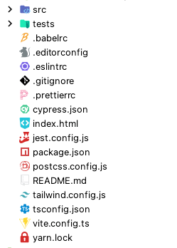

W głównym folderze, widocznym na rysunku 62, znajdują się pliki konfiguracyjne, katalog _src_ oraz katalog _tests_.
Katalog _tests_ przechowuje testy, atrapy danych oraz kod potrzebny do konfiguracji środowiska testowego.
Katalog _src_ przechowuje kod źródłowy aplikacji webowej. Jego zawartości zaprezentowano na rysunku 63.

.Układ katalogów w folderze _src_.
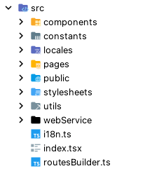

Z katalogu _pages_ są udostępniane komponenty stanowiące główną część lub cały widok pojedynczej strony. Pokazany
jest on na rysunku 64.

.Układ katalogów i plików w folderze _pages_.
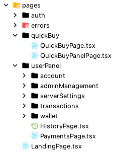

Widoki są pogrupowane na domeny. Podobne pogrupowanie widoczne jest w innych miejscach aplikacji.

* _auth_ — autentykacja użytkowników
* _quickBuy_ — przyjmowanie płatności i zwracanie tokenów
* _userPanel_ — widoki dla zalogowanych użytkowników
** _account_ — edycja konta
** _adminManagement_ — zarządzanie kontami administratorów
** _serverSettings_ — edytowanie konfiguracji serwera
** _transactions_ — zarządzanie transakcjami
** _wallet_ — tworzenie i wyświetlanie statystyk portfela

Katalog _components_ zawiera komponenty, które nie zostały zamieszczone w katalogu _pages_.
Został on zaprezentowany na rysunku 65.
Wyodrębniono je w taki sposób, aby mogły być wykorzystane w dowolnym miejscu w aplikacji.
Pozwala to na ponowne użycie komponentów. Na przykład komponent do przyjmowania płatności _QuickBuy.tsx_,
który można zobaczyć w panelu użytkownika i na widoku publicznym.

.Układ katalogów i plików w folderze _components_.
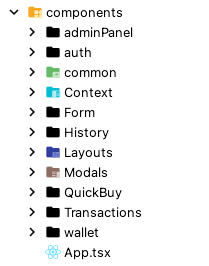

* _common_ — komponenty wykorzystywane w więcej niż jednych widoku
* _Context_ — komponenty zwracające _React context_ z przygotowanymi danymi i hookami
* _Form_ — komponenty do tworzenia formularzy
* _Layouts_ — komponenty, wyświetlające inne komponenty dodając do nich pewne elementy
* _Modals_ — okna dialogowe

Reszta katalogów w folderze _components_ jest nazwana od widoków, gdzie są wykorzystywane:

* auth
* adminPanel
* wallet
* History
* Quickbuy
* Transactions

==== Pliki konfiguracyjne

* postcss.config.js — konfiguracja narzędzia _postcss_, wymagana przez _tailwindcss_
* jest.config.js — zawiera konfiguracje takich elementów jak generowanie raportów z testów,
czy dodawanie ścieżek modułów wykorzystywanych w testach
* .prettierrc — konfiguracja narzędzia _prettier_
* .tailwind.config.js — konfiguracja narzędzia _tailwind_
* .vite.config.ts — zawiera ścieżki, których zapytania powinny być przekazane przez _vite_ do serwera,
ponieważ w środowisku deweloperskim serwer i aplikacja internetowa są uruchomione na różnych portach
[source,typescript]
----
include::../../../webapp/vite.config.ts[lines=7..20]
----
** .eslintrc — zawiera informacje o tym, jakiego typu problemy ze składnią powinien zgłaszać _eslint_
przy analizowaniu kodu

==== Nawigacja

W jednostronicowych aplikacjach internetowych zmiana widoku nie powinna wywołać przeładowania strony.
Ścieżka URL w przeglądarce musi być więc aktualizowana przez kod _JavaScript_.
W tym celu została wykorzystana biblioteka _react-router-dom_, która wyświetla odpowiednie komponenty
zależnie od ścieżki oraz udostępnia funkcje do jej aktualizowania.
Przypisanie komponentów do ścieżek można zobaczyć w komponencie głównym aplikacji - _src/components/App.tsx_,
widocznym w kodzie 90.

.Fragment pliku App.tsx.
[source, tsx]
----
include::../../../webapp/src/components/App.tsx[lines=40..57]
...
----

Ścieżki URL aplikacji webowej zostały zapisane w postaci _JSON_ do pliku _src/routesBuilder.ts_
w celu zwiększania elastyczności kodu.

Oprócz zdefiniowanych ścieżek widać, że na samej górze drzewa komponentów znajdują się contexty i layouty.
Layout _NavbarLayout.tsx_ zagnieżdża prawie każdy widok, ponieważ dodaje górny pasek nawigacyjny do widoków.
Jedyne widoki, które owego paska nie posiadają, to _LogoutPage.tsx_ i _Error404Page.tsx_.
Do tego sprawdza, czy _UserContext.tsx_ wczytuje token, jeśli tak, to dodaje powiadomienie z informacją,
że token jest w trakcie ładowania. Powiadomienie widoczne jest na rysunku 66, a jego kod widoczny jest w kodzie 91.

.Fragment pliku NavbarLayout.tsx.
[source, tsx]
----
include::../../../webapp/src/components/Layouts/NavbarLayout.tsx[lines=9..32]
----

.Wiadomość o wczytywaniu tokena w lewym dolnym rogu.
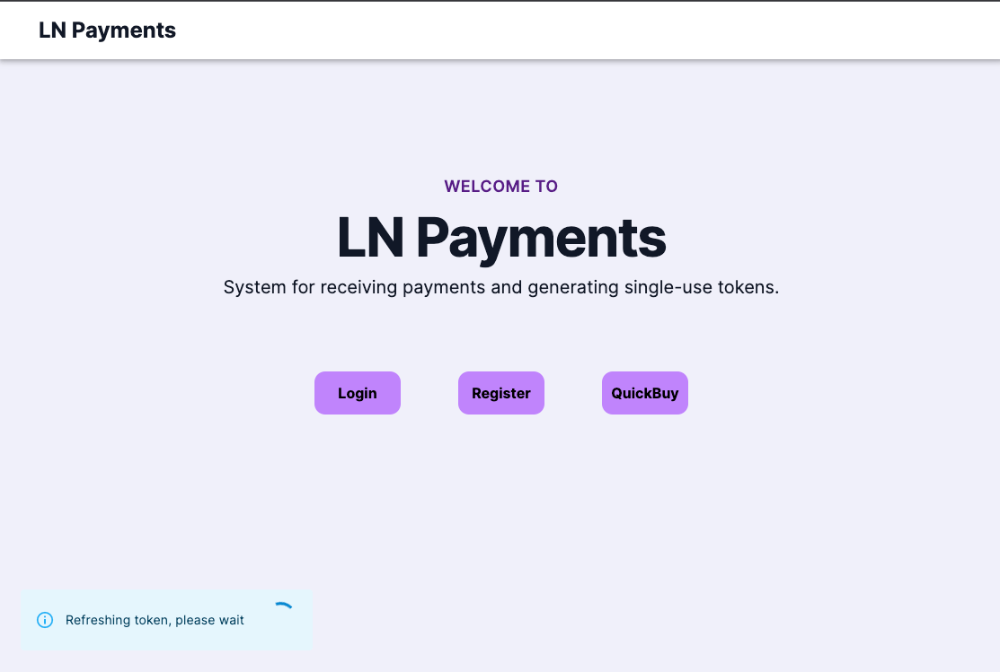

_UserLayout.tsx_, tak samo, jak _AdminLayout.tsx_ i _PublicLayout.tsx_ przekierowuje użytkownika
w zależności od jego stanu.
Zagnieżdżają w sobie komponenty w zależności od tego, komu należy udostępnić dany widok.

* _UserLayout.tsx_ — przekierowuje do strony logowania — jeśli użytkownik nie jest zalogowany
lub do strony głównej — jeśli użytkownik ma rolę tymczasową
* _AdminLayout.tsx_ — przekierowuje do strony logowania — jeśli użytkownik nie jest zalogowany
lub do strony głównej — jeśli użytkownik nie jest adminem
* _PublicLayout.tsx_ — przekierowuje do panelu użytkownika — jeśli użytkownik jest zalogowany
i ma rolę inną niż tymczasową

.Fragment pliku UserLayout.tsx.
[source, tsx]
----
include::../../../webapp/src/components/Layouts/UserLayout.tsx[lines=9..18]
----

_UserContext.tsx_ jest odpowiedzialny za przechowywanie danych o użytkowniku oraz sprawdzanie ważności tokena dostępu
do serwera. Kod tego kontekstu pokazano w kodach 92, 93 i 94. Jeśli odświeżanie tokena się nie
powiedzie, użytkownik zostanie wylogowany, a zarazem przekierowany przez _UserLayout.tsx_ lub _AdminLayout.tsx_ do
strony logowania. Jeśli odświeżanie się powiedzie, kolejne jego uruchomienie zostaje zakolejkowane do wykonania za 10
minut. Dzięki temu, że ważność tokena na serwerze jest ustalona na 15 minut, token w przeglądarce jest zawsze ważny.
Udostępnia również funkcje pomocnicze, takie jak _login_, _logout_, w celu wyeliminowania powtórzeń.

.Funkcje _login_ i _logout_ pliku UserContext.tsx.
[source, tsx]
----
include::../../../webapp/src/components/Context/UserContext.tsx[lines=47..59]
----

.Odświeżanie tokena w pliku UserContext.tsx.
[source, tsx]
----
include::../../../webapp/src/components/Context/UserContext.tsx[lines=61..79]
----

Context _UserContext.tsx_ obejmuje wszystkie widoki w taki sposób,
aby dane o użytkowniku nie zostały usunięte przy zmianie widoków.
Do tego korzysta z pliku pomocniczego _src/utils/persist.ts_,
aby dane o użytkowniku zostały zapisane nawet przy zamknięciu przeglądarki.

Plik _persist.ts_ zawiera funkcje dotyczące _localStorage_,
czyli API do długotrwałego zapisu danych dostępnego w przeglądarce.
API _localStorage_ pozwala zapisać dane typu klucz wartość, ale tylko w postaci wartości tekstowej.
Zostały napisane funkcje, aby obejść to ograniczenie, zamieniając obiekty na wartość tekstową przy zapisywaniu
i odwrotnie przy wczytywaniu.

Funkcja _setLocalJson_ zamienia przyjętą wartość w ciąg tekstowy i zapisuje go w _localStorage_. Pokazana ona została
w kodzie 95.

.Funkcja setLocalJson w pliku persist.ts.
[source, typescript]
----
include::../../../webapp/src/utils/persist.ts[lines=13..15]
----

Funkcja _getLocalJson_, widoczna w kodzie 96, pobiera wartość z _localStorage_ i zamienia ją z ciągu tekstowego na
obiekt _JSON_, przy okazji zamieniając ciągi tekstowe na obiekty _Date_.

.Funkcja getLocalJson pliku persist.ts.
[source, typescript]
----
include::../../../webapp/src/utils/persist.ts[lines=4..11]
----

Z powodu tego, że w Reakcie zmienne wartości muszą być przechowywane w stanie, został napisany hook _useLocalStorage_,
który oprócz zapisywania wartości w stanie, nadpisuje ją w _localStorage_.
Używa się go jak standardowego hooku _useState_, z tą różnicą, że zamiast przyjmować wartość, przyjmuje klucz,
który wskazuje na wartość w _localStorage_. Jego kod zaprezentowano w kodzie 97.

.Funkcja _useLocalStorage_ w pliku _persist.ts_.
[source, typescript]
----
include::../../../webapp/src/utils/persist.ts[lines=17..30]
----

Pasek nawigacyjny po lewej stronie ekranu został zaimplementowany w _src/components/common/Sidebar/Sidebar.tsx_.
Jest on dodawany do komponentów w _PanelLayout.tsx_.
Każdy przycisk na tym pasku jest zdefiniowany przy pomocy komponentu _SidebarEntry.tsx_, który widoczny jest w
kodzie 98. Istnieje możliwość przekazania do niego argumentu _adminOnly_,
jeśli ma być wyświetlony tylko dla administratorów.
Przycisk jest podświetlony, jeśli otwarta ścieżka w przeglądarce zawiera w sobie jego ścieżkę.

.Komponent SidebarEntry.
[source, tsx]
----
include::../../../webapp/src/components/common/Sidebar/SidebarEntry.tsx[]
----

==== Internacjonalizacja

Korzystanie z biblioteki _i18next_ usprawnia odizolowanie wartości tekstowych
wyświetlanych użytkownikowi od kodu i zmienienie języku interfejsu.
Obecnie aplikacja posiada tylko jeden język — angielski, lecz taka izolacja pozwala na ograniczanie powtórzeń
oraz łatwiejsze poprawki i zmiany.
Tekst jest zapisany w postaci plików _json_ w folderze _src/locales_ pogrupowanych na domeny, co można zobaczyć
na rysunku 67.

.Układ katalogów i plików w folderze _locales_.
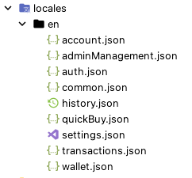

==== Komunikacja z serwerem

W katalogu _src/webServer_ znajduje się interfejs do komunikacji z serwerem. Jest on widoczny na rysunku 68.
Wyodrębnione zostały funkcje odpowiedzialne za pobieranie danych w taki sposób,
żeby wywołanie funkcji było czytelne i bez niepotrzebnych powtórzeń.

.Układ katalogów i plików w folderze _webService_.
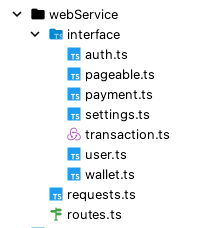

* interface — typy, opisujące dane zwracane z serwera
* routes.ts — ścieżki URL do serwera w postaci _JSON_
* requests.ts — przechowuje singleton klasy _Requests_, która jest odpowiedzialna za komunikację z serwerem

.Klasa _Requests_.
[source, typescript]
----
include::../../../webapp/src/webService/requests.ts[lines=42..51]
...
----

Klasa _Requests_, widoczna w kodach 99 oraz 100, posiada pole _api_, przechowujące funkcje, które wysyłają zapytania
do API serwera. Każda funkcja jest odpowiedzialna za komunikację z jedną ścieżką serwera.

.Pole _api_ metody _Requests_.
[source, typescript]
----
include::../../../webapp/src/webService/requests.ts[lines=53..68]
...
----

Dla ujednolicenia funkcji w polu _api_ każda z nich zwraca ten sam interfejs — _Response_. Definicja typu widoczna
jest w kodzie 101.

.Typ _Response_ pliku _requests.ts_.
[source, typescript]
----
include::../../../webapp/src/webService/requests.ts[lines=31..34]
----

Każda funkcja w polu _api_ wykorzystuje metodę _request_,
która dodaje do zapytania nagłówek z tokenami i wykonuje je przy użyciu biblioteki _axios_. Jej kod widoczny jest
w kodzie 102.

.Metoda _request_ klasy _Requests_.
[source, typescript]
----
include::../../../webapp/src/webService/requests.ts[lines=195..216]
----

Serwer używa kodów HTTP do przekazania różnych informacji, w tym także kodów błędów.
Biblioteka _axios_ wyrzuca wyjątek, jeśli kod odpowiedzi nie jest kodem powodzenia.
Metoda _request_ wyłapuje wyjątki zwracane przez axios i zwraca obiekt typu _Response_ z pustym polem danych,
zamiast wyrzucać błąd. Oznacza to, że nie trzeba wyłapywać błędu przy każdym wywołaniu funkcji pola _api_.
Żeby zobaczyć, czy zapytanie zakończyło się powodzeniem, wystarczy sprawdzić pole _status_ zwracanego obiektu.
Przykład użycia pliku _requests_ zaprezentowano w kodzie 103.

.Przykład użycia pliku _requests.ts_.
[source, typescript]
----
import { requests } from 'webService/requests'

const { data, status } = requests.api.auth.login('admin@admin.pl', 'password1')
----

==== Portfel

Katalog _src/components/wallet_ zawiera komponenty potrzebne do stworzenia widoku wyświetlającego dane o portfelu.
Widok portfela składa się z kafelek, dlatego powstał komponent _WalletCard.tsx_,
z którego korzystają wszystkie komponenty reprezentujące kafelek, aby ujednolicić wygląd i uniknąć powtórzeń.
Kod pojedynczego kafelka widoczny jest w kodzie 104, a ekran portfela zaprezentowany został na rysunku 69.

.Fragment pliku WalletCard.tsx.
[source, tsx]
----
include::../../../webapp/src/components/wallet/WalletCard.tsx[lines=9..16]
----

.Kafelki na widoku portfela.
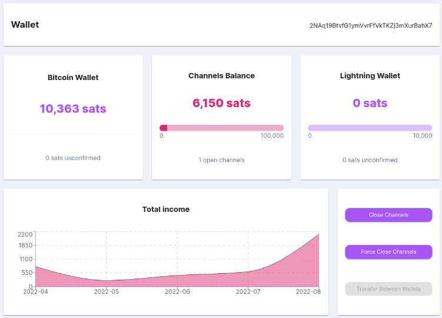

Komponent _ProgressCard.tsx_, podobnie jak _WalletCard.tsx_, jest wykorzystywany w wielu miejscach.
Jego kod widoczny jest w kodzie 105.
Przy wyświetlaniu stanu środków portfela i środków w kanałach _Lightning Network_.
Przyjmuje informacje o tym, jaki tekst ma być wyświetlony na kafelku i wartości liczbowe,
jakie mają być wyświetlone na pasku wczytywania.

.Fragment pliku ProgressCard.tsx.
[source, tsx]
----
include::../../../webapp/src/components/wallet/ProgressCard.tsx[lines=25..41]
----

Dane liczbowe są przekazywane do komponentu _BalanceProgressBar.tsx_, który jest odpowiedzialny za wyświetlanie paska.
Przyjmuje dwie wartości liczbowe i zapełnia pasek ładowania zgodnie ze stosunkiem tych dwóch liczb. Kod komponentu
zaprezentowano w kodzie 106.

.Fragment pliku BalanceProgressBar.tsx.
[source, tsx]
----
include::../../../webapp/src/components/wallet/BalanceProgressBar.tsx[lines=11..34]
----

Kolejnym elementem panelu jest komponent _TotalIncomeChart.tsx_.
Wyświetla dane z serwera w postaci wykresu, korzystając z biblioteki _recharts_.
Dzięki temu, że dane do wykresu są odpowiednio przygotowane przez serwer, nie ma potrzeby ich formatowania.

Gdy dane o portfelu są w trakcie pobierania, widok portfela wyświetla _WalletLoadingSkeleton.tsx_.
Ten komponent mniej więcej odwzorowuje kafelki stanowiące interfejs widoku _WalletPage.tsx_.
Efekt można zobaczyć na rysunku 70, natomiast kod komponentu w kodzie 107.

.Widok portfela podczas wczytywania.
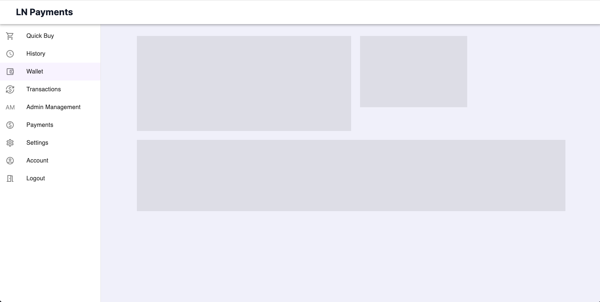

.Plik _WalletLoadingSkeleton.tsx_.
[source, tsx]
----
include::../../../webapp/src/components/wallet/WalletLoadingSkeleton.tsx[]
----

Żeby wyświetlić dane o portfelu, trzeba wcześniej go stworzyć.
Do tego służy widok _WalletCreatePage.tsx_.
Jeśli korzystając z niego, serwer nie ma stworzonego portfela, zostanie wyświetlony _WalletCreatePage.tsx_.
Żeby stworzyć portfel, potrzebny jest co najmniej jeden administrator z przypisanym kluczem publicznym.
W komponencie _WalletCreatePage.tsx_ pobierani są użytkownicy z rolą _admin_
i filtrowani sprawdzając posiadanie klucza publicznego.
Jeśli długość tablicy zawierającej filtrowanych adminów wynosi zero,
zamiast formularza zwracany jest komunikat o błędzie, pokazany na rysunku 71.
W kodzie 108 zawarto funkcję odpowiedzialną za pobieranie z serwera listy administratorów.

.Pobieranie adminów w _WalletCreatePage.tsx_.
[source, tsx]
----
include::../../../webapp/src/pages/userPanel/wallet/WalletCreatePage.tsx[lines=24..35]
----

.Komunikat o błędzie w widoku formularza portfela.
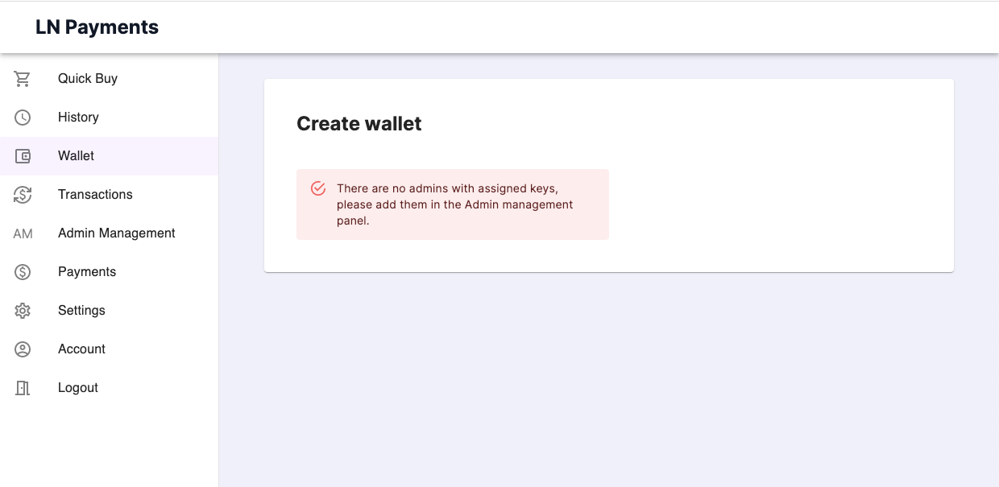

==== Płatność

Za przyjmowanie płatności odpowiedzialny jest komponent _QuickBuy.tsx_, którego fragment pokazano w kodzie 109.
Składa się z trzech komponentów, które są naprzemiennie wyświetlane.
Do każdego komponentu są przekazywane te same argumenty, takie jak cena pojedynczej transakcji,
czy funkcje do przechodzenia do następnego komponentu.

.Fragment pliku QuickBuy.tsx.
[source, tsx]
----
include::../../../webapp/src/components/QuickBuy/QuickBuy.tsx[lines=71..94]
----

Pierwszym krokiem jest wypełnienie formularza, w którym użytkownik ustawia ilość tokenów, które chce kupić.
Znajduje się on w pliku _SetupStage.tsx_, widocznym w kodzie 110.
Jeśli użytkownik nie jest zalogowany, zostanie wyświetlone pole na adres email,
a po zatwierdzaniu formularza użytkownik zostanie zalogowany z rolą tymczasową.

.Logowanie tymczasowego użytkownika.
[source, tsx]
----
include::../../../webapp/src/components/QuickBuy/Stages/SetupStage/SetupStage.tsx[lines=31..52]
----

Drugim krokiem jest wyświetlenie informacji o transakcji i przejście na trzeci komponent,
w momencie, gdy płatność zostanie wykonana. Tym zajmuje się komponent _TokensStage.tsx_.
Informacje przedstawione są w postaci kodu QR, który można zeskanować,
używając telefonu lub kopiując go do schowka poprzez naciśnięcie na ten kod.
Fragment kodu źródłowego odpowiedzialnego za generowanie kodów QR można znaleźć w kodzie 111.

.Fragment pliku QRComponent.tsx.
[source, tsx]
----
include::../../../webapp/src/components/QuickBuy/Stages/TransactionStage/QRComponent.tsx[lines=19..37]
----

Aby dostać informacje o tym, że płatność została wykonana w czasie rzeczywistym,
komponent _TransactionStage.tsx_ łączy się do serwera przy pomocy _websocketu_.
Obiekt przedstawiający połączenie jest aktywowany przy wyświetleniu komponentu i deaktywowany,
jeśli komponent zostanie zamknięty. Kod za to odpowiedzialny widoczny jest w kodzie 112.

.Tworzenie połączenie _websocket_ w TransactionStage.tsx.
[source, tsx]
----
include::../../../webapp/src/components/QuickBuy/Stages/TransactionStage/TransactionStage.tsx[lines=52..71]
----

Na dole komponentu znajduje się zegar odliczający czas do zamknięcia płatności.
Gdy czas dojdzie do zera, pojawi się okno dialogowe z adekwatną wiadomością,
a aktywny komponent zostanie zmieniony na pierwszy.
Aktualizowaniem czasu zajmuje się _hook_ _useCountdown_ znajdujący się w pliku _src/utils/time.ts_. Jego zawartość
została zamieszczona w kodzie 113, a przykłady użycia w kodzie 114.

._Hook_ _useCountdown_ w pliku _time.ts_.
[source, tsx]
----
include::../../../webapp/src/utils/time.ts[lines=7..32]
----

.Przykład użycia _useCountdown_ w _TransactionStage.tsx_.
[source, tsx]
----
include::../../../webapp/src/components/QuickBuy/Stages/TransactionStage/TransactionStage.tsx[indent=0,lines=42..45]
...
include::../../../webapp/src/components/QuickBuy/Stages/TransactionStage/TransactionStage.tsx[indent=0,lines=95..97]
----

Ostatnim krokiem jest wyświetlenie tokenów zwróconych przez serwer poprzez komponent _TokensStage.tsx_. Odbywa się
to we fragmencie kodu pokazanym w kodzie 115.
Tokeny są wyświetlone w liście, gdzie każda pozycja ma przycisk do skopiowania tokena do schowka
i drugi przycisk do wyświetlenia tokena.

.Fragment pliku TokenItem.tsx.
[source, tsx]
----
include::../../../webapp/src/components/QuickBuy/Stages/TokensStage/TokenItem.tsx[lines=23..42]
----

Jeśli użytkownik na tym etapie ma tymczasowe konto, wyświetlona jest ostrzeżenie,
że tokeny nie będą mogły być odczytane po zamknięciu widoku. Kod odpowiedzialny za ostrzeżenie widoczny jest w
kodzie 116.

.Ostrzeżenie w _TokensStage.tsx_.
[source, tsx]
----
include::../../../webapp/src/components/QuickBuy/Stages/TokensStage/TokensStage.tsx[lines=28..32]
----

==== Historia płatności

Do wyświetlenia historii płatności służy widok _HistoryPage.tsx_, pokazany w kodzie 118.
Ten widok wykorzystuje plik _Panel_, widoczny w kodzie 117, który składa się z trzech komponentów,
które są przeznaczone do stylizacji widoków w panelu zalogowanego użytkownika.
Dodaje białe tło, duży nagłówek i dopełnienie do brzegów tła.
Każdy widok w panelu użytkownika korzysta z tych komponentów, dzięki czemu panel zachowuje jednolitą estetykę.

.Plik Panel/index.ts.
[source, typescript]
----
include::../../../webapp/src/components/common/Panel/index.ts[]
----

.Plik HistoryPage.tsx.
[source, typescript]
----
include::../../../webapp/src/pages/userPanel/HistoryPage.tsx[]
----

Aby wyświetlić dane w tabeli razem z elementami sterującymi paginacją,
komponent _History.tsx_ korzysta z _ApiPageableTable.tsx_.
Z racji, że w większości widoków z tabelami zespół chce pobrać listę danych z danej ścieżki i ją wyświetlić,
_ApiPageableTable.tsx_ zamiast danych przyjmuje ścieżkę URL do serwera.
Eliminuje to dużo powtórzeń, ale uniemożliwia zapisanie i manipulacji danymi poza tym komponentem.
W tym celu powstał komponent _PageableTable.tsx_, wykorzystywany przez _ApiPageableTable.tsx_,
który przyjmuje listę danych i wyświetla ją w postaci tabeli. Fragment komponentu _History_ można zobaczyć w kodzie 119.

.Plik History.tsx.
[source, tsx]
----
include::../../../webapp/src/components/History/History.tsx[lines=21..30]
----

==== Powiadomienia

[NOTE]
Opisywane w tej sekcji powiadomienia nie mają nic wspólnego z powiadomieniami zdefiniowanymi w modelu domenowym
aplikacji. W tym rozdziale ten termin dotyczy informacji prezentowanych użytkownikowi podczas wykonywania akcji
w aplikacji internetowej.

Żeby wyświetlone powiadomienia mogły pozostawać widoczne po przejściu na inny widok, zespół stworzył komponent
_NotificationContext.tsx_, który decyduje o tym, jakie powiadomienie jest widoczne w danej chwili na ekranie.
Jego kod można zobaczyć w kodzie 120. Każdy komponent zagnieżdżony w tym context'ście ma możliwość wyświetlenia
powiadomienia, która nie zniknie przy zamknięci komponentu, który wyświetlił powiadomienie.
Jeśli jeden komponent wyświetli powiadomienie, a następnie drugi zrobi to samo, zostanie wyświetlona powiadomienie
ostatniego komponentu, czyli w tym przypadku, drugiego.

._Context_ i jego _Provider_ pliku _NotificationContext.tsx_.
[source, tsx]
----
include::../../../webapp/src/components/Context/NotificationContext.tsx[lines=13..34]
----

Do zmieniania stanu powiadomienia wykorzystywany jest hook _useNotification_, którego kod został wypisany w kodzie 121.

._Hook_ _useNotification_ pliku _NotificationContext.tsx_.
[source, tsx]
----
include::../../../webapp/src/components/Context/NotificationContext.tsx[lines=36..59]
----

Wygląd powiadomienia został zaimplementowany w pliku _src/components/common/Notification.tsx_, co widać w kodzie 122.
Wykorzystany został komponent _Snackbar_ z biblioteki _material-ui_.

.Plik Notification.tsx.
[source, tsx]
----
include::../../../webapp/src/components/common/Notification.tsx[]
----

==== Pozostałe komponenty

Biblioteka _formik_ bardzo ułatwia tworzenie formularzy, lecz żeby spersonalizować widok pól formularzy,
trzeba dostosować się do sposobu działania tej biblioteki.
Pola tworzy się przy pomocy komponentu _Field_ z tej biblioteki, który przyjmuje argument o nazwie _component_.
_TextInput.tsx_ oraz _MultiSelectInput.tsx_ w katalogu _src/Form/FormikInputs_ są stworzone,
aby być przekazane jako ten argument.
_TextInput.tsx_ zwraca pole tekstowego, a _MultiSelectInput.tsx_ zwraca listę z możliwością wybrania wielu pozycji.
Przykład użycia komponentu _TextInput_ został zaprezentowany w kodzie 123.

.Przykład użycia _TextInput.tsx_ w _Register.tsx_.
[source, tsx]
----
include::../../../webapp/src/components/auth/Register/Register.tsx[indent=0,lines=54..60]
----

_ConfirmationModal.tsx_ to okno dialogowe, które wyświetla przekazany tekst z dwoma przyciskami —
do odrzucenia i do zaakceptowania wyświetlonej informacji.
Okno dialogowe zobaczyć można na rysunku 72.
Jeśli wiadomość zostanie odrzucona, okno zostaje zamknięte.
Jeśli jednak wiadomość zostanie zaakceptowana, okno zostaje zamknięte,
i wykonana jest funkcja wcześniej przekazana do okna jako parametr.
Przykład użycia komponentu _ConfirmationModal_ widoczny jest w kodzie 124.

.Przykład użycia _ConfirmationModal.tsx_.
[source, tsx]
----
include::../../../webapp/src/components/auth/Register/Register.tsx[lines=106..112]
----

.Okno dialogowe wyświetlane przy udanej rejestracji.
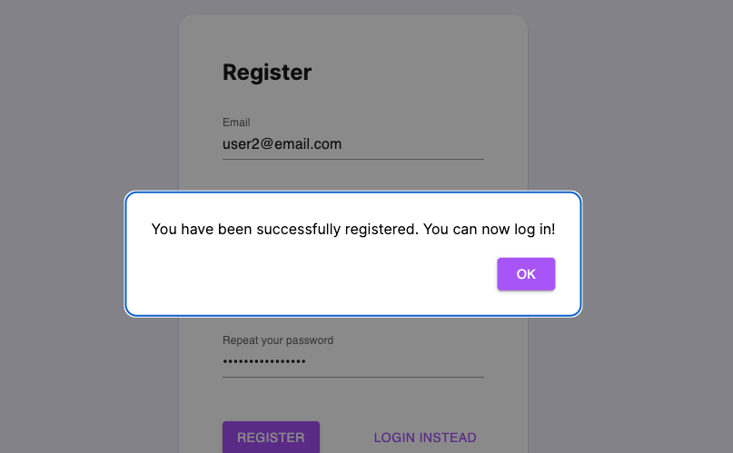
