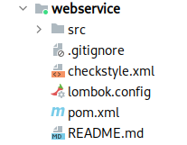
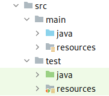
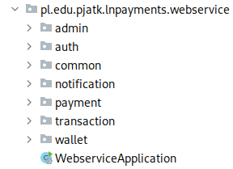
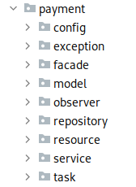
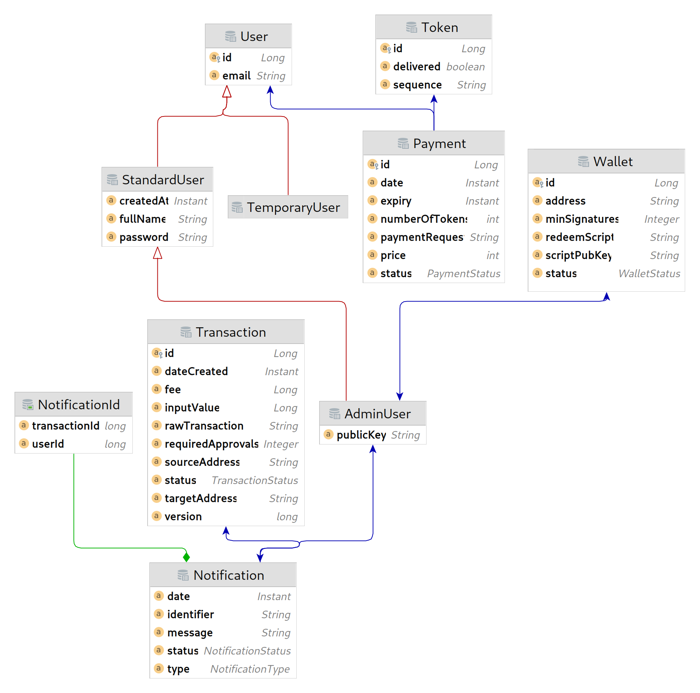
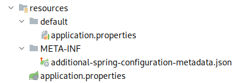

=== Serwer

Do stworzenia serwera dla tworzonej aplikacji zdecydowano się na język programowania Java oraz framework Spring.
Zastosowane narzędzia pozwalają w łatwy i szybki sposób tworzyć kompletne aplikacje internetowe, a zapewnione dodatkowe
moduły ułatwiają między innymi komunikację z bazą danych czy obsługę kolejek wiadomości. Do procesu budowania
wykorzystywane jest narzędzie Maven, które wymusza określoną hierarchię katalogów w projekcie. Wykorzystano również
wiele narzędzi wspomagających pracę jak CheckStyle, wspomagający utrzymanie jednolitego stylu kodu w projekcie.

W projekcie wykorzystywanych jest wiele mechanizmów Springa takich jak kontener IoC czy też wstrzykiwanie zależności.
Wiele adnotacji i konfiguracji z tym związanych nie będzie tłumaczonych w tym rozdziale. Od czytelnika wymagana jest
podstawowa znajomość Javy 17 oraz frameworków Spring i Spring Boot.

==== Struktura i pakiety

Główny katalog aplikacji serwerowej zawiera przede wszystkim pliki konfiguracyjne dla wykorzystywanych narzędzi oraz
jeden katalog, w którym znajduje się kod źródłowy aplikacji. Pokazany on został na rysunku 40.

.Układ katalogów w folderze głównym serwera.

Katalog główny zawiera znany już plik _.gitignore_, dzięki któremu można ustawić ignorowane przez program Git ścieżki.
Plik _checkstyle.xml_ zawiera zestaw reguł dotyczących sposobu formatowania kodu. Na jego podstawie wymuszana jest
spójność stylu kodu w projekcie. Jeżeli kod nie spełnia reguł, nie może zostać włączony do głównej gałęzi projektu.
Weryfikowane jest to poprzez zadanie podczas uruchamiania procesu CI. W pliku _lombok.config_ znajduje się konfiguracja
dla biblioteki lombok, upraszczającej tworzenie i zarządzanie klasami modelowymi w Javie. Plik _README.md_ zawiera
podstawowe informacje o komponencie oraz instrukcje uruchomienia samej aplikacji, testów oraz konfiguracje środowiska
deweloperskiego. W pliku _pom.xml_ znajduje się konfiguracja dla narzędzia budowania aplikacji Maven. Zawiera on
metadane projektu, wykorzystywane zależności oraz instrukcje do budowania aplikacji w określony sposób, na przykład
warunki sprawdzania pokrycia kodu testami. Pozwala również na zbudowanie pliku zawierającego aplikację internetową i
serwer w jednym pliku wykonywalnym. Na koniec został folder _src_ zawierający kod źródłowy posegregowany zgodnie ze
standardowym układem dla programu Maven<<maven_directories>>. Jego zawartość zaprezentowana została na rysunku 41.

.Układ katalogów w folderze _src_.

Folder zawiera dwa katalogi: main i test. Pierwszy z nich zawiera kod źródłowy aplikacji, natomiast drugi kod źródłowy
testów jednostkowych i integracyjnych. Więcej o testach opisane jest w rozdziale <<_testy,10>>. Oba katalogi
zawierają takie same podkatalogi. Folder _java_ zawiera pakiety zawierające kod źródłowy, a _resources_ pliki statyczne
wymagane do uruchomienia aplikacji, a które nie wymagają kompilacji.

Kod w Javie grupowany jest w pakietach domenowych. Zdecydowano się na grupowanie kodu w pakietach pod względem
funkcjonalności. Jest to rozwiązanie zwiększające czytelność oraz ułatwiające rozwój aplikacji według tych
funkcjonalności. Zazwyczaj są one w jakimś stopniu niezależne od innych, ewentualnie wykorzystują publiczne serwisy,
więc zapewnia to pewien poziom enkapsulacji. Oczywiście lepszym zastosowaniem byłyby tutaj moduły dodane w Javie 9,
gdyż eliminują one kompletnie problem niechcianego dostępu do klas. Pozwalają one na jawne zdefiniowanie dostępu do
klas publicznych poza modułem. Nie zdecydowano się na ich użycie ze względu na duży poziom skomplikowania oraz rozmiar
projektu. Niektóre pakiety zawierają niewiele klas, a wyodrębnienie ich do modułów zwiększyłoby ilość niepotrzebnych
plików oraz wymaganej konfiguracji. Kolejnym powodem było uproszczenie procesu deweloperskiego, gdyż o wiele łatwiej
modyfikuje się kod znajdujący się w jednym projekcie i jednym katalogu, a nie w kilku osobnych. Finalny układ pakietów
pokazany został na rysunku 42.

.Pakiety Java wykorzystywane w serwerze.

Wszystkie pakiety pogrupowane są w ścieżce pakietów _pl.edu.pjatk.lnpayments.webservice_. Pakiet _webservice_ zawiera
jedną klasę _WebserviceApplication_ odpowiedzialną tylko i wyłącznie za uruchomienie aplikacji. Pozostałą zawartością
są pakiety domenowe oraz jeden pakiet _common_ zawierający ogólną konfigurację, oraz klasy wspólne dla całej aplikacji.
Wewnątrz każdego pakietu pliki pogrupowane zostały według innego popularnego podejścia, czyli grupowania według
warstw. Zdecydowano się na stworzenie aplikacji według architektury warstwowej, więc osobne warstwy, takie jak
repozytoria, kontrolery i serwisy znajdują się w swoich pakietach. Zawartości jednego z pakietów domenowych znajduje
się na rysunku 43.

.Przykład podziału warstwowego pakietów na przykładzie pakietu _payment_.

==== Baza danych

Zdecydowano się na użycie relacyjnej bazy danych PostgreSQL, gdyż dane przechowywane w bazie danych są wyraźnie
ustrukturyzowane. Ze względu na charakter przechowywanych danych ważna jest również obsługa transakcji na poziomie
bazy danych. W tym komponencie wykorzystujemy do obsługi bazy danych framework Spring Data JPA oraz Hibernate.
Pozwoliło to na znaczne ułatwienie procesu tworzenia bazy danych. JPA pozwala na mapowanie relacyjnej bazy danych na
zwykłe klasy Java z wykorzystaniem specjalnych adnotacji. Hibernate natomiast oferuje funkcjonalność automatycznego
tworzenia bazy danych na podstawie mapowań w JPA. Dzięki temu nie było potrzeby ręcznego pisania kwerend SQL, a baza
danych była tworzona w ramach zwykłych zadań dodających nowe funkcjonalności. Na początku prac wykonana została
konfiguracja połączenia z bazą danych oraz wymaganych bibliotek i frameworków. Cała reszta działa się automatycznie na
podstawie kodu tworzonego w Javie.

Schemat bazy danych z rysunku 44 nie różni się znacząco od diagramu domenowego prezentowanego w rozdziale 4.
Znajduje się tam opis każdej z tabeli, jak i relacje pomiędzy nimi. Główne różnice to przede wszystkim nazwy oraz ilość
pól w poszczególnych tabelach. Oczywiście prawie każda z tabel zawiera kolumny _id_, która służy jako klucz publiczny,
a także odpowiednie pola, które są kluczami obcymi.

.Schemat bazy danych wygenerowany przez plugin JPA Buddy dla programu IntelliJ IDEA.

Niektóre z pól zostały wymuszone przez względy techniczne, na przykład pole _version_ w tabeli _Transaction_.
Zapobiega ono problemowi utraconych zapisów przy podpisywaniu transakcji. W przypadku tabeli _Notification_
zdecydowano się na wykorzystanie złożonego klucza publicznego składającego się z ID pochodzącego z tabel _Notification_
oraz _User_ (technicznie tylko dla AdminUser, gdyż tylko administrator może otrzymywać powiadomienia o
nowej transakcji). Dzięki temu dla jednego użytkownika oraz jednej transakcji w bazie danych może powstać tylko jedno
powiadomienie. Tabela _Notification_ zawiera również pole identifier, które wyliczane jest na podstawie klucza
złożonego. Wykorzystywane jest do odnoszenia się do rekordu danych podczas wysyłania żądań do API powiadomień.
Reszta kolumn została dodana, aby ułatwić pracę niektórych algorytmów bądź uatrakcyjnić widok danych prezentowany
użytkownikowi. Wszystkie relacje pomiędzy tabelami zostały bez zmian względem diagramu domenowego z rysunku 6.

include::solution/webservice/common.adoc[]

include::solution/webservice/auth.adoc[]

include::solution/webservice/payment.adoc[]

include::solution/webservice/admin.adoc[]

include::solution/webservice/wallet.adoc[]

include::solution/webservice/transaction.adoc[]

include::solution/webservice/notification.adoc[]

==== Zasoby

Folder _resources_ przechowuje pliki, które podczas pakowania aplikacji zostaną dołączone w folderze docelowym, bądź
pliku wykonywalnym. Jego zawartość znajduje się na rysunku 61.

.Zawartość folderu resources.

Zawiera on tylko 3 pliki. Najważniejszym jest _application.properties_, który zawiera wartości konfiguracyjne
aplikacji. Ustawione w nim są różne wartości takie jak operowana sieć Bitcoina, poziomy logowania czy też czas ważności
tokena JWT. Folder _default_ zawiera kolejny plik _application.properties_, natomiast ten nie jest konfiguracją
aplikacji, tylko plikiem zawierającym domyślne wartości dla ustawień użytkownika. Jak już zostało opisane wcześniej,
jest on przechowywany w katalogu domowym użytkownika i może być modyfikowany z poziomu komputera, bądź aplikacji
internetowej. Plik ten kopiowany jest do docelowego katalogu, gdy nie znajduje się tam jeszcze istniejąca konfiguracja.
Ostatnim folderem jest _META-INF_, zawierający dodatkowe pliki konfiguracyjne interpretowane przez Javę.
W przypadku aplikacji folder zawiera dodatkową konfigurację metadanych wartości w pliku konfiguracyjnym. Dzięki
temu Spring otrzymuje informację o typach i opis poszczególnych własności konfiguracyjnych.
